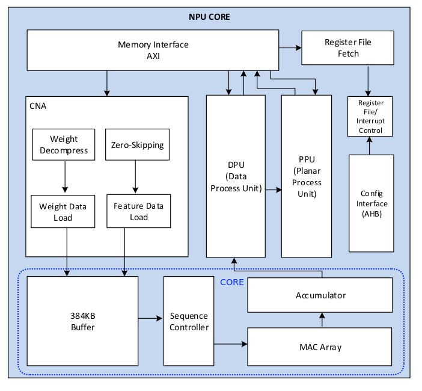

# How to add a new backend to tinygrad: A Rockchip NPU example  
Last update: Sep 20 2026

TLDR: This blog will mainly use DPU EW op for the 28 GroupOps.ALU, treat CMAC like tensor core for GEMM/CONV if the shape matches, otherwise will just use EW add/mul for GEMM. 

Tinygrad is a zero-dependency minmial codebase (25407 core lines @20260920) to do ML in python, those lines already included a PyTorch like frontend and kernel space GPU driver down to MMIO written in user space, so makes it the perfect place to support USB3 eGPU thats can drives a car (https://www.youtube.com/watch?v=nmTepfv3Itg) and add new accelorator support. 

"Your accelerator of choice only needs to support a total of ~25 low level ops."
-- from tinygrad README (https://github.com/tinygrad/tinygrad/blob/ebf163682acfa4a6be2775c5efa02a503c86a220/README.md?plain=1#L112)

We will 
- Part 1: Modify ops_python.py as starting point to understand the NPU and implements the 25 Ops
- Part 2: Run test_ops.py to see how many passes we can achieve with it  
- Part 3: Write proper ops_rockchip.py from scratch before fixig failed cases
- Part 4: Fail case fix by Pattern Matcher
- Part 5: Add tests cases and Emulator for CI
- Part 5: Issues to be solved before a PR
- Part 6: Repeat 1 - 5 on Apple ANE

U can follow among if u own an OrangePi 5 running the Orange pi Ubuntu 22.02 image.

## Part 1: modify ops_python.py as starting point to understand the NPU and implements the 25 Ops

This approach was inspired by liej6799 (https://github.com/liej6799/tinygrad/blob/3588-new/tinygrad/runtime/ops_rockchip.py) who made the simplest ADD works on tinygrad while I was struggling how to port the registers and Ops I reversed (https://github.com/allbilly/npu/blob/master/include/rknnops.h) to tinygrad.

Lets begin with
```
git clone https://github.com/tinygrad/tinygrad 
cd tinygrad && git checkout ebf1636
uv venv && source .venv/bin/activate
cp tinygrad/runtime/ops_python.py tinygrad/runtime/ops_rockchip.py
```

In tinygrad, u can choose a runtime with env like DEV=ROCKCHIP. If u want to run tests, some dependenceis are still needed like pytest and numpy/torch to generte reference output. 
```
uv pip install -e . numpy torch --torch-backend=cpu
DEV=ROCKCHIP python test/backend/test_ops.py TestOps.test_add
```

```
(tinygrad) orangepi@orangepi5:~/tinygrad$ DEV=ROCKCHIP python test/backend/test_ops.py TestOps.test_add
  Traceback (most recent call last):
    File "/home/orangepi/tinygrad/test/backend/test_ops.py", line 92, in <module>
      class TestOps(unittest.TestCase):
    File "/home/orangepi/tinygrad/test/backend/test_ops.py", line 727, in TestOps
      @unittest.skipIf(isinstance(Device[Device.DEFAULT].renderer, NIRRenderer), "TODO: broken in LVP")
                                  ~~~~~~^^^^^^^^^^^^^^^^
    File "/home/orangepi/tinygrad/tinygrad/device.py", line 32, in __getitem__
      return self.__get_canonicalized_item(ix)
             ^^^^^^^^^^^^^^^^^^^^^^^^^^^^^^^^^
    File "/home/orangepi/tinygrad/tinygrad/device.py", line 40, in __get_canonicalized_item
      ret = self.get_class(ix)(ix)
            ^^^^^^^^^^^^^^^^^^
    File "/home/orangepi/tinygrad/tinygrad/device.py", line 37, in get_class
      return [cls for cname, cls in inspect.getmembers(importlib.import_module(f'{base}.runtime.ops_{x}')) if
  (cname.lower() == x + "device")][0]

  ~~~~~~~~~~~~~~~~~~~~~~~~~~~~~~~~~~~~~~~~~~~~~~~~~~~~~~~~~~~~~~~~~~~~~~~~~~~~~~~~~~~~~~~~~~~~~~~~~~~~~~~~~~~~~~~~~~~~~
  ~~~~~~~~~~~~^^^
  IndexError: list index out of range
```

This is because RockchipDevice was not found in our new ops_rockchip.py. Lets replace all "Python" with "Rockchip"

```diff
+ops_map = {Ops.ADD: 2}
+
-class PythonProgram(Program['PythonDevice']):
-  def __init__(self, dev:'PythonDevice', obj:TinyELF):
+class RockchipProgram(Program['RockchipDevice']):
+  def __init__(self, dev:'RockchipDevice', obj:TinyELF):
     self.uops: list[UOp] = pickle.loads(obj.lib)
-    self.tensor_cores = PythonRenderer(obj.target).tensor_cores
+    self.tensor_cores = RockchipRenderer(obj.target).tensor_cores
     self.uop_to_index: dict[UOp, int] = {u:i for i,u in enumerate(self.uops)}
     self.loop_ends: dict[UOp, int] = {u.src[1]:i for i, u in enumerate(self.uops) if u.op == Ops.END}
   def __call__(self, *bufs, global_size:tuple[int,int,int]=(1,1,1), local_size:tuple[int,int,int]=(1,1,1), vals:tuple[int, ...]=(), wait=False, **kw):
@@ -156,12 +156,12 @@ class PythonProgram(Program['PythonDevice']):
         i += 1
     return time.perf_counter() - st

-class PythonCompiler(Compiler):
+class RockchipCompiler(Compiler):
   def compile(self, src:str) -> bytes: return base64.b64decode(src)

-class PythonRenderer(Renderer):
+class RockchipRenderer(Renderer):
-  code_for_op = python_alu
+  code_for_op = {op: python_alu.get(op, lambda: None) for op in ops_map}
-  compiler = PythonCompiler()
+  compiler = RockchipCompiler()

   def __init__(self, target:Target):
     assert (emu:=getenv("EMULATE", "")) == "", ("EMULATE is deprecated, use DEV=PYTHON::" +
@@ -181,6 +181,6 @@ class PythonRenderer(Renderer):

   def supported_dtypes(self): return {d for d in super().supported_dtypes() if d != dtypes.half or sys.version_info >= (3, 12)}

-class PythonDevice(Compiled):
+class RockchipDevice(Compiled):
   def __init__(self, device:str):
-    super().__init__(device, HostAllocator(self), [PythonRenderer], PythonProgram)
+    super().__init__(device, HostAllocator(self), [RockchipRenderer], RockchipProgram)
```

```
$ DEV=ROCKCHIP python test/backend/test_ops.py TestOps.test_add

test_add (__main__.TestOps.test_add) ...
testing                     [(45, 68), (45, 68)]   torch/tinygrad fp: 0.26 / 263.81 ms  bp: 1.07 / 2.80 ms
testing                                       []   torch/tinygrad fp: 0.27 / 0.25 ms  bp: nan / nan ms
testing                     [(45, 68), (45, 68)]   torch/tinygrad fp: 0.06 / 107.37 ms  bp: 0.49 / 0.73 ms
testing                                 [(), ()]   torch/tinygrad fp: 0.05 / 0.09 ms  bp: 0.44 / 0.39 ms ok

----------------------------------------------------------------------
Ran 1 test in 0.494s

OK
```

Great, but it was running on the CPU not the NPU. We need to understand a bit more on the NPU first. 

Rockchip NPU was derived from the open NVDLA (doc link) NPU from nvidia as described in mtx512 blog(https://jas-hacks.blogspot.com/2024/02/rk3588-reverse-engineering-rknn.html). Rockchip neither release the verilog nor RKNN (link) compiler and runtime, but they released the linux KMD rknpu_driver(https://github.com/allbilly/rknpu_driver) because of linux GPLv2 license. Thanks to prior work from phhusson (https://github.com/phhusson/rknpu-reverse-engineering) that introduced me the concept of IOCTL and GEM. Reading the rknpu_driver code we can easily find DRM_IOCTL_RKNPU_SUBMIT and the submit struct it needed. Rockchip proprietary runtime being closed source is not really a problem for us because it still needed some way to talk to linux KMD, so we can capture the RKNN bytes, replays it, and rewrite into readable code. With GDB and enough pantient, i captured the submit struct and bytes in each allocated BO/GEM and rewrote in C(https://github.com/allbilly/npu/blob/master/include/rknnops.h) according to the leaked TRM(https://github.com/liej6799/rk3588/blob/main/trm.pdf) and prior work from mtx512(https://github.com/mtx512/rk3588-npu) who did the GEMM reverse. Its a year long frustrating but rewarding process as SOTA GPT-5.1 back then was bad in register programming, it helps with decoding a bit but dont even think about auto debug why the replay/rewrite is not working, which forces me to read/program/debug everything myself. Most effort was in decoding CONV input/weight bytes packing for every shapes(https://github.com/allbilly/npu/blob/master/ops_reg/main.c) and decoding/programming the LUT silu (https://github.com/allbilly/npu/blob/master/ops_rknn/act/silu.py) and sigmoid(https://github.com/allbilly/npu/blob/master/ops_rknn/act/sigmoid.py). Details are not included in this blog, if u are still interested in my frustration, just point ur agent to commit history in allbilly/npu and allbilly/rk3588.

Rockchip and NVDLA


The NPU is a 3 core fixed stage pipeline processor, input and weight go through CORE (MAC array) -> DPU (elementwise op) -> PPU (pooling/reduction op). In NVDLA terms, CORE is CSC/CMAC/CACC(https://github.com/nvdla/hw/tree/nvdlav1/vmod/nvdla), DPU is SDP(https://github.com/nvdla/hw/tree/nvdlav1/vmod/nvdla/sdp), PPU is PDP(https://github.com/nvdla/hw/tree/nvdlav1/vmod/nvdla/pdp). This blog will mainly use DPU EW op for the 25 Ops, treat CMAC like tensor core for GEMM/CONV if the shape matches, otherwise will just use EW add/mul for GEMM. 

Now to do a simple fp16 ADD example, this is also my NPU health check script.
```
cd ~ && git clone https://github.com/allbilly/rk3588
python rk3588/examples/simple_add.py

ret=0, handle=1, obj_addr=0xffffff8137dadc00, dma_addr=0xfffff000
Memory mapped at offset=0x100000000
ret=0, handle=2, obj_addr=0xffffff8137da8000, dma_addr=0xffffe000
Memory mapped at offset=0x100001000
ret=0, handle=3, obj_addr=0xffffff8137daec00, dma_addr=0xff800000
Memory mapped at offset=0x100002000
ret=0, handle=4, obj_addr=0xffffff8137dac400, dma_addr=0xff400000
Memory mapped at offset=0x100402000
ret=0, handle=5, obj_addr=0xffffff8137dab000, dma_addr=0xff000000
Memory mapped at offset=0x100802000
reset_npu ret=0
SUBMIT ret=0
ADD  NPU=[8 8 8 8 8 8 8 8] expected=[8 8 8 8 8 8 8 8] PASS
```

what the script does is first open the NPU device to obtain fd, then use ctypes to create C struct, ioctl DRM_IOCTL_RKNPU_MEM_CREATE to allocate BO for task/regcmd/input/weight/output, then update dma_addr of input/weight/output in the register sequence, copy the registers to C array regcmd, set regcmd address in a task, and DRM_IOCTL_RKNPU_SUBMIT to submit the task. npu_regs was captured from RKNN simple add and removed all unesscary lines.

```python
npu_regs = [
        0x1001000001e5400c,
        0x1001480000024010,
        0x100100070007403c,
        0x1001000000004030,
        0x1001108202c04070,
        0x200100000000500c,
        0x2001000000005010,
        0x2001000700075014,
        0x2001400000085034,
        (reg.TARGET_DPU  << 48) | ((output_mem_create.dma_addr & 0xFFFFFFFF) << 16) | reg.DST_BASE_ADDR,
        (reg.TARGET_RDMA << 48) | ((input_mem_create.dma_addr & 0xFFFFFFFF) << 16) | reg.RDMA_SRC_BASE_ADDR,
        (reg.TARGET_RDMA << 48) | ((weight_mem_create.dma_addr & 0xFFFFFFFF) << 16) | reg.RDMA_EW_BASE_ADDR,
        0x2001000178495044,
        0x0081000000180008,
    ]
```

Dont worry, we will decode it later. The NPU programming model is mulitple NPU submits by host -> mulitple tasks in one submit -> fused mulitple ops in one task, e.g. CONV/MAC+ELEMENTWISE+BN+BS+RELU+POOL in one task.

Great, now we can port this to ops_rockchip.py and open the NPU device. In simple_add.py, we used os.open(f"/dev/dri/card1", os.O_RDWR), but in tinygrad we will use FileIOInterface like other runtime do. 

AGENTS.md
```diff
+- DO NOT run -n12 for RK NPU use -n0 instead, otherwise will race condition crashes the NPU. 
```

```diff
-import pickle, base64, itertools, time, sys, ctypes
+import pickle, base64, itertools, time, sys, ctypes, os
+from tinygrad.runtime.support.hcq import FileIOInterface
  ...
  class RockchipDevice(Compiled):
    def __init__(self, device:str):
+    self.fd_ctl = FileIOInterface("/dev/dri/card1", os.O_RDWR)
```

we also need the C struct and registers offset from rknpu_driver/inlcude/*.h (https://github.com/allbilly/rknpu_driver/tree/main/include) to be imported in python, here i will just reuse the autogen from liej6799(https://github.com/liej6799/tinygrad/blob/3588-new/tinygrad/runtime/autogen/rockchip.py)

```
cd ~/tinygrad/tinygrad/runtime/autogen
wget https://raw.githubusercontent.com/liej6799/tinygrad/refs/heads/3588-new/tinygrad/runtime/autogen/rockchip.py
```

And allocate task/regcmd/input/weight/output Buffer Object
```diff
-import pickle, base64, itertools, time, sys, ctypes, os
+import pickle, base64, itertools, time, sys, ctypes, os, mmap
+from tinygrad.runtime.autogen import rockchip as rk

class RockchipDevice(Compiled):
     def __init__(self, device:str):
       self.fd_ctl = FileIOInterface("/dev/dri/card1", os.O_RDWR)
       super().__init__(device, HostAllocator(self), [RockchipRenderer], RockchipProgram)
+      self.task_buf, self.task_mem = self._gpu_alloc(1024, rk.RKNPU_MEM_KERNEL_MAPPING)
+      self.regcmd_buf, self.regcmd_mem = self._gpu_alloc(8192)
+      self.input_buf, self.input_mem = self._gpu_alloc(4194304)
+      self.weight_buf, self.weight_mem = self._gpu_alloc(4194304)
+      self.output_buf, self.output_mem = self._gpu_alloc(4194304)
+  
+    def _gpu_alloc(self, size:int, flags:int=0) -> tuple[int, rk.struct_rknpu_mem_create]:
+      mem = rk.DRM_IOCTL_RKNPU_MEM_CREATE(self.fd_ctl, size=size, flags=flags | rk.RKNPU_MEM_NON_CACHEABLE)
+      try:
+        mapping = rk.DRM_IOCTL_RKNPU_MEM_MAP(self.fd_ctl, handle=mem.handle)
+        addr = self.fd_ctl.mmap(0, mem.size, mmap.PROT_READ | mmap.PROT_WRITE, mmap.MAP_SHARED, mapping.offset)
+      except Exception:
+        rk.DRM_IOCTL_RKNPU_MEM_DESTROY(self.fd_ctl, handle=mem.handle, obj_addr=mem.obj_addr)
+        raise
+      return addr, mem
+  
+    def _gpu_free(self, addr:int, mem:rk.struct_rknpu_mem_create) -> None:
+      FileIOInterface.munmap(addr, mem.size)
+      rk.DRM_IOCTL_RKNPU_MEM_DESTROY(self.fd_ctl, handle=mem.handle, obj_addr=mem.obj_addr)
```

Next, update dma_addr of input/weight/output in the register sequence, dma_addr are owned by RockchipDevice so we can get it with self.dev.output_mem.dma_addr

```diff
 class RockchipProgram(Program['RockchipDevice']):
   def __init__(self, dev:'RockchipDevice', obj:TinyELF):
+    self.dev = dev
     self.uops: list[UOp] = pickle.loads(obj.lib)
     self.tensor_cores = RockchipRenderer(obj.target).tensor_cores
     self.uop_to_index: dict[UOp, int] = {u:i for i,u in enumerate(self.uops)}
     self.loop_ends: dict[UOp, int] = {u.src[1]:i for i, u in enumerate(self.uops) if u.op == Ops.END}
+    self.npu_regs = [
+      0x1001000001e5400c,
+      0x1001480000024010,
+      0x100100070007403c,
+      0x1001000000004030,
+      0x1001108202c04070,
+      0x200100000000500c,
+      0x2001000000005010,
+      0x2001000700075014,
+      0x2001400000085034,
+      ((rk.DPU + 1) << 48) | ((self.dev.output_mem.dma_addr & 0xFFFFFFFF) << 16) | rk.REG_DPU_DST_BASE_ADDR,
+      ((rk.DPU_RDMA + 1) << 48) | ((self.dev.input_mem.dma_addr & 0xFFFFFFFF) << 16) | rk.REG_DPU_RDMA_RDMA_SRC_BASE_ADDR,
+      ((rk.DPU_RDMA + 1) << 48) | ((self.dev.weight_mem.dma_addr & 0xFFFFFFFF) << 16) | rk.REG_DPU_RDMA_RDMA_EW_BASE_ADDR,
+      0x2001000178495044,
+      0x0081000000180008,
+    ]
```

Next, copy the registers to the C array regcmd, set the regcmd DMA address in a task, prepare the submut struct and submit with DRM_IOCTL_RKNPU_SUBMIT 
we will add a function submit() in RockchipProgram

```diff
+  def submit(self) -> None:
+    regs = self.npu_regs
+    # copy the registers to the C array regcmd
+    ctypes.memset(self.dev.regcmd_buf, 0, self.dev.regcmd_mem.size)
+    regcmd = (ctypes.c_uint64 * len(regs)).from_address(self.dev.regcmd_buf)
+    regcmd[:] = list(regs)
+
+    # set the regcmd DMA address in a task
+    tasks = ctypes.cast(self.dev.task_buf, ctypes.POINTER(rk.struct_rknpu_task))
+    tasks[0] = rk.struct_rknpu_task(
+      flags=0,
+      op_idx=4,
+      enable_mask=0x18,
+      int_mask=0x300,
+      int_clear=0x1ffff,
+      int_status=0,
+      regcfg_amount=len(regs),
+      regcfg_offset=0,
+      regcmd_addr=self.dev.regcmd_mem.dma_addr
+    )
+
+    # prepare the submut struct
+    submit = rk.struct_rknpu_submit(
+      flags=rk.RKNPU_JOB_PC | rk.RKNPU_JOB_BLOCK | rk.RKNPU_JOB_PINGPONG,
+      timeout=6000,
+      task_start=0,
+      task_number=1,
+      task_counter=0,
+      priority=0,
+      task_obj_addr=self.dev.task_mem.obj_addr,
+      core_mask=1,
+      fence_fd=-1
+    )
+    submit.subcore_task[0] = rk.struct_rknpu_subcore_task(task_start=0, task_number=1) # assigned to core 0
+    submit.subcore_task[1] = rk.struct_rknpu_subcore_task(task_start=1, task_number=0)
+    submit.subcore_task[2] = rk.struct_rknpu_subcore_task(task_start=2, task_number=0)
+
+    # submit with DRM_IOCTL_RKNPU_SUBMIT
+    rk.DRM_IOCTL_RKNPU_SUBMIT(self.dev.fd_ctl, __payload=submit)
```

and then pack our inputs


```diff
-import pickle, base64, itertools, time, sys, ctypes, os, mmap
+import pickle, base64, itertools, time, sys, ctypes, os, mmap, struct

 class RockchipProgram(Program['RockchipDevice']):
   def __init__(self, dev:'RockchipDevice', obj:TinyELF):
     self.dev = dev
+    self.ops_map = ops_map
```

`self.ops_map` uses the shared module-level map introduced above. It currently contains only ADD, whose EW algorithm code is 2. At this step the runtime uses map membership to select the NPU execution path, and the renderer uses the same keys to select code-generation rewrites. The captured register sequence remains hardcoded for ADD.

```diff
+  def add(self, a:list[float], b:list[float]) -> list[float]:
+    assert b is not None and len(a) == len(b)
+    result:list = []
+    # The captured register sequence processes eight FP16 elements per submission.
+    for start in range(0, len(a), 8):
+      lanes, rhs = a[start:start+8], b[start:start+8]
+      packed = struct.pack("<8e", *(lanes + [0] * (8-len(lanes))))
+      to_mv(self.dev.input_buf, 16)[:] = packed
+      to_mv(self.dev.weight_buf, 16)[:] = struct.pack("<8e", *(rhs + [0.0] * (8 - len(rhs))))
+      self.submit()
+      result.extend(struct.unpack("<8e", to_mv(self.dev.output_buf, 16))[:len(lanes)])
+    return result
```

but exec_alu() is still doing the calculation on CPU and stores result to values[u], we want it runs on NPU instead.

```diff
-          values[u] = [exec_alu(u.op, u.dtype, p) for p in zip(*src_values)]
+          if dtypes.is_float(u.dtype):
+            if u.op not in self.ops_map or u.dtype != dtypes.half:
+              raise NotImplementedError(f"ROCKCHIP NPU does not support {u.op} with {u.dtype}")
+            values[u] = self.add(*src_values)
+          else:
+            values[u] = [exec_alu(u.op, u.dtype, p) for p in zip(*src_values)]
```

Floating-point ALU operations now either run on the NPU or raise a clear error. Our map only contains ADD and the captured registers use FP16, so FP32 ADD and unsupported floating-point operations are rejected. Non-floating-point ALU operations, including integer address calculations, still use the CPU interpreter. This avoids a successful ROCKCHI-labelled floating-point kernel silently calculating on the CPU.

and for simplicity, comment the other cases and leave the first one  
```python
def test_add(self):
  helper_test_op([(45,68), (45,68)], lambda x,y: x+y, Tensor.add)
  # helper_test_op([], lambda: torch.tensor(1)+0.5, lambda: Tensor(1)+0.5, forward_only=True)
  # helper_test_op([(45,68), (45,68)], lambda x,y: x+y)
  # helper_test_op([(), ()], lambda x,y: x+y)
```

```bash
$ DEV=ROCKCHIP python test/backend/test_ops.py TestOps.test_add

NotImplementedError: ROCKCHIP NPU does not support Ops.ADD with dtypes.float

----------------------------------------------------------------------
Ran 1 test in 0.191s

FAILED (errors=1)
```

Its raise NotImplementedError as DEFAULT_FLOAT is fp32, lets set as HALF
```
$ DEFAULT_FLOAT=HALF DEV=ROCKCHIP python test/backend/test_ops.py TestOps.test_add

test_add (__main__.TestOps.test_add) ...
testing                     [(45, 68), (45, 68)]   torch/tinygrad fp: 0.64 / 390.55 ms  bp: 0.98 / 3.25 ms ok

----------------------------------------------------------------------
Ran 1 test in 0.496s

OK
```

Great its run, lets check whats happening with DEBUG=5
```bash
$ DEBUG=5 DEFAULT_FLOAT=HALF DEV=ROCKCHIP python test/backend/test_ops.py TestOps.test_add | grep "\*\*\*"

compiling E_255_4_3                               : 100%|█| 1/1 [00:00<00:00, 12.38it/s]
compiling E_1020_3                                : 100%|█| 1/1 [00:00<00:00, 36.65it/s]
ok

----------------------------------------------------------------------
Ran 1 test in 0.615s

OK
*** ROCKCHI    1 copy    5.98 KB, ROCKCHI <- NPY                arg  2 mem   0.00 GB tm   4985.97us/     4.99ms (      0 GFLOPS    0|0      GB/s)
*** ROCKCHI    2 copy    5.98 KB, ROCKCHI <- NPY                arg  2 mem   0.00 GB tm   2234.13us/     7.22ms (      0 GFLOPS    0|0      GB/s)
*** ROCKCHI    3 E_255_4_3                                      arg  3 mem   0.00 GB tm    323.77ms/   330.99ms (      0 GFLOPS    0|0      GB/s)
*** CPU        4 E_1020_3                                       arg  1 mem   0.00 GB tm     28.58us/   331.02ms (      0 GFLOPS    0|0      GB/s)
*** CPU        5 E_1020_3                                       arg  1 mem   0.00 GB tm     23.92us/   331.04ms (      0 GFLOPS    0|0      GB/s)
```

Why the last 2 kernels running on CPU not ROCKCHIP? Turns out those are the backward kernel that we shd just skips at this stage with FORWARD_ONLY=1
```
$ DEBUG=5 FORWARD_ONLY=1 DEFAULT_FLOAT=HALF DEV=ROCKCHIP python test/backend/test_ops.py TestOps.test_add | grep "\*\*\*"

compiling E_255_4_3                               : 100%|█| 1/1 [00:00<00:00, 12.31it/s]
ok

----------------------------------------------------------------------
Ran 1 test in 0.411s

OK
*** ROCKCHI    1 copy    5.98 KB, ROCKCHI <- NPY                arg  2 mem   0.00 GB tm   5080.76us/     5.08ms (      0 GFLOPS    0|0      GB/s)
*** ROCKCHI    2 copy    5.98 KB, ROCKCHI <- NPY                arg  2 mem   0.00 GB tm   2346.71us/     7.43ms (      0 GFLOPS    0|0      GB/s)
*** ROCKCHI    3 E_255_4_3                                      arg  3 mem   0.00 GB tm    220.15ms/   227.58ms (      0 GFLOPS    0|0      GB/s)
```

Great now all kernels are on ROCKCHIP and we shd uncomment the remaining cases in test_add one by one
2. torch.tensor(1)+0.5 : showed a CPU kernel even with NOOPT=1 because constant folding in symbolic.py still optimized it
3. [(45,68), (45,68)]  : ROCKCHIP only kernels
4. [(), ()]            : showed a CPU kernel just like (2)

We passed test_add on NPU, next for MUL. To add NPU MUL support, we shdnt rely on the hardcoded hex blob any more.
I wrote a decode script(https://github.com/allbilly/npu/blob/master/ops_reg/dump.py) to decode the RKNN weight BO, why weight u might ask, because RKNN put weight and regcmd in the same BO.
You can use it with RKNN gdb here(https://github.com/allbilly/npu/blob/master/ops_reg/run.sh) and here(https://github.com/allbilly/npu/blob/master/ops_reg/test.gdb)

The decoded registers are in `~/rk3588/examples/elementwise.py`. The local example now has `CAST_BOOL_HALF`, which runs an INT16 MUL on 0/1 lanes to form the FP16 bit patterns, and `CAST_HALF_BOOL`, which converts an FP16 0/1 mask to packed bool bytes. We will expose those CASTs to tinygrad later; for now we can carry their register modes into the builder.
Most important one for us is EW_CFG, and TRM shows

| Bit   | Attr | Reset | Description |
|------:|:----:|:-----:|-------------|
|    31 |  RW  | `0x0` | **ew_cvt_type** — Convert type of EW input conversion when input is 0.5.<br>`1'd0`: Mul first<br>`1'd1`: Add first |
|    30 |  RW  | `0x0` | **ew_cvt_round** — Rounding type of EW input conversion when input is 0.5.<br>`1'd0`: If the integer is odd, carry 1<br>`1'd1`: Carry 1 no matter what the integer is |
| 29:28 |  RW  | `0x0` | **ew_data_mode** — Data mode of the data from ERDMA. |
| 27:24 |  RO  | `0x0` | Reserved. |
| 23:22 |  RW  | `0x0` | **edata_size** — Data size of the cube from ERDMA.<br>`2'd0`: 4-bit<br>`2'd1`: 8-bit<br>`2'd2`: 16-bit<br>`2'd3`: 32-bit |
|    21 |  RW  | `0x0` | **ew_equal_en** — Min/max equal enable.<br>`1'd0`: Disable<br>`1'd1`: Enable |
|    20 |  RW  | `0x0` | **ew_binary_en** — Min/max binary enable.<br>`1'd0`: Disable<br>`1'd1`: Enable |
| 19:16 |  RW  | `0x0` | **ew_alu_algo** — EW core ALU operation type.<br>`4'd0`: Max<br>`4'd1`: Min<br>`4'd2`: Add<br>`4'd3`: Div<br>`4'd4`: Minus<br>`4'd5`: Abs<br>`4'd6`: Neg<br>`4'd7`: Floor<br>`4'd8`: Ceil |
| 15:11 |  RO  | `0x0` | Reserved. |
|    10 |  RW  | `0x0` | **ew_relux_en** — Enable RELUX.<br>`1'd0`: Disable<br>`1'd1`: Enable |
|     9 |  RW  | `0x0` | **ew_relu_bypass** — Bypass EW core RELU operation.<br>`1'd0`: Do not bypass<br>`1'd1`: Bypass |
|     8 |  RW  | `0x0` | **ew_op_cvt_bypass** — Bypass EW input converter.<br>`1'd0`: Do not bypass<br>`1'd1`: Bypass |
|     7 |  RW  | `0x0` | **ew_lut_bypass** — Bypass LUT.<br>`1'd0`: Do not bypass<br>`1'd1`: Bypass |
|     6 |  RW  | `0x0` | **ew_op_src** — Operand source.<br>`1'd0`: From configure register<br>`1'd1`: From outside |
|     5 |  RW  | `0x0` | **ew_mul_prelu** — Enable MUL PRELU.<br>`1'd0`: Disable<br>`1'd1`: Enable |
|   4:3 |  RO  | `0x0` | Reserved. |
|     2 |  RW  | `0x0` | **ew_op_type** — Operator type.<br>`1'd0`: ALU<br>`1'd1`: MUL |
|     1 |  RW  | `0x0` | **ew_op_bypass** — Bypass EW core ALU and MUL operation.<br>`1'd0`: Do not bypass<br>`1'd1`: Bypass |
|     0 |  RW  | `0x0` | **ew_bypass** — Bypass EW core.<br>`1'd0`: Do not bypass EW core<br>`1'd1`: Bypass EW core |

At first glance, ew_alu_algo looks interesting, but it doesnt contains MUL we want

ew_alu_algo
| Value  | Operation |
|:------:|-----------|
| `4'd0` | Max       |
| `4'd1` | Min       |
| `4'd2` | Add       |
| `4'd3` | Div       |
| `4'd4` | Minus     |
| `4'd5` | Abs       |
| `4'd6` | Neg       |
| `4'd7` | Floor     |
| `4'd8` | Ceil      |

MUL is is in ew_op_type
| Value  | Operator Type |
|:------:|---------------|
| `1'd0` | ALU           |
| `1'd1` | MUL           |

And from the RKNN capture and playing around with different val, "MUL" would need to set not only DPU_EW_CFG_EW_OP_TYPE but also DPU_EW_CFG_EW_OP_CVT_BYPASS

The following is extracted from elementwise.py in allbilly/rk3588
The byte-output mode processes sixteen lanes per task: MRDMA reads the first eight FP16 values, ERDMA reads the next eight, and the output is sixteen bytes. The example pads the last atom and submits these conversion atoms separately. `CAST_HALF_BOOL` rejects inputs other than 0/1.
```python
int16_mode = op == "CAST_BOOL_HALF"
byte_output = op == "CAST_HALF_BOOL"
out_precision = 0 if byte_output else 1 if int16_mode else (2 if hw_out_fp16 else 5)
precision = 1 if int16_mode else 2
out_cvt_scale = (1 if fdiv_op or int16_mode or byte_output else ((1 << 16) | 1)) if hw_out_fp16 else 0

task_regs.append([
    E(reg.DPU,  reg.S_POINTER, 0x0000000E),
    E(reg.DPU,  reg.FEATURE_MODE_CFG,
        ((byte_output << 31) |               # DPU_FEATURE_MODE_CFG_COMB_USE
         (15 << 5) |                          # DPU_FEATURE_MODE_CFG_BYPASS
         (2 << 1)  |                          # DPU_FEATURE_MODE_CFG_MODE
         1)                                    # DPU_FEATURE_MODE_CFG_FLYING_MODE
    ),
    E(reg.DPU,  reg.DATA_FORMAT,
        ((out_precision << 29) |              # DPU_DATA_FORMAT_OUT_PRECISION
         (precision << 26) |                  # DPU_DATA_FORMAT_IN_PRECISION
         precision)                            # DPU_DATA_FORMAT_PROC_PRECISION
    ),
    E(reg.DPU,  reg.DATA_CUBE_WIDTH, dataout_width),
    E(reg.DPU,  reg.DATA_CUBE_HEIGHT, 0),
    E(reg.DPU,  reg.DATA_CUBE_NOTCH, 0),
    E(reg.DPU,  reg.DATA_CUBE_CHANNEL,
        (((15 if byte_output else 7) << 16) | # DPU_DATA_CUBE_CHANNEL_CUBE
         (15 if byte_output else 7))           # DPU_DATA_CUBE_CHANNEL_ATOMICS
    ),
    # Each task owns its bypass state, including after BS/BN comparisons.
    E(reg.DPU,  reg.BS_CFG,
        ((1 << 6) |                          # DPU_BS_CFG_BS_RELU_BYPASS
         ((not byte_output) << 4) |           # DPU_BS_CFG_BS_MUL_BYPASS
         (1 << 1) |                          # DPU_BS_CFG_BS_ALU_BYPASS
         (not byte_output))                   # DPU_BS_CFG_BS_BYPASS
    ),
    E(reg.DPU,  reg.BN_CFG,
        (((2 if byte_output else 0) << 16) |  # DPU_BN_CFG_BN_ALU_ALGO: ADD
         (1 << 6) |                          # DPU_BN_CFG_BN_RELU_BYPASS
         (1 << 4) |                          # DPU_BN_CFG_BN_MUL_BYPASS
         ((not byte_output) << 1) |           # DPU_BN_CFG_BN_ALU_BYPASS
         (not byte_output))                   # DPU_BN_CFG_BN_BYPASS
    ),
    # Clear operands and clamp values left by earlier BS/BN tasks.
    E(reg.DPU,  reg.BS_ALU_CFG, 0),
    E(reg.DPU,  reg.BS_MUL_CFG,
        (int(np.float16(1.0).view(np.uint16)) << 16) if byte_output else 0), # DPU_BS_MUL_CFG_BS_MUL_OPERAND
    E(reg.DPU,  reg.BN_ALU_CFG, 0),
    E(reg.DPU,  reg.BN_MUL_CFG, 0),
    E(reg.DPU,  reg.BS_RELUX_CMP_VALUE, 0),
    E(reg.DPU,  reg.BN_RELUX_CMP_VALUE, 0),
    E(reg.DPU,  reg.EW_CFG,
        ((1 << 9) |                          # DPU_EW_CFG_EW_RELU_BYPASS
         (1 << 8) |                          # DPU_EW_CFG_EW_OP_CVT_BYPASS
         (1 << 7) |                          # DPU_EW_CFG_EW_LUT_BYPASS
         (1 << 1) |                          # DPU_EW_CFG_EW_OP_BYPASS
         1) if byte_output else              # DPU_EW_CFG_EW_BYPASS
        # selects MAX=0, ADD=2, FDIV=3, SUB=4 when EW_OP_TYPE[2]=0.
        # MUL/NEG/CAST_BOOL_HALF use EW_OP_TYPE[2]=1 instead of an ALU selector.
        # Base config: data_mode=1, data_size=2, relu_bypass=1, lut_bypass=1, op_src=1
        ((1 << 28) |                         # DPU_EW_CFG_EW_DATA_MODE
         (2 << 22) |                         # DPU_EW_CFG_EDATA_SIZE
         ({"MAX": 0, "ADD": 2, "FDIV": 3, "SUB": 4}.get(op, 0) << 16) |  # DPU_EW_CFG_EW_ALU_ALGO
         (1 << 9)  |                         # DPU_EW_CFG_EW_RELU_BYPASS
         ((op in ("MUL", "NEG", "FDIV") and not int16_mode) << 8) |  # DPU_EW_CFG_EW_OP_CVT_BYPASS
         (1 << 7)  |                         # DPU_EW_CFG_EW_LUT_BYPASS
         (1 << 6)  |                         # DPU_EW_CFG_EW_OP_SRC
         ((op in ("MUL", "NEG", "CAST_BOOL_HALF")) << 2))  # DPU_EW_CFG_EW_OP_TYPE: MUL (0 selects ALU)
    ),
    E(reg.DPU,  reg.EW_CVT_SCALE_VALUE, 1),
    E(reg.DPU,  reg.OUT_CVT_OFFSET, 0),  # No bias from a previous output conversion.
    E(reg.DPU,  reg.OUT_CVT_SCALE, out_cvt_scale),
    E(reg.DPU,  reg.OUT_CVT_SHIFT, 0),  # Clear exponent adjustment left by comparisons.
    E(reg.RDMA, reg.RDMA_S_POINTER, 0x0000000E),
    E(reg.RDMA, reg.RDMA_DATA_CUBE_WIDTH, dataout_width),
    E(reg.RDMA, reg.RDMA_DATA_CUBE_HEIGHT, 0),
    E(reg.RDMA, reg.RDMA_DATA_CUBE_CHANNEL, 15 if byte_output else 7),
    E(reg.RDMA, reg.RDMA_ERDMA_CFG,
        ((1 << 30) |                          # DPU_RDMA_RDMA_ERDMA_CFG_ERDMA_DATA_MODE
         (2 << 2))                            # DPU_RDMA_RDMA_ERDMA_CFG_ERDMA_DATA_SIZE
    ),
    E(reg.DPU,  reg.DST_BASE_ADDR, output_addr),
    E(reg.RDMA, reg.RDMA_SRC_BASE_ADDR, input_addr),
    E(reg.RDMA, reg.RDMA_EW_BASE_ADDR, weight_addr),
    E(reg.RDMA, reg.RDMA_FEATURE_MODE_CFG,
        (((3 if byte_output else 0) << 8) |   # DPU_RDMA_RDMA_FEATURE_MODE_CFG_COMB_USE
         (precision << 15) |                  # DPU_RDMA_RDMA_FEATURE_MODE_CFG_IN_PRECISION
         (15 << 11) |                         # DPU_RDMA_RDMA_FEATURE_MODE_CFG_BURST_LEN
         (precision << 5) |                   # DPU_RDMA_RDMA_FEATURE_MODE_CFG_PROC_PRECISION
         ((not fdiv_op and not int16_mode) << 3) |  # DPU_RDMA_RDMA_FEATURE_MODE_CFG_MRDMA_FP16TOFP32_EN
         1)                                    # DPU_RDMA_RDMA_FEATURE_MODE_CFG_FLYING_MODE
    ),
    E(reg.RDMA, reg.RDMA_SURF_NOTCH, (1 if byte_output else 0) << 4), # RDMA_SURF_NOTCH_ADDR
    E(reg.RDMA, reg.RDMA_EW_SURF_NOTCH, (1 if byte_output else 0) << 4), # RDMA_EW_SURF_NOTCH
])
if byte_output:
    task_regs[-1] += [
        E(reg.DPU, reg.BS_OW_CFG, 1 << 1),     # DPU_BS_OW_CFG_OD_BYPASS
        E(reg.DPU, reg.WDMA_SIZE_0, 15),       # DPU_WDMA_SIZE_0_CHANNEL_WDMA
        E(reg.DPU, reg.WDMA_SIZE_1, 0),        # DPU_WDMA_SIZE_1_WIDTH/HEIGHT_WDMA
        E(reg.DPU, reg.DST_SURF_STRIDE, 1 << 4), # DPU_DST_SURF_STRIDE
        E(reg.DPU, reg.SURFACE_ADD, 1 << 4),   # DPU_SURFACE_ADD_SURF_ADD
        E(reg.RDMA, reg.RDMA_BRDMA_CFG, 0),
        E(reg.RDMA, reg.RDMA_NRDMA_CFG, 0),
        E(reg.RDMA, reg.RDMA_EW_SURF_STRIDE, 2 << 4), # RDMA_EW_SURF_STRIDE
    ]
```

Now replace the hardcoded hex blob in npu_regs in RockchipProgram. 
Note that `elementwise.py` is desiged to be single python file so it uses hardcoded numeric shifts
Here we use the `rk` shifts CONSTANT from autogen 

```diff
-ops_map = {Ops.ADD: 2}
+ops_map = {Ops.ADD: 2, Ops.MUL: 0}
+
+def fp16(value:float) -> int: return int.from_bytes(struct.pack("<e", value), "little")
@@
 class RockchipProgram(Program['RockchipDevice']):
@@
+  @staticmethod
+  def EMIT(target:int, reg:int, value:int) -> int: return ((target + 1) << 48) | ((value & 0xFFFFFFFF) << 16) | reg
+
@@
+    self.npu_regs:list[int] = []
+
+  def build_registers(self, op:Ops, int16_mode:bool=False, custom:str|None=None, byte_output:bool=False,
+                      input_addr:int|None=None, weight_addr:int|None=None, output_addr:int|None=None) -> None:
+    E = self.EMIT
+    exp_shift = custom == "fp16_exponent_shift_minus(16)"
+    assert custom is None or (op is Ops.CUSTOM and custom == "fp16_exponent_shift_minus(16)" and not int16_mode)
+    pc_enable = 0x80 # E adds 1: operation-enable target 0x0081, distinct from rk.PC (PC register writes).
+    precision = 1 if int16_mode else 2
     self.npu_regs = [
-      0x1001000001e5400c,
-      0x1001480000024010,
-      0x100100070007403c,
-      0x1001000000004030,
-      0x1001108202c04070,
-      0x200100000000500c,
-      0x2001000000005010,
-      0x2001000700075014,
-      0x2001400000085034,
-      ((rk.DPU + 1) << 48) | ((self.dev.output_mem.dma_addr & 0xFFFFFFFF) << 16) | rk.REG_DPU_DST_BASE_ADDR,
-      ((rk.DPU_RDMA + 1) << 48) | ((self.dev.input_mem.dma_addr & 0xFFFFFFFF) << 16) | rk.REG_DPU_RDMA_RDMA_SRC_BASE_ADDR,
-      ((rk.DPU_RDMA + 1) << 48) | ((self.dev.weight_mem.dma_addr & 0xFFFFFFFF) << 16) | rk.REG_DPU_RDMA_RDMA_EW_BASE_ADDR,
-      0x2001000178495044,
-      0x0081000000180008,
+      E(rk.DPU, rk.REG_DPU_S_POINTER, 0xE),
+      E(rk.DPU, rk.REG_DPU_FEATURE_MODE_CFG,
+        (byte_output << rk.DPU_FEATURE_MODE_CFG_COMB_USE__SHIFT) |
+        (15 << rk.DPU_FEATURE_MODE_CFG_BURST_LEN__SHIFT) |
+        (2 << rk.DPU_FEATURE_MODE_CFG_OUTPUT_MODE__SHIFT) |
+        (1 << rk.DPU_FEATURE_MODE_CFG_FLYING_MODE__SHIFT)),
+      E(rk.DPU, rk.REG_DPU_DATA_FORMAT,
+        ((0 if byte_output else precision) << rk.DPU_DATA_FORMAT_OUT_PRECISION__SHIFT) |
+        (precision << rk.DPU_DATA_FORMAT_IN_PRECISION__SHIFT) |
+        (precision << rk.DPU_DATA_FORMAT_PROC_PRECISION__SHIFT)),
+      E(rk.DPU, rk.REG_DPU_DATA_CUBE_WIDTH, 0),
+      E(rk.DPU, rk.REG_DPU_DATA_CUBE_HEIGHT, 0),
+      E(rk.DPU, rk.REG_DPU_DATA_CUBE_NOTCH_ADDR, 0),
+      E(rk.DPU, rk.REG_DPU_DATA_CUBE_CHANNEL,
+        ((15 if byte_output else 7) << rk.DPU_DATA_CUBE_CHANNEL_ORIG_CHANNEL__SHIFT) |
+        ((15 if byte_output else 7) << rk.DPU_DATA_CUBE_CHANNEL_CHANNEL__SHIFT)),
+      E(rk.DPU, rk.REG_DPU_BS_CFG,
+        ((0 if byte_output else 2) << rk.DPU_BS_CFG_BS_ALU_ALGO__SHIFT) |
+        (1 << rk.DPU_BS_CFG_BS_ALU_BYPASS__SHIFT) |
+        (1 << rk.DPU_BS_CFG_BS_RELU_BYPASS__SHIFT) if exp_shift or byte_output else
+        (1 << rk.DPU_BS_CFG_BS_BYPASS__SHIFT) | (1 << rk.DPU_BS_CFG_BS_ALU_BYPASS__SHIFT) |
+        (1 << rk.DPU_BS_CFG_BS_MUL_BYPASS__SHIFT) | (1 << rk.DPU_BS_CFG_BS_RELU_BYPASS__SHIFT)),
+      E(rk.DPU, rk.REG_DPU_BN_CFG,
+        (2 << rk.DPU_BN_CFG_BN_ALU_ALGO__SHIFT) | (1 << rk.DPU_BN_CFG_BN_MUL_BYPASS__SHIFT) |
+        (1 << rk.DPU_BN_CFG_BN_RELU_BYPASS__SHIFT) if byte_output else
+        (1 << rk.DPU_BN_CFG_BN_BYPASS__SHIFT) | (1 << rk.DPU_BN_CFG_BN_ALU_BYPASS__SHIFT) |
+        (1 << rk.DPU_BN_CFG_BN_MUL_BYPASS__SHIFT) | (1 << rk.DPU_BN_CFG_BN_RELU_BYPASS__SHIFT)),
+      E(rk.DPU, rk.REG_DPU_BS_ALU_CFG, 0),
+      E(rk.DPU, rk.REG_DPU_BS_MUL_CFG,
+        (fp16(1.0) << rk.DPU_BS_MUL_CFG_BS_MUL_OPERAND__SHIFT) if exp_shift or byte_output else 0),
+      E(rk.DPU, rk.REG_DPU_BS_OW_CFG, 1 << rk.DPU_BS_OW_CFG_OD_BYPASS__SHIFT),
+      E(rk.DPU, rk.REG_DPU_WDMA_SIZE_0, 15 if byte_output else 7),
+      E(rk.DPU, rk.REG_DPU_WDMA_SIZE_1, 0),
+      E(rk.DPU, rk.REG_DPU_BN_MUL_CFG, 0),
+      E(rk.DPU, rk.REG_DPU_BN_ALU_CFG, 0),
+      E(rk.DPU, rk.REG_DPU_BN_RELUX_CMP_VALUE, 0),
+      E(rk.DPU, rk.REG_DPU_EW_CFG,
+        (1 << rk.DPU_EW_CFG_EW_BYPASS__SHIFT) | (1 << rk.DPU_EW_CFG_EW_OP_BYPASS__SHIFT) |
+        (1 << rk.DPU_EW_CFG_EW_OP_CVT_BYPASS__SHIFT) | (1 << rk.DPU_EW_CFG_EW_LUT_BYPASS__SHIFT) |
+        (1 << rk.DPU_EW_CFG_EW_RELU_BYPASS__SHIFT) if exp_shift or byte_output else
+        (1 << rk.DPU_EW_CFG_EW_DATA_MODE__SHIFT) |
+        (2 << rk.DPU_EW_CFG_EDATA_SIZE__SHIFT) |
+        (self.ops_map[op] << rk.DPU_EW_CFG_EW_ALU_ALGO__SHIFT) |
+        (1 << rk.DPU_EW_CFG_EW_RELU_BYPASS__SHIFT) |
+        ((not int16_mode and op in (Ops.MUL, Ops.NEG, Ops.FDIV)) << rk.DPU_EW_CFG_EW_OP_CVT_BYPASS__SHIFT) |
+        (1 << rk.DPU_EW_CFG_EW_LUT_BYPASS__SHIFT) |
+        ((op is not Ops.NEG) << rk.DPU_EW_CFG_EW_OP_SRC__SHIFT) |
+        ((op in (Ops.MUL, Ops.NEG)) << rk.DPU_EW_CFG_EW_OP_TYPE__SHIFT)),
+      E(rk.DPU, rk.REG_DPU_EW_CVT_SCALE_VALUE, 1),
+      E(rk.DPU, rk.REG_DPU_OUT_CVT_OFFSET, 0),
+      E(rk.DPU, rk.REG_DPU_OUT_CVT_SHIFT, (16 if exp_shift else 0) << rk.DPU_OUT_CVT_SHIFT_MINUS_EXP__SHIFT),
+      E(rk.DPU, rk.REG_DPU_SURFACE_ADD,
+        (1 if byte_output else 2 if int16_mode or exp_shift else 4) << rk.DPU_SURFACE_ADD_SURF_ADD__SHIFT),
+      E(rk.DPU, rk.REG_DPU_OUT_CVT_SCALE,
+        ((not int16_mode and not byte_output and op is not Ops.FDIV) << rk.DPU_OUT_CVT_SCALE_FP32TOFP16_EN__SHIFT) |
+        (1 << rk.DPU_OUT_CVT_SCALE_OUT_CVT_SCALE__SHIFT)),
+      E(rk.DPU_RDMA, rk.REG_DPU_RDMA_RDMA_S_POINTER, 0xE),
+      E(rk.DPU_RDMA, rk.REG_DPU_RDMA_RDMA_DATA_CUBE_WIDTH, 0),
+      E(rk.DPU_RDMA, rk.REG_DPU_RDMA_RDMA_DATA_CUBE_HEIGHT, 0),
+      E(rk.DPU_RDMA, rk.REG_DPU_RDMA_RDMA_DATA_CUBE_CHANNEL, 15 if byte_output else 7),
+      E(rk.DPU_RDMA, rk.REG_DPU_RDMA_RDMA_ERDMA_CFG,
+        (1 << rk.DPU_RDMA_RDMA_ERDMA_CFG_ERDMA_DATA_MODE__SHIFT) |
+        (2 << rk.DPU_RDMA_RDMA_ERDMA_CFG_ERDMA_DATA_SIZE__SHIFT) |
+        ((exp_shift or op is Ops.NEG) << rk.DPU_RDMA_RDMA_ERDMA_CFG_ERDMA_DISABLE__SHIFT)),
+      E(rk.DPU, rk.REG_DPU_DST_BASE_ADDR, self.dev.output_mem.dma_addr if output_addr is None else output_addr),
+      E(rk.DPU_RDMA, rk.REG_DPU_RDMA_RDMA_SRC_BASE_ADDR, self.dev.input_mem.dma_addr if input_addr is None else input_addr),
+      E(rk.DPU_RDMA, rk.REG_DPU_RDMA_RDMA_FEATURE_MODE_CFG,
+        ((3 if byte_output else 0) << rk.DPU_RDMA_RDMA_FEATURE_MODE_CFG_COMB_USE__SHIFT) |
+        (precision << rk.DPU_RDMA_RDMA_FEATURE_MODE_CFG_IN_PRECISION__SHIFT) |
+        (15 << rk.DPU_RDMA_RDMA_FEATURE_MODE_CFG_BURST_LEN__SHIFT) |
+        (precision << rk.DPU_RDMA_RDMA_FEATURE_MODE_CFG_PROC_PRECISION__SHIFT) |
+        ((not int16_mode and op is not Ops.FDIV) << rk.DPU_RDMA_RDMA_FEATURE_MODE_CFG_MRDMA_FP16TOFP32_EN__SHIFT) |
+        (1 << rk.DPU_RDMA_RDMA_FEATURE_MODE_CFG_FLYING_MODE__SHIFT)),
+      E(rk.DPU_RDMA, rk.REG_DPU_RDMA_RDMA_SURF_NOTCH,
+        (1 if byte_output else 0) << rk.DPU_RDMA_RDMA_SURF_NOTCH_SURF_NOTCH_ADDR__SHIFT),
+      E(rk.DPU_RDMA, rk.REG_DPU_RDMA_RDMA_EW_SURF_NOTCH,
+        (1 if byte_output else 0) << rk.DPU_RDMA_RDMA_EW_SURF_NOTCH_EW_SURF_NOTCH__SHIFT),
+    ]
+    if exp_shift or byte_output:
+      self.npu_regs += [
+        E(rk.DPU_RDMA, rk.REG_DPU_RDMA_RDMA_BRDMA_CFG, 0 if byte_output else 1),
+        E(rk.DPU_RDMA, rk.REG_DPU_RDMA_RDMA_NRDMA_CFG, 0 if byte_output else 1),
+        E(rk.DPU, rk.REG_DPU_DST_SURF_STRIDE, (1 if byte_output else 2) << rk.DPU_DST_SURF_STRIDE_DST_SURF_STRIDE__SHIFT),
+        E(rk.DPU_RDMA, rk.REG_DPU_RDMA_RDMA_EW_SURF_STRIDE, 2 << rk.DPU_RDMA_RDMA_EW_SURF_STRIDE_EW_SURF_STRIDE__SHIFT),
+      ]
+    if op is Ops.NEG:
+      self.npu_regs.append(E(rk.DPU, rk.REG_DPU_EW_OP_VALUE_0, fp16(-1.0)))
+    else:
+      self.npu_regs.append(E(rk.DPU_RDMA, rk.REG_DPU_RDMA_RDMA_EW_BASE_ADDR,
+                            self.dev.weight_mem.dma_addr if weight_addr is None else weight_addr))
+    self.npu_regs.append(E(pc_enable, rk.REG_PC_OPERATION_ENABLE,
+      rk.GLOBAL_OPERATION_ENABLE_DPU_OP_EN__MASK | rk.GLOBAL_OPERATION_ENABLE_DPU_RDMA_OP_EN__MASK))
@@
-  def add(self, a:list[float], b:list[float]) -> list[float]:
+  def alu(self, op:Ops, a:list[float], b:list[float]) -> list[float]:
     assert b is not None and len(a) == len(b)
+    self.build_registers(op)
     result:list = []
@@
           if dtypes.is_float(u.dtype):
             if u.op not in self.ops_map or u.dtype != dtypes.half:
               raise NotImplementedError(f"ROCKCHIP NPU does not support {u.op} with {u.dtype}")
-            values[u] = self.add(*src_values)
+            values[u] = self.alu(u.op, *src_values)
           else:
             values[u] = [exec_alu(u.op, u.dtype, p) for p in zip(*src_values)]
```

The decoded builder includes both operand routes. Binary ADD and MUL use `EW_OP_SRC=1` and read the second tensor through ERDMA. NEG uses the MUL datapath with `EW_OP_SRC=0`, reads FP16 `-1.0` from `EW_OP_VALUE_0`, and disables ERDMA. The FDIV converter settings are here too. Neither NEG nor FDIV is exposed in `ops_map` yet; this keeps the register setup together while the next step still tests only ADD and MUL.

The builder also carries the example's `CAST_BOOL_HALF` INT16 mode and `CAST_HALF_BOOL` byte-output mode now, but does not expose those CASTs to tinygrad yet. Both paths explicitly initialize their register state. The optional DMA addresses keep the example's variable input/weight/output addresses; omitting them uses the device's default buffers. The exponent-shift mode multiplies by 1 and adjusts the exponent; its MUL inf input will be a separate UOp.

The standalone byte-output mode can be tested with `python ~/rk3588/examples/elementwise.py CAST_HALF_BOOL`. It passed sizes 1, 3, 7, 8, 9, 15, 16, 17, 31, 32 and 4096, checking the raw packed output bytes as well as the bool values.

now lets run test_add, test_tiny_mul and test_mul

```bash
$ DEBUG=5 NOOPT=1 FORWARD_ONLY=1 DEFAULT_FLOAT=HALF DEV=ROCKCHIP python test/backend/test_ops.py TestOps.test_tiny_mul

*** ROCKCHI    3 E_64                                           arg  3 mem   0.00 GB tm     13.12ms/    24.23ms (      0 GFLOPS    0|0      GB/s)
Ran 1 test in 0.150s

OK

$ DEBUG=5 NOOPT=1 FORWARD_ONLY=1 DEFAULT_FLOAT=HALF DEV=ROCKCHIP python test/backend/test_ops.py TestOps.test_add

*** ROCKCHI    1 copy    5.98 KB, ROCKCHI <- NPY                arg  2 mem   0.00 GB tm   5097.38us/     5.10ms (      0 GFLOPS    0|0      GB/s)
*** ROCKCHI    2 copy    5.98 KB, ROCKCHI <- NPY                arg  2 mem   0.00 GB tm   2259.80us/     7.36ms (      0 GFLOPS    0|0      GB/s)
*** ROCKCHI    3 E_3060                                         arg  3 mem   0.00 GB tm    752.22ms/   759.58ms (      0 GFLOPS    0|0      GB/s)
*** CPU        4 E                                              arg  1 mem   0.00 GB tm     21.87us/   759.60ms (      0 GFLOPS    0|0      GB/s)
*** ROCKCHI    5 copy    5.98 KB, ROCKCHI <- NPY                arg  2 mem   0.00 GB tm   1292.36us/   760.89ms (      0 GFLOPS    0|0      GB/s)
*** ROCKCHI    6 copy    5.98 KB, ROCKCHI <- NPY                arg  2 mem   0.00 GB tm   1045.32us/   761.94ms (      0 GFLOPS    0|0      GB/s)
*** ROCKCHI    7 E_3060                                         arg  3 mem   0.00 GB tm    568.81ms/  1330.75ms (      0 GFLOPS    0|0      GB/s)
*** CPU        8 E                                              arg  1 mem   0.00 GB tm     11.37us/  1330.76ms (      0 GFLOPS    0|0      GB/s)
Ran 1 test in 1.581s

OK

$ DEBUG=5 NOOPT=1 FORWARD_ONLY=1 DEFAULT_FLOAT=HALF DEV=ROCKCHIP python test/backend/test_ops.py TestOps.test_mul

*** ROCKCHI    1 copy    8.00 KB, ROCKCHI <- NPY                arg  2 mem   0.00 GB tm   5286.96us/     5.29ms (      0 GFLOPS    0|0      GB/s)
*** ROCKCHI    2 copy    8.00 KB, ROCKCHI <- NPY                arg  2 mem   0.00 GB tm   2315.21us/     7.60ms (      0 GFLOPS    0|0      GB/s)
*** ROCKCHI    3 E_4096                                         arg  3 mem   0.00 GB tm    891.25ms/   898.85ms (      0 GFLOPS    0|0      GB/s)
*** ROCKCHI    4 copy    8.00 KB, ROCKCHI <- NPY                arg  2 mem   0.00 GB tm   1318.31us/   900.17ms (      0 GFLOPS    0|0      GB/s)
*** ROCKCHI    5 copy    8.00 KB, ROCKCHI <- NPY                arg  2 mem   0.00 GB tm   1114.44us/   901.28ms (      0 GFLOPS    0|0      GB/s)
*** ROCKCHI    6 E_4096                                         arg  3 mem   0.00 GB tm    907.43ms/  1808.71ms (      0 GFLOPS    0|0      GB/s)
*** CPU        7 E                                              arg  1 mem   0.00 GB tm     23.62us/  1808.73ms (      0 GFLOPS    0|0      GB/s)
Ran 1 test in 2.141s

OK
```

CPU kernel was observed when running test_mul [(), ()], with same reason mentioend in test_add

next we do test_sub and test_neg, 
test_sub is simply add Ops.SUB: 4 to ops_map, while Ops.NEG is an unary Ops, so we set Ops.NEG as default 0 and need some fix to expect single input here


```diff
-ops_map = {Ops.ADD: 2, Ops.MUL: 0}
+ops_map = {Ops.ADD: 2, Ops.MUL: 0, Ops.SUB: 4, Ops.NEG: 0}
@@
-  def alu(self, op:Ops, a:list[float], b:list[float]) -> list[float]:
+  def alu(self, op:Ops, a:list[float], b:list[float]|None=None) -> list[float]:
-    assert b is not None and len(a) == len(b)
+    assert (b is None and op is Ops.NEG) or (b is not None and len(a) == len(b))
     self.build_registers(op)
@@
-      lanes, rhs = a[start:start+8], b[start:start+8]
+      lanes = a[start:start+8]
       packed = struct.pack("<8e", *(lanes + [0] * (8-len(lanes))))
       to_mv(self.dev.input_buf, 16)[:] = packed
-      to_mv(self.dev.weight_buf, 16)[:] = struct.pack("<8e", *(rhs + [0.0] * (8 - len(rhs))))
+      if b is not None:
+        rhs = b[start:start+8]
+        to_mv(self.dev.weight_buf, 16)[:] = struct.pack("<8e", *(rhs + [0.0] * (8 - len(rhs))))
```

```bash
$ DEBUG=5 NOOPT=1 FORWARD_ONLY=1 DEFAULT_FLOAT=HALF DEV=ROCKCHIP \
    python -m pytest -n0 -q -s \
    test/backend/test_ops.py::TestOps::test_sub \
    test/backend/test_ops.py::TestOps::test_neg \
    test/backend/test_ops.py::TestOps::test_add \
    test/backend/test_ops.py::TestOps::test_tiny_mul \
    test/backend/test_ops.py::TestOps::test_mul

*** ROCKCHI    3 E_2925                                         arg  3 mem   0.00 GB tm    565.83ms/   573.58ms (      0 GFLOPS    0|0      GB/s)
*** ROCKCHI    6 E_2925                                         arg  3 mem   0.00 GB tm    567.44ms/  1143.54ms (      0 GFLOPS    0|0      GB/s)
*** CPU        7 E                                              arg  1 mem   0.00 GB tm     21.00us/  1143.56ms (      0 GFLOPS    0|0      GB/s)
*** ROCKCHI    9 E_2925                                         arg  2 mem   0.00 GB tm    503.06ms/  1648.11ms (      0 GFLOPS    0|0      GB/s)
*** ROCKCHI   11 E_2925                                         arg  2 mem   0.00 GB tm    495.21ms/  2144.67ms (      0 GFLOPS    0|0      GB/s)
*** CPU       12 E                                              arg  1 mem   0.00 GB tm     10.50us/  2144.68ms (      0 GFLOPS    0|0      GB/s)
*** ROCKCHI   15 E_3060                                         arg  3 mem   0.00 GB tm    667.54ms/  2814.86ms (      0 GFLOPS    0|0      GB/s)
*** CPU       16 E                                              arg  1 mem   0.00 GB tm      9.33us/  2814.87ms (      0 GFLOPS    0|0      GB/s)
*** ROCKCHI   19 E_3060                                         arg  3 mem   0.00 GB tm    582.86ms/  3400.13ms (      0 GFLOPS    0|0      GB/s)
*** CPU       20 E                                              arg  1 mem   0.00 GB tm      8.75us/  3400.14ms (      0 GFLOPS    0|0      GB/s)
*** ROCKCHI   23 E_64                                           arg  3 mem   0.00 GB tm     12.35ms/  3415.11ms (      0 GFLOPS    0|0      GB/s)
*** ROCKCHI   26 E_4096                                         arg  3 mem   0.00 GB tm    796.47ms/  4214.25ms (      0 GFLOPS    0|0      GB/s)
*** ROCKCHI   29 E_4096                                         arg  3 mem   0.00 GB tm    811.10ms/  5027.76ms (      0 GFLOPS    0|0      GB/s)
*** CPU       30 E                                              arg  1 mem   0.00 GB tm      9.04us/  5027.77ms (      0 GFLOPS    0|0      GB/s)
5 passed in 8.14s
```

Great it works without the `emulating in python` warnings, also some cpu kernels are expected for costand folding case.

now we have ADD/MUL/SUB/NEG working, what are the remaining ones?
The deifintion of the ~25 Ops is in GroupOp.ALU of tinygrad/uop/__init__.py, while the living definition is in ops_python.py

```python
class GroupOp:
  Unary = {Ops.EXP2, Ops.LOG2, Ops.SIN, Ops.SQRT, Ops.RECIPROCAL, Ops.NEG, Ops.TRUNC}
  Binary = {Ops.ADD, Ops.MUL, Ops.CDIV, Ops.MAX, Ops.CMOD, Ops.CMPLT, Ops.CMPNE, Ops.CMPEQ,
            Ops.XOR, Ops.SHL, Ops.SHR, Ops.OR, Ops.AND, Ops.THREEFRY, Ops.SUB, Ops.FDIV, Ops.POW, Ops.FLOORDIV, Ops.FLOORMOD}
  Ternary = {Ops.WHERE, Ops.MULACC}
  ALU = set.union(Unary, Binary, Ternary)
  Broadcastable = set.union(Binary, Ternary)

  # TODO: is BITCAST always Elementwise if it's shape changing?
  Elementwise = set.union(ALU, {Ops.CAST, Ops.BITCAST})
```

so GroupOp.ALU counts 28 Ops, and GroupOp.Elementwise counts 30 Ops with Ops.CAST and Ops.BITCASE
and we already got NEG/ADD/MUL/SUB running,

| Group                | Working now         | Remaining                           |
|----------------------|---------------------|-------------------------------------|
| `GroupOp.Unary`      | `NEG`               | `EXP2`, `LOG2`, `RECIPROCAL`        |
|                      |                     | `SIN`, `SQRT`, `TRUNC`              |
| `GroupOp.Binary`     | `ADD`, `MUL`, `SUB` | `AND`, `CDIV`, `CMOD`               |
|                      |                     | `CMPEQ`, `CMPLT`, `CMPNE`           |
|                      |                     | `FDIV`, `FLOORDIV`, `FLOORMOD`      |
|                      |                     | `MAX`, `OR`, `POW`                  |
|                      |                     | `SHL`, `SHR`, `THREEFRY`, `XOR`     |
| `GroupOp.Ternary`    | —                   | `MULACC`, `WHERE`                    |
| `Elementwise` extras | —                   | `CAST`, `BITCAST`                    |
| **Total**            | **4 / 30**          | **26 / 30**                          |                                                                                                                                       |                                                                                                                            |
Just like what we did on Ops.SUB and Ops.NEG, we will expand the coverage to ops_map to see what all those DPU_EW_ALU_ALGO bring us

```diff
-ops_map = {Ops.ADD: 2, Ops.MUL: 0, Ops.SUB: 4, Ops.NEG: 0}
+ops_map = {Ops.ADD: 2, Ops.MUL: 0, Ops.SUB: 4, Ops.NEG: 0, Ops.FDIV: 3, Ops.MAX:0 }
```

```bash
$ DEBUG=5 NOOPT=1 FORWARD_ONLY=1 DEFAULT_FLOAT=HALF DEV=ROCKCHIP python test/backend/test_ops.py TestOps.test_div

*** ROCKCHI    1 copy    5.71 KB, ROCKCHI <- NPY                arg  2 mem   0.00 GB tm   5282.29us/     5.28ms (      0 GFLOPS    0|0      GB/s)
*** ROCKCHI    2 copy    5.71 KB, ROCKCHI <- NPY                arg  2 mem   0.00 GB tm   2330.96us/     7.61ms (      0 GFLOPS    0|0      GB/s)
*** ROCKCHI    3 E_2925                                         arg  3 mem   0.00 GB tm    539.16ms/   546.78ms (      0 GFLOPS    0|0      GB/s)
*** ROCKCHI    4 copy    5.71 KB, ROCKCHI <- NPY                arg  2 mem   0.00 GB tm   1314.81us/   548.09ms (      0 GFLOPS    0|0      GB/s)
*** ROCKCHI    5 copy    5.71 KB, ROCKCHI <- NPY                arg  2 mem   0.00 GB tm   1138.94us/   549.23ms (      0 GFLOPS    0|0      GB/s)
*** ROCKCHI    6 E_2925                                         arg  3 mem   0.00 GB tm    508.98ms/  1058.21ms (      0 GFLOPS    0|0      GB/s)
*** CPU        7 E                                              arg  1 mem   0.00 GB tm     42.29us/  1058.25ms (      0 GFLOPS    0|0      GB/s)
1 passed in 3.95s
```

Ops.FDIV is an easy win and passed test_div, note that the NPU edge case handling is non-standard, 
e.g.`+0 / -2` returns `+0` and `-0 / -2` returns `-0`, which is opposite of IEEE division, comparison still pass but keep this in mind, we might need to handle them with pattern matcher later. 

How about RECIPROCAL? We can do `RECIP = 1 / x` with FDIV

```diff
-ops_map = {Ops.ADD: 2, Ops.MUL: 0, Ops.SUB: 4, Ops.NEG: 0, Ops.FDIV: 3, Ops.MAX:0 }
+ops_map = {Ops.ADD: 2, Ops.MUL: 0, Ops.SUB: 4, Ops.NEG: 0, Ops.FDIV: 3, Ops.MAX: 0, Ops.RECIPROCAL: 3}
@@
-import pickle, base64, itertools, time, sys, ctypes, os, mmap, struct
+import pickle, base64, itertools, time, sys, ctypes, os, mmap, struct, math
+
@@
-  def alu(self, op:Ops, a:list[float], b:list[float]|None=None) -> list[float]:
+  def run_npu(self, op:Ops, a:list, b:list|None=None) -> list:
+    if op is Ops.RECIPROCAL:
+      if any(x == -math.inf or (x == 0 and math.copysign(1.0, x) < 0) for x in a):
+        raise NotImplementedError("ROCKCHIP NPU RECIPROCAL does not preserve the sign of negative zero or negative infinity")
+      return self.run_npu(Ops.FDIV, [1.0] * len(a), a)
@@
-          if dtypes.is_float(u.dtype):
-            if u.op not in self.ops_map or u.dtype != dtypes.half:
-              raise NotImplementedError(f"ROCKCHIP NPU does not support {u.op} with {u.dtype}")
-            values[u] = self.alu(u.op, *src_values)
-          else:
-            values[u] = [exec_alu(u.op, u.dtype, p) for p in zip(*src_values)]
+          if u.op not in self.ops_map or u.dtype != dtypes.half:
+            raise NotImplementedError(f"ROCKCHIP NPU does not support {u.op} with {u.dtype}")
+          values[u] = self.run_npu(u.op, *src_values)
```

Python only prepares the constant ones; FDIV runs on the NPU. No new register mode is needed. The direct RECIPROCAL check passed 14 values, including positive and negative finite inputs, +0, +inf and NaN. But FDIV gave +inf for `1 / -0` and +0 for `1 / -inf`, so this RECIPROCAL path rejects those two inputs for now. Expressions already lowered to FDIV still have the FDIV limitations above.

Rerun the division test:

```bash
$ DEBUG=5 NOOPT=1 FORWARD_ONLY=1 DEFAULT_FLOAT=HALF DEV=ROCKCHIP python test/backend/test_ops.py TestOps.test_div
*** ROCKCHI    3 E_2925                                         arg  3 mem   0.00 GB tm    541.86ms/   549.35ms (      0 GFLOPS    0|0      GB/s)
*** ROCKCHI    6 E_2925                                         arg  3 mem   0.00 GB tm    527.58ms/  1079.32ms (      0 GFLOPS    0|0      GB/s)
Ran 1 test in 1.322s
OK
```

Ops.MAX is different though, we didnt pass test_maximum (not using test_max here, its for reduction)

```bash
$ DEBUG=5 NOOPT=1 FORWARD_ONLY=1 DEFAULT_FLOAT=HALF DEV=ROCKCHIP python test/backend/test_ops.py TestOps.test_maximum

NotImplementedError: ROCKCHIP NPU does not support Ops.OR with dtypes.bool

----------------------------------------------------------------------
Ran 1 test in 0.906s

FAILED (errors=1)
```

why test_maximum is calling Ops.OR? 
We can check each test cases inside test_maximum and find out its caused by this boolean case
```python
helper_test_op(None, torch.maximum, Tensor.maximum, vals=[[True, False, False], [True, True, False]], forward_only=True)
```

lets comment out other case and inspect its UOps list with TRACE=1

```bash
$ TRACE=1 NOOPT=1 FORWARD_ONLY=1 DEFAULT_FLOAT=HALF DEV=ROCKCHIP python test/backend/test_ops.py TestOps.test_maximum

test_maximum (__main__.TestOps.test_maximum) ... 0 Ops.PARAM dtypes.bool ParamArg(0, dtypes.bool, 3, device='ROCKCHIP') [] []
1 Ops.PARAM dtypes.bool ParamArg(1, dtypes.bool, 3, device='ROCKCHIP') [] []
2 Ops.PARAM dtypes.bool ParamArg(2, dtypes.bool, 3, device='ROCKCHIP') [] []
3 Ops.CONST dtypes.weakint 3 [] []
4 Ops.CAST dtypes.int dtypes.int [[3]] [dtypes.weakint]
5 Ops.SPECIAL dtypes.int gidx0 [[3]] [dtypes.int]
6 Ops.INDEX dtypes.bool None [[<memory at 0x7f6500fdc0>], [0]] [dtypes.bool, dtypes.int]
7 Ops.LOAD dtypes.bool None [[(<memory at 0x7f6500fdc0>, 0)]] [dtypes.bool]
8 Ops.INDEX dtypes.bool None [[<memory at 0x7f6500ff40>], [0]] [dtypes.bool, dtypes.int]
9 Ops.LOAD dtypes.bool None [[(<memory at 0x7f6500ff40>, 0)]] [dtypes.bool]
10 Ops.INDEX dtypes.bool None [[<memory at 0x7f6500fa00>], [0]] [dtypes.bool, dtypes.int]
11 Ops.OR dtypes.bool None [[True], [True]] [dtypes.bool, dtypes.bool]
```

OR using VIZ=1
```bash
$ VIZ=1 NOOPT=1 FORWARD_ONLY=1 DEFAULT_FLOAT=HALF DEV=ROCKCHIP python test/backend/test_ops.py TestOps.test_maximum
```


We found tinygrad rewrite Ops.MAX(dtypes.bool) into Ops.OR(dtypes.bool) for bool input, which we were only allowing dtypes.half before.
The solution is Pattern Matcher, its rewrite the UOps tree according to a predefined rule.
We can add one to rewrite Ops.OR(dtypes.bool) into Ops.MAX(dtypes.half) in `RockchipRenderer.extra_matcher` and `RockchipProgram` would recieved the rewritten Uops tree

```diff
-from tinygrad.uop.ops import python_alu, Ops, UOp, GroupOp
+from tinygrad.uop.ops import python_alu, Ops, UOp, GroupOp, PatternMatcher, UPat

 class RockchipRenderer(Renderer):
   code_for_op = {op: python_alu.get(op, lambda: None) for op in ops_map}
+  extra_matcher = PatternMatcher([
+    # Bool OR is MAX of the FP16 0/1 inputs.
+    (UPat(Ops.OR, dtypes.bool, name="u"),
+     lambda u: u.src[0].cast(dtypes.half).maximum(u.src[1].cast(dtypes.half)).cast(dtypes.bool)),
+  ])
```

As we are using cast, we need another NPU gate around `elif u.op is Ops.CAST`

```diff
 elif u.op is Ops.CAST:
+  if (src_dtypes[0], u.dtype) == (dtypes.bool, dtypes.half):
+    raise NotImplementedError(f"ROCKCHIP NPU CAST from {src_dtypes[0]} to {u.dtype} is not implemented")
-  values[u] = [truncate.get(u.dtype, lambda dt: dt)(u.dtype.const(x)) for x in src_values[0]]
+  else:
+    if (src_dtypes[0], u.dtype) == (dtypes.half, dtypes.bool):
+      print(f"warning: {u.op} from {src_dtypes[0]} to {u.dtype} is not supported on ROCKCHIP NPU, emulating in python")
+    values[u] = [truncate.get(u.dtype, lambda dt: dt)(u.dtype.const(x)) for x in src_values[0]]
```

```bash
$ TRACE=1 DEV=ROCKCHIP NOOPT=1 FORWARD_ONLY=1 DEFAULT_FLOAT=HALF python test/backend/test_ops.py TestOps.test_maximum

test_maximum (__main__.TestOps.test_maximum) ... 0 Ops.PARAM dtypes.bool ParamArg(0, dtypes.bool, 3, device='ROCKCHIP') [] []
1 Ops.PARAM dtypes.bool ParamArg(1, dtypes.bool, 3, device='ROCKCHIP') [] []
2 Ops.PARAM dtypes.bool ParamArg(2, dtypes.bool, 3, device='ROCKCHIP') [] []
3 Ops.CONST dtypes.weakint 3 [] []
4 Ops.CAST dtypes.int dtypes.int [[3]] [dtypes.weakint]
5 Ops.SPECIAL dtypes.int gidx0 [[3]] [dtypes.int]
6 Ops.INDEX dtypes.bool None [[<memory at 0x7f5e7bfb80>], [0]] [dtypes.bool, dtypes.int]
7 Ops.LOAD dtypes.bool None [[(<memory at 0x7f5e7bfb80>, 0)]] [dtypes.bool]
8 Ops.INDEX dtypes.bool None [[<memory at 0x7f5e7bfd00>], [0]] [dtypes.bool, dtypes.int]
9 Ops.LOAD dtypes.bool None [[(<memory at 0x7f5e7bfd00>, 0)]] [dtypes.bool]
10 Ops.INDEX dtypes.bool None [[<memory at 0x7f5e7bf7c0>], [0]] [dtypes.bool, dtypes.int]
11 Ops.CAST dtypes.half dtypes.half [[True]] [dtypes.bool]
ERROR

NotImplementedError: ROCKCHIP NPU bool-to-half CAST is not implemented
```

As expected, NPU Ops.CAST NotImplementedError raised
Lets implement the bool-to-half CAST on NPU with bool_mask * 0x3c00 (1.0 in fp16)

```diff
   def run_npu(self, op:Ops, a:list, b:list|None=None) -> list:
@@
-    assert (b is None and op is Ops.NEG) or (b is not None and len(a) == len(b))
-    self.build_registers(op)
+    assert (b is None and op in (Ops.NEG, Ops.CAST)) or (b is not None and len(a) == len(b))
+    if op is Ops.CAST:
+      # result = mask * fp16(1.0)
+      self.build_registers(Ops.MUL, int16_mode=True)
+      to_mv(self.dev.weight_buf, 16)[:] = struct.pack("<H", fp16(1.0)) * 8
+    else: self.build_registers(op)
     result:list = []
@@
       lanes = a[start:start+8]
-      packed = struct.pack("<8e", *(lanes + [0] * (8-len(lanes))))
+      # Bool-to-half CAST packs INT16 0/1 (8h); half-to-bool CAST and arithmetic pack FP16 (8e).
+      packed = struct.pack("<8h" if op is Ops.CAST else "<8e", *(lanes + [0] * (8-len(lanes))))
       to_mv(self.dev.input_buf, 16)[:] = packed
@@
 elif u.op is Ops.CAST:
   if (src_dtypes[0], u.dtype) == (dtypes.bool, dtypes.half):
-    raise NotImplementedError(f"ROCKCHIP NPU CAST from {src_dtypes[0]} to {u.dtype} is not implemented")
+    values[u] = self.run_npu(Ops.CAST, src_values[0])
   else:
     if (src_dtypes[0], u.dtype) == (dtypes.half, dtypes.bool):
       print(f"warning: {u.op} from {src_dtypes[0]} to {u.dtype} is not supported on ROCKCHIP NPU, emulating in python")
     values[u] = [truncate.get(u.dtype, lambda dt: dt)(u.dtype.const(x)) for x in src_values[0]]
```

```bash
$ TRACE=1 DEV=ROCKCHIP NOOPT=1 FORWARD_ONLY=1 DEFAULT_FLOAT=HALF python test/backend/test_ops.py TestOps.test_maximum

11 Ops.CAST dtypes.half dtypes.half [[True]] [dtypes.bool]
12 Ops.CAST dtypes.half dtypes.half [[True]] [dtypes.bool]
15 Ops.MAX dtypes.half None [[1.0], [1.0]] [dtypes.half, dtypes.half]
16 Ops.CMPNE dtypes.bool None [[1.0], [0.0]] [dtypes.half, dtypes.half]

NotImplementedError: ROCKCHIP NPU does not support Ops.CMPNE with dtypes.bool
Ran 1 test in 0.223s
FAILED (errors=1)
```

Great, we have bool-to-FP16 Ops.CAST working on NPU already, but Ops.CMPNE still raises NotImplementedError.
It is just the last step in our pattern matcher cast fp16 back to bool usig x != 0.0,

CMPEQ and CMPNE is very interesting here, as the NPU does not expose COMPARE/EQUAL/IF implementation, all we got are just MUL and those in EW_ALU_ALGO and RELU if u already found it in the registers name.
You cannot find any CMPEQ/CMPNQ alternative in RKNN compiled capture either, it just offload it to CPU.

I have stucked for a week or two, and comes up with this idea by myself during a shower, GPT back then cant even port my NPU C code to Python. 
```
CMPEQ_FP16(A, B) = ReLU((exponent_shift_minus_16((B-A)*inf)-1)*1024)
```

Looks diffcult but not really that hard if u put it into a spreadsheet.

| Stage             | Operation / Constant |      delta |      delta |          delta |      delta |      delta |
|-------------------|----------------------|-----------:|-----------:|---------------:|-----------:|-----------:|
| task1 EW SUB      | `B - A`              |         -4 |         -2 |              0 |          2 |          4 |
| task2 BS MUL      | `* inf`              |     `-inf` |     `-inf` | `NaN (0x7c01)` |      `inf` |      `inf` |
|   EXPON SHF MINUS | `exp shift 16`       |         -1 |         -1 |   1.0009765625 |          1 |          1 |
| task3 BS SUB      | `- 1`                |         -2 |         -2 |   0.0009765625 |          0 |          0 |
|       BS MUL      | `* 1024`             |      -2048 |      -2048 |              1 |          0 |          0 |
|       BS ReLU     | `max(x, 0)`          |          0 |          0 |              1 |          0 |          0 |

1. First we find the delta between A and B, B-A or A-B doesnt matter, and we need delta == 0, but how can we do CMPEQ(delta, 0) while we are currently implementing CMPEQ itself? Its totally possible with the following bits trick.

2. Next, we dont need another CMPEQ, my shower thought was to trigger out fp16 edge cases could help us here. We want to make value with 0 different to other value, and other value got the same value, such that {"0": "A", "others":"B"} just like an IF. The floating edge cases mostly play with 0 and INF and overflow. So, 
```
anything * INF = INF, INF * INF = INF, 0 * INF = NaN. 
```
Viola! Thats exactly what we needed. In the table, we got -inf for negative delta and NaN for 0 and inf for positive inf, but we still need to normalize -inf and inf into same value later.

3. Next, we need to turn the inf and NaN back to numbers. I found an interesting register named DPU_OUT_CVT_SHIFT_MINUS_EXP which minus exponent value from a fp16 value. So, with a floating point playground(https://evanw.github.io/float-toy/) we can see fp16
```
-inf = 0xFC00 = -1 * 2^16 * 1
NaN  = 0x7C01 (observed on this NPU; fraction bits = 1/1024)
inf  = 0x7C00 =  1 * 2^16 * 1

set f = exponent_shift_minus_16
f(-inf) = -1 * 2^(16-16) * 1   = -1 * 2^(0) * 1   = -1
f(NaN)  =  1 * 2^(16-16) * (1 + 1/1024) = 1.0009765625 (0x3C01)
f(inf)  =  1 * 2^(16-16) * 1   =  1 * 2^(0) * 1   =  1
```

4. Next, subtract 1 so -1 and 1 become -2 and 0. Simple RELU can bring both to 0. So its explained the SUB and RELU. But what about MUL 1024? 
If we apply RELU(X-1) to last step result, we got
```
Step3 result -1, -1, 1.0009765625, 1, 1
SUB 1        -2, -2, 0.0009765625, 0, 0
RELU          0,  0, 0.0009765625, 0, 0
```
A simple MUL 1024 gets the CMPEQ result we need: 0.0009765625 * 1024 is exactly 1.0 (fp16 0x3c00), verified on the NPU with ReLUX disabled. Ordinary RELU removes the negative values, so no upper clamp is needed.

With MUL 1024 and ordinary RELU, 4112 mixed comparison lanes gave exact fp16 0/1, including subnormals, signed zero and partial atoms. The seven tests `test_maximum`, `test_add`, `test_sub`, `test_neg`, `test_mul`, `test_tiny_mul` and `test_div` gave `7 passed in 9.51s`.

And thats our trick, now looking at the formula again and its not that diffcult to understand. 
And u might ask, what are those BS MUL in the table? Why not use EW MUL we have been using?

> what are those BS MUL in the table?
If u remember we have mentioned the NPU programming model is mulitple NPU submits by host -> mulitple tasks in one submit -> fused mulitple ops in one task, e.g. CONV/MAC+ELEMENTWISE+BN+BS+RELU+POOL in one task. Its because NVDLA was released in 2017, and it was designed for pipeline
```
CONV(MAC) → BS(Norm/ReLUX) → BN(Another Norm/ReLUX) → EW(ALU_ALGO/ReLUX) → POOL 
```
matching those in popular Convulution model in 2017 like YOLO. On BS/BN, the input floating point precision requirement is different, and TRM also mentioned that they can perform RELUX as well.

```
BS: (x + FP32 bias) × FP16 scale
BN: (x × FP16 scale) + FP32 bias
```

> Why not use EW MUL we have been using?
Because we want to fuse multiple Ops into one task instead of issusing many task per Ops, like GPU kerenl fusion. But the pipeline runs in squential order, we cant put everything into one task. I have made CMPEQ into 3 task, task1 EW_SUB, task2 BS_MUL+EXPON_SHF_MINUS, task3 BS_SUB+BS_MUL+BS_RELU. Other combination might still works and might be faster as well.

> But we are not actually fusing those Ops here, i want them to be sepearted in UOps tree for readabiliy, later maybe we can fuse them with pattern matcher.

so lets implement Ops.CMPEQ in ops_rockchip.py and do Ops.CMPNE with `1 - CMPEQ(A, B)`

```diff
+CMP = 9  # Internal multi-stage comparison marker, not an EW algorithm.
-ops_map = {Ops.ADD: 2, Ops.MUL: 0, Ops.SUB: 4, Ops.NEG: 0, Ops.FDIV: 3, Ops.MAX: 0, Ops.RECIPROCAL: 3}
+ops_map = {Ops.ADD: 2, Ops.MUL: 0, Ops.SUB: 4, Ops.NEG: 0, Ops.FDIV: 3, Ops.MAX: 0, Ops.RECIPROCAL: 3, Ops.CMPEQ: CMP, Ops.CMPNE: CMP}
@@
     assert custom is None or (op is Ops.CUSTOM and custom == "fp16_exponent_shift_minus(16)" and not int16_mode)
+    assert op is Ops.CUSTOM or self.ops_map[op] != CMP, "comparisons must be lowered by the renderer"
```

As test_maximum lowered Ops.CMPNE, we can implement it with Ops.CMPNE = 1 - Ops.CMPEQ and RELU in tinygrad can be done with MAX(x, 0).

```
Ops.CMPEQ = a, b → SUB → MUL inf → CUSTOM fp16_exponent_shift_minus(16) → SUB 1 → MUL 1024 → RELU/MAX(0) → CAST(bool)
Ops.CMPNE = a, b → SUB → MUL inf → CUSTOM fp16_exponent_shift_minus(16) → SUB 1 → MUL 1024 → RELU/MAX(0) → 1 - RESULT → CAST(bool)
```

CMPNE formulae represented in a table
| Stage  | Operation                          | delta | delta |        delta | delta | delta |
|--------|------------------------------------|------:|------:|-------------:|------:|------:|
| SUB    | `a - b`                            |    -4 |    -2 |            0 |     2 |     4 |
| MUL    | `* inf`                            | `-inf`| `-inf`|        `NaN` | `inf` | `inf` |
| CUSTOM | `fp16_exponent_shift_minus(16)`    |    -1 |    -1 | 1.0009765625 |     1 |     1 |
| SUB    | `- 1`                              |    -2 |    -2 | 0.0009765625 |     0 |     0 |
| MUL    | `* 1024`                           | -2048 | -2048 |            1 |     0 |     0 |
| MAX    | `MAX(x, 0)`                        |     0 |     0 |            1 |     0 |     0 |
| SUB    | `1 - x` for CMPNE                  |     1 |     1 |            0 |     1 |     1 |
| CAST   | `bool`                             |  True |  True |        False |  True |  True |

Lets apply the CMPNE formula with a pattern matcher. 

```diff
 class RockchipRenderer(Renderer):
+  @staticmethod
+  def _pm_lower_compare(u:UOp) -> UOp:
+    a, b = (x.cast(dtypes.half) for x in u.src)
+    product = a.alu(Ops.SUB, b).alu(Ops.MUL, a.const_like(float("inf")))
+    tag = UOp(Ops.CUSTOM, src=(product, a, b), arg=("fp16_exponent_shift_minus(16)", dtypes.half))
+    mask = tag.alu(Ops.SUB, tag.const_like(1)).alu(Ops.MUL, tag.const_like(1024)).maximum(tag.const_like(0))
+    return mask.const_like(1).alu(Ops.SUB, mask).cast(dtypes.bool)
+
   code_for_op = {op: python_alu.get(op, lambda: None) for op in ops_map}
   extra_matcher = PatternMatcher([
     # Bool OR is MAX of the FP16 0/1 inputs.
     (UPat(Ops.OR, dtypes.bool, name="u"),
      lambda u: u.src[0].cast(dtypes.half).maximum(u.src[1].cast(dtypes.half)).cast(dtypes.bool)),
+    # CMPNE inverts the equality mask: 1 - mask, then CAST(bool).
+    (UPat(Ops.CMPNE, src=(UPat(dtype=(dtypes.half, dtypes.weakfloat)),
+                         UPat(dtype=(dtypes.half, dtypes.weakfloat))), name="u"),
+     lambda u: RockchipRenderer._pm_lower_compare(u)),
   ])
```

```bash
$ TRACE=1 NOOPT=1 FORWARD_ONLY=1 DEFAULT_FLOAT=HALF DEV=ROCKCHIP python test/backend/test_ops.py TestOps.test_maximum

RuntimeError: infinite loop in graph_rewrite (stack too big)
FAILED (errors=1)
```

The RuntimeError is caused by infinite rewrite. 
In tinygrad, Ops.CAST bool is rewritten as `x != 0`:

```python
# tinygrad/uop/symbolic.py
(UPat.var("x").cast(dtypes.bool), lambda x: x != 0),
```

and our formula CAST(bool) is at the last step, so we got 
```text
CMPNE(a, b) → our formula → CAST(mask1, bool)
                           ↓
                           CMPNE(mask1, 0) → our formula → CAST(mask2, bool)
                                                          ↓
                                                          CMPNE(mask2, 0) → our formula → CAST(mask3, bool) → ...
```

To prevent inifinite rewrite, we seperate a new comparison_matcher from normal extra_matcher, and do a final stage of graph_rewrite ourself in RockchipRenderer.render()

```diff
-from tinygrad.uop.ops import python_alu, Ops, UOp, GroupOp, PatternMatcher, UPat
+from tinygrad.uop.ops import python_alu, Ops, UOp, GroupOp, PatternMatcher, UPat, graph_rewrite
@@
   extra_matcher = PatternMatcher([
     # Bool OR is MAX of the FP16 0/1 inputs.
     (UPat(Ops.OR, dtypes.bool, name="u"),
      lambda u: u.src[0].cast(dtypes.half).maximum(u.src[1].cast(dtypes.half)).cast(dtypes.bool)),
+  ])
+  comparison_matcher = PatternMatcher([
-    # CMPNE inverts the equality mask: 1 - mask, then CAST(bool).
+    # Lower comparisons after general rewrites so the final mask CAST stays a CAST.
     (UPat(Ops.CMPNE, src=(UPat(dtype=(dtypes.half, dtypes.weakfloat)),
                          UPat(dtype=(dtypes.half, dtypes.weakfloat))), name="u"),
      lambda u: RockchipRenderer._pm_lower_compare(u)),
   ])
@@
-  def render(self, uops:list[UOp]) -> str: return base64.b64encode(pickle.dumps(uops)).decode()
+  def render(self, uops:list[UOp]) -> str:
+    # Keep the original UOp order; remove only the temporary sink after lowering.
+    sink = graph_rewrite(UOp.sink(*uops), self.comparison_matcher)
+    return base64.b64encode(pickle.dumps(list(sink.toposort())[:-1])).decode()
```

```bash
$ TRACE=1 NOOPT=1 FORWARD_ONLY=1 DEFAULT_FLOAT=HALF DEV=ROCKCHIP python test/backend/test_ops.py TestOps.test_maximum

18 Ops.SUB dtypes.half
21 Ops.MUL dtypes.half
22 Ops.CUSTOM dtypes.half ('fp16_exponent_shift_minus(16)', dtypes.half)

AssertionError: UOp(Ops.CUSTOM, arg=('fp16_exponent_shift_minus(16)', dtypes.half), src=(...))
Ran 1 test in 0.122s
FAILED (failures=1)
```

Great, no more inifinte rewrite and we got our Ops.SUB and Ops.CUSTOM here. 
And we need to handle Ops.CUSTOM for fp16_exponent_shift_minus which set the register DPU_OUT_CVT_SHIFT_MINUS_EXP.

Relax the gate for Ops.CUSTOM
```diff
-  def run_npu(self, op:Ops, a:list, b:list|None=None) -> list:
+  def run_npu(self, op:Ops, a:list, b:list|None=None, custom:str|None=None) -> list:
@@
-    assert (b is None and op in (Ops.NEG, Ops.CAST)) or (b is not None and len(a) == len(b))
+    assert (b is None and op in (Ops.NEG, Ops.CAST, Ops.CUSTOM)) or (b is not None and len(a) == len(b))
@@
-    else: self.build_registers(op)
+    else: self.build_registers(op, custom=custom)
@@
+        elif u.op is Ops.CUSTOM:
+          if u.arg == ("fp16_exponent_shift_minus(16)", dtypes.half) and u.dtype == dtypes.half and src_dtypes == [dtypes.half] * 3:
+            # The original operands retain the finite-input check even if SUB overflows.
+            if any(not math.isfinite(x) for xs in src_values[1:] for x in xs):
+              raise NotImplementedError("ROCKCHIP NPU FP16 comparisons do not support NaN or infinity")
+          else:
+            raise NotImplementedError(f"ROCKCHIP NPU does not support CUSTOM {u.arg}")
+          values[u] = self.run_npu(Ops.CUSTOM, src_values[0], custom=u.arg[0])
         elif u.op in GroupOp.ALU:
@@
-          if u.op not in self.ops_map or u.dtype != dtypes.half:
+          if u.op not in self.ops_map or self.ops_map[u.op] == CMP or u.dtype != dtypes.half:
             raise NotImplementedError(f"ROCKCHIP NPU does not support {u.op} with {u.dtype}")
```

```bash
$ TRACE=1 NOOPT=1 FORWARD_ONLY=1 DEFAULT_FLOAT=HALF DEV=ROCKCHIP python test/backend/test_ops.py TestOps.test_maximum

18 Ops.SUB dtypes.half None [[0.0], [0.0]] [dtypes.half, dtypes.half]
21 Ops.MUL dtypes.half None [[0.0], [inf]] [dtypes.half, dtypes.half]
22 Ops.CUSTOM dtypes.half ('fp16_exponent_shift_minus(16)', dtypes.half) [[nan], [0.0], [0.0]] [dtypes.half, dtypes.half, dtypes.half]
23 Ops.SUB dtypes.half None [[1.0009765625], [1.0]] [dtypes.half, dtypes.half]
26 Ops.MUL dtypes.half None [[0.0009765625], [1024.0]] [dtypes.half, dtypes.half]
27 Ops.MAX dtypes.half None [[1.0], [0.0]] [dtypes.half, dtypes.half]
28 Ops.SUB dtypes.half None [[1.0], [1.0]] [dtypes.half, dtypes.half]
29 Ops.CAST dtypes.bool dtypes.bool [[0.0]] [dtypes.half]
warning: Ops.CAST from dtypes.half to dtypes.bool is not supported on ROCKCHIP NPU, emulating in python

Ran 1 test in 0.135s
OK
```

test_maximum passed with our Ops.CMPNE implementation, but we got a warning of Ops.CAST emulated in python, we need to implement Ops.CAST on NPU as well.
We can set input as fp16 and output as int8 to convert dtypes.half to dtypes.bool, the registers sequence extract from allbilly/rk3588 elementwise.py already contain int16 mode support and we just need to enable it.

```diff
@@
-  def run_npu(self, op:Ops, a:list, b:list|None=None, custom:str|None=None) -> list:
+  def run_npu(self, op:Ops, a:list, b:list|None=None, custom:str|None=None, dtype:DType=dtypes.half) -> list:
@@
     assert (b is None and op in (Ops.NEG, Ops.CAST, Ops.CUSTOM)) or (b is not None and len(a) == len(b))
+    byte_output = False
     if op is Ops.CAST:
+      byte_output = dtype in (dtypes.int8, dtypes.bool)
+      if byte_output and any(x not in (0.0, 1.0) for x in a):
+        raise NotImplementedError("ROCKCHIP FP16 to byte CAST currently requires a 0/1 mask")
       # result = mask * fp16(1.0)
-      self.build_registers(Ops.MUL, int16_mode=True)
-      to_mv(self.dev.weight_buf, 16)[:] = struct.pack("<H", fp16(1.0)) * 8
+      self.build_registers(Ops.MUL, int16_mode=not byte_output, byte_output=byte_output)
+      # Bool-to-half needs the FP16 1.0 bits as an INT16 multiplier; byte output uses this buffer for the second eight input lanes.
+      if not byte_output: to_mv(self.dev.weight_buf, 16)[:] = struct.pack("<H", fp16(1.0)) * 8
     else: self.build_registers(op, custom=custom)
```

Our previous Ops.CAST implements bool_to_fp16, now we are implmentig fp16_to_bool so we need to enable FP16 inputs (8e) packing for Ops.CAST and set both input and weight use the same packed.
```diff
@@
     for start in range(0, len(a), 8):
       lanes = a[start:start+8]
-      # Bool-to-half CAST packs INT16 0/1 (8h); half-to-bool CAST and arithmetic pack FP16 (8e).
+      # Only bool-to-half CAST uses 8h; byte_output CAST takes FP16 inputs (8e), like arithmetic.
-      packed = struct.pack("<8h" if op is Ops.CAST else "<8e", *(lanes + [0] * (8-len(lanes))))
+      packed = struct.pack("<8h" if op is Ops.CAST and not byte_output else "<8e", *(lanes + [0] * (8-len(lanes))))
       to_mv(self.dev.input_buf, 16)[:] = packed
+      if byte_output: to_mv(self.dev.weight_buf, 16)[:] = packed
@@
       self.submit()
-      result.extend(struct.unpack("<8e", to_mv(self.dev.output_buf, 16))[:len(lanes)])
+      # The 16-byte output holds 16 bool/INT8 values or 8 FP16 values; keep only len(lanes).
+      fmt = "16?" if dtype == dtypes.bool else "16b" if dtype == dtypes.int8 else "8e"
+      result.extend(struct.unpack("<" + fmt, to_mv(self.dev.output_buf, 16))[:len(lanes)])
     return result
```

Now relax the NPU gate for half-to-bool CAST:

```diff
         elif u.op is Ops.CAST:
-          if (src_dtypes[0], u.dtype) == (dtypes.bool, dtypes.half):
-            values[u] = self.run_npu(Ops.CAST, src_values[0])
+          if (src_dtypes[0], u.dtype) in ((dtypes.bool, dtypes.half), (dtypes.half, dtypes.int8), (dtypes.half, dtypes.bool)):
+            values[u] = self.run_npu(Ops.CAST, src_values[0], dtype=u.dtype)
```

```bash
$ TRACE=1 NOOPT=1 FORWARD_ONLY=1 DEFAULT_FLOAT=HALF DEV=ROCKCHIP python test/backend/test_ops.py TestOps.test_maximum

18 Ops.SUB dtypes.half
21 Ops.MUL dtypes.half
22 Ops.CUSTOM dtypes.half ('fp16_exponent_shift_minus(16)', dtypes.half)
23 Ops.SUB dtypes.half
26 Ops.MUL dtypes.half
27 Ops.MAX dtypes.half
28 Ops.SUB dtypes.half
29 Ops.CAST dtypes.bool dtypes.bool
30 Ops.STORE dtypes.void

Ran 1 test in 0.130s

OK
```

Good. This problematic test_maximum case passed, we have came a long way for this problematic case, where we implemented NPU Ops.CAST and Ops.CMPNE
Lets do a quick progress review so far 

| Group                | Working now                           | Remaining                                      |
|----------------------|---------------------------------------|------------------------------------------------|
| `GroupOp.Unary`      | `NEG`, `RECIPROCAL`                   | `EXP2`, `LOG2`                                  |
|                      |                                       | `SIN`, `SQRT`, `TRUNC`                         |
| `GroupOp.Binary`     | `ADD`, `MUL`, `SUB`                   | `AND`, `CDIV`, `CMOD`                          |
|                      | `FDIV`, `MAX`                         | `CMPLT`, `FLOORDIV`, `FLOORMOD`                |
|                      | `CMPNE`                               | `POW`, `SHL`, `SHR` , `CMPEQ`,                 |
|                      | `OR` (bool)                           | `THREEFRY`, `XOR`                              |
| `GroupOp.Ternary`    | —                                     | `MULACC`, `WHERE`                              |
| `Elementwise` extras | `CAST` (bool → FP16, mask → bool)     | `BITCAST`                                      |
| **Total**            | **10 / 30**                           | **20 / 30**                                    |

We have 10/30 Ops implemented, the remaining Ops.CMPEQ can be done with another pattern matcher, Ops.WHERE / Ops.CMPLT can be done similarly with staged bit trick, we already have Ops.FDIV, and will see what we can do with Ops.CDIV/Ops.CMOD/Ops.FLOORDIV/Ops.FLOORMOD

TODO: Ops.CMPEQ, Ops.WHERE, Ops.CMPLT

Next we will uncomment all test cases in test_maximum

```
$NOOPT=1 FORWARD_ONLY=1 DEFAULT_FLOAT=HALF DEV=ROCKCHIP python test/backend/test_ops.py TestOps.test_maximum

test_maximum (__main__.TestOps.test_maximum) ...
testing                     [(45, 65), (45, 65)]   torch/tinygrad fp: 0.21 / 794.28 ms  bp: nan / nan ms
testing                                 [(), ()]   torch/tinygrad fp: 0.07 / 0.14 ms  bp: nan / nan ms
testing                                     None   torch/tinygrad fp: 0.09 / 14.67 ms  bp: nan / nan ms
testing                                     None   torch/tinygrad fp: 0.08 / 15.81 ms  bp: nan / nan ms
testing                                     None   torch/tinygrad fp: 0.05 / 8.61 ms  bp: nan / nan ms
testing                                     None   torch/tinygrad fp: 0.04 / 11.75 ms  bp: nan / nan ms
testing                                     None   torch/tinygrad fp: 0.06 / 10.15 ms  bp: nan / nan ms
testing                                     None   torch/tinygrad fp: 0.04 / 23.17 ms  bp: nan / nan ms
testing                                     None   torch/tinygrad fp: 0.08 / 14.01 ms  bp: nan / nan ms
testing                                     None   torch/tinygrad fp: 0.11 / 8.07 ms  bp: nan / nan ms
testing                                     None   torch/tinygrad fp: 0.06 / 7.71 ms  bp: nan / nan ms ok

----------------------------------------------------------------------
Ran 1 test in 0.994s

OK
```

Wonderful! Everycase passed, how about test_minimum?

```
$ TRACE=1 NOOPT=1 FORWARD_ONLY=1 DEFAULT_FLOAT=HALF DEV=ROCKCHIP python test/backend/test_ops.py TestOps.test_minimum

testing                                     None   torch/tinygrad fp: 0.07 / 11.86 ms  bp: nan / nan ms 0 Ops.PARAM dtypes.bool ParamArg(0, dtypes.bool, 3, device='ROCKCHIP') [] []
1 Ops.PARAM dtypes.bool ParamArg(1, dtypes.bool, 3, device='ROCKCHIP') [] []
2 Ops.PARAM dtypes.bool ParamArg(2, dtypes.bool, 3, device='ROCKCHIP') [] []
3 Ops.CONST dtypes.weakint 3 [] []
4 Ops.CAST dtypes.int dtypes.int [[3]] [dtypes.weakint]
5 Ops.SPECIAL dtypes.int gidx0 [[3]] [dtypes.int]
6 Ops.INDEX dtypes.bool None [[<memory at 0x7f464928c0>], [0]] [dtypes.bool, dtypes.int]
7 Ops.LOAD dtypes.bool None [[(<memory at 0x7f464928c0>, 0)]] [dtypes.bool]
8 Ops.INDEX dtypes.bool None [[<memory at 0x7f46492ec0>], [0]] [dtypes.bool, dtypes.int]
9 Ops.LOAD dtypes.bool None [[(<memory at 0x7f46492ec0>, 0)]] [dtypes.bool]
10 Ops.INDEX dtypes.bool None [[<memory at 0x7f464931c0>], [0]] [dtypes.bool, dtypes.int]
11 Ops.CONST dtypes.bool True [] []
12 Ops.CAST dtypes.bool dtypes.bool [[True]] [dtypes.bool]
13 Ops.XOR dtypes.bool None [[True], [True]] [dtypes.bool, dtypes.bool]
ERROR

NotImplementedError: ROCKCHIP NPU does not support Ops.XOR with dtypes.bool
```

We saw NotImplementedError for Ops.XOR with dtypes.bool, Ops.XOR isnt on our TODO list so we will have a look later.
Now lets run test_cmp_eq first before adding the pattern matcher

```bash
$ TRACE=1 NOOPT=1 FORWARD_ONLY=1 DEFAULT_FLOAT=HALF DEV=ROCKCHIP python test/backend/test_ops.py TestOps.test_cmp_eq

testing                                     None   torch/tinygrad fp: 0.14 / 123.28 ms  bp: nan / nan ms 0 Ops.PARAM dtypes.bool ParamArg(0, dtypes.bool, 3, device='ROCKCHIP') [] []
1 Ops.PARAM dtypes.int ParamArg(1, dtypes.int, 3, device='ROCKCHIP') [] []
2 Ops.PARAM dtypes.int ParamArg(2, dtypes.int, 3, device='ROCKCHIP') [] []
3 Ops.CONST dtypes.weakint 3 [] []
4 Ops.CAST dtypes.int dtypes.int [[3]] [dtypes.weakint]
5 Ops.SPECIAL dtypes.int gidx0 [[3]] [dtypes.int]
6 Ops.INDEX dtypes.int None [[<memory at 0x7f5a270040>], [0]] [dtypes.int, dtypes.int]
7 Ops.LOAD dtypes.int None [[(<memory at 0x7f5a270040>, 0)]] [dtypes.int]
8 Ops.INDEX dtypes.int None [[<memory at 0x7f5a270280>], [0]] [dtypes.int, dtypes.int]
9 Ops.LOAD dtypes.int None [[(<memory at 0x7f5a270280>, 0)]] [dtypes.int]
10 Ops.INDEX dtypes.bool None [[<memory at 0x7f5b65c700>], [0]] [dtypes.bool, dtypes.int]
11 Ops.CMPEQ dtypes.bool None [[0], [2]] [dtypes.int, dtypes.int]

NotImplementedError: ROCKCHIP NPU does not support Ops.CMPEQ with dtypes.bool
```

We can reuse the mask without CMPNE final `1 - mask` and update the pattern matcher.

```diff
@@
-    return mask.const_like(1).alu(Ops.SUB, mask).cast(dtypes.bool)
+    # CMPEQ keeps the equality mask; CMPNE inverts it.
+    return (mask.const_like(1).alu(Ops.SUB, mask) if u.op is Ops.CMPNE else mask).cast(dtypes.bool)
@@
   comparison_matcher = PatternMatcher([
@@
-    (UPat(Ops.CMPNE, src=(UPat(dtype=(dtypes.half, dtypes.weakfloat)),
-                         UPat(dtype=(dtypes.half, dtypes.weakfloat))), name="u"),
+    (UPat((Ops.CMPEQ, Ops.CMPNE), src=(UPat(dtype=(dtypes.half, dtypes.weakfloat)),
+                                     UPat(dtype=(dtypes.half, dtypes.weakfloat))), name="u"),
      lambda u: RockchipRenderer._pm_lower_compare(u)),
```

```bash
$ TRACE=1 NOOPT=1 FORWARD_ONLY=1 DEFAULT_FLOAT=HALF DEV=ROCKCHIP python test/backend/test_ops.py TestOps.test_cmp_eq

11 Ops.CMPEQ dtypes.bool None [[0], [2]] [dtypes.int, dtypes.int]

NotImplementedError: ROCKCHIP NPU does not support Ops.CMPEQ with dtypes.bool

----------------------------------------------------------------------
Ran 1 test in 0.206s

FAILED (errors=1)
```

We dont support input dtypes.int Ops.CMPEQ, can we just cast it to fp16?

```diff
   comparison_matcher = PatternMatcher([
+    # Lossy INT32 comparison: FP16 conversion can make distinct integers equal.
+    (UPat((Ops.CMPEQ, Ops.CMPNE), src=(UPat(dtype=dtypes.int32), UPat(dtype=dtypes.int32)), name="u"),
+     lambda u: RockchipRenderer._pm_lower_compare(u)),
```

```bash
$ TRACE=1 NOOPT=1 FORWARD_ONLY=1 DEFAULT_FLOAT=HALF DEV=ROCKCHIP python test/backend/test_ops.py TestOps.test_cmp_eq

10 Ops.INDEX dtypes.bool None [[<memory at 0x7f4eee84c0>], [0]] [dtypes.bool, dtypes.int]
11 Ops.CMPEQ dtypes.bool None [[True], [False]] [dtypes.bool, dtypes.bool]
ERROR

NotImplementedError: ROCKCHIP NPU does not support Ops.CMPEQ with dtypes.bool
```

We need handle input dtypes.bool as well
```diff
   comparison_matcher = PatternMatcher([
+    # Bool inputs convert exactly to FP16 0/1 on the NPU.
+    (UPat((Ops.CMPEQ, Ops.CMPNE), src=(UPat(dtype=dtypes.bool), UPat(dtype=dtypes.bool)), name="u"),
+     lambda u: RockchipRenderer._pm_lower_compare(u)),
```

```bash
$ TRACE=1 NOOPT=1 FORWARD_ONLY=1 DEFAULT_FLOAT=HALF DEV=ROCKCHIP python test/backend/test_ops.py TestOps.test_cmp_eq

8 Ops.SPECIAL dtypes.int gidx1 [[12]] [dtypes.int]
9 Ops.MUL dtypes.int None [[0], [5]] [dtypes.int, dtypes.int]
NotImplementedError: ROCKCHIP NPU does not support Ops.MUL with dtypes.int
```

Now we failed the broadcasting test cases with no input dtypes.int support for Ops.MUL.
Lets try cast int32 MUL to fp16, and cast the result back to int32:

```diff
   comparison_matcher = PatternMatcher([
+    # Experimental: FP16 MUL is not exact for arbitrary INT32 inputs or products.
+    (UPat(Ops.MUL, dtypes.int32, name="u"),
+     lambda u: u.src[0].cast(dtypes.half).alu(Ops.MUL, u.src[1].cast(dtypes.half)).cast(dtypes.int32)),
```

```bash
$ TRACE=1 NOOPT=1 FORWARD_ONLY=1 DEFAULT_FLOAT=HALF DEV=ROCKCHIP python test/backend/test_ops.py TestOps.test_cmp_eq

13 Ops.ADD dtypes.int None [[0], [0]] [dtypes.int, dtypes.int]

NotImplementedError: ROCKCHIP NPU does not support Ops.ADD with dtypes.int
Ran 1 test in 0.400s
FAILED (errors=1)
```

So CAST for Ops.ADD as well
```diff
-    # Experimental: FP16 MUL is not exact for arbitrary INT32 inputs or products.
-    (UPat(Ops.MUL, dtypes.int32, name="u"),
-     lambda u: u.src[0].cast(dtypes.half).alu(Ops.MUL, u.src[1].cast(dtypes.half)).cast(dtypes.int32)),
+    # Experimental: FP16 arithmetic is not exact for arbitrary INT32 values.
+    (UPat((Ops.MUL, Ops.ADD), dtypes.int32, name="u"),
+     lambda u: u.src[0].cast(dtypes.half).alu(u.op, u.src[1].cast(dtypes.half)).cast(dtypes.int32)),
```

```bash
$ TRACE=1 NOOPT=1 FORWARD_ONLY=1 DEFAULT_FLOAT=HALF DEV=ROCKCHIP python test/backend/test_ops.py TestOps.test_cmp_eq

NotImplementedError: ROCKCHIP NPU FP16 comparisons do not support NaN or infinity

----------------------------------------------------------------------
Ran 1 test in 0.623s

FAILED (errors=1)
```

so we reached last part in test_cmp_eq
```
specials = [0.0, 1.0, -1.0, math.inf, -math.inf]#, math.nan]
for s0 in specials:
     for s1 in specials:
     helper_test_op(None, fxn, fxn, forward_only=True, vals=[[s0], [s1]])
```

Temporarily bypassing the guard gives four wrong infinity pairs:

| Inputs         | CMPEQ result | Expected | `1 - result` |
|----------------|-------------:|---------:|-------------:|
| `inf, inf`     |            0 |        1 |            1 |
| `-inf, -inf`   |            0 |        1 |            1 |
| `inf, -inf`    |            1 |        0 |            0 |
| `-inf, inf`    |            1 |        0 |            0 |

Tracing the first operation shows the problem is in EW SUB:

| Inputs         | EW SUB output  | NPU `ADD(a, NEG(b))` output |
|----------------|----------------|-----------------------------|
| `inf, inf`     | `inf (0x7c00)` | `NaN (0x7c01)`              |
| `inf, -inf`    | `NaN (0x7c01)` | `inf (0x7c00)`              |
| `-inf, inf`    | `NaN (0x7c01)` | `-inf (0xfc00)`             |
| `-inf, -inf`   | `inf (0x7c00)` | `NaN (0x7c01)`              |

so lets try to replace Ops.SUB in CMP implementation with Ops.ADD and Ops.NEG

```diff
@@
-    product = a.alu(Ops.SUB, b).alu(Ops.MUL, a.const_like(float("inf")))
+    # EW SUB mishandles infinity pairs; ADD with NPU NEG preserves their signs.
+    product = a.alu(Ops.ADD, b.alu(Ops.NEG)).alu(Ops.MUL, a.const_like(float("inf")))
@@
-            # The original operands retain the finite-input check even if SUB overflows.
-            if any(not math.isfinite(x) for xs in src_values[1:] for x in xs):
-              raise NotImplementedError("ROCKCHIP NPU FP16 comparisons do not support NaN or infinity")
+            # Equal infinities intentionally produce an intermediate NaN; check original inputs only.
+            if any(math.isnan(x) for xs in src_values[1:] for x in xs):
+              raise NotImplementedError("ROCKCHIP NPU FP16 comparisons do not support NaN inputs")
```

```bash
$ TRACE=1 NOOPT=1 FORWARD_ONLY=1 DEFAULT_FLOAT=HALF DEV=ROCKCHIP python test/backend/test_ops.py TestOps.test_cmp_eq

Ran 1 test in 0.811s

OK
```

Cool! test_cmp_eq all passed. We actually forgot to run test for Ops.CMPNE before, but there is only test_cmp_ne_backward and no test_cmp_ne so we just skip it.

TODO: Ops.WHERE, Ops.CMPLT

Next we will implement Ops.CMPLT first with the formula
```
Ops.CMPLT(A, B) = RELU(((B-A)-ε)*2*inf)
```

`ε = 2^-24 ≈ 5.9604645e-8`
| Stage | Op       | delta | delta | delta | delta = ε | delta | delta |
|-------|----------|------:|------:|------:|----------:|------:|------:|
| SUB   | `B - A`  | -4    | -2    | 0     | `ε`       | 2     | 4     |
| MUL   | `× 2`    | -8    | -4    | 0     | `2ε`      | 4     | 8     |
| ALU   | `- ε`    | `-8-ε`| `-4-ε`| `-ε`  | `ε`       | `4-ε` | `8-ε` |
| MUL   | `× inf`  | `-inf`| `-inf`| `-inf`| `inf`     | `inf` | `inf` |
| RELU  | `RELU`   | 0     | 0     | 0     | 1         | 1     | 1     |

1. SUB to find delta
2. MUL 2
3. SUB ε as we need to make a zero delta negative, 
we take ε = 2^-24 ≈ 5.9604645e-8, the smallest positive FP16 value here because we dont want a large value turn positive delta to negative. For example, if we take ε = 0.2 , for delta = 0.1 might became -0.1.
But if the delta is exactly ε, a positive delta will become 0, so we MUL the delta by 2 first 
4. MUL by inf turns negative values into `-inf` and positive values into `inf`
5. RELU to turn all negative values to 0 and claim positive value to 1

```diff
@@
-           Ops.CMPEQ: CMP, Ops.CMPNE: CMP}
+           Ops.CMPEQ: CMP, Ops.CMPNE: CMP, Ops.CMPLT: CMP}

@@
 class RockchipRenderer(Renderer):
+  @staticmethod
+  def _pm_lower_cmplt(u:UOp) -> UOp:
+    a, b = (x.cast(dtypes.half) for x in u.src)
+    delta = b.alu(Ops.ADD, a.alu(Ops.NEG))
+    biased = delta.alu(Ops.MUL, delta.const_like(2)).alu(Ops.ADD, delta.const_like(-2**-24))
+    positive = biased.alu(Ops.MUL, delta.const_like(float("inf"))).maximum(delta.const_like(0))
+    # Clamp to [0, 1] with existing MAX/NEG operations, then write bool bytes.
+    return positive.alu(Ops.NEG).maximum(delta.const_like(-1)).alu(Ops.NEG).cast(dtypes.bool)
+
@@
   comparison_matcher = PatternMatcher([
+    # Scale before subtracting epsilon so the smallest positive FP16 delta stays positive.
+    (UPat(Ops.CMPLT, src=(UPat(dtype=(dtypes.half, dtypes.weakfloat, dtypes.int32, dtypes.bool)),
+                         UPat(dtype=(dtypes.half, dtypes.weakfloat, dtypes.int32, dtypes.bool))), name="u"),
+     lambda u: RockchipRenderer._pm_lower_cmplt(u)),
```

```bash
$ TRACE=1 NOOPT=1 FORWARD_ONLY=1 DEFAULT_FLOAT=HALF DEV=ROCKCHIP python test/backend/test_ops.py TestOps.test_cmp_lt

NotImplementedError: ROCKCHIP FP16 to byte CAST currently requires a 0/1 mask
Ran 1 test in 0.810s
FAILED (errors=1)
```

We failed at `inf < inf` because ADD(inf, NEG(inf)) got NaN, we can solve this by replace RELU implementaion from Ops.MAX to hardware RELUX.
Hardware BN ReLU-X maps that NaN to finite 1, so we can multiply it by CMPNE(A, B) as a mask

```text
CMPLT(A, B) = RELUX1((2*(B-A) - ε)*inf) * CAST(CMPNE(A, B), half)
```

We will create `Ops.CUSTOM` with `arg=("RELUX", dtypes.half)` with the RELUX register sequence

```diff
   def build_registers(self, op:Ops, int16_mode:bool=False, custom:str|None=None, byte_output:bool=False,
                       input_addr:int|None=None, weight_addr:int|None=None, output_addr:int|None=None) -> None:
     E = self.EMIT
+    if custom == "RELUX":
+      self.build_registers(op, int16_mode, "fp16_exponent_shift_minus(16)", byte_output,
+                           input_addr, weight_addr, output_addr)
+      self.npu_regs += [
+        E(rk.DPU, rk.REG_DPU_OUT_CVT_SHIFT, 0),
+        E(rk.DPU, rk.REG_DPU_BN_CFG,
+          (1 << rk.DPU_BN_CFG_BN_ALU_BYPASS__SHIFT) | (1 << rk.DPU_BN_CFG_BN_MUL_BYPASS__SHIFT) |
+          (1 << rk.DPU_BN_CFG_BN_RELUX_EN__SHIFT)),
+        E(rk.DPU, rk.REG_DPU_BN_RELUX_CMP_VALUE,
+          int.from_bytes(struct.pack("<f", 1.0), "little") << rk.DPU_BN_RELUX_CMP_VALUE_BN_RELUX_CMP_DAT__SHIFT),
+      ]
+      return
     exp_shift = custom == "fp16_exponent_shift_minus(16)"
```

Allow in validation
```diff
   def __call__(self, *bufs, global_size:tuple[int,int,int]=(1,1,1), local_size:tuple[int,int,int]=(1,1,1), vals:tuple[int, ...]=(), wait=False, **kw):
@@
               raise NotImplementedError("ROCKCHIP NPU FP16 comparisons do not support NaN inputs")
+          elif u.arg == ("RELUX", dtypes.half) and u.dtype == dtypes.half and src_dtypes == [dtypes.half]: pass
           else:
             raise NotImplementedError(f"ROCKCHIP NPU does not support CUSTOM {u.arg}")
```

```diff
   def _pm_lower_cmplt(u:UOp) -> UOp:
@@
-    positive = biased.alu(Ops.MUL, delta.const_like(float("inf"))).maximum(delta.const_like(0))
-    # Clamp to [0, 1] with existing MAX/NEG operations, then write bool bytes.
-    return positive.alu(Ops.NEG).maximum(delta.const_like(-1)).alu(Ops.NEG).cast(dtypes.bool)
+    product = biased.alu(Ops.MUL, delta.const_like(float("inf")))
+    mask = UOp(Ops.CUSTOM, src=(product,), arg=("RELUX", dtypes.half))
+    # Hardware ReLU-X maps NaN to 1; clear equal inputs, including equal infinities.
+    unequal = RockchipRenderer._pm_lower_compare(a.alu(Ops.CMPNE, b)).cast(dtypes.half)
+    return mask.alu(Ops.MUL, unequal).cast(dtypes.bool)
```

```bash
$ TRACE=1 NOOPT=1 FORWARD_ONLY=1 DEFAULT_FLOAT=HALF DEV=ROCKCHIP python test/backend/test_ops.py TestOps.test_cmp_lt

Ran 1 test in 1.081s

OK
```

Quick progress recap

| Group                | Working now                           | Remaining                                      |
|----------------------|---------------------------------------|------------------------------------------------|
| `GroupOp.Unary`      | `NEG`, `RECIPROCAL`                   | `EXP2`, `LOG2`                                  |
|                      |                                       | `SIN`, `SQRT`, `TRUNC`                         |
| `GroupOp.Binary`     | `ADD`, `MUL`, `SUB`                   | `AND`, `CDIV`, `CMOD`                          |
|                      | `FDIV`, `MAX`                         | `FLOORDIV`, `FLOORMOD`                         |
|                      | `CMPEQ`, `CMPNE`, `CMPLT`             | `POW`, `SHL`, `SHR`                            |
|                      | `OR` (bool)                           | `THREEFRY`, `XOR`                              |
| `GroupOp.Ternary`    | —                                     | `MULACC`, `WHERE`                              |
| `Elementwise` extras | `CAST` (bool → FP16, mask → bool)     | `BITCAST`                                      |
| **Total**            | **12 / 30**                           | **18 / 30**                                    |

Next we will do Ops.WHERE, WHERE is mostly handled on hardware with `a×x + b×(1-x)` and with a spreadsheet, we can implement it ourself even official RKNN has no NPU WHERE/IF support.

```
Ops.WHERE(x, a, b) = a×x + b×(1-x)
```

| Stage      | Operation                      | `x = 0` | `x = 1` |
|------------|--------------------------------|--------:|--------:|
| `Ops.CAST` | `x → FP16`                     | 0       | 1       |
| `Ops.MUL`  | mask = `a × x`                 | 0       | `a`     |
|------------|--------------------------------|--------:|--------:|
| `Ops.CAST` | `x → FP16`                     | 0       | 1       |
| `Ops.SUB`  | `1 - x`                        | 1       | 0       |
| `Ops.MUL`  | inverse = `b × (1 - x)`        | `b`     | 0       |
|------------|--------------------------------|--------:|--------:|
| `Ops.ADD`  | result = `mask + inverse`      | `b`     | `a`     |

1. `Ops.CAST` bool to half
2. `Ops.MUL` by a for true branch result 

3. inverse branch reuses CAST result 
4. `Ops.SUB` calculates inverse mask `1 - x` 
5. `Ops.MUL` calculates false branch result `b × (1 - x)`

6. `Ops.ADD` true branch and false branch 

And implements Ops.WHERE in ops_rockchip.py
```diff
 ops_map = {Ops.ADD: 2, Ops.MUL: 0, Ops.SUB: 4, Ops.NEG: 0, Ops.FDIV: 3, Ops.MAX: 0, Ops.RECIPROCAL: 3,
-           Ops.CMPEQ: CMP, Ops.CMPNE: CMP, Ops.CMPLT: CMP}
+           Ops.CMPEQ: CMP, Ops.CMPNE: CMP, Ops.CMPLT: CMP, Ops.WHERE: CMP}
@@
 class RockchipRenderer(Renderer):
+  @staticmethod
+  def _pm_lower_where(u:UOp) -> UOp:
+    x, a, b = u.src
+    mask = x.cast(dtypes.half)
+    positive = a.alu(Ops.MUL, mask)
+    inverse = b.alu(Ops.MUL, mask.const_like(1).alu(Ops.SUB, mask))
+    return positive.alu(Ops.ADD, inverse)
+
@@
   comparison_matcher = PatternMatcher([
+    # Arithmetic selection for FP16 branches; non-finite values and signed zero need separate handling.
+    (UPat(Ops.WHERE, dtypes.half, src=(UPat(dtype=dtypes.bool), UPat(dtype=dtypes.half), UPat(dtype=dtypes.half)), name="u"),
+     lambda u: RockchipRenderer._pm_lower_where(u)),
```

```bash
$ TRACE=1 NOOPT=1 FORWARD_ONLY=1 DEFAULT_FLOAT=HALF DEV=ROCKCHIP python test/backend/test_ops.py TestOps.test_where

NotImplementedError: ROCKCHIP NPU does not support Ops.WHERE with dtypes.int
Ran 1 test in 0.120s
FAILED (errors=1)
```

Let do input dtype CAST from int32 to fp16, then CAST the result back to WHERE output dtype:

```diff
   def _pm_lower_where(u:UOp) -> UOp:
     x, a, b = u.src
+    a, b = a.cast(dtypes.half), b.cast(dtypes.half)
@@
-    return positive.alu(Ops.ADD, inverse)
+    return positive.alu(Ops.ADD, inverse).cast(u.dtype)
@@
   comparison_matcher = PatternMatcher([
-    # Arithmetic selection for FP16 branches; non-finite values and signed zero need separate handling.
-    (UPat(Ops.WHERE, dtypes.half, src=(UPat(dtype=dtypes.bool), UPat(dtype=dtypes.half), UPat(dtype=dtypes.half)), name="u"),
+    # Arithmetic selection; INT32 casts are lossy, and non-finite values/signed zero need separate handling.
+    (UPat(Ops.WHERE, (dtypes.half, dtypes.int32), src=(UPat(dtype=dtypes.bool),
+      UPat(dtype=(dtypes.half, dtypes.int32, dtypes.weakint, dtypes.weakfloat)),
+      UPat(dtype=(dtypes.half, dtypes.int32, dtypes.weakint, dtypes.weakfloat))), name="u"),
      lambda u: RockchipRenderer._pm_lower_where(u)),
```

```bash
$ TRACE=1 NOOPT=1 FORWARD_ONLY=1 DEFAULT_FLOAT=HALF DEV=ROCKCHIP python test/backend/test_ops.py TestOps.test_where

Ran 1 test in 0.125s

OK
```

ALL test cases in test_where passed!
Next we will do Ops.SHL with `x << n → MUL(x, 2^n)`

first extend ops_map
```diff
 ops_map = {Ops.ADD: 2, Ops.MUL: 0, Ops.SUB: 4, Ops.NEG: 0, Ops.FDIV: 3, Ops.MAX: 0, Ops.RECIPROCAL: 3,
-           Ops.CMPEQ: CMP, Ops.CMPNE: CMP, Ops.CMPLT: CMP, Ops.WHERE: CMP}
+           Ops.CMPEQ: CMP, Ops.CMPNE: CMP, Ops.CMPLT: CMP, Ops.WHERE: CMP, Ops.SHL: 0}
```

prepare input and powers constant

```diff
   def run_npu(self, op:Ops, a:list, b:list|None=None, custom:str|None=None, dtype:DType=dtypes.half) -> list:
@@
     assert (b is None and op in (Ops.NEG, Ops.CAST, Ops.CUSTOM)) or (b is not None and len(a) == len(b))
+    if op is Ops.SHL:
+      assert b is not None
+      if dtype != dtypes.int16 or not b or not all_same(b) or not 0 <= b[0] <= 14:
+        raise NotImplementedError("ROCKCHIP SHL requires INT16 and one uniform shift count in 0..14")
+      shift = b[0]
+      # Select a constant multiplier instead of using CPU << inside the SHL implementation.
+      powers = (1, 2, 4, 8, 16, 32, 64, 128, 256, 512, 1024, 2048, 4096, 8192, 16384)
+      b = [powers[shift]] * len(a)
     byte_output = False
```

Set Ops.SHL to build registers with Ops.MUL for `x << n → MUL(x, 2^n)` and set both input and output packing to int16 for Ops.SHL
```diff
   def run_npu(self, op:Ops, a:list, b:list|None=None, custom:str|None=None, dtype:DType=dtypes.half) -> list:
@@
+    elif op is Ops.SHL: self.build_registers(Ops.MUL, int16_mode=True)
     else: self.build_registers(op, custom=custom)
@@
-      # Only bool-to-half CAST uses 8h; byte_output CAST takes FP16 inputs (8e), like arithmetic.
+      # SHL and bool-to-half CAST pack INT16 lanes (8h); other paths pack FP16 (8e).
-      packed = struct.pack("<8h" if op is Ops.CAST and not byte_output else "<8e", *(lanes + [0] * (8-len(lanes))))
+      packed = struct.pack("<8h" if op is Ops.SHL or (op is Ops.CAST and not byte_output) else "<8e", *(lanes + [0] * (8-len(lanes))))
@@
-        to_mv(self.dev.weight_buf, 16)[:] = struct.pack("<8e", *(rhs + [0.0] * (8 - len(rhs))))
+        to_mv(self.dev.weight_buf, 16)[:] = struct.pack("<8h" if op is Ops.SHL else "<8e", *(rhs + [0] * (8-len(rhs))))
@@
-      # The 16-byte output holds 16 bool/INT8 values or 8 FP16 values; keep only len(lanes).
+      # The 16-byte output holds 16 bool/INT8 values or 8 INT16/FP16 values; keep only len(lanes).
-      fmt = "16?" if dtype == dtypes.bool else "16b" if dtype == dtypes.int8 else "8e"
+      fmt = "16?" if dtype == dtypes.bool else "16b" if dtype == dtypes.int8 else "8h" if dtype == dtypes.int16 else "8e"
```

Relax NPU gate for Ops.SHL
```diff
   def __call__(self, *bufs, global_size:tuple[int,int,int]=(1,1,1), local_size:tuple[int,int,int]=(1,1,1), vals:tuple[int, ...]=(), wait=False, **kw):
@@
-          if u.op not in self.ops_map or self.ops_map[u.op] == CMP or u.dtype != dtypes.half:
+          if u.op not in self.ops_map or self.ops_map[u.op] == CMP or u.dtype != (dtypes.int16 if u.op is Ops.SHL else dtypes.half):
             raise NotImplementedError(f"ROCKCHIP NPU does not support {u.op} with {u.dtype}")
-          values[u] = self.run_npu(u.op, *src_values)
+          values[u] = self.run_npu(u.op, *src_values, dtype=u.dtype)
```

```bash
$ TRACE=1 NOOPT=1 FORWARD_ONLY=1 DEFAULT_FLOAT=HALF DEV=ROCKCHIP python test/backend/test_ops.py TestOps.test_lshift

NotImplementedError: ROCKCHIP NPU does not support Ops.SHL with dtypes.uint
Ran 1 test in 0.169s
FAILED (errors=1)
```

The NotImplementedError is caused by test_lshift using dtypes.uint, but our RKNPU doesnt supports dtypes.uint by default.

In previous section, we can CAST integer unsupported inputs into supported INT16/FP16 because the tested values are small. 
But `test_lshift` input used `1 << 16` and `1 << 30`, so we cannot use the simple CAST directly so decomposition is needed.
tinygrad `codegen/decomp/dtype.py` can rewrite 64bit operations into 32bit ones, it doesnt lower UINT32 shifts into INT16 so we need to write our own decomposition.

Lets say the uint32 input is `0xABCD1234` and so want to SHL by 4 so `0xABCD1234 << 4`
We cannot just shift the uint32 input as the NPU can only handles INT16/FP16/INT8, 
so the plan is to 
- split `0xABCD1234` into 4 chunk of 1B `0x34, 0x12, 0xCD, 0xAB` 
- multply each Byte with 16, essentially shifting left 4 bit on each chunk, `0x34*16, 0x12*16, 0xCD*16, 0xAB*16` 
- push the carry if any to the upper byte and adds it

Heres are the steps in detail

| Task   | Stage          | Op / formula                                      | Dtype       | Byte 0 | Byte 1 | Byte 2 | Byte 3 |
|-------:|----------------|---------------------------------------------------|-------------|-------:|-------:|-------:|-------:|
| Input  | Original input | `0xABCD1234`, lowest byte first                   | UINT32      | `0x34` | `0x12` | `0xCD` | `0xAB` |
| 1.1    | CNA read       | `DATA_SIGN=1`: read the same raw bytes as signed  | INT8        | 52     | 18     | -51    | -85    |
| 1.2    | CONV/CVT       | compute `q`, equivalent to `floor((s+8)/16)`      | INT8        | 3      | 1      | -3     | -5     |
| 2.1    | CNA read       | `DATA_SIGN=0`: reread the same bytes as unsigned  | UINT8       | 52     | 18     | 205    | 171    |
| 2.2    | CNA CVT        | subtract `128` so the values fit signed INT8      | INT8        | -76    | -110   | 77     | 43     |
| 2.3    | CONV/CVT       | compute `carry = floor(u/16)`                     | INT8        | 3      | 1      | 12     | 10     |
| 3.1    | CONV           | `16*s - 256*q`                                    | accumulator | 64     | 32     | -48    | -80    |
| 3.2    | CONV weights   | select carry from previous byte; byte 0 gets zero | INT8 source | 0      | 3      | 1      | 12     |
| 3.3    | Output         | shifted byte + incoming carry                     | INT8        | 64     | 35     | -47    | -68    |
| Output | Stored result  | reinterpret the four output bytes as UINT32       | UINT32      | `0x40` | `0x23` | `0xD1` | `0xBC` |

Input. 4 Byte split 1 Byte each and its little-endian.

```
0xABCD1234 
   ↓ 
[0x34, 0x12, 0xCD, 0xAB]
```

Task 1.1. The NPU arithmetic path expects signed values, so Task 1 reads them as INT8 with `DATA_SIGN=1` but bytes in RAM still the same:

```
[0x34, 0x12, 0xCD, 0xAB]
    ↓ INT8
s = [52, 18, -51, -85]
```


Task 1.2. SHL by 4 means multiply each chunk by 2**4 = 16. However, some values might overflow INT8 (−128 to 127),
we need to extract the low 8 bits, simple approach is just `& 255` but we dont have `Ops.AND` yet,
but we can also extract low bits with MOD

```
on memory:       [0x34, 0x12, 0xCD, 0xAB]
<< 4:            [0x340, 0x120, 0xCD0, 0xAB0] <- overflowed int8
extract 8 bits:  [ 0x40,  0x20,  0xD0,  0xB0] <- diffcult step here
INT8:            [   64,    32,   -48,   -80]

Overflow without AND or MOD
-51 * 16 = -816  (Overflow)
-85 * 16 = -1360 (Overflow)

With AND
(-51 * 16) & 255 = 208 = 0xD0 = -48 in INT8 (What we need)
(-85 * 16) & 255 = 176 = 0xB0 = -80 in INT8 

With MOD
(-51 * 16) MOD 256 (same as above)
(-85 * 16) MOD 256 
```

And there is 2 problems here
- s * 16 does not fit in INT8, so we need a way to calculate the low 8-bit result without relying on INT8 wraparound.
- left shift produces carry-out bits that cross into the next higher byte.

```
original byte:     [ upper 4 ][ lower 4 ]

after << 4:
carry to next byte: [ upper 4 ]
current byte:                  [ lower 4 ][0000]
```

We dont have MOD implemented yet, but we can split the MOD calcaution as shifted = (X * 16) MOD 256 with `s*16 - 256*q`,
In order to find shifted, we need to find q first
```
shifted = s*16 - 256*q  

-128 <= shifted <= 127
-128 <= 16*s - 256*q <= 127
-8 <= s - 16*q <= 7
0 <= s + 8 - 16*q <= 15
16*q <= s + 8 <= 16*q + 15
q <= (s + 8)/16 <= q + 15/16
q <= (s + 8)/16 
q = floor((s + 8)/16), q as interger

for s = 0xCD = -51 in INT8
q = floor((s + 8)/16)
= floor((-51 + 8) / 16)
= floor(-43 / 16)
= floor(-2.6875) = -3
```

but seems we can find shifted directly without finding q first, why bother 
```
shifted = -51 * 16 - 256 * floor((-51 + 8) / 16)
       = -816 - 256 * floor((-51 + 8) / 16)
       = -816 - 256 * floor(-2.6875)
       = -816 - 256 * (-3)
       = -816 + 768
       = -48  
```

Because hardware still need intermediates and calcaute step by step, here in Task1.2 we will first find q and later in Task3 combine with s*16 to form shifted.
```
INT8 s:     [     52,      18,      -51,      -85]
2 * s:      [    104,      36,     -102,     -170]
+ 1:        [    105,      37,     -101,     -169]
/ 32:       [3.28125, 1.15625, -3.15625, -5.28125]
rounded q:  [      3,       1,       -3,       -5]
```

Task 2. We have now found q, so mathematically the next step would be to calculate
```
shifted = s*16 - 256*q

s:            [52, 18, -51, -85] 
q:            [ 3, 1, -3, -5] 
s * 16:       [832, 288, -816, -1360] 
256 * q:      [768, 256, -768, -1280] 
s*16 - 256*q: [ 64, 32, -48, -80]
as shifted
```

As mentioned, we also need the high bit as carry-out and final shifted is

```
s*16 - 256*q + incoming_carry
```

Here we find carry first, for example 
```
0xCD << 4 = 1100 1101 << 4 

carry-out = 1100
result    =      1101 0000
```

Carry-out is just the upper 4 bits for lshift 4 Ops, so funny enough to implement lshift we need rshift to get those upper bits.
```
0xCD >> 4 = 1100 1101 >> 4 = 0000 1100 = 0xC = 12 in both UINT8 and INT8
```

but how can we have right shift already implemented while we are implementing Ops.SHL?
Left shift is diffcult but right shift is not at all, because the NPU exposed hardware right shift by the OUT_CVT_SHIFT register, but does it makes our life so much easier? Answer is no.

One problem remains, earlier we interpered the byte as signed int8, but we might want uint8 here.
```
0xCD = 1100 1101 = -51 in INT8 = -51 >> 4 = -4  = 1111 1100 (not we need)
0xCD = 1100 1101 = 205 in UINT8 = 205 >> 4 = 12 = 0000 1100 (what we need)
```

The NPU hardware only supports calculation on sigend dtype but the developer was kind enough to exposed an UINT8 byte reading path which was designed for reading model weights. This UINT8 reading path is only available on the CNA/CMAC but not on our DPU path we were working all among. Therefore, we will setup CNA registers later and the configured CNA/CONVULUTION path can actually helps the Ops.SHL implementaion by saving lots of DPU EW Ops, will be shown on Task3.

Task 2.1 rereads the exact same input bytes as unsigned values using `DATA_SIGN=0`:

```text
[0x34, 0x12, 0xCD, 0xAB]
    ↓ UINT8
[52, 18, 205, 171]
```

Task 2.2. The CONVULUTION datapath still expects signed INT8 values, so `205` and `171` cannot be used directly. We will first -128 to let UINT8 values `[0, 255]` fits within INT8 range `[-128, 127]` and restore +128 later. The subtraction is done by the CNA converter, no DPU EW/BS/BN is needed here.

CNA's input converter subtracts `128` as offset before convolution:

```text
[52, 18, 205, 171]
    ↓ subtract 128
[-76, -110, 77, 43]
```

Task 2.3. Task 2 now extracts the upper 4 bits without FLOOR op because convolution output converter comes with a biased rounded right shift with REG_DPU_OUT_CVT_OFFSET and REG_DPU_OUT_CVT_SHIFT, we can rearrange the math to make them useful.

We want a simple >> 4 to get the upper 4 bits,

```
on memory:  [0x34,      0x12,      0xCD,      0xAB]
  in bin    [00110100,  00010010,  11001101,  10101011]
  in UINT8  [52,        18,        205,       171]

with physical lshift
>> 4:       [00000011,  00000001,  00001100,  00001010]
  in UINT8  [3,         1,         12,         10]

with UINT8 calculation
FLOORDIV 16 [3,         1,         12,         10]
```

but we cannot do that because remember we need to calcaute in signed INT8 and `-128` as mentioned. Instead, we do

```
carry 
= u >> 4
= floor(u / 16)
= round((2*u - 15) / 32)
= round((2*(u - 128) + 241) / 2^5) 

Note: used *2 here to avoid 0.5 rounding ties and set the register as
REG_DPU_OUT_CVT_OFFSET = 241
REG_DPU_OUT_CVT_SHIFT  = 5   (right shift)

on memory:            [0x34,      0x12,      0xCD,      0xAB]
uint8:                [ 52,    18,    205,    171]
u - 128:              [-76,  -110,     77,     43]
2 * (u - 128):        [-152, -220,    154,     86]
+ 241:                [ 89,    21,    395,    327]
/ 32:                 [2.78125, 0.65625, 12.34375, 10.21875]
round:                [  3,     1,     12,      10]
```

Thats exactly what we want as simple >> 4.


Task 3.1.1. Task 3 combines the original signed byte `s` with the correction `q` from Task 1
```
shifted = s*16 - 256*q

s:            [52, 18, -51, -85] 
q:            [ 3, 1, -3, -5] 
s * 16:       [832, 288, -816, -1360] 
256 * q:      [768, 256, -768, -1280] 
s*16 - 256*q: [ 64, 32, -48, -80]        
= shifted

simple << 4 we want
on memory:       [0x34, 0x12, 0xCD, 0xAB]
<< 4:            [0x340, 0x120, 0xCD0, 0xAB0] <- overflowed int8
extract 8 bits:  [ 0x40,  0x20,  0xD0,  0xB0] <- diffcult step here
INT8:            [   64,    32,   -48,   -80]
```

Task 3.1.2. Now propagate the carry from each lower byte into the next higher byte.

From Task 2, we already calculated the carry-out from each byte:
```
byte:          [Byte 0, Byte 1, Byte 2, Byte 3]
on memory:     [ 0x34,   0x12,   0xCD,   0xAB]
carry-out:     [    3,      1,     12,     10]
```
For little-endian UINT32, each byte receives the carry-out from the byte below it:
```
carry-out:     [3, 1, 12, 10]
                  ↘  ↘   ↘
incoming carry:[0, 3,  1, 12] (right shifted 1)
```

The final convolution can select the previous byte's carry directly with constant weights, so we dont need to rshift or reorder by ourself.

Task 3.1.3. Add the incoming carry to the shifted low byte:

```text
shifted: [64, 32, -48, -80]
carry:   [ 0,  3,   1,  12]
         -------------------
result:  [64, 35, -47, -68]
         [0x40, 0x23, 0xD1, 0xBC]

As little-endian UINT32: 0xBCD12340 = 0xABCD1234 << 4
```

Convolution is useful here because it can do both pieces of the final operation in one task:
```text
shift each byte
+
select carry from the preceding byte
+
write the final INT8 byte
```

Quick recap
```text
Task 1: compute q for signed INT8 wrapping
Task 2: compute the unsigned carry
Task 3: compute shifted byte + preceding carry

s = original byte read as INT8
u = the same byte read as UINT8
q = floor((s + 2^(k-1)) / 2^k)
carry = floor(u / 2^k)
signed_result[i] = 2^r*s[i] - 256*q[i] + carry[i-1]
```

Okay we have gone so far and now we are back to code.

Like elementwise.py earlier, first extract the convolution registers from `examples/conv_simple.py` in `allbilly/rk3588`, function `make_int8_regs()`.
Its integer mode already has byte packing, channel alignment, input conversion, CORE precision and INT8 output.

Think of the extracted setup as this CONV pseudocode, with NCHW input and OIHW weights:
```python
CONV(input_shape=(1, 4, 1, 1), weight_shape=(32, 4, 1, 1),
     stride=(1, 1), padding=0, groups=1,
     input_dtype=UINT8, weight_dtype=INT8, output_dtype=INT8)
```

For a `1×1` kernel with `groups=1`, every output channel is a weighted sum of converted input channels at the same position:
```text
acc[o] = sum(converted_input[c] * weight[o, c, 0, 0] for c in channels)
```

For `x << 4`, let `s` be each byte read as INT8 and `u` the same byte read as UINT8:

```text
Task 1: q[i]      = floor((s[i] + 8) / 16)
Task 2: carry[i]  = floor(u[i] / 16)
Task 3: result[i] = 16*s[i] - 256*q[i] + carry[i-1]
                   (byte 0 gets carry 0)
```

For `x << 4`, the three tasks use this setup:
| Parameter        | Extracted setup    | Task 1: q         | Task 2: carry             | Task 3: result                    |
|------------------|--------------------|-------------------|---------------------------|-----------------------------------|
| Batch            | 1                  | same              | same                      | same                              |
| Height × width   | `rows×1`; `rows=1` | same              | same                      | same                              |
| Kernel           | 1 × 1              | same              | same                      | same                              |
| Stride / padding | 1 / 0              | same              | same                      | same                              |
| Groups           | 1                  | same              | same                      | same                              |
| Input channels   | 4, padded to 32    | same              | same                      | 64 scratch lanes: `s`, `q`, carry |
| Input mode       | UINT8 or INT8      | INT8 (`s`)        | UINT8 (`u`)               | INT8                              |
| CNA conversion   | scale 1            | no offset         | subtract 128              | bypass                            |
| Weights          | INT8               | `2*s`             | `2*(u-128)`               | `16*s - 256*q + preceding carry`  |
| Output offset    | configurable       | +1                | +241                      | 0                                 |
| Output shift     | configurable       | 5                 | 5                         | 0                                 |
| Output channels  | 32                 | 12 q copies used  | 4 carry lanes used        | 4 result lanes used               |
| Output           | INT8               | `floor((s+8)/16)` | `floor(u/16)`             | final UINT32 bytes                |
| `unsigned`       | configurable       | False             | True: read bytes as UINT8 | False                             |
| `scratch_input`  | configurable       | False             | False                     | True: read 64 scratch channels    |

Our existing `build_registers(int16_mode=True)` supplies the shared integer DPU initialization, pointers and BS/BN bypasses as starting point, and add our extracted setup here.

```diff
 class RockchipProgram(Program['RockchipDevice']):
@@
+  def build_conv_uint8_registers(self, rows:int, output_addr:int) -> None:
+    E = self.EMIT
+    assert 1 <= rows <= 64
+    # Ops.MUL supplies integer initialization only; below we select CNA/CORE and bypass EW, with no extra MUL task.
+    self.build_registers(Ops.MUL, int16_mode=True, output_addr=output_addr)
+    self.npu_regs += [
+      # Input shape and weights.
+      E(rk.CNA, rk.REG_CNA_CONV_CON1, (1 << rk.CNA_CONV_CON1_NONALIGN_DMA__SHIFT) |
+        (1 << rk.CNA_CONV_CON1_GROUP_LINE_OFF__SHIFT) | (11 << rk.CNA_CONV_CON1_ARGB_IN__SHIFT)),
+      E(rk.CNA, rk.REG_CNA_CONV_CON2, (rows+1) << rk.CNA_CONV_CON2_FEATURE_GRAINS__SHIFT),
+      E(rk.CNA, rk.REG_CNA_CONV_CON3, (1 << rk.CNA_CONV_CON3_CONV_Y_STRIDE__SHIFT) |
+        (1 << rk.CNA_CONV_CON3_CONV_X_STRIDE__SHIFT)),
+      E(rk.CNA, rk.REG_CNA_DATA_SIZE0, (1 << rk.CNA_DATA_SIZE0_DATAIN_WIDTH__SHIFT) | rows),
+      E(rk.CNA, rk.REG_CNA_DATA_SIZE1, (3 << rk.CNA_DATA_SIZE1_DATAIN_CHANNEL_REAL__SHIFT) | 32),
+      E(rk.CNA, rk.REG_CNA_DATA_SIZE2, 1),
+      E(rk.CNA, rk.REG_CNA_DATA_SIZE3, rows),
+      E(rk.CNA, rk.REG_CNA_WEIGHT_SIZE0, 1024),
+      E(rk.CNA, rk.REG_CNA_WEIGHT_SIZE1, 32),
+      E(rk.CNA, rk.REG_CNA_WEIGHT_SIZE2, (1 << rk.CNA_WEIGHT_SIZE2_WEIGHT_WIDTH__SHIFT) |
+        (1 << rk.CNA_WEIGHT_SIZE2_WEIGHT_HEIGHT__SHIFT) | 32),
+      E(rk.CNA, rk.REG_CNA_CBUF_CON0, (11 << rk.CNA_CBUF_CON0_WEIGHT_BANK__SHIFT) | 1),
+      E(rk.CNA, rk.REG_CNA_CBUF_CON1, 4*rows),
+      # UINT8 converter and DMA: scale 1, offset -128.
+      E(rk.CNA, rk.REG_CNA_CVT_CON0, 1 << rk.CNA_CVT_CON0_CVT_TYPE__SHIFT), # unsigned, conversion enabled
+      E(rk.CNA, rk.REG_CNA_CVT_CON1, (1 << rk.CNA_CVT_CON1_CVT_SCALE0__SHIFT) | (-128 & rk.CNA_CVT_CON1_CVT_OFFSET0__MASK)),
+      E(rk.CNA, rk.REG_CNA_CVT_CON2, (1 << rk.CNA_CVT_CON2_CVT_SCALE1__SHIFT) | (-128 & rk.CNA_CVT_CON2_CVT_OFFSET1__MASK)),
+      E(rk.CNA, rk.REG_CNA_CVT_CON3, (1 << rk.CNA_CVT_CON3_CVT_SCALE2__SHIFT) | (-128 & rk.CNA_CVT_CON3_CVT_OFFSET2__MASK)),
+      E(rk.CNA, rk.REG_CNA_CVT_CON4, (1 << rk.CNA_CVT_CON4_CVT_SCALE3__SHIFT) | (-128 & rk.CNA_CVT_CON4_CVT_OFFSET3__MASK)),
+      E(rk.CNA, rk.REG_CNA_CVT_CON5, 0xffffffff),
+      E(rk.CNA, rk.REG_CNA_FEATURE_DATA_ADDR, self.dev.input_mem.dma_addr),
+      E(rk.CNA, rk.REG_CNA_DMA_CON0, (15 << rk.CNA_DMA_CON0_WEIGHT_BURST_LEN__SHIFT) | 15),
+      E(rk.CNA, rk.REG_CNA_DMA_CON1, 1),
+      E(rk.CNA, rk.REG_CNA_DMA_CON2, 0),
+      E(rk.CNA, rk.REG_CNA_FC_DATA_SIZE0, (1 << rk.CNA_FC_DATA_SIZE0_DMA_WIDTH__SHIFT) | rows),
+      E(rk.CNA, rk.REG_CNA_FC_DATA_SIZE1, 32),
+      E(rk.CNA, rk.REG_CNA_DCOMP_ADDR0, self.dev.weight_mem.dma_addr),
+      # Integer CORE and INT8 output layout.
+      E(rk.CORE, rk.REG_CORE_MISC_CFG, 1 << rk.CORE_MISC_CFG_QD_EN__SHIFT),
+      E(rk.CORE, rk.REG_CORE_DATAOUT_SIZE_0, (rows-1) << rk.CORE_DATAOUT_SIZE_0_DATAOUT_HEIGHT__SHIFT),
+      E(rk.CORE, rk.REG_CORE_DATAOUT_SIZE_1, 31),
+      E(rk.DPU, rk.REG_DPU_FEATURE_MODE_CFG, (15 << rk.DPU_FEATURE_MODE_CFG_BURST_LEN__SHIFT) |
+        (2 << rk.DPU_FEATURE_MODE_CFG_OUTPUT_MODE__SHIFT)),
+      E(rk.DPU, rk.REG_DPU_DATA_FORMAT, 0),
+      E(rk.DPU, rk.REG_DPU_DST_SURF_STRIDE, 1 << rk.DPU_DST_SURF_STRIDE_DST_SURF_STRIDE__SHIFT),
+      E(rk.DPU, rk.REG_DPU_DATA_CUBE_HEIGHT, rows-1),
+      E(rk.DPU, rk.REG_DPU_DATA_CUBE_NOTCH_ADDR, (1 << rk.DPU_DATA_CUBE_NOTCH_ADDR_NOTCH_ADDR_1__SHIFT) | 1),
+      E(rk.DPU, rk.REG_DPU_DATA_CUBE_CHANNEL, (31 << rk.DPU_DATA_CUBE_CHANNEL_ORIG_CHANNEL__SHIFT) | 31),
+      E(rk.DPU, rk.REG_DPU_BS_OW_CFG, (1 << rk.DPU_BS_OW_CFG_SIZE_E_0__SHIFT) |
+        (1 << rk.DPU_BS_OW_CFG_SIZE_E_1__SHIFT) | (1 << rk.DPU_BS_OW_CFG_SIZE_E_2__SHIFT)),
+      E(rk.DPU, rk.REG_DPU_WDMA_SIZE_0, 31),
+      E(rk.DPU, rk.REG_DPU_WDMA_SIZE_1, (rows-1) << rk.DPU_WDMA_SIZE_1_HEIGHT_WDMA__SHIFT),
+      E(rk.DPU, rk.REG_DPU_EW_CFG, (1 << rk.DPU_EW_CFG_EW_BYPASS__SHIFT) | (1 << rk.DPU_EW_CFG_EW_OP_BYPASS__SHIFT) |
+        (1 << rk.DPU_EW_CFG_EW_OP_CVT_BYPASS__SHIFT) | (1 << rk.DPU_EW_CFG_EW_LUT_BYPASS__SHIFT) |
+        (1 << rk.DPU_EW_CFG_EW_RELU_BYPASS__SHIFT)),
+      E(rk.DPU, rk.REG_DPU_OUT_CVT_OFFSET, 0),
+      E(rk.DPU, rk.REG_DPU_SURFACE_ADD, 32),
+    ]
```

We need to add CNA/CORE enable as we were working with DPU/RDMA only before .

```diff
 class RockchipProgram(Program['RockchipDevice']):
   def build_registers(self, op:Ops, int16_mode:bool=False, custom:str|None=None, byte_output:bool=False,
                       input_addr:int|None=None, weight_addr:int|None=None, output_addr:int|None=None) -> None:
@@
-    pc_enable = 0x80 # E adds 1: operation-enable target 0x0081, distinct from rk.PC (PC register writes).
@@
-    self.npu_regs.append(E(pc_enable, rk.REG_PC_OPERATION_ENABLE,
-      rk.GLOBAL_OPERATION_ENABLE_DPU_OP_EN__MASK | rk.GLOBAL_OPERATION_ENABLE_DPU_RDMA_OP_EN__MASK))
@@
-  def submit(self) -> None:
-    regs = self.npu_regs
+  def submit(self, cna:bool=False) -> None:
+    E = self.EMIT
+    guard_offset = (len(self.npu_regs) + 3 + 1) // 2 * 16
+    assert guard_offset + mmap.PAGESIZE <= self.dev.regcmd_mem.size
+    regs = self.npu_regs + [
+      E(rk.PC, rk.REG_PC_BASE_ADDRESS, (self.dev.regcmd_mem.dma_addr + guard_offset) & rk.PC_BASE_ADDRESS_PC_SOURCE_ADDR__MASK),
+      E(rk.PC, rk.REG_PC_REGISTER_AMOUNTS, 0),
+      E(0x80, rk.REG_PC_OPERATION_ENABLE,
+        rk.GLOBAL_OPERATION_ENABLE_DPU_OP_EN__MASK | (rk.GLOBAL_OPERATION_ENABLE_CNA_OP_EN__MASK |
+        rk.GLOBAL_OPERATION_ENABLE_CORE_OP_EN__MASK if cna else rk.GLOBAL_OPERATION_ENABLE_DPU_RDMA_OP_EN__MASK)),
+    ]
@@
-      op_idx=4,
-      enable_mask=0x18,
+      op_idx=1 if cna else 4,
+      enable_mask=0xd if cna else 0x18,
```

As mentioned in the table, 
Task 1 selects signed input
Task 2 keeps the UINT8 converter; 
Task 3 also enables the 64-channel scratch layout.

Now we add `conv_shl_subtask()` under `RockchipProgram` to pack the task's weights, select its input mode and output conversion, and submit one convolution. 
For Task 3, `scratch_input=True` updates the channel count, weight sizes, DMA stride and CBUF layout together to read 64 scratch channels.

```diff
 class RockchipProgram(Program['RockchipDevice']):
@@
+  def conv_shl_subtask(self, weights:list[list[int]], out_addr:int, offset:int=0, shift:int=0, unsigned:bool=False, scratch_input:bool=False) -> None:
+    E = self.EMIT
+    # weights/offset/shift encode the task formula; zero offset/shift leave the sum unchanged before INT8 saturation.
+    # Defaults select signed input and the four-byte layout; scratch_input=True selects 64 scratch channels.
+    # Scratch means temporary NPU storage: SHL keeps the original bytes plus q/carry from tasks 1/2 for task 3 to read.
+    k = 64 if scratch_input else 32 # Tasks 1/2 use 32 lanes; task 3 uses 64 scratch lanes for s, q and carry.
+    tile = bytearray(32*k)
+    # weights[o][i] multiplies input i into output o; pack constants in 32x32-byte tiles.
+    for o, row in enumerate(weights):
+      # Input tile, output row, input lane; &255 stores the signed weight's byte.
+      for i, w in enumerate(row): tile[(i//32)*1024+o*32+i%32] = w & 255
+    to_mv(self.dev.weight_buf, len(tile))[:] = tile
+    # All three tasks use height × width = 1 × 1; input bytes are channels.
+    self.build_conv_uint8_registers(1, out_addr)
+    self.npu_regs += [
+      E(rk.DPU, rk.REG_DPU_OUT_CVT_OFFSET, offset),
+      E(rk.DPU, rk.REG_DPU_OUT_CVT_SHIFT, (1 << rk.DPU_OUT_CVT_SHIFT_CVT_TYPE__SHIFT) | (shift << rk.DPU_OUT_CVT_SHIFT_OUT_CVT_SHIFT__SHIFT)),
+    ]
+    # Task 1/3 read signed bytes; Task 2 keeps UINT8 conversion with offset -128.
+    if not unsigned: 
+      self.npu_regs.append(E(rk.CNA, rk.REG_CNA_CVT_CON0, (1 << rk.CNA_CVT_CON0_CVT_TYPE__SHIFT) | (1 << rk.CNA_CVT_CON0_DATA_SIGN__SHIFT) |
+        (scratch_input << rk.CNA_CVT_CON0_CVT_BYPASS__SHIFT)))
+      for reg in (rk.REG_CNA_CVT_CON1, rk.REG_CNA_CVT_CON2, rk.REG_CNA_CVT_CON3, rk.REG_CNA_CVT_CON4):
+        self.npu_regs.append(E(rk.CNA, reg, 1 << rk.CNA_CVT_CON1_CVT_SCALE0__SHIFT))
+    # Task 3 reads 64 signed scratch channels instead of the initial 32.
+    if scratch_input: 
+      self.npu_regs += [
+        E(rk.CNA, rk.REG_CNA_CONV_CON1, 1 << rk.CNA_CONV_CON1_GROUP_LINE_OFF__SHIFT),
+        E(rk.CNA, rk.REG_CNA_DATA_SIZE1, ((k-1) << rk.CNA_DATA_SIZE1_DATAIN_CHANNEL_REAL__SHIFT) | k),
+        E(rk.CNA, rk.REG_CNA_WEIGHT_SIZE0, 32*k), E(rk.CNA, rk.REG_CNA_WEIGHT_SIZE1, k),
+        E(rk.CNA, rk.REG_CNA_FC_DATA_SIZE1, k), E(rk.CNA, rk.REG_CNA_DMA_CON1, k//16),
+        E(rk.CNA, rk.REG_CNA_CBUF_CON1, k//32),
+      ]
+    self.submit(cna=True)
```

Now add `conv_shl()` under `RockchipProgram` to prepare and call the 3 subtasks with `conv_shl_subtask()`

```diff
 class RockchipProgram(Program['RockchipDevice']):
@@
+  def conv_shl(self, raw:bytes, amount:int) -> bytes:
+    output_addr = self.dev.output_mem.dma_addr
+    # One initial upload; original bytes stay in lanes 0..3 of the scratch input.
+    to_mv(self.dev.input_buf, 128)[:] = raw+bytes(128-len(raw))
+    residual, displacement = amount%8, amount//8
+    if residual == 0: # Shifts by 0, 8, 16 or 24 bits: only whole-byte routing, no carry calculation.
+      # Whole-byte shift: one convolution selects bytes and inserts zeros.
+      self.conv_shl_subtask([[int(j==i-displacement) for j in range(4)] for i in range(4)], output_addr)
+    else:
+      k = 8-residual
+      # Task 1: the NPU writes q copies at scratch offsets 16, 20 and 24.
+      qweights = [[2*int(j==i%4) for j in range(4)] for i in range(12)]
+      self.conv_shl_subtask(qweights, self.dev.input_mem.dma_addr+16, offset=-1 if residual == 7 else 1, shift=k+1)
+      
+      # Task 2: the NPU writes unsigned carry at scratch offset 48.
+      self.conv_shl_subtask([[2*int(j==i) for j in range(4)] for i in range(4)],
+                         self.dev.input_mem.dma_addr+48, offset=256-(2**k-1), shift=k+1, unsigned=True)
+      # Task 3: select s, q and the preceding carry, then write INT8 (table steps 3.1–3.3).
+      weights = [[0]*64 for _ in range(4)]
+      for i in range(4):
+        # Select the source byte; negative j leaves a zero output row.
+        j = i-displacement
+        if j < 0: continue
+        if residual == 7:
+          weights[i][j] = -128
+          # Three q copies let INT8 weights express +256 as 127+127+2.
+          weights[i][16+j], weights[i][20+j], weights[i][24+j] = 127, 127, 2
+        else:
+          weights[i][j] = 2**residual
+          # Two q copies express -256 as -128-128.
+          weights[i][16+j] = weights[i][20+j] = -128
+        # Select the preceding byte's carry; byte 0 has none.
+        if j > 0: weights[i][48+j-1] = 1
+      self.conv_shl_subtask(weights, output_addr, scratch_input=True)
+    # The four output bytes are already in UINT32 order. No packing/rearrangement.
+    return bytes(to_mv(self.dev.output_buf, 4))
```

Finally dispatch UINT32 SHL to the helper. 
Pack the original word and read the final four bytes;

```diff
 class RockchipProgram(Program['RockchipDevice']):
@@
+  def run_u32_shl(self, a:list, b:list, dtype:DType) -> list:
+    if not b or not all_same(b) or not 0 <= b[0] <= 31:
+      raise NotImplementedError("ROCKCHIP UINT32 SHL requires one uniform shift count in 0..31")
+    return [struct.unpack("<I", self.conv_shl(struct.pack("<I", x), int(b[0])))[0] for x in a]
```

```diff
   def __call__(self, *bufs, global_size:tuple[int,int,int]=(1,1,1), local_size:tuple[int,int,int]=(1,1,1), vals:tuple[int, ...]=(), wait=False, **kw):
@@
         elif u.op in GroupOp.ALU:
-          if u.op not in self.ops_map or self.ops_map[u.op] == CMP or u.dtype != (dtypes.int16 if u.op is Ops.SHL else dtypes.half):
+          if u.op not in self.ops_map or self.ops_map[u.op] == CMP or \
+             u.dtype not in ((dtypes.int16, dtypes.uint) if u.op is Ops.SHL else (dtypes.half,)):
             raise NotImplementedError(f"ROCKCHIP NPU does not support {u.op} with {u.dtype}")
+          elif u.op is Ops.SHL and u.dtype == dtypes.uint:
+            values[u] = self.run_u32_shl(src_values[0], src_values[1], u.dtype)
-          values[u] = self.run_npu(u.op, *src_values, dtype=u.dtype)
+          else: values[u] = self.run_npu(u.op, *src_values, dtype=u.dtype)
```

```bash
$ NOOPT=1 FORWARD_ONLY=1 DEFAULT_FLOAT=HALF DEV=ROCKCHIP python test/backend/test_ops.py TestOps.test_lshift

test_lshift (__main__.TestOps.test_lshift) ... ok

Ran 1 test in 0.267s

OK
```

Great we passed test_lshift, how about test_lshift_signed?

```bash
$ NOOPT=1 FORWARD_ONLY=1 DEFAULT_FLOAT=HALF DEV=ROCKCHIP python test/backend/test_ops.py TestOps.test_lshift_signed

NotImplementedError: ROCKCHIP NPU does not support Ops.SHL with dtypes.int

Ran 1 test in 0.152s

FAILED (errors=1)
```

The input is INT32, but our gate only accepts UINT32 at the moment. 
Left shift moves the same bits for both: discard bits past bit 31 and insert zeros at the bottom. 
No sign extension is needed, so we can reuse the same convolution tasks.

Allow INT32 at the gate and use signed packing for its input/output. 
`<I` cannot pack negative inputs; use `<i` keeps their two's-complement bytes and reads the result as signed INT32:

```diff
 class RockchipProgram(Program['RockchipDevice']):
@@
   def run_u32_shl(self, a:list, b:list, dtype:DType) -> list:
@@
-    return [struct.unpack("<I", self.conv_shl(struct.pack("<I", x), int(b[0])))[0] for x in a]
+    fmt = "<I" if dtype == dtypes.uint else "<i"
+    return [struct.unpack(fmt, self.conv_shl(struct.pack(fmt, x), int(b[0])))[0] for x in a]
@@
   def __call__(self, *bufs, global_size:tuple[int,int,int]=(1,1,1), local_size:tuple[int,int,int]=(1,1,1), vals:tuple[int, ...]=(), wait=False, **kw):
@@
-             u.dtype not in ((dtypes.int16, dtypes.uint) if u.op is Ops.SHL else (dtypes.half,)):
+             u.dtype not in ((dtypes.int16, dtypes.int, dtypes.uint) if u.op is Ops.SHL else (dtypes.half,)):
             raise NotImplementedError(f"ROCKCHIP NPU does not support {u.op} with {u.dtype}")
-          elif u.op is Ops.SHL and u.dtype == dtypes.uint:
+          elif u.op is Ops.SHL and u.dtype in (dtypes.int, dtypes.uint):
             values[u] = self.run_u32_shl(src_values[0], src_values[1], u.dtype)
```

Run the signed case again:

```bash
$ NOOPT=1 FORWARD_ONLY=1 DEFAULT_FLOAT=HALF DEV=ROCKCHIP python test/backend/test_ops.py TestOps.test_lshift_signed

test_lshift_signed (__main__.TestOps.test_lshift_signed) ... ok

Ran 1 test in 0.289s

OK
```
