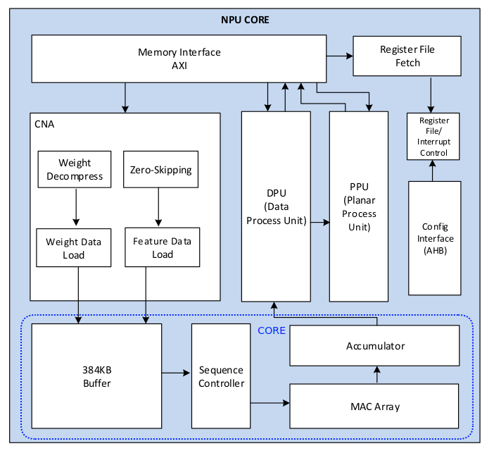
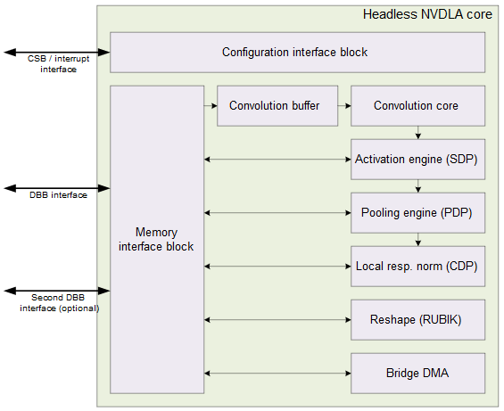
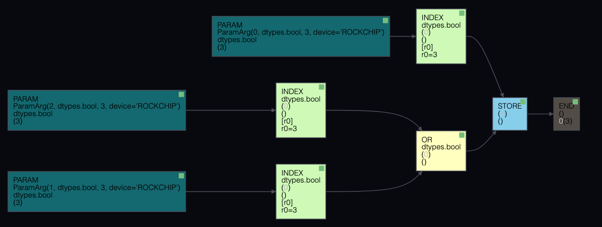

# How to add a new backend to tinygrad: A Rockchip NPU example (Part 1)
Last update: Sep 30 2026

TLDR: This blog (Part 1) modfified ops_python.py and implemented 28/30 GroupOps.ALU and Ops.WMMA for NPU on RK3588, passing each Ops dedicated test case from test_ops.py if any, and ran test_ops.py full sweep result in 177/432 Pass, 235 Fail, 7 timed out, 13 skipped. In Part 2 I will debug and fix each fail case. 

Note: The first half is like solving puzzle and interesting to read but the second half is kind of written in a hurry. I will update daily to make it better!

| Section                                                                                                                           |
| --------------------------------------------------------------------------------------------------------------------------------- |
| [1. Ops.ADD](#1-opsadd)                                                                                                           |
| [2. Ops.MUL](#2-opsmul)                                                                                                           |
| [3. Ops.SUB and Ops.NEG](#3-opssub-and-opsneg)                                                                                    |
| [4. Ops.FDIV](#4-opsfdiv)                                                                                                         |
| [5. Ops.RECIPROCAL](#5-opsreciprocal)                                                                                             |
| [6. Ops.MAX](#6-opsmax)                                                                                                           |
| [7. Ops.OR](#7-opsor)                                                                                                             |
| [8. Ops.CAST: bool to FP16](#8-opscast-bool-to-fp16)                                                                              |
| [9. Ops.CMPNE](#9-opscmpne)                                                                                                       |
| [10. Ops.CAST: FP16 mask to bool](#10-opscast-fp16-mask-to-bool)                                                                  |
| [11. Ops.CMPEQ](#11-opscmpeq)                                                                                                     |
| [12. Ops.CMPLT](#12-opscmplt)                                                                                                     |
| [13. Ops.WHERE](#13-opswhere)                                                                                                     |
| [14. Ops.SHL](#14-opsshl)                                                                                                         |
| [15. Ops.SHR](#15-opsshr)                                                                                                         |
| [16. Ops.TRUNC](#16-opstrunc)                                                                                                     |
| [17. Ops.MULACC](#17-opsmulacc)                                                                                                   |
| [18. Ops.THREEFRY](#18-opsthreefry)                                                                                               |
| [19. Ops.EXP2 (Agent assisted, rewrite WIP)](#19-opsexp2-agent-assisted-rewrite-wip)                                              |
| [20. Ops.LOG2 (Agent assisted, rewrite WIP)](#20-opslog2-agent-assisted-rewrite-wip)                                              |
| [20.1 Boolean AND](#201-boolean-and)                                                                                              |
| [21. Ops.POW](#21-opspow)                                                                                                         |
| [22. Bool XOR](#22-bool-xor)                                                                                                      |
| [23. Ops.CMOD / Ops.CDIV / Ops.FLOORDIV / Ops.FLOORMOD (Agent assisted, rewrite WIP)](#23-opscmod--opscdiv--opsfloordiv--opsfloormod)                           |
| [23.1 CMOD: the remainder (Agent assisted, rewrite WIP)](#231-cmod-the-remainder-agent-assisted-rewrite-wip)                      |
| [23.2 CDIV and the floor correction (Agent assisted, rewrite WIP)](#232-cdiv-and-the-floor-correction-agent-assisted-rewrite-wip) |
| [23.3 Numeric CAST on the NPU](#233-numeric-cast-on-the-npu)                                                                      |
| [24. Ops.SQRT](#24-opssqrt)                                                                                                       |
| [25. Ops.SIN (Agent assisted, rewrite WIP)](#25-opssin-agent-assisted-rewrite-wip)                                                |
| [26. Ops.BITCAST (Agent assisted, rewrite WIP)](#26-opsbitcast-agent-assisted-rewrite-wip)                                        |
| [27. Ops.WMMA (Agent assisted, rewrite WIP)](#27-opswmma-agent-assisted-rewrite-wip)                                              |
| [Full sweep test_ops.py](#full-sweep-test_opspy)                                                                                  |
| [Additional hardware features](#additional-hardware-features)                                                                     |
| [A1. LUT](#a1-lut)                                                                                                                |
| [A2. PPU](#a2-ppu)                                                                                                                |
| [A3. Convolution tiling](#a3-convolution-tiling)                                                                                  |

Tinygrad is a zero-dependency minmial codebase (25407 core lines @20260920) to do ML in python, those lines already included a PyTorch like frontend and kernel space GPU driver down to MMIO written in user space, so makes it the perfect place to support [USB3 eGPU thats can drives a car](https://www.youtube.com/watch?v=nmTepfv3Itg) and add new accelorator support.

"Your accelerator of choice only needs to support a total of ~25 low level ops."
-- from [tinygrad README](https://github.com/tinygrad/tinygrad/blob/ebf163682acfa4a6be2775c5efa02a503c86a220/README.md?plain=1#L112)

It sounds simple but I found no resource or blog post on how to add new accelerator to tinygrad, so here it is and we will find out how deep is the rabbit hole.

In this blog seris, we  
- Part 1: Modify ops_python.py as starting point to understand the NPU and implements the ~25 Ops and run test_ops.py.
- Part 2 (WIP): fix each failed test case and then rewrite ops_rockchip.py from scratch 
- Part 3 (WIP): prepare for PR

U can follow among if u own an OrangePi 5 running the OrangePi Ubuntu 22.02 stock image.

## 1. Ops.ADD

This approach was inspired by [liej6799](https://github.com/liej6799/tinygrad/blob/3588-new/tinygrad/runtime/ops_rockchip.py) who made the simplest ADD works on tinygrad while I was still struggling how to port the [registers and Ops I already reversed](https://github.com/allbilly/npu/blob/master/include/rknnops.h) to tinygrad.

Lets begin with
```
git clone https://github.com/tinygrad/tinygrad 
cd tinygrad && git checkout ebf1636
uv venv && source .venv/bin/activate
cp tinygrad/runtime/ops_python.py tinygrad/runtime/ops_rockchip.py
```

In tinygrad, u can choose a runtime with env like DEV=ROCKCHIP. If u want to run tests, some dependenceis are still needed like pytest and numpy/torch to generte reference output. 
```
uv pip install -e . numpy torch pytest pytest-xdist --torch-backend=cpu
DEV=ROCKCHIP python test/backend/test_ops.py TestOps.test_add
```

The sequential replay checks use Python 3.12.12, NumPy 2.5.3, CPU Torch 2.14.0, pytest 9.1.1 and pytest-xdist 3.8.0 with the pinned tinygrad checkout above. The older timings below are recorded runs, not speed guarantees for this environment.

```
(tinygrad) orangepi@orangepi5:~/tinygrad$ DEV=ROCKCHIP python test/backend/test_ops.py TestOps.test_add
  Traceback (most recent call last):
    File "/home/orangepi/tinygrad/test/backend/test_ops.py", line 92, in <module>
      class TestOps(unittest.TestCase):
    File "/home/orangepi/tinygrad/test/backend/test_ops.py", line 727, in TestOps
      @unittest.skipIf(isinstance(Device[Device.DEFAULT].renderer, NIRRenderer), "TODO: broken in LVP")
                                  ~~~~~~^^^^^^^^^^^^^^^^
    File "/home/orangepi/tinygrad/tinygrad/device.py", line 32, in __getitem__
      return self.__get_canonicalized_item(ix)
             ^^^^^^^^^^^^^^^^^^^^^^^^^^^^^^^^^
    File "/home/orangepi/tinygrad/tinygrad/device.py", line 40, in __get_canonicalized_item
      ret = self.get_class(ix)(ix)
            ^^^^^^^^^^^^^^^^^^
    File "/home/orangepi/tinygrad/tinygrad/device.py", line 37, in get_class
      return [cls for cname, cls in inspect.getmembers(importlib.import_module(f'{base}.runtime.ops_{x}')) if
  (cname.lower() == x + "device")][0]

  ~~~~~~~~~~~~~~~~~~~~~~~~~~~~~~~~~~~~~~~~~~~~~~~~~~~~~~~~~~~~~~~~~~~~~~~~~~~~~~~~~~~~~~~~~~~~~~~~~~~~~~~~~~~~~~~~~~~~~
  ~~~~~~~~~~~~^^^
  IndexError: list index out of range
```

This is because RockchipDevice was not found in our new ops_rockchip.py. Lets replace all "Python" with "Rockchip"

```diff
-class PythonProgram(Program['PythonDevice']):
-  def __init__(self, dev:'PythonDevice', obj:TinyELF):
+class RockchipProgram(Program['RockchipDevice']):
+  def __init__(self, dev:'RockchipDevice', obj:TinyELF):
     self.uops: list[UOp] = pickle.loads(obj.lib)
-    self.tensor_cores = PythonRenderer(obj.target).tensor_cores
+    self.tensor_cores = RockchipRenderer(obj.target).tensor_cores
     self.uop_to_index: dict[UOp, int] = {u:i for i,u in enumerate(self.uops)}
     self.loop_ends: dict[UOp, int] = {u.src[1]:i for i, u in enumerate(self.uops) if u.op == Ops.END}
   def __call__(self, *bufs, global_size:tuple[int,int,int]=(1,1,1), local_size:tuple[int,int,int]=(1,1,1), vals:tuple[int, ...]=(), wait=False, **kw):
@@ -156,12 +156,12 @@ class PythonProgram(Program['PythonDevice']):
         i += 1
     return time.perf_counter() - st

-class PythonCompiler(Compiler):
+class RockchipCompiler(Compiler):
   def compile(self, src:str) -> bytes: return base64.b64decode(src)

-class PythonRenderer(Renderer):
+class RockchipRenderer(Renderer):
   code_for_op = python_alu
-  compiler = PythonCompiler()
+  compiler = RockchipCompiler()

   def __init__(self, target:Target):
     assert (emu:=getenv("EMULATE", "")) == "", ("EMULATE is deprecated, use DEV=PYTHON::" +
@@ -181,6 +181,6 @@ class PythonRenderer(Renderer):

   def supported_dtypes(self): return {d for d in super().supported_dtypes() if d != dtypes.half or sys.version_info >= (3, 12)}

-class PythonDevice(Compiled):
+class RockchipDevice(Compiled):
   def __init__(self, device:str):
-    super().__init__(device, HostAllocator(self), [PythonRenderer], PythonProgram)
+    super().__init__(device, HostAllocator(self), [RockchipRenderer], RockchipProgram)
```

```
$ DEV=ROCKCHIP python test/backend/test_ops.py TestOps.test_add

test_add (__main__.TestOps.test_add) ...
testing                     [(45, 68), (45, 68)]   torch/tinygrad fp: 0.26 / 263.81 ms  bp: 1.07 / 2.80 ms
testing                                       []   torch/tinygrad fp: 0.27 / 0.25 ms  bp: nan / nan ms
testing                     [(45, 68), (45, 68)]   torch/tinygrad fp: 0.06 / 107.37 ms  bp: 0.49 / 0.73 ms
testing                                 [(), ()]   torch/tinygrad fp: 0.05 / 0.09 ms  bp: 0.44 / 0.39 ms ok

----------------------------------------------------------------------
Ran 1 test in 0.494s

OK
```

Great, but it was running on the CPU not the NPU. We need to understand a bit more on the NPU first. 

Rockchip NPU was derived from the open NVDLA (doc link) NPU from nvidia as described in [mtx512 blog](https://jas-hacks.blogspot.com/2024/02/rk3588-reverse-engineering-rknn.html). Rockchip neither release the verilog nor RKNN (link) compiler and runtime, but they released the linux KMD [rknpu_driver](https://github.com/allbilly/rknpu_driver) because of linux GPLv2 license. Thanks to prior work from [phhusson](https://github.com/phhusson/rknpu-reverse-engineering) that introduced me the concept of IOCTL and GEM. Reading the rknpu_driver code we can easily find DRM_IOCTL_RKNPU_SUBMIT and the submit struct it needed. Rockchip proprietary runtime being closed source is not really a problem for us because it still needed some way to talk to linux KMD, so we can capture the RKNN bytes, replays it, and rewrite into readable code. With GDB and enough pantient, i captured the submit struct and bytes in each allocated BO/GEM and rewrote in [C](https://github.com/allbilly/npu/blob/master/include/rknnops.h) according to the leaked [TRM](https://github.com/liej6799/rk3588/blob/main/trm.pdf) and prior work from [mtx512](https://github.com/mtx512/rk3588-npu) who did the GEMM reverse. Its a year long frustrating but rewarding process as SOTA GPT-5.1 back then was bad in register programming, it helps with decoding a bit but dont even think about auto debug why the replay/rewrite is not working, which forces me to read/program/debug everything myself. Most effort was in decoding CONV input/weight bytes packing for [every shapes](https://github.com/allbilly/npu/blob/master/ops_reg/main.c) and decoding/programming the LUT [silu](https://github.com/allbilly/npu/blob/master/ops_rknn/act/silu.py) and [sigmoid](https://github.com/allbilly/npu/blob/master/ops_rknn/act/sigmoid.py). Details are not included in this blog, if u are still interested in my frustration, just point ur agent to commit history in allbilly/npu and allbilly/rk3588.

Rockchip NPU



NVDLA



The NPU is a 3 core fixed stage pipeline processor, input and weight go through CORE (MAC array) -> DPU (elementwise op) -> PPU (pooling/reduction op). In NVDLA terms, CORE is [CSC/CMAC/CACC](https://github.com/nvdla/hw/tree/nvdlav1/vmod/nvdla), DPU is [SDP](https://github.com/nvdla/hw/tree/nvdlav1/vmod/nvdla/sdp), PPU is [PDP](https://github.com/nvdla/hw/tree/nvdlav1/vmod/nvdla/pdp). This blog will mainly use DPU EW op for the 25 Ops, treat CMAC like tensor core for GEMM/CONV if the shape matches, otherwise will just use EW add/mul for GEMM. 

Now to do a simple fp16 ADD example, this is also my NPU health check script.
```
cd ~ && git clone https://github.com/allbilly/rk3588
python rk3588/examples/simple_add.py

ret=0, handle=1, obj_addr=0xffffff8137dadc00, dma_addr=0xfffff000
Memory mapped at offset=0x100000000
ret=0, handle=2, obj_addr=0xffffff8137da8000, dma_addr=0xffffe000
Memory mapped at offset=0x100001000
ret=0, handle=3, obj_addr=0xffffff8137daec00, dma_addr=0xff800000
Memory mapped at offset=0x100002000
ret=0, handle=4, obj_addr=0xffffff8137dac400, dma_addr=0xff400000
Memory mapped at offset=0x100402000
ret=0, handle=5, obj_addr=0xffffff8137dab000, dma_addr=0xff000000
Memory mapped at offset=0x100802000
reset_npu ret=0
SUBMIT ret=0
ADD  NPU=[8 8 8 8 8 8 8 8] expected=[8 8 8 8 8 8 8 8] PASS
```

what the script does is first open the NPU device to obtain fd, then use ctypes to create C struct, ioctl DRM_IOCTL_RKNPU_MEM_CREATE to allocate BO for task/regcmd/input/weight/output, then update dma_addr of input/weight/output in the register sequence, copy the registers to C array regcmd, set regcmd address in a task, and DRM_IOCTL_RKNPU_SUBMIT to submit the task. npu_regs was captured from RKNN simple add and removed all unesscary lines.

```python
npu_regs = [
        0x1001000001e5400c,
        0x1001480000024010,
        0x100100070007403c,
        0x1001000000004030,
        0x1001108202c04070,
        0x200100000000500c,
        0x2001000000005010,
        0x2001000700075014,
        0x2001400000085034,
        (reg.TARGET_DPU  << 48) | ((output_mem_create.dma_addr & 0xFFFFFFFF) << 16) | reg.DST_BASE_ADDR,
        (reg.TARGET_RDMA << 48) | ((input_mem_create.dma_addr & 0xFFFFFFFF) << 16) | reg.RDMA_SRC_BASE_ADDR,
        (reg.TARGET_RDMA << 48) | ((weight_mem_create.dma_addr & 0xFFFFFFFF) << 16) | reg.RDMA_EW_BASE_ADDR,
        0x2001000178495044,
        0x0081000000180008,
    ]
```

Dont worry, we will decode it later. The NPU programming model is mulitple NPU submits by host -> mulitple tasks in one submit -> fused mulitple ops in one task, e.g. CONV/MAC+ELEMENTWISE+BN+BS+RELU+POOL in one task.

Great, now we can port this to ops_rockchip.py and open the NPU device. In simple_add.py, we used os.open(f"/dev/dri/card1", os.O_RDWR), but in tinygrad we will use FileIOInterface like other runtime do. I use agent to run test so add rule to use -n0 to prevent race condition the NPU as the vendor driver did not prevent it. 

AGENTS.md
```diff
+- DO NOT run -n12 for RK NPU use -n0 instead, otherwise will race condition crashes the NPU. 
```

```diff
-import pickle, base64, itertools, time, sys, ctypes
+import pickle, base64, itertools, time, sys, ctypes, os
+from tinygrad.runtime.support.hcq import FileIOInterface
@@
 class RockchipDevice(Compiled):
   def __init__(self, device:str):
+    self.fd_ctl = FileIOInterface("/dev/dri/card1", os.O_RDWR)
```

we also need the C struct and registers offset from [rknpu_driver/inlcude/*.h](https://github.com/allbilly/rknpu_driver/tree/main/include) to be imported in python, here i will just reuse the autogen from [liej6799](https://github.com/liej6799/tinygrad/blob/3588-new/tinygrad/runtime/autogen/rockchip.py)

```
cd ~/tinygrad
wget -O tinygrad/runtime/autogen/rockchip.py https://raw.githubusercontent.com/liej6799/tinygrad/5101a24d100dc08ef612fada1d0766b44f4cbad9/tinygrad/runtime/autogen/rockchip.py
```

Keep running the following commands from ~/tinygrad. This pinned register file has SHA256 `2ae597cd73a2c2a4afa245f5afbddb416485fcd479529ed7e16f4ddaf31e2ebf`.

And allocate task/regcmd/input/weight/output Buffer Object
```diff
-import pickle, base64, itertools, time, sys, ctypes, os
+import pickle, base64, itertools, time, sys, ctypes, os, mmap
+from tinygrad.runtime.autogen import rockchip as rk
@@
 class RockchipDevice(Compiled):
   def __init__(self, device:str):
     self.fd_ctl = FileIOInterface("/dev/dri/card1", os.O_RDWR)
     super().__init__(device, HostAllocator(self), [RockchipRenderer], RockchipProgram)
+    self.task_buf, self.task_mem = self._gpu_alloc(1024, rk.RKNPU_MEM_KERNEL_MAPPING)
+    self.regcmd_buf, self.regcmd_mem = self._gpu_alloc(8192)
+    self.input_buf, self.input_mem = self._gpu_alloc(4194304)
+    self.weight_buf, self.weight_mem = self._gpu_alloc(4194304)
+    self.output_buf, self.output_mem = self._gpu_alloc(4194304)
+  
+  def _gpu_alloc(self, size:int, flags:int=0) -> tuple[int, rk.struct_rknpu_mem_create]:
+    mem = rk.DRM_IOCTL_RKNPU_MEM_CREATE(self.fd_ctl, size=size, flags=flags | rk.RKNPU_MEM_NON_CACHEABLE)
+    try:
+      mapping = rk.DRM_IOCTL_RKNPU_MEM_MAP(self.fd_ctl, handle=mem.handle)
+      addr = self.fd_ctl.mmap(0, mem.size, mmap.PROT_READ | mmap.PROT_WRITE, mmap.MAP_SHARED, mapping.offset)
+    except Exception:
+      rk.DRM_IOCTL_RKNPU_MEM_DESTROY(self.fd_ctl, handle=mem.handle, obj_addr=mem.obj_addr)
+      raise
+    return addr, mem
+  
+  def _gpu_free(self, addr:int, mem:rk.struct_rknpu_mem_create) -> None:
+    FileIOInterface.munmap(addr, mem.size)
+    rk.DRM_IOCTL_RKNPU_MEM_DESTROY(self.fd_ctl, handle=mem.handle, obj_addr=mem.obj_addr)
```

Next, update dma_addr of input/weight/output in the register sequence, dma_addr are owned by RockchipDevice so we can get it with self.dev.output_mem.dma_addr

```diff
 class RockchipProgram(Program['RockchipDevice']):
@@
   def __init__(self, dev:'RockchipDevice', obj:TinyELF):
+    self.dev = dev
     self.uops: list[UOp] = pickle.loads(obj.lib)
     self.tensor_cores = RockchipRenderer(obj.target).tensor_cores
     self.uop_to_index: dict[UOp, int] = {u:i for i,u in enumerate(self.uops)}
     self.loop_ends: dict[UOp, int] = {u.src[1]:i for i, u in enumerate(self.uops) if u.op == Ops.END}
+    self.npu_regs = [
+      0x1001000001e5400c,
+      0x1001480000024010,
+      0x100100070007403c,
+      0x1001000000004030,
+      0x1001108202c04070,
+      0x200100000000500c,
+      0x2001000000005010,
+      0x2001000700075014,
+      0x2001400000085034,
+      ((rk.DPU + 1) << 48) | ((self.dev.output_mem.dma_addr & 0xFFFFFFFF) << 16) | rk.REG_DPU_DST_BASE_ADDR,
+      ((rk.DPU_RDMA + 1) << 48) | ((self.dev.input_mem.dma_addr & 0xFFFFFFFF) << 16) | rk.REG_DPU_RDMA_RDMA_SRC_BASE_ADDR,
+      ((rk.DPU_RDMA + 1) << 48) | ((self.dev.weight_mem.dma_addr & 0xFFFFFFFF) << 16) | rk.REG_DPU_RDMA_RDMA_EW_BASE_ADDR,
+      0x2001000178495044,
+    ]
```

Next, copy the registers to the C array regcmd, set the regcmd DMA address in a task, prepare the submut struct and submit with DRM_IOCTL_RKNPU_SUBMIT 
we will add a function submit() in RockchipProgram

```diff
 class RockchipProgram(Program['RockchipDevice']):
+  @staticmethod
+  def EMIT(target:int, reg:int, value:int) -> int: return ((target + 1) << 48) | ((value & 0xFFFFFFFF) << 16) | reg
+
+  def submit(self) -> None:
+    E = self.EMIT
+    regs = self.npu_regs + [E(0x80, rk.REG_PC_OPERATION_ENABLE,
+      rk.GLOBAL_OPERATION_ENABLE_DPU_OP_EN__MASK | rk.GLOBAL_OPERATION_ENABLE_DPU_RDMA_OP_EN__MASK)]
+    # copy the registers to the C array regcmd
+    ctypes.memset(self.dev.regcmd_buf, 0, self.dev.regcmd_mem.size)
+    regcmd = (ctypes.c_uint64 * len(regs)).from_address(self.dev.regcmd_buf)
+    regcmd[:] = list(regs)
+
+    # set the regcmd DMA address in a task
+    tasks = ctypes.cast(self.dev.task_buf, ctypes.POINTER(rk.struct_rknpu_task))
+    tasks[0] = rk.struct_rknpu_task(
+      flags=0,
+      op_idx=4,
+      enable_mask=0x18,
+      int_mask=0x300,
+      int_clear=0x1ffff,
+      int_status=0,
+      regcfg_amount=len(regs),
+      regcfg_offset=0,
+      regcmd_addr=self.dev.regcmd_mem.dma_addr
+    )
+
+    # prepare the submut struct
+    submit = rk.struct_rknpu_submit(
+      flags=rk.RKNPU_JOB_PC | rk.RKNPU_JOB_BLOCK | rk.RKNPU_JOB_PINGPONG,
+      timeout=6000,
+      task_start=0,
+      task_number=1,
+      task_counter=0,
+      priority=0,
+      task_obj_addr=self.dev.task_mem.obj_addr,
+      core_mask=1,
+      fence_fd=-1
+    )
+    submit.subcore_task[0] = rk.struct_rknpu_subcore_task(task_start=0, task_number=1) # assigned to core 0
+    submit.subcore_task[1] = rk.struct_rknpu_subcore_task(task_start=1, task_number=0)
+    submit.subcore_task[2] = rk.struct_rknpu_subcore_task(task_start=2, task_number=0)
+
+    # submit with DRM_IOCTL_RKNPU_SUBMIT
+    rk.DRM_IOCTL_RKNPU_SUBMIT(self.dev.fd_ctl, __payload=submit)
```

and then pack our inputs

The captured registers only implement ADD, so now restrict the renderer and runtime to that Op.

```diff
-import pickle, base64, itertools, time, sys, ctypes, os, mmap
+import pickle, base64, itertools, time, sys, ctypes, os, mmap, struct
@@
+supported_ops = {Ops.ADD}
+
 class RockchipProgram(Program['RockchipDevice']):
@@
   def __init__(self, dev:'RockchipDevice', obj:TinyELF):
     self.dev = dev
+    self.supported_ops = supported_ops
@@
 class RockchipRenderer(Renderer):
-  code_for_op = python_alu
+  code_for_op = dict.fromkeys(supported_ops)
```

`self.supported_ops` uses the shared module-level set introduced above. It currently contains only ADD. At this step the runtime uses set membership to select the NPU execution path, and the renderer uses the same set to select code-generation rewrites. The captured register sequence remains hardcoded for ADD.

```diff
 class RockchipProgram(Program['RockchipDevice']):
+  def add(self, a:list[float], b:list[float]) -> list[float]:
+    assert b is not None and len(a) == len(b)
+    result:list = []
+    # The captured register sequence processes eight FP16 elements per submission.
+    for start in range(0, len(a), 8):
+      lanes, rhs = a[start:start+8], b[start:start+8]
+      packed = struct.pack("<8e", *(lanes + [0] * (8-len(lanes))))
+      to_mv(self.dev.input_buf, 16)[:] = packed
+      to_mv(self.dev.weight_buf, 16)[:] = struct.pack("<8e", *(rhs + [0.0] * (8 - len(rhs))))
+      self.submit()
+      result.extend(struct.unpack("<8e", to_mv(self.dev.output_buf, 16))[:len(lanes)])
+    return result
```

but exec_alu() is still doing the calculation on CPU and stores result to values[u], we want it runs on NPU instead.

```diff
-          values[u] = [exec_alu(u.op, u.dtype, p) for p in zip(*src_values)]
+          if dtypes.is_float(u.dtype):
+            if u.op not in self.supported_ops or u.dtype != dtypes.half:
+              raise NotImplementedError(f"ROCKCHIP NPU does not support {u.op} with {u.dtype}")
+            values[u] = self.add(*src_values)
+          else:
+            values[u] = [exec_alu(u.op, u.dtype, p) for p in zip(*src_values)]
```

Floating-point ALU operations now either run on the NPU or raise a clear error. Our map only contains ADD and the captured registers use FP16, so FP32 ADD and unsupported floating-point operations are rejected. Non-floating-point ALU operations, including integer address calculations, still use the CPU interpreter. This avoids a successful ROCKCHI-labelled floating-point kernel silently calculating on the CPU.

and for simplicity, comment the other cases and leave the first one  
```diff
 class TestOps(unittest.TestCase):
@@
   def test_add(self):
     helper_test_op([(45,68), (45,68)], lambda x,y: x+y, Tensor.add)
+    # helper_test_op([], lambda: torch.tensor(1)+0.5, lambda: Tensor(1)+0.5, forward_only=True)
+    # helper_test_op([(45,68), (45,68)], lambda x,y: x+y)
+    # helper_test_op([(), ()], lambda x,y: x+y)
-    helper_test_op([], lambda: torch.tensor(1)+0.5, lambda: Tensor(1)+0.5, forward_only=True)
-    helper_test_op([(45,68), (45,68)], lambda x,y: x+y)
-    helper_test_op([(), ()], lambda x,y: x+y)
```

```bash
$ DEV=ROCKCHIP python test/backend/test_ops.py TestOps.test_add

NotImplementedError: ROCKCHIP NPU does not support Ops.ADD with dtypes.float

----------------------------------------------------------------------
Ran 1 test in 0.191s

FAILED (errors=1)
```

Its raise NotImplementedError as DEFAULT_FLOAT is fp32, lets set as HALF
```
$ DEFAULT_FLOAT=HALF DEV=ROCKCHIP python test/backend/test_ops.py TestOps.test_add

test_add (__main__.TestOps.test_add) ...
testing                     [(45, 68), (45, 68)]   torch/tinygrad fp: 0.64 / 390.55 ms  bp: 0.98 / 3.25 ms ok

----------------------------------------------------------------------
Ran 1 test in 0.496s

OK
```

Great its run, lets check whats happening with DEBUG=5
```bash
$ DEBUG=5 DEFAULT_FLOAT=HALF DEV=ROCKCHIP python test/backend/test_ops.py TestOps.test_add | grep "\*\*\*"

compiling E_255_4_3                               : 100%|█| 1/1 [00:00<00:00, 12.38it/s]
compiling E_1020_3                                : 100%|█| 1/1 [00:00<00:00, 36.65it/s]
ok

----------------------------------------------------------------------
Ran 1 test in 0.615s

OK
*** ROCKCHI    1 copy    5.98 KB, ROCKCHI <- NPY                arg  2 mem   0.00 GB tm   4985.97us/     4.99ms (      0 GFLOPS    0|0      GB/s)
*** ROCKCHI    2 copy    5.98 KB, ROCKCHI <- NPY                arg  2 mem   0.00 GB tm   2234.13us/     7.22ms (      0 GFLOPS    0|0      GB/s)
*** ROCKCHI    3 E_255_4_3                                      arg  3 mem   0.00 GB tm    323.77ms/   330.99ms (      0 GFLOPS    0|0      GB/s)
*** CPU        4 E_1020_3                                       arg  1 mem   0.00 GB tm     28.58us/   331.02ms (      0 GFLOPS    0|0      GB/s)
*** CPU        5 E_1020_3                                       arg  1 mem   0.00 GB tm     23.92us/   331.04ms (      0 GFLOPS    0|0      GB/s)
```

Why the last 2 kernels running on CPU not ROCKCHIP? Turns out those are the backward kernel that we shd just skips at this stage with FORWARD_ONLY=1
```
$ DEBUG=5 FORWARD_ONLY=1 DEFAULT_FLOAT=HALF DEV=ROCKCHIP python test/backend/test_ops.py TestOps.test_add | grep "\*\*\*"

compiling E_255_4_3                               : 100%|█| 1/1 [00:00<00:00, 12.31it/s]
ok

----------------------------------------------------------------------
Ran 1 test in 0.411s

OK
*** ROCKCHI    1 copy    5.98 KB, ROCKCHI <- NPY                arg  2 mem   0.00 GB tm   5080.76us/     5.08ms (      0 GFLOPS    0|0      GB/s)
*** ROCKCHI    2 copy    5.98 KB, ROCKCHI <- NPY                arg  2 mem   0.00 GB tm   2346.71us/     7.43ms (      0 GFLOPS    0|0      GB/s)
*** ROCKCHI    3 E_255_4_3                                      arg  3 mem   0.00 GB tm    220.15ms/   227.58ms (      0 GFLOPS    0|0      GB/s)
```

Great now all kernels are on ROCKCHIP and we shd uncomment the remaining cases in test_add one by one

```diff
 class TestOps(unittest.TestCase):
@@
   def test_add(self):
     helper_test_op([(45,68), (45,68)], lambda x,y: x+y, Tensor.add)
+    helper_test_op([], lambda: torch.tensor(1)+0.5, lambda: Tensor(1)+0.5, forward_only=True)
+    helper_test_op([(45,68), (45,68)], lambda x,y: x+y)
+    helper_test_op([(), ()], lambda x,y: x+y)
-    # helper_test_op([], lambda: torch.tensor(1)+0.5, lambda: Tensor(1)+0.5, forward_only=True)
-    # helper_test_op([(45,68), (45,68)], lambda x,y: x+y)
-    # helper_test_op([(), ()], lambda x,y: x+y)
```

```bash
$ DEBUG=5 FORWARD_ONLY=1 DEFAULT_FLOAT=HALF DEV=ROCKCHIP python test/backend/test_ops.py TestOps.test_add

# Excerpt: materializing the folded scalar on CPU
c0 = UOp(Ops.PARAM, (), ParamArg(0, dtypes.half, 1, device='CPU'))
c4 = UOp.const(1.5).cast(dtypes.half)
c5 = c0.index(UOp.const(0)).store(c4)
...
Exception: forward pass failed shape (): dtype mismatch: tinygrad=float16 | torch=float32

Ran 1 test in 0.477s
FAILED (errors=1)
```


The scalar case also needs both frameworks to use the same default float dtype. DEFAULT_FLOAT=HALF changes tinygrad, not Torch, so it otherwise gives `dtype mismatch: tinygrad=float16 | torch=float32`. Add this in test/backend/test_ops.py before continuing; the dtype assertion stays unchanged:

test_ops.py
```diff
 from tinygrad.renderer.nir import NIRRenderer
+# Match scalar promotion when DEFAULT_FLOAT selects a non-FP32 test dtype.
+torch.set_default_dtype(getattr(torch, dtypes.default_float.name))
 
 TINY_BACKEND = getenv("TINY_BACKEND")
```

```python
def test_add(self):
  helper_test_op([(45,68), (45,68)], lambda x,y: x+y, Tensor.add)
  helper_test_op([], lambda: torch.tensor(1)+0.5, lambda: Tensor(1)+0.5, forward_only=True)
  helper_test_op([(45,68), (45,68)], lambda x,y: x+y)
  helper_test_op([(), ()], lambda x,y: x+y)
```

To simplify the tutorial and test process, we will use NOOPT=1 to skip the usual kernel optimization heuristics. Constant folding and op decomposition still run. The later WMMA section explicitly enables optimization to test tensor-core selection.

## 2. Ops.MUL

We passed test_add on NPU, next for MUL. To add NPU MUL support, we shdnt rely on the hardcoded hex blob any more.
I wrote a [decode script](https://github.com/allbilly/npu/blob/master/ops_reg/dump.py) to decode the RKNN weight BO, why weight u might ask, because RKNN put weight and regcmd in the same BO.
You can use it with RKNN gdb [here](https://github.com/allbilly/npu/blob/master/ops_reg/run.sh) and [here](https://github.com/allbilly/npu/blob/master/ops_reg/test.gdb)

The decoded registers are in `~/rk3588/examples/elementwise.py`. The local example now has `CAST_BOOL_HALF`, which runs an INT16 MUL on 0/1 lanes to form the FP16 bit patterns, and `CAST_HALF_BOOL`, which converts an FP16 0/1 mask to packed bool bytes. We will expose those CASTs to tinygrad later; for now we can carry their register modes into the builder.
Most important one for us is EW_CFG, and TRM shows

| Bit   | Attr | Reset | Description                                                                                                                                                                               |
| ----: | :--: | :---: | ----------------------------------------------------------------------------------------------------------------------------------------------------------------------------------------- |
| 31    | RW   | `0x0` | **ew_cvt_type** — Convert type of EW input conversion when input is 0.5.<br>`1'd0`: Mul first<br>`1'd1`: Add first                                                                        |
| 30    | RW   | `0x0` | **ew_cvt_round** — Rounding type of EW input conversion when input is 0.5.<br>`1'd0`: If the integer is odd, carry 1<br>`1'd1`: Carry 1 no matter what the integer is                     |
| 29:28 | RW   | `0x0` | **ew_data_mode** — Data mode of the data from ERDMA.                                                                                                                                      |
| 27:24 | RO   | `0x0` | Reserved.                                                                                                                                                                                 |
| 23:22 | RW   | `0x0` | **edata_size** — Data size of the cube from ERDMA.<br>`2'd0`: 4-bit<br>`2'd1`: 8-bit<br>`2'd2`: 16-bit<br>`2'd3`: 32-bit                                                                  |
| 21    | RW   | `0x0` | **ew_equal_en** — Min/max equal enable.<br>`1'd0`: Disable<br>`1'd1`: Enable                                                                                                              |
| 20    | RW   | `0x0` | **ew_binary_en** — Min/max binary enable.<br>`1'd0`: Disable<br>`1'd1`: Enable                                                                                                            |
| 19:16 | RW   | `0x0` | **ew_alu_algo** — EW core ALU operation type.<br>`4'd0`: Max<br>`4'd1`: Min<br>`4'd2`: Add<br>`4'd3`: Div<br>`4'd4`: Minus<br>`4'd5`: Abs<br>`4'd6`: Neg<br>`4'd7`: Floor<br>`4'd8`: Ceil |
| 15:11 | RO   | `0x0` | Reserved.                                                                                                                                                                                 |
| 10    | RW   | `0x0` | **ew_relux_en** — Enable RELUX.<br>`1'd0`: Disable<br>`1'd1`: Enable                                                                                                                      |
| 9     | RW   | `0x0` | **ew_relu_bypass** — Bypass EW core RELU operation.<br>`1'd0`: Do not bypass<br>`1'd1`: Bypass                                                                                            |
| 8     | RW   | `0x0` | **ew_op_cvt_bypass** — Bypass EW input converter.<br>`1'd0`: Do not bypass<br>`1'd1`: Bypass                                                                                              |
| 7     | RW   | `0x0` | **ew_lut_bypass** — Bypass LUT.<br>`1'd0`: Do not bypass<br>`1'd1`: Bypass                                                                                                                |
| 6     | RW   | `0x0` | **ew_op_src** — Operand source.<br>`1'd0`: From configure register<br>`1'd1`: From outside                                                                                                |
| 5     | RW   | `0x0` | **ew_mul_prelu** — Enable MUL PRELU.<br>`1'd0`: Disable<br>`1'd1`: Enable                                                                                                                 |
| 4:3   | RO   | `0x0` | Reserved.                                                                                                                                                                                 |
| 2     | RW   | `0x0` | **ew_op_type** — Operator type.<br>`1'd0`: ALU<br>`1'd1`: MUL                                                                                                                             |
| 1     | RW   | `0x0` | **ew_op_bypass** — Bypass EW core ALU and MUL operation.<br>`1'd0`: Do not bypass<br>`1'd1`: Bypass                                                                                       |
| 0     | RW   | `0x0` | **ew_bypass** — Bypass EW core.<br>`1'd0`: Do not bypass EW core<br>`1'd1`: Bypass EW core                                                                                                |

At first glance, ew_alu_algo looks interesting, but it doesnt contains MUL we want

ew_alu_algo
| Value  | Operation |
| :----: | --------- |
| `4'd0` | Max       |
| `4'd1` | Min       |
| `4'd2` | Add       |
| `4'd3` | Div       |
| `4'd4` | Minus     |
| `4'd5` | Abs       |
| `4'd6` | Neg       |
| `4'd7` | Floor     |
| `4'd8` | Ceil      |

MUL is is in ew_op_type
| Value  | Operator Type |
| :----: | ------------- |
| `1'd0` | ALU           |
| `1'd1` | MUL           |

And from the RKNN capture and playing around with different val, "MUL" would need to set not only DPU_EW_CFG_EW_OP_TYPE but also DPU_EW_CFG_EW_OP_CVT_BYPASS

The following is extracted from our local elementwise.py in allbilly/rk3588. Its extended modes are not all committed upstream yet; use the complete diff below for this tutorial, not a fresh checkout's register list.
The byte-output mode processes sixteen lanes per task: MRDMA reads the first eight FP16 values, ERDMA reads the next eight, and the output is sixteen bytes. The example pads the last atom and submits these conversion atoms separately. `CAST_HALF_BOOL` rejects inputs other than 0/1.
```python
int16_mode = op == "CAST_BOOL_HALF"
byte_output = op == "CAST_HALF_BOOL"
out_precision = 0 if byte_output else 1 if int16_mode else (2 if hw_out_fp16 else 5)
precision = 1 if int16_mode else 2
out_cvt_scale = (1 if fdiv_op or int16_mode or byte_output else ((1 << 16) | 1)) if hw_out_fp16 else 0

task_regs.append([
    E(reg.DPU,  reg.S_POINTER, 0x0000000E),
    E(reg.DPU,  reg.FEATURE_MODE_CFG,
        ((byte_output << 31) |               # DPU_FEATURE_MODE_CFG_COMB_USE
         (15 << 5) |                          # DPU_FEATURE_MODE_CFG_BYPASS
         (2 << 1)  |                          # DPU_FEATURE_MODE_CFG_MODE
         1)                                    # DPU_FEATURE_MODE_CFG_FLYING_MODE
    ),
    E(reg.DPU,  reg.DATA_FORMAT,
        ((out_precision << 29) |              # DPU_DATA_FORMAT_OUT_PRECISION
         (precision << 26) |                  # DPU_DATA_FORMAT_IN_PRECISION
         precision)                            # DPU_DATA_FORMAT_PROC_PRECISION
    ),
    E(reg.DPU,  reg.DATA_CUBE_WIDTH, dataout_width),
    E(reg.DPU,  reg.DATA_CUBE_HEIGHT, 0),
    E(reg.DPU,  reg.DATA_CUBE_NOTCH, 0),
    E(reg.DPU,  reg.DATA_CUBE_CHANNEL,
        (((15 if byte_output else 7) << 16) | # DPU_DATA_CUBE_CHANNEL_CUBE
         (15 if byte_output else 7))           # DPU_DATA_CUBE_CHANNEL_ATOMICS
    ),
    # Each task owns its bypass state, including after BS/BN comparisons.
    E(reg.DPU,  reg.BS_CFG,
        ((1 << 6) |                          # DPU_BS_CFG_BS_RELU_BYPASS
         ((not byte_output) << 4) |           # DPU_BS_CFG_BS_MUL_BYPASS
         (1 << 1) |                          # DPU_BS_CFG_BS_ALU_BYPASS
         (not byte_output))                   # DPU_BS_CFG_BS_BYPASS
    ),
    E(reg.DPU,  reg.BN_CFG,
        (((2 if byte_output else 0) << 16) |  # DPU_BN_CFG_BN_ALU_ALGO: ADD
         (1 << 6) |                          # DPU_BN_CFG_BN_RELU_BYPASS
         (1 << 4) |                          # DPU_BN_CFG_BN_MUL_BYPASS
         ((not byte_output) << 1) |           # DPU_BN_CFG_BN_ALU_BYPASS
         (not byte_output))                   # DPU_BN_CFG_BN_BYPASS
    ),
    # Clear operands and clamp values left by earlier BS/BN tasks.
    E(reg.DPU,  reg.BS_ALU_CFG, 0),
    E(reg.DPU,  reg.BS_MUL_CFG,
        (int(np.float16(1.0).view(np.uint16)) << 16) if byte_output else 0), # DPU_BS_MUL_CFG_BS_MUL_OPERAND
    E(reg.DPU,  reg.BN_ALU_CFG, 0),
    E(reg.DPU,  reg.BN_MUL_CFG, 0),
    E(reg.DPU,  reg.BS_RELUX_CMP_VALUE, 0),
    E(reg.DPU,  reg.BN_RELUX_CMP_VALUE, 0),
    E(reg.DPU,  reg.EW_CFG,
        ((1 << 9) |                          # DPU_EW_CFG_EW_RELU_BYPASS
         (1 << 8) |                          # DPU_EW_CFG_EW_OP_CVT_BYPASS
         (1 << 7) |                          # DPU_EW_CFG_EW_LUT_BYPASS
         (1 << 1) |                          # DPU_EW_CFG_EW_OP_BYPASS
         1) if byte_output else              # DPU_EW_CFG_EW_BYPASS
        # selects MAX=0, ADD=2, FDIV=3, SUB=4 when EW_OP_TYPE[2]=0.
        # MUL/NEG/CAST_BOOL_HALF use EW_OP_TYPE[2]=1 instead of an ALU selector.
        # Base config: data_mode=1, data_size=2, relu_bypass=1, lut_bypass=1, op_src=1
        ((1 << 28) |                         # DPU_EW_CFG_EW_DATA_MODE
         (2 << 22) |                         # DPU_EW_CFG_EDATA_SIZE
         ({"MAX": 0, "ADD": 2, "FDIV": 3, "SUB": 4}.get(op, 0) << 16) |  # DPU_EW_CFG_EW_ALU_ALGO
         (1 << 9)  |                         # DPU_EW_CFG_EW_RELU_BYPASS
         ((op in ("MUL", "NEG", "FDIV") and not int16_mode) << 8) |  # DPU_EW_CFG_EW_OP_CVT_BYPASS
         (1 << 7)  |                         # DPU_EW_CFG_EW_LUT_BYPASS
         (1 << 6)  |                         # DPU_EW_CFG_EW_OP_SRC
         ((op in ("MUL", "NEG", "CAST_BOOL_HALF")) << 2))  # DPU_EW_CFG_EW_OP_TYPE: MUL (0 selects ALU)
    ),
    E(reg.DPU,  reg.EW_CVT_SCALE_VALUE, 1),
    E(reg.DPU,  reg.OUT_CVT_OFFSET, 0),  # No bias from a previous output conversion.
    E(reg.DPU,  reg.OUT_CVT_SCALE, out_cvt_scale),
    E(reg.DPU,  reg.OUT_CVT_SHIFT, 0),  # Clear exponent adjustment left by comparisons.
    E(reg.RDMA, reg.RDMA_S_POINTER, 0x0000000E),
    E(reg.RDMA, reg.RDMA_DATA_CUBE_WIDTH, dataout_width),
    E(reg.RDMA, reg.RDMA_DATA_CUBE_HEIGHT, 0),
    E(reg.RDMA, reg.RDMA_DATA_CUBE_CHANNEL, 15 if byte_output else 7),
    E(reg.RDMA, reg.RDMA_ERDMA_CFG,
        ((1 << 30) |                          # DPU_RDMA_RDMA_ERDMA_CFG_ERDMA_DATA_MODE
         (2 << 2))                            # DPU_RDMA_RDMA_ERDMA_CFG_ERDMA_DATA_SIZE
    ),
    E(reg.DPU,  reg.DST_BASE_ADDR, output_addr),
    E(reg.RDMA, reg.RDMA_SRC_BASE_ADDR, input_addr),
    E(reg.RDMA, reg.RDMA_EW_BASE_ADDR, weight_addr),
    E(reg.RDMA, reg.RDMA_FEATURE_MODE_CFG,
        (((3 if byte_output else 0) << 8) |   # DPU_RDMA_RDMA_FEATURE_MODE_CFG_COMB_USE
         (precision << 15) |                  # DPU_RDMA_RDMA_FEATURE_MODE_CFG_IN_PRECISION
         (15 << 11) |                         # DPU_RDMA_RDMA_FEATURE_MODE_CFG_BURST_LEN
         (precision << 5) |                   # DPU_RDMA_RDMA_FEATURE_MODE_CFG_PROC_PRECISION
         ((not fdiv_op and not int16_mode) << 3) |  # DPU_RDMA_RDMA_FEATURE_MODE_CFG_MRDMA_FP16TOFP32_EN
         1)                                    # DPU_RDMA_RDMA_FEATURE_MODE_CFG_FLYING_MODE
    ),
    E(reg.RDMA, reg.RDMA_SURF_NOTCH, (1 if byte_output else 0) << 4), # RDMA_SURF_NOTCH_ADDR
    E(reg.RDMA, reg.RDMA_EW_SURF_NOTCH, (1 if byte_output else 0) << 4), # RDMA_EW_SURF_NOTCH
])
if byte_output:
    task_regs[-1] += [
        E(reg.DPU, reg.BS_OW_CFG, 1 << 1),     # DPU_BS_OW_CFG_OD_BYPASS
        E(reg.DPU, reg.WDMA_SIZE_0, 15),       # DPU_WDMA_SIZE_0_CHANNEL_WDMA
        E(reg.DPU, reg.WDMA_SIZE_1, 0),        # DPU_WDMA_SIZE_1_WIDTH/HEIGHT_WDMA
        E(reg.DPU, reg.DST_SURF_STRIDE, 1 << 4), # DPU_DST_SURF_STRIDE
        E(reg.DPU, reg.SURFACE_ADD, 1 << 4),   # DPU_SURFACE_ADD_SURF_ADD
        E(reg.RDMA, reg.RDMA_BRDMA_CFG, 0),
        E(reg.RDMA, reg.RDMA_NRDMA_CFG, 0),
        E(reg.RDMA, reg.RDMA_EW_SURF_STRIDE, 2 << 4), # RDMA_EW_SURF_STRIDE
    ]
```

Now replace the hardcoded hex blob in npu_regs in RockchipProgram. 
Note that `elementwise.py` is desiged to be single python file so it uses hardcoded numeric shifts
Here we use the `rk` shifts CONSTANT from autogen 

supported_ops lists the UOps we accept. ew_alu_algo lists the hardware ALU selectors; having a selector in that table does not enable a new UOp. MUL uses the multiplier, so its ALU selector stays 0.

The reference uses MUL by -1 for NEG. Probing EW selector 6 also negated finite values, signed zeros and infinities, so we use that native NEG mode here. It needs no immediate -1 register.

Use tinygrad's `bitcast` helper to encode register constants. This is host setup, not tensor BITCAST.

```diff
-supported_ops = {Ops.ADD}
+supported_ops = {Ops.ADD, Ops.MUL}
+
+ew_alu_algo = {"MAX": 0, "MIN": 1, "ADD": 2, "DIV": 3, "SUB": 4, "ABS": 5, "NEG": 6, "FLOOR": 7, "CEIL": 8}
+op_to_ew = {Ops.ADD: "ADD", Ops.SUB: "SUB", Ops.MAX: "MAX", Ops.FDIV: "DIV", Ops.NEG: "NEG"}
+
+def fp16(value:float) -> int: return bitcast(value, dtypes.half, dtypes.uint16)
@@
 class RockchipProgram(Program['RockchipDevice']):
@@
+    self.npu_regs:list[int] = []
+
+  def build_registers(self, op:Ops, int16_mode:bool=False, arg:tuple[str, DType]|None=None, byte_output:bool=False,
+                      input_addr:int|None=None, weight_addr:int|None=None, output_addr:int|None=None) -> None:
+    E = self.EMIT
+    exp_shift = arg == ("fp16_exponent_shift_minus(16)", dtypes.half)
+    unary = op in GroupOp.Unary
+    # MUL uses the multiplier, so its ALU selector stays 0.
+    if op is Ops.CUSTOM:
+      alu_algo = ew_alu_algo.get(arg[0], 0)
+    else:
+      alu_algo = ew_alu_algo[op_to_ew[op]] if op in op_to_ew else 0
+    if op not in op_to_ew and op not in (Ops.MUL, Ops.NEG, Ops.CUSTOM):
+      raise NotImplementedError(f"ROCKCHIP requires lowering or a dedicated handler for {op}")
+    precision = 1 if int16_mode else 2
     self.npu_regs = [
-      0x1001000001e5400c,
-      0x1001480000024010,
-      0x100100070007403c,
-      0x1001000000004030,
-      0x1001108202c04070,
-      0x200100000000500c,
-      0x2001000000005010,
-      0x2001000700075014,
-      0x2001400000085034,
-      ((rk.DPU + 1) << 48) | ((self.dev.output_mem.dma_addr & 0xFFFFFFFF) << 16) | rk.REG_DPU_DST_BASE_ADDR,
-      ((rk.DPU_RDMA + 1) << 48) | ((self.dev.input_mem.dma_addr & 0xFFFFFFFF) << 16) | rk.REG_DPU_RDMA_RDMA_SRC_BASE_ADDR,
-      ((rk.DPU_RDMA + 1) << 48) | ((self.dev.weight_mem.dma_addr & 0xFFFFFFFF) << 16) | rk.REG_DPU_RDMA_RDMA_EW_BASE_ADDR,
-      0x2001000178495044,
-    ]
+      E(rk.DPU, rk.REG_DPU_S_POINTER, 0xE),
+      E(rk.DPU, rk.REG_DPU_FEATURE_MODE_CFG,
+        (byte_output << rk.DPU_FEATURE_MODE_CFG_COMB_USE__SHIFT) |
+        (15 << rk.DPU_FEATURE_MODE_CFG_BURST_LEN__SHIFT) |
+        (2 << rk.DPU_FEATURE_MODE_CFG_OUTPUT_MODE__SHIFT) |
+        (1 << rk.DPU_FEATURE_MODE_CFG_FLYING_MODE__SHIFT)),
+      E(rk.DPU, rk.REG_DPU_DATA_FORMAT,
+        ((0 if byte_output else precision) << rk.DPU_DATA_FORMAT_OUT_PRECISION__SHIFT) |
+        (precision << rk.DPU_DATA_FORMAT_IN_PRECISION__SHIFT) |
+        (precision << rk.DPU_DATA_FORMAT_PROC_PRECISION__SHIFT)),
+      E(rk.DPU, rk.REG_DPU_DATA_CUBE_WIDTH, 0),
+      E(rk.DPU, rk.REG_DPU_DATA_CUBE_HEIGHT, 0),
+      E(rk.DPU, rk.REG_DPU_DATA_CUBE_NOTCH_ADDR, 0),
+      E(rk.DPU, rk.REG_DPU_DATA_CUBE_CHANNEL,
+        ((15 if byte_output else 7) << rk.DPU_DATA_CUBE_CHANNEL_ORIG_CHANNEL__SHIFT) |
+        ((15 if byte_output else 7) << rk.DPU_DATA_CUBE_CHANNEL_CHANNEL__SHIFT)),
+      E(rk.DPU, rk.REG_DPU_BS_CFG,
+        ((0 if byte_output else 2) << rk.DPU_BS_CFG_BS_ALU_ALGO__SHIFT) |
+        (1 << rk.DPU_BS_CFG_BS_ALU_BYPASS__SHIFT) |
+        (1 << rk.DPU_BS_CFG_BS_RELU_BYPASS__SHIFT) if exp_shift or byte_output else
+        (1 << rk.DPU_BS_CFG_BS_BYPASS__SHIFT) | (1 << rk.DPU_BS_CFG_BS_ALU_BYPASS__SHIFT) |
+        (1 << rk.DPU_BS_CFG_BS_MUL_BYPASS__SHIFT) | (1 << rk.DPU_BS_CFG_BS_RELU_BYPASS__SHIFT)),
+      E(rk.DPU, rk.REG_DPU_BN_CFG,
+        (2 << rk.DPU_BN_CFG_BN_ALU_ALGO__SHIFT) | (1 << rk.DPU_BN_CFG_BN_MUL_BYPASS__SHIFT) |
+        (1 << rk.DPU_BN_CFG_BN_RELU_BYPASS__SHIFT) if byte_output else
+        (1 << rk.DPU_BN_CFG_BN_BYPASS__SHIFT) | (1 << rk.DPU_BN_CFG_BN_ALU_BYPASS__SHIFT) |
+        (1 << rk.DPU_BN_CFG_BN_MUL_BYPASS__SHIFT) | (1 << rk.DPU_BN_CFG_BN_RELU_BYPASS__SHIFT)),
+      E(rk.DPU, rk.REG_DPU_BS_ALU_CFG, 0),
+      E(rk.DPU, rk.REG_DPU_BS_MUL_CFG,
+        (fp16(1.0) << rk.DPU_BS_MUL_CFG_BS_MUL_OPERAND__SHIFT) if exp_shift or byte_output else 0),
+      E(rk.DPU, rk.REG_DPU_BS_OW_CFG, 1 << rk.DPU_BS_OW_CFG_OD_BYPASS__SHIFT),
+      E(rk.DPU, rk.REG_DPU_WDMA_SIZE_0, 15 if byte_output else 7),
+      E(rk.DPU, rk.REG_DPU_WDMA_SIZE_1, 0),
+      E(rk.DPU, rk.REG_DPU_BN_MUL_CFG, 0),
+      E(rk.DPU, rk.REG_DPU_BN_ALU_CFG, 0),
+      E(rk.DPU, rk.REG_DPU_BN_RELUX_CMP_VALUE, 0),
+      E(rk.DPU, rk.REG_DPU_EW_CFG,
+        (1 << rk.DPU_EW_CFG_EW_BYPASS__SHIFT) | (1 << rk.DPU_EW_CFG_EW_OP_BYPASS__SHIFT) |
+        (1 << rk.DPU_EW_CFG_EW_OP_CVT_BYPASS__SHIFT) | (1 << rk.DPU_EW_CFG_EW_LUT_BYPASS__SHIFT) |
+        (1 << rk.DPU_EW_CFG_EW_RELU_BYPASS__SHIFT) if exp_shift or byte_output else
+        (1 << rk.DPU_EW_CFG_EW_DATA_MODE__SHIFT) |
+        (2 << rk.DPU_EW_CFG_EDATA_SIZE__SHIFT) |
+        (alu_algo << rk.DPU_EW_CFG_EW_ALU_ALGO__SHIFT) |
+        (1 << rk.DPU_EW_CFG_EW_RELU_BYPASS__SHIFT) |
+        ((not int16_mode and op in (Ops.MUL, Ops.FDIV)) << rk.DPU_EW_CFG_EW_OP_CVT_BYPASS__SHIFT) |
+        (1 << rk.DPU_EW_CFG_EW_LUT_BYPASS__SHIFT) |
+        ((not unary) << rk.DPU_EW_CFG_EW_OP_SRC__SHIFT) |
+        ((op is Ops.MUL) << rk.DPU_EW_CFG_EW_OP_TYPE__SHIFT)),
+      E(rk.DPU, rk.REG_DPU_EW_CVT_SCALE_VALUE, 1),
+      E(rk.DPU, rk.REG_DPU_OUT_CVT_OFFSET, 0),
+      E(rk.DPU, rk.REG_DPU_OUT_CVT_SHIFT, (16 if exp_shift else 0) << rk.DPU_OUT_CVT_SHIFT_MINUS_EXP__SHIFT),
+      E(rk.DPU, rk.REG_DPU_SURFACE_ADD,
+        (1 if byte_output else 2 if int16_mode or exp_shift else 4) << rk.DPU_SURFACE_ADD_SURF_ADD__SHIFT),
+      E(rk.DPU, rk.REG_DPU_OUT_CVT_SCALE,
+        ((not int16_mode and not byte_output and op is not Ops.FDIV) << rk.DPU_OUT_CVT_SCALE_FP32TOFP16_EN__SHIFT) |
+        (1 << rk.DPU_OUT_CVT_SCALE_OUT_CVT_SCALE__SHIFT)),
+      E(rk.DPU_RDMA, rk.REG_DPU_RDMA_RDMA_S_POINTER, 0xE),
+      E(rk.DPU_RDMA, rk.REG_DPU_RDMA_RDMA_DATA_CUBE_WIDTH, 0),
+      E(rk.DPU_RDMA, rk.REG_DPU_RDMA_RDMA_DATA_CUBE_HEIGHT, 0),
+      E(rk.DPU_RDMA, rk.REG_DPU_RDMA_RDMA_DATA_CUBE_CHANNEL, 15 if byte_output else 7),
+      E(rk.DPU_RDMA, rk.REG_DPU_RDMA_RDMA_ERDMA_CFG,
+        (1 << rk.DPU_RDMA_RDMA_ERDMA_CFG_ERDMA_DATA_MODE__SHIFT) |
+        (2 << rk.DPU_RDMA_RDMA_ERDMA_CFG_ERDMA_DATA_SIZE__SHIFT) |
+        ((exp_shift or unary) << rk.DPU_RDMA_RDMA_ERDMA_CFG_ERDMA_DISABLE__SHIFT)),
+      E(rk.DPU, rk.REG_DPU_DST_BASE_ADDR, self.dev.output_mem.dma_addr if output_addr is None else output_addr),
+      E(rk.DPU_RDMA, rk.REG_DPU_RDMA_RDMA_SRC_BASE_ADDR, self.dev.input_mem.dma_addr if input_addr is None else input_addr),
+      E(rk.DPU_RDMA, rk.REG_DPU_RDMA_RDMA_FEATURE_MODE_CFG,
+        ((3 if byte_output else 0) << rk.DPU_RDMA_RDMA_FEATURE_MODE_CFG_COMB_USE__SHIFT) |
+        (precision << rk.DPU_RDMA_RDMA_FEATURE_MODE_CFG_IN_PRECISION__SHIFT) |
+        (15 << rk.DPU_RDMA_RDMA_FEATURE_MODE_CFG_BURST_LEN__SHIFT) |
+        (precision << rk.DPU_RDMA_RDMA_FEATURE_MODE_CFG_PROC_PRECISION__SHIFT) |
+        ((not int16_mode and op is not Ops.FDIV) << rk.DPU_RDMA_RDMA_FEATURE_MODE_CFG_MRDMA_FP16TOFP32_EN__SHIFT) |
+        (1 << rk.DPU_RDMA_RDMA_FEATURE_MODE_CFG_FLYING_MODE__SHIFT)),
+      E(rk.DPU_RDMA, rk.REG_DPU_RDMA_RDMA_SURF_NOTCH,
+        (1 if byte_output else 0) << rk.DPU_RDMA_RDMA_SURF_NOTCH_SURF_NOTCH_ADDR__SHIFT),
+      E(rk.DPU_RDMA, rk.REG_DPU_RDMA_RDMA_EW_SURF_NOTCH,
+        (1 if byte_output else 0) << rk.DPU_RDMA_RDMA_EW_SURF_NOTCH_EW_SURF_NOTCH__SHIFT),
+    ]
+    if exp_shift or byte_output:
+      self.npu_regs += [
+        E(rk.DPU_RDMA, rk.REG_DPU_RDMA_RDMA_BRDMA_CFG, 0 if byte_output else 1),
+        E(rk.DPU_RDMA, rk.REG_DPU_RDMA_RDMA_NRDMA_CFG, 0 if byte_output else 1),
+        E(rk.DPU, rk.REG_DPU_DST_SURF_STRIDE, (1 if byte_output else 2) << rk.DPU_DST_SURF_STRIDE_DST_SURF_STRIDE__SHIFT),
+        E(rk.DPU_RDMA, rk.REG_DPU_RDMA_RDMA_EW_SURF_STRIDE, 2 << rk.DPU_RDMA_RDMA_EW_SURF_STRIDE_EW_SURF_STRIDE__SHIFT),
+      ]
+    if not unary:
+      self.npu_regs.append(E(rk.DPU_RDMA, rk.REG_DPU_RDMA_RDMA_EW_BASE_ADDR,
+                            self.dev.weight_mem.dma_addr if weight_addr is None else weight_addr))
@@
-  def add(self, a:list[float], b:list[float]) -> list[float]:
+  def alu(self, op:Ops, a:list[float], b:list[float]) -> list[float]:
     assert b is not None and len(a) == len(b)
+    self.build_registers(op)
     result:list = []
@@
           if dtypes.is_float(u.dtype):
             if u.op not in self.supported_ops or u.dtype != dtypes.half:
               raise NotImplementedError(f"ROCKCHIP NPU does not support {u.op} with {u.dtype}")
-            values[u] = self.add(*src_values)
+            values[u] = self.alu(u.op, *src_values)
           else:
             values[u] = [exec_alu(u.op, u.dtype, p) for p in zip(*src_values)]
```

The decoded builder includes both operand routes. Binary ADD and MUL use `EW_OP_SRC=1` and read the second tensor through ERDMA. Native NEG uses `EW_OP_SRC=0` and disables ERDMA. The FDIV converter settings are here too. Neither NEG nor FDIV is exposed in `supported_ops` yet; this keeps the register setup together while the next step still tests only ADD and MUL.

The builder also carries the example's `CAST_BOOL_HALF` INT16 mode and `CAST_HALF_BOOL` byte-output mode now, but does not expose those CASTs to tinygrad yet. Both paths explicitly initialize their register state. The optional DMA addresses keep the example's variable input/weight/output addresses; omitting them uses the device's default buffers. The exponent-shift mode multiplies by 1 and adjusts the exponent; its MUL inf input will be a separate UOp.

The local elementwise.py extension's CAST_HALF_BOOL probe passed sizes 1, 3, 7, 8, 9, 15, 16, 17, 31, 32 and 4096, checking raw packed bytes as well as bool values. A fresh upstream checkout does not include that mode yet. For this tutorial, use the complete register diff above; we will test it through tinygrad when we enable the mask CAST below.

now lets run test_add, test_tiny_mul and test_mul

```bash
$ DEBUG=5 NOOPT=1 FORWARD_ONLY=1 DEFAULT_FLOAT=HALF DEV=ROCKCHIP python test/backend/test_ops.py TestOps.test_tiny_mul

*** ROCKCHI    3 E_64                                           arg  3 mem   0.00 GB tm     13.12ms/    24.23ms (      0 GFLOPS    0|0      GB/s)
Ran 1 test in 0.150s

OK

$ DEBUG=5 NOOPT=1 FORWARD_ONLY=1 DEFAULT_FLOAT=HALF DEV=ROCKCHIP python test/backend/test_ops.py TestOps.test_add

*** ROCKCHI    1 copy    5.98 KB, ROCKCHI <- NPY                arg  2 mem   0.00 GB tm   5097.38us/     5.10ms (      0 GFLOPS    0|0      GB/s)
*** ROCKCHI    2 copy    5.98 KB, ROCKCHI <- NPY                arg  2 mem   0.00 GB tm   2259.80us/     7.36ms (      0 GFLOPS    0|0      GB/s)
*** ROCKCHI    3 E_3060                                         arg  3 mem   0.00 GB tm    752.22ms/   759.58ms (      0 GFLOPS    0|0      GB/s)
*** CPU        4 E                                              arg  1 mem   0.00 GB tm     21.87us/   759.60ms (      0 GFLOPS    0|0      GB/s)
*** ROCKCHI    5 copy    5.98 KB, ROCKCHI <- NPY                arg  2 mem   0.00 GB tm   1292.36us/   760.89ms (      0 GFLOPS    0|0      GB/s)
*** ROCKCHI    6 copy    5.98 KB, ROCKCHI <- NPY                arg  2 mem   0.00 GB tm   1045.32us/   761.94ms (      0 GFLOPS    0|0      GB/s)
*** ROCKCHI    7 E_3060                                         arg  3 mem   0.00 GB tm    568.81ms/  1330.75ms (      0 GFLOPS    0|0      GB/s)
*** CPU        8 E                                              arg  1 mem   0.00 GB tm     11.37us/  1330.76ms (      0 GFLOPS    0|0      GB/s)
Ran 1 test in 1.581s

OK

$ DEBUG=5 NOOPT=1 FORWARD_ONLY=1 DEFAULT_FLOAT=HALF DEV=ROCKCHIP python test/backend/test_ops.py TestOps.test_mul

*** ROCKCHI    1 copy    8.00 KB, ROCKCHI <- NPY                arg  2 mem   0.00 GB tm   5286.96us/     5.29ms (      0 GFLOPS    0|0      GB/s)
*** ROCKCHI    2 copy    8.00 KB, ROCKCHI <- NPY                arg  2 mem   0.00 GB tm   2315.21us/     7.60ms (      0 GFLOPS    0|0      GB/s)
*** ROCKCHI    3 E_4096                                         arg  3 mem   0.00 GB tm    891.25ms/   898.85ms (      0 GFLOPS    0|0      GB/s)
*** ROCKCHI    4 copy    8.00 KB, ROCKCHI <- NPY                arg  2 mem   0.00 GB tm   1318.31us/   900.17ms (      0 GFLOPS    0|0      GB/s)
*** ROCKCHI    5 copy    8.00 KB, ROCKCHI <- NPY                arg  2 mem   0.00 GB tm   1114.44us/   901.28ms (      0 GFLOPS    0|0      GB/s)
*** ROCKCHI    6 E_4096                                         arg  3 mem   0.00 GB tm    907.43ms/  1808.71ms (      0 GFLOPS    0|0      GB/s)
*** CPU        7 E                                              arg  1 mem   0.00 GB tm     23.62us/  1808.73ms (      0 GFLOPS    0|0      GB/s)
Ran 1 test in 2.141s

OK
```

CPU kernel was observed when running test_mul [(), ()], with same reason mentioend in test_add

## 3. Ops.SUB and Ops.NEG

next we do test_sub and test_neg, 
test_sub is simply add Ops.SUB to supported_ops, while Ops.NEG is an unary Ops, so we use its native ALU mode and need some fix to expect single input here


```diff
-supported_ops = {Ops.ADD, Ops.MUL}
+supported_ops = {Ops.ADD, Ops.MUL, Ops.SUB, Ops.NEG}
@@
-  def alu(self, op:Ops, a:list[float], b:list[float]) -> list[float]:
+  def alu(self, op:Ops, a:list[float], b:list[float]|None=None) -> list[float]:
-    assert b is not None and len(a) == len(b)
+    if b is None:
+      assert op in GroupOp.Unary
+    else:
+      assert len(a) == len(b)
     self.build_registers(op)
@@
-      lanes, rhs = a[start:start+8], b[start:start+8]
+      lanes = a[start:start+8]
       packed = struct.pack("<8e", *(lanes + [0] * (8-len(lanes))))
       to_mv(self.dev.input_buf, 16)[:] = packed
-      to_mv(self.dev.weight_buf, 16)[:] = struct.pack("<8e", *(rhs + [0.0] * (8 - len(rhs))))
+      if b is not None:
+        rhs = b[start:start+8]
+        to_mv(self.dev.weight_buf, 16)[:] = struct.pack("<8e", *(rhs + [0.0] * (8 - len(rhs))))
```

```bash
$ DEBUG=5 NOOPT=1 FORWARD_ONLY=1 DEFAULT_FLOAT=HALF DEV=ROCKCHIP \
    python -m pytest -n0 -q -s \
    test/backend/test_ops.py::TestOps::test_sub \
    test/backend/test_ops.py::TestOps::test_neg \
    test/backend/test_ops.py::TestOps::test_add \
    test/backend/test_ops.py::TestOps::test_tiny_mul \
    test/backend/test_ops.py::TestOps::test_mul

*** ROCKCHI    3 E_2925                                         arg  3 mem   0.00 GB tm    565.83ms/   573.58ms (      0 GFLOPS    0|0      GB/s)
*** ROCKCHI    6 E_2925                                         arg  3 mem   0.00 GB tm    567.44ms/  1143.54ms (      0 GFLOPS    0|0      GB/s)
*** CPU        7 E                                              arg  1 mem   0.00 GB tm     21.00us/  1143.56ms (      0 GFLOPS    0|0      GB/s)
*** ROCKCHI    9 E_2925                                         arg  2 mem   0.00 GB tm    503.06ms/  1648.11ms (      0 GFLOPS    0|0      GB/s)
*** ROCKCHI   11 E_2925                                         arg  2 mem   0.00 GB tm    495.21ms/  2144.67ms (      0 GFLOPS    0|0      GB/s)
*** CPU       12 E                                              arg  1 mem   0.00 GB tm     10.50us/  2144.68ms (      0 GFLOPS    0|0      GB/s)
*** ROCKCHI   15 E_3060                                         arg  3 mem   0.00 GB tm    667.54ms/  2814.86ms (      0 GFLOPS    0|0      GB/s)
*** CPU       16 E                                              arg  1 mem   0.00 GB tm      9.33us/  2814.87ms (      0 GFLOPS    0|0      GB/s)
*** ROCKCHI   19 E_3060                                         arg  3 mem   0.00 GB tm    582.86ms/  3400.13ms (      0 GFLOPS    0|0      GB/s)
*** CPU       20 E                                              arg  1 mem   0.00 GB tm      8.75us/  3400.14ms (      0 GFLOPS    0|0      GB/s)
*** ROCKCHI   23 E_64                                           arg  3 mem   0.00 GB tm     12.35ms/  3415.11ms (      0 GFLOPS    0|0      GB/s)
*** ROCKCHI   26 E_4096                                         arg  3 mem   0.00 GB tm    796.47ms/  4214.25ms (      0 GFLOPS    0|0      GB/s)
*** ROCKCHI   29 E_4096                                         arg  3 mem   0.00 GB tm    811.10ms/  5027.76ms (      0 GFLOPS    0|0      GB/s)
*** CPU       30 E                                              arg  1 mem   0.00 GB tm      9.04us/  5027.77ms (      0 GFLOPS    0|0      GB/s)
5 passed in 8.14s
```

Great it works without the `emulating in python` warnings, also some cpu kernels are expected for costand folding case.

now we have ADD/MUL/SUB/NEG working, what are the remaining ones?
The deifintion of the ~25 Ops is in GroupOp.ALU of tinygrad/uop/__init__.py, while the living definition is in ops_python.py

```python
class GroupOp:
  Unary = {Ops.EXP2, Ops.LOG2, Ops.SIN, Ops.SQRT, Ops.RECIPROCAL, Ops.NEG, Ops.TRUNC}
  Binary = {Ops.ADD, Ops.MUL, Ops.CDIV, Ops.MAX, Ops.CMOD, Ops.CMPLT, Ops.CMPNE, Ops.CMPEQ,
            Ops.XOR, Ops.SHL, Ops.SHR, Ops.OR, Ops.AND, Ops.THREEFRY, Ops.SUB, Ops.FDIV, Ops.POW, Ops.FLOORDIV, Ops.FLOORMOD}
  Ternary = {Ops.WHERE, Ops.MULACC}
  ALU = set.union(Unary, Binary, Ternary)
  Broadcastable = set.union(Binary, Ternary)

  # TODO: is BITCAST always Elementwise if it's shape changing?
  Elementwise = set.union(ALU, {Ops.CAST, Ops.BITCAST})
```

so GroupOp.ALU counts 28 Ops, and GroupOp.Elementwise counts 30 Ops with Ops.CAST and Ops.BITCASE
and we already got NEG/ADD/MUL/SUB running,

| Group                | Working now         | Remaining                       |
| -------------------- | ------------------- | ------------------------------- |
| `GroupOp.Unary`      | `NEG`               | `EXP2`, `LOG2`, `RECIPROCAL`    |
|                      |                     | `SIN`, `SQRT`, `TRUNC`          |
| `GroupOp.Binary`     | `ADD`, `MUL`, `SUB` | `AND`, `CDIV`, `CMOD`           |
|                      |                     | `CMPEQ`, `CMPLT`, `CMPNE`       |
|                      |                     | `FDIV`, `FLOORDIV`, `FLOORMOD`  |
|                      |                     | `MAX`, `OR`, `POW`              |
|                      |                     | `SHL`, `SHR`, `THREEFRY`, `XOR` |
| `GroupOp.Ternary`    | —                   | `MULACC`, `WHERE`               |
| `Elementwise` extras | —                   | `CAST`, `BITCAST`               |
| **Total**            | **4 / 30**          | **26 / 30**                     |

## 4. Ops.FDIV

Just like what we did on Ops.SUB and Ops.NEG, we will expand the coverage in supported_ops to see what all those DPU_EW_ALU_ALGO bring us

```diff
-supported_ops = {Ops.ADD, Ops.MUL, Ops.SUB, Ops.NEG}
+supported_ops = {Ops.ADD, Ops.MUL, Ops.SUB, Ops.NEG, Ops.FDIV}
```

```bash
$ DEBUG=5 NOOPT=1 FORWARD_ONLY=1 DEFAULT_FLOAT=HALF DEV=ROCKCHIP python test/backend/test_ops.py TestOps.test_div

*** ROCKCHI    1 copy    5.71 KB, ROCKCHI <- NPY                arg  2 mem   0.00 GB tm   5282.29us/     5.28ms (      0 GFLOPS    0|0      GB/s)
*** ROCKCHI    2 copy    5.71 KB, ROCKCHI <- NPY                arg  2 mem   0.00 GB tm   2330.96us/     7.61ms (      0 GFLOPS    0|0      GB/s)
*** ROCKCHI    3 E_2925                                         arg  3 mem   0.00 GB tm    539.16ms/   546.78ms (      0 GFLOPS    0|0      GB/s)
*** ROCKCHI    4 copy    5.71 KB, ROCKCHI <- NPY                arg  2 mem   0.00 GB tm   1314.81us/   548.09ms (      0 GFLOPS    0|0      GB/s)
*** ROCKCHI    5 copy    5.71 KB, ROCKCHI <- NPY                arg  2 mem   0.00 GB tm   1138.94us/   549.23ms (      0 GFLOPS    0|0      GB/s)
*** ROCKCHI    6 E_2925                                         arg  3 mem   0.00 GB tm    508.98ms/  1058.21ms (      0 GFLOPS    0|0      GB/s)
*** CPU        7 E                                              arg  1 mem   0.00 GB tm     42.29us/  1058.25ms (      0 GFLOPS    0|0      GB/s)
1 passed in 3.95s
```

Ops.FDIV is an easy win and passed test_div, note that the NPU edge case handling is non-standard, 
e.g.`+0 / -2` returns `+0` and `-0 / -2` returns `-0`, which is opposite of IEEE division, comparison still pass but keep this in mind, we might need to handle them with pattern matcher later. 

## 5. Ops.RECIPROCAL

How about RECIPROCAL? We can do `RECIP = 1 / x` with FDIV

```diff
-supported_ops = {Ops.ADD, Ops.MUL, Ops.SUB, Ops.NEG, Ops.FDIV}
+supported_ops = {Ops.ADD, Ops.MUL, Ops.SUB, Ops.NEG, Ops.FDIV, Ops.MAX, Ops.RECIPROCAL}
@@
-import pickle, base64, itertools, time, sys, ctypes, os, mmap, struct
+import pickle, base64, itertools, time, sys, ctypes, os, mmap, struct, math
+
@@
-  def alu(self, op:Ops, a:list[float], b:list[float]|None=None) -> list[float]:
+  def run_npu(self, op:Ops, a:list, b:list|None=None) -> list:
+    if op is Ops.RECIPROCAL:
+      if any(x == -math.inf or (x == 0 and math.copysign(1.0, x) < 0) for x in a):
+        raise NotImplementedError("ROCKCHIP NPU RECIPROCAL does not preserve the sign of negative zero or negative infinity")
+      return self.run_npu(Ops.FDIV, [1.0] * len(a), a)
@@
-          if dtypes.is_float(u.dtype):
-            if u.op not in self.supported_ops or u.dtype != dtypes.half:
-              raise NotImplementedError(f"ROCKCHIP NPU does not support {u.op} with {u.dtype}")
-            values[u] = self.alu(u.op, *src_values)
-          else:
-            values[u] = [exec_alu(u.op, u.dtype, p) for p in zip(*src_values)]
+          if u.op not in self.supported_ops or u.dtype != dtypes.half:
+            raise NotImplementedError(f"ROCKCHIP NPU does not support {u.op} with {u.dtype}")
+          values[u] = self.run_npu(u.op, *src_values)
```

Python only prepares the constant ones; FDIV runs on the NPU. No new register mode is needed. The direct RECIPROCAL check passed 14 values, including positive and negative finite inputs, +0, +inf and NaN. But FDIV gave +inf for `1 / -0` and +0 for `1 / -inf`, so this RECIPROCAL path rejects those two inputs for now. Expressions already lowered to FDIV still have the FDIV limitations above.

Rerun the division test:

```bash
$ DEBUG=5 NOOPT=1 FORWARD_ONLY=1 DEFAULT_FLOAT=HALF DEV=ROCKCHIP python test/backend/test_ops.py TestOps.test_div
*** ROCKCHI    3 E_2925                                         arg  3 mem   0.00 GB tm    541.86ms/   549.35ms (      0 GFLOPS    0|0      GB/s)
*** ROCKCHI    6 E_2925                                         arg  3 mem   0.00 GB tm    527.58ms/  1079.32ms (      0 GFLOPS    0|0      GB/s)
Ran 1 test in 1.322s
OK
```

## 6. Ops.MAX

Ops.MAX is different though, we didnt pass test_maximum (not using test_max here, its for reduction)

```bash
$ DEBUG=5 NOOPT=1 FORWARD_ONLY=1 DEFAULT_FLOAT=HALF DEV=ROCKCHIP python test/backend/test_ops.py TestOps.test_maximum

NotImplementedError: ROCKCHIP NPU does not support Ops.OR with dtypes.bool

----------------------------------------------------------------------
Ran 1 test in 0.906s

FAILED (errors=1)
```

why test_maximum is calling Ops.OR? 
We can check each test cases inside test_maximum and find out its caused by this boolean case
```python
helper_test_op(None, torch.maximum, Tensor.maximum, vals=[[True, False, False], [True, True, False]], forward_only=True)
```

lets comment out other case and inspect its UOps list with TRACE=1

```diff
 class TestOps(unittest.TestCase):
@@
   def test_maximum(self):
+    # helper_test_op([(45,65), (45,65)], torch.maximum, Tensor.maximum)
+    # helper_test_op([(), ()], torch.maximum, Tensor.maximum)
+    # helper_test_op(None, torch.maximum, Tensor.maximum, vals=[[1., 0., 3., -4.], 3.])
+    # helper_test_op(None, torch.maximum, Tensor.maximum, vals=[[1., 0., 3., -4.], [-1., -2., 3., 0.]])
+    # helper_test_op(None, torch.maximum, Tensor.maximum,
+    #                vals=[[-1234, 0, 1234, dtypes.int.max, dtypes.int.min], dtypes.int.max], forward_only=True)
+    # helper_test_op(None, torch.maximum, Tensor.maximum,
+    #                vals=[[-1234, 0, 1234, dtypes.int.max, dtypes.int.min], dtypes.int.min], forward_only=True)
+    # helper_test_op(None, torch.maximum, Tensor.maximum, vals=[[True, False, False], True], forward_only=True)
-    helper_test_op([(45,65), (45,65)], torch.maximum, Tensor.maximum)
-    helper_test_op([(), ()], torch.maximum, Tensor.maximum)
-    helper_test_op(None, torch.maximum, Tensor.maximum, vals=[[1., 0., 3., -4.], 3.])
-    helper_test_op(None, torch.maximum, Tensor.maximum, vals=[[1., 0., 3., -4.], [-1., -2., 3., 0.]])
-    helper_test_op(None, torch.maximum, Tensor.maximum,
-                   vals=[[-1234, 0, 1234, dtypes.int.max, dtypes.int.min], dtypes.int.max], forward_only=True)
-    helper_test_op(None, torch.maximum, Tensor.maximum,
-                   vals=[[-1234, 0, 1234, dtypes.int.max, dtypes.int.min], dtypes.int.min], forward_only=True)
-    helper_test_op(None, torch.maximum, Tensor.maximum, vals=[[True, False, False], True], forward_only=True)
     helper_test_op(None, torch.maximum, Tensor.maximum, vals=[[True, False, False], [True, True, False]], forward_only=True)
 
+    # # test applying to different dtype
+    # helper_test_op(None, torch.maximum, Tensor.maximum, vals=[[1, 2, 3], 1.2], forward_only=True)
+    # helper_test_op(None, torch.maximum, Tensor.maximum, vals=[[True, False, False], 1.2], forward_only=True)
+    # helper_test_op(None, torch.maximum, Tensor.maximum, vals=[[True, False, False], 3], forward_only=True)
-    # test applying to different dtype
-    helper_test_op(None, torch.maximum, Tensor.maximum, vals=[[1, 2, 3], 1.2], forward_only=True)
-    helper_test_op(None, torch.maximum, Tensor.maximum, vals=[[True, False, False], 1.2], forward_only=True)
-    helper_test_op(None, torch.maximum, Tensor.maximum, vals=[[True, False, False], 3], forward_only=True)
```


```bash
$ TRACE=1 NOOPT=1 FORWARD_ONLY=1 DEFAULT_FLOAT=HALF DEV=ROCKCHIP python test/backend/test_ops.py TestOps.test_maximum

test_maximum (__main__.TestOps.test_maximum) ... 0 Ops.PARAM dtypes.bool ParamArg(0, dtypes.bool, 3, device='ROCKCHIP') [] []
1 Ops.PARAM dtypes.bool ParamArg(1, dtypes.bool, 3, device='ROCKCHIP') [] []
2 Ops.PARAM dtypes.bool ParamArg(2, dtypes.bool, 3, device='ROCKCHIP') [] []
3 Ops.CONST dtypes.weakint 3 [] []
4 Ops.CAST dtypes.int dtypes.int [[3]] [dtypes.weakint]
5 Ops.SPECIAL dtypes.int gidx0 [[3]] [dtypes.int]
6 Ops.INDEX dtypes.bool None [[<memory at 0x7f6500fdc0>], [0]] [dtypes.bool, dtypes.int]
7 Ops.LOAD dtypes.bool None [[(<memory at 0x7f6500fdc0>, 0)]] [dtypes.bool]
8 Ops.INDEX dtypes.bool None [[<memory at 0x7f6500ff40>], [0]] [dtypes.bool, dtypes.int]
9 Ops.LOAD dtypes.bool None [[(<memory at 0x7f6500ff40>, 0)]] [dtypes.bool]
10 Ops.INDEX dtypes.bool None [[<memory at 0x7f6500fa00>], [0]] [dtypes.bool, dtypes.int]
11 Ops.OR dtypes.bool None [[True], [True]] [dtypes.bool, dtypes.bool]
```

OR using VIZ=1
```bash
$ VIZ=1 NOOPT=1 FORWARD_ONLY=1 DEFAULT_FLOAT=HALF DEV=ROCKCHIP python test/backend/test_ops.py TestOps.test_maximum
```


## 7. Ops.OR

We found tinygrad rewrite Ops.MAX(dtypes.bool) into Ops.OR(dtypes.bool) for bool input, which we were only allowing dtypes.half before.
The solution is Pattern Matcher, its rewrite the UOps tree according to a predefined rule.
We can add one to rewrite Ops.OR(dtypes.bool) into Ops.MAX(dtypes.half) in `RockchipRenderer.extra_matcher` and `RockchipProgram` would recieved the rewritten Uops tree

```diff
-from tinygrad.uop.ops import exec_alu, python_alu, Ops, UOp, GroupOp
+from tinygrad.uop.ops import python_alu, Ops, UOp, GroupOp, PatternMatcher, UPat
@@
 class RockchipRenderer(Renderer):
   code_for_op = dict.fromkeys(supported_ops)
+  extra_matcher = PatternMatcher([
+    # Bool OR is MAX of the FP16 0/1 inputs.
+    (UPat(Ops.OR, dtypes.bool, name="u"),
+     lambda u: u.src[0].cast(dtypes.half).maximum(u.src[1].cast(dtypes.half)).cast(dtypes.bool)),
+  ])
```

As we are using cast, we need another NPU gate around `elif u.op is Ops.CAST`

```diff
         elif u.op is Ops.CAST:
+          if (src_dtypes[0], u.dtype) == (dtypes.bool, dtypes.half):
+            raise NotImplementedError(f"ROCKCHIP NPU CAST from {src_dtypes[0]} to {u.dtype} is not implemented")
-          values[u] = [truncate.get(u.dtype, lambda dt: dt)(u.dtype.const(x)) for x in src_values[0]]
+          else:
+            if (src_dtypes[0], u.dtype) == (dtypes.half, dtypes.bool):
+              print(f"warning: {u.op} from {src_dtypes[0]} to {u.dtype} is not supported on ROCKCHIP NPU, emulating in python")
+            values[u] = [truncate.get(u.dtype, lambda dt: dt)(u.dtype.const(x)) for x in src_values[0]]
```

```bash
$ TRACE=1 DEV=ROCKCHIP NOOPT=1 FORWARD_ONLY=1 DEFAULT_FLOAT=HALF python test/backend/test_ops.py TestOps.test_maximum

test_maximum (__main__.TestOps.test_maximum) ... 0 Ops.PARAM dtypes.bool ParamArg(0, dtypes.bool, 3, device='ROCKCHIP') [] []
1 Ops.PARAM dtypes.bool ParamArg(1, dtypes.bool, 3, device='ROCKCHIP') [] []
2 Ops.PARAM dtypes.bool ParamArg(2, dtypes.bool, 3, device='ROCKCHIP') [] []
3 Ops.CONST dtypes.weakint 3 [] []
4 Ops.CAST dtypes.int dtypes.int [[3]] [dtypes.weakint]
5 Ops.SPECIAL dtypes.int gidx0 [[3]] [dtypes.int]
6 Ops.INDEX dtypes.bool None [[<memory at 0x7f5e7bfb80>], [0]] [dtypes.bool, dtypes.int]
7 Ops.LOAD dtypes.bool None [[(<memory at 0x7f5e7bfb80>, 0)]] [dtypes.bool]
8 Ops.INDEX dtypes.bool None [[<memory at 0x7f5e7bfd00>], [0]] [dtypes.bool, dtypes.int]
9 Ops.LOAD dtypes.bool None [[(<memory at 0x7f5e7bfd00>, 0)]] [dtypes.bool]
10 Ops.INDEX dtypes.bool None [[<memory at 0x7f5e7bf7c0>], [0]] [dtypes.bool, dtypes.int]
11 Ops.CAST dtypes.half dtypes.half [[True]] [dtypes.bool]
ERROR

NotImplementedError: ROCKCHIP NPU bool-to-half CAST is not implemented
```

## 8. Ops.CAST: bool to FP16

As expected, NPU Ops.CAST NotImplementedError raised
Lets implement the bool-to-half CAST on NPU with bool_mask * 0x3c00 (1.0 in fp16)

```diff
   def run_npu(self, op:Ops, a:list, b:list|None=None) -> list:
@@
-    if b is None:
-      assert op in GroupOp.Unary
-    else:
-      assert len(a) == len(b)
-    self.build_registers(op)
+    if b is None:
+      assert op in GroupOp.Unary | {Ops.CAST}
+    else:
+      assert len(a) == len(b)
+    if op is Ops.CAST:
+      # result = mask * fp16(1.0)
+      self.build_registers(Ops.MUL, int16_mode=True)
+      to_mv(self.dev.weight_buf, 16)[:] = struct.pack("<H", fp16(1.0)) * 8
+    else: self.build_registers(op)
     result:list = []
@@
       lanes = a[start:start+8]
-      packed = struct.pack("<8e", *(lanes + [0] * (8-len(lanes))))
+      # Bool-to-half CAST packs INT16 0/1 (8h); half-to-bool CAST and arithmetic pack FP16 (8e).
+      packed = struct.pack("<8h" if op is Ops.CAST else "<8e", *(lanes + [0] * (8-len(lanes))))
       to_mv(self.dev.input_buf, 16)[:] = packed
@@
         elif u.op is Ops.CAST:
           if (src_dtypes[0], u.dtype) == (dtypes.bool, dtypes.half):
-            raise NotImplementedError(f"ROCKCHIP NPU CAST from {src_dtypes[0]} to {u.dtype} is not implemented")
+            values[u] = self.run_npu(Ops.CAST, src_values[0])
           else:
             if (src_dtypes[0], u.dtype) == (dtypes.half, dtypes.bool):
               print(f"warning: {u.op} from {src_dtypes[0]} to {u.dtype} is not supported on ROCKCHIP NPU, emulating in python")
             values[u] = [truncate.get(u.dtype, lambda dt: dt)(u.dtype.const(x)) for x in src_values[0]]
```

```bash
$ TRACE=1 DEV=ROCKCHIP NOOPT=1 FORWARD_ONLY=1 DEFAULT_FLOAT=HALF python test/backend/test_ops.py TestOps.test_maximum

11 Ops.CAST dtypes.half dtypes.half [[True]] [dtypes.bool]
12 Ops.CAST dtypes.half dtypes.half [[True]] [dtypes.bool]
15 Ops.MAX dtypes.half None [[1.0], [1.0]] [dtypes.half, dtypes.half]
16 Ops.CMPNE dtypes.bool None [[1.0], [0.0]] [dtypes.half, dtypes.half]

NotImplementedError: ROCKCHIP NPU does not support Ops.CMPNE with dtypes.bool
Ran 1 test in 0.223s
FAILED (errors=1)
```

## 9. Ops.CMPNE

Great, we have bool-to-FP16 Ops.CAST working on NPU already, but Ops.CMPNE still raises NotImplementedError.
It is just the last step in our pattern matcher cast fp16 back to bool usig x != 0.0,

CMPEQ and CMPNE is very interesting here, as the NPU does not expose COMPARE/EQUAL/IF implementation, all we got are just MUL and those in EW_ALU_ALGO and RELU if u already found it in the registers name.
You cannot find any CMPEQ/CMPNQ alternative in RKNN compiled capture either, it just offload it to CPU.

I have stucked for a week or two, and comes up with this idea by myself during a shower, GPT back then cant even port my NPU C code to Python. 
```
CMPEQ_FP16(A, B) = ReLU((exponent_shift_minus_16((B-A)*inf)-1)*1024)
```

Looks diffcult but not really that hard if u put it into a spreadsheet.

| Stage           | Operation / Constant | delta  | delta  | delta          | delta | delta |
| --------------- | -------------------- | -----: | -----: | -------------: | ----: | ----: |
| task1 EW SUB    | `B - A`              | -4     | -2     | 0              | 2     | 4     |
| task2 BS MUL    | `* inf`              | `-inf` | `-inf` | `NaN (0x7c01)` | `inf` | `inf` |
| EXPON SHF MINUS | `exp shift 16`       | -1     | -1     | 1.0009765625   | 1     | 1     |
| task3 BS SUB    | `- 1`                | -2     | -2     | 0.0009765625   | 0     | 0     |
| BS MUL          | `* 1024`             | -2048  | -2048  | 1              | 0     | 0     |
| BS ReLU         | `max(x, 0)`          | 0      | 0      | 1              | 0     | 0     |

1. First we find the delta between A and B, B-A or A-B doesnt matter, and we need delta == 0, but how can we do CMPEQ(delta, 0) while we are currently implementing CMPEQ itself? Its totally possible with the following bits trick.

2. Next, we dont need another CMPEQ, my shower thought was to trigger out fp16 edge cases could help us here. We want to make value with 0 different to other value, and other value got the same value, such that {"0": "A", "others":"B"} just like an IF. The floating edge cases mostly play with 0 and INF and overflow. So, 
```
anything * INF = INF, INF * INF = INF, 0 * INF = NaN. 
```
Viola! Thats exactly what we needed. In the table, we got -inf for negative delta and NaN for 0 and inf for positive inf, but we still need to normalize -inf and inf into same value later.

3. Next, we need to turn the inf and NaN back to numbers. I found an interesting register named DPU_OUT_CVT_SHIFT_MINUS_EXP which minus exponent value from a fp16 value. So, with a [floating point playground](https://evanw.github.io/float-toy/) we can see fp16
```
-inf = 0xFC00 = -1 * 2^16 * 1
NaN  = 0x7C01 (observed on this NPU; fraction bits = 1/1024)
inf  = 0x7C00 =  1 * 2^16 * 1

set f = exponent_shift_minus_16
f(-inf) = -1 * 2^(16-16) * 1   = -1 * 2^(0) * 1   = -1
f(NaN)  =  1 * 2^(16-16) * (1 + 1/1024) = 1.0009765625 (0x3C01)
f(inf)  =  1 * 2^(16-16) * 1   =  1 * 2^(0) * 1   =  1
```

4. Next, subtract 1 so -1 and 1 become -2 and 0. Simple RELU can bring both to 0. So its explained the SUB and RELU. But what about MUL 1024? 
If we apply RELU(X-1) to last step result, we got
```
Step3 result -1, -1, 1.0009765625, 1, 1
SUB 1        -2, -2, 0.0009765625, 0, 0
RELU          0,  0, 0.0009765625, 0, 0
```
A simple MUL 1024 gets the CMPEQ result we need: 0.0009765625 * 1024 is exactly 1.0 (fp16 0x3c00), verified on the NPU with ReLUX disabled. Ordinary RELU removes the negative values, so no upper clamp is needed.

With MUL 1024 and ordinary RELU, 4112 mixed comparison lanes gave exact fp16 0/1, including subnormals, signed zero and partial atoms. The seven tests `test_maximum`, `test_add`, `test_sub`, `test_neg`, `test_mul`, `test_tiny_mul` and `test_div` gave `7 passed in 9.51s`.

And thats our trick, now looking at the formula again and its not that diffcult to understand. 
And u might ask, what are those BS MUL in the table? Why not use EW MUL we have been using?

> what are those BS MUL in the table?
If u remember we have mentioned the NPU programming model is mulitple NPU submits by host -> mulitple tasks in one submit -> fused mulitple ops in one task, e.g. CONV/MAC+ELEMENTWISE+BN+BS+RELU+POOL in one task. Its because NVDLA was released in 2017, and it was designed for pipeline
```
CONV(MAC) → BS(Norm/ReLUX) → BN(Another Norm/ReLUX) → EW(ALU_ALGO/ReLUX) → POOL 
```
matching those in popular Convulution model in 2017 like YOLO. On BS/BN, the input floating point precision requirement is different, and TRM also mentioned that they can perform RELUX as well.

```
BS: (x + FP32 bias) × FP16 scale
BN: (x × FP16 scale) + FP32 bias
```

> Why not use EW MUL we have been using?
Because we want to fuse multiple Ops into one task instead of issusing many task per Ops, like GPU kerenl fusion. But the pipeline runs in squential order, we cant put everything into one task. I have made CMPEQ into 3 task, task1 EW_SUB, task2 BS_MUL+EXPON_SHF_MINUS, task3 BS_SUB+BS_MUL+BS_RELU. Other combination might still works and might be faster as well.

> But we are not actually fusing those Ops here, i want them to be sepearted in UOps tree for readabiliy, later maybe we can fuse them with pattern matcher.

so lets implement Ops.CMPEQ in ops_rockchip.py and do Ops.CMPNE with `1 - CMPEQ(A, B)`

```diff
-supported_ops = {Ops.ADD, Ops.MUL, Ops.SUB, Ops.NEG, Ops.FDIV, Ops.MAX, Ops.RECIPROCAL}
+supported_ops = {Ops.ADD, Ops.MUL, Ops.SUB, Ops.NEG, Ops.FDIV, Ops.MAX, Ops.RECIPROCAL, Ops.CMPEQ, Ops.CMPNE}
```

As test_maximum lowered Ops.CMPNE, we can implement it with Ops.CMPNE = 1 - Ops.CMPEQ and RELU in tinygrad can be done with MAX(x, 0).

```
Ops.CMPEQ = a, b → SUB → MUL inf → CUSTOM fp16_exponent_shift_minus(16) → SUB 1 → MUL 1024 → RELU/MAX(0) → CAST(bool)
Ops.CMPNE = a, b → SUB → MUL inf → CUSTOM fp16_exponent_shift_minus(16) → SUB 1 → MUL 1024 → RELU/MAX(0) → 1 - RESULT → CAST(bool)
```

CMPNE formulae represented in a table
| Stage  | Operation                       | delta  | delta  | delta        | delta | delta |
| ------ | ------------------------------- | -----: | -----: | -----------: | ----: | ----: |
| SUB    | `a - b`                         | -4     | -2     | 0            | 2     | 4     |
| MUL    | `* inf`                         | `-inf` | `-inf` | `NaN`        | `inf` | `inf` |
| CUSTOM | `fp16_exponent_shift_minus(16)` | -1     | -1     | 1.0009765625 | 1     | 1     |
| SUB    | `- 1`                           | -2     | -2     | 0.0009765625 | 0     | 0     |
| MUL    | `* 1024`                        | -2048  | -2048  | 1            | 0     | 0     |
| MAX    | `MAX(x, 0)`                     | 0      | 0      | 1            | 0     | 0     |
| SUB    | `1 - x` for CMPNE               | 1      | 1      | 0            | 1     | 1     |
| CAST   | `bool`                          | True   | True   | False        | True  | True  |

Lets apply the CMPNE formula with a pattern matcher. 

```diff
 class RockchipRenderer(Renderer):
+  @staticmethod
+  def _pm_lower_compare(u:UOp) -> UOp:
+    a, b = (x.cast(dtypes.half) for x in u.src)
+    product = a.alu(Ops.SUB, b).alu(Ops.MUL, a.const_like(float("inf")))
+    tag = UOp(Ops.CUSTOM, src=(product, a, b), arg=("fp16_exponent_shift_minus(16)", dtypes.half))
+    mask = tag.alu(Ops.SUB, tag.const_like(1)).alu(Ops.MUL, tag.const_like(1024)).maximum(tag.const_like(0))
+    return mask.const_like(1).alu(Ops.SUB, mask).cast(dtypes.bool)
+
   code_for_op = dict.fromkeys(supported_ops)
   extra_matcher = PatternMatcher([
     # Bool OR is MAX of the FP16 0/1 inputs.
     (UPat(Ops.OR, dtypes.bool, name="u"),
      lambda u: u.src[0].cast(dtypes.half).maximum(u.src[1].cast(dtypes.half)).cast(dtypes.bool)),
+    # CMPNE inverts the equality mask: 1 - mask, then CAST(bool).
+    (UPat(Ops.CMPNE, src=(UPat(dtype=(dtypes.half, dtypes.weakfloat)),
+                         UPat(dtype=(dtypes.half, dtypes.weakfloat))), name="u"),
+     lambda u: RockchipRenderer._pm_lower_compare(u)),
   ])
```

```bash
$ TRACE=1 NOOPT=1 FORWARD_ONLY=1 DEFAULT_FLOAT=HALF DEV=ROCKCHIP python test/backend/test_ops.py TestOps.test_maximum

# No runtime UOps: graph rewriting fails before kernel execution.
RuntimeError: infinite loop in graph_rewrite (stack too big)
FAILED (errors=1)
```

The RuntimeError is caused by infinite rewrite. 
In tinygrad, Ops.CAST bool is rewritten as `x != 0`:

```python
# tinygrad/uop/symbolic.py
(UPat.var("x").cast(dtypes.bool), lambda x: x != 0),
```

and our formula CAST(bool) is at the last step, so we got 
```text
CMPNE(a, b) → our formula → CAST(mask1, bool)
                           ↓
                           CMPNE(mask1, 0) → our formula → CAST(mask2, bool)
                                                          ↓
                                                          CMPNE(mask2, 0) → our formula → CAST(mask3, bool) → ...
```

To prevent inifinite rewrite, we seperate a new comparison_matcher from normal extra_matcher, and do a final stage of graph_rewrite ourself in RockchipRenderer.render()

```diff
-from tinygrad.uop.ops import python_alu, Ops, UOp, GroupOp, PatternMatcher, UPat
+from tinygrad.uop.ops import python_alu, Ops, UOp, GroupOp, PatternMatcher, UPat, graph_rewrite
@@
   extra_matcher = PatternMatcher([
     # Bool OR is MAX of the FP16 0/1 inputs.
     (UPat(Ops.OR, dtypes.bool, name="u"),
      lambda u: u.src[0].cast(dtypes.half).maximum(u.src[1].cast(dtypes.half)).cast(dtypes.bool)),
+  ])
+  comparison_matcher = PatternMatcher([
-    # CMPNE inverts the equality mask: 1 - mask, then CAST(bool).
+    # Lower comparisons after general rewrites so the final mask CAST stays a CAST.
     (UPat(Ops.CMPNE, src=(UPat(dtype=(dtypes.half, dtypes.weakfloat)),
                          UPat(dtype=(dtypes.half, dtypes.weakfloat))), name="u"),
      lambda u: RockchipRenderer._pm_lower_compare(u)),
   ])
@@
-  def render(self, uops:list[UOp]) -> str: return base64.b64encode(pickle.dumps(uops)).decode()
+  def render(self, uops:list[UOp]) -> str:
+    # Keep the original UOp order; remove only the temporary sink after lowering.
+    sink = graph_rewrite(UOp.sink(*uops), self.comparison_matcher)
+    return base64.b64encode(pickle.dumps(list(sink.toposort())[:-1])).decode()
```

```bash
$ TRACE=1 NOOPT=1 FORWARD_ONLY=1 DEFAULT_FLOAT=HALF DEV=ROCKCHIP python test/backend/test_ops.py TestOps.test_maximum

18 Ops.SUB dtypes.half
21 Ops.MUL dtypes.half
22 Ops.CUSTOM dtypes.half ('fp16_exponent_shift_minus(16)', dtypes.half)

AssertionError: UOp(Ops.CUSTOM, arg=('fp16_exponent_shift_minus(16)', dtypes.half), src=(...))
Ran 1 test in 0.122s
FAILED (failures=1)
```

Great, no more inifinte rewrite and we got our Ops.SUB and Ops.CUSTOM here. 
And we need to handle Ops.CUSTOM for fp16_exponent_shift_minus which set the register DPU_OUT_CVT_SHIFT_MINUS_EXP.

Pass u.arg unchanged through run_npu to build_registers; it already contains the mode and dtype.

Relax the gate for Ops.CUSTOM
```diff
-  def run_npu(self, op:Ops, a:list, b:list|None=None) -> list:
+  def run_npu(self, op:Ops, a:list, b:list|None=None, arg:tuple[str, DType]|None=None) -> list:
@@
-    if b is None:
-      assert op in GroupOp.Unary | {Ops.CAST}
-    else:
-      assert len(a) == len(b)
+    if b is None:
+      assert op in GroupOp.Unary | {Ops.CAST, Ops.CUSTOM}
+    else:
+      assert len(a) == len(b)
@@
-    else: self.build_registers(op)
+    else: self.build_registers(op, arg=arg)
@@
+        elif u.op is Ops.CUSTOM:
+          if u.arg == ("fp16_exponent_shift_minus(16)", dtypes.half) and u.dtype == dtypes.half and src_dtypes == [dtypes.half] * 3:
+            # The original operands retain the finite-input check even if SUB overflows.
+            if any(not math.isfinite(x) for xs in src_values[1:] for x in xs):
+              raise NotImplementedError("ROCKCHIP NPU FP16 comparisons do not support NaN or infinity")
+          else:
+            raise NotImplementedError(f"ROCKCHIP NPU does not support CUSTOM {u.arg}")
+          values[u] = self.run_npu(Ops.CUSTOM, src_values[0], arg=u.arg)
         elif u.op in GroupOp.ALU:
@@
           if u.op not in self.supported_ops or u.dtype != dtypes.half:
             raise NotImplementedError(f"ROCKCHIP NPU does not support {u.op} with {u.dtype}")
```

```bash
$ TRACE=1 NOOPT=1 FORWARD_ONLY=1 DEFAULT_FLOAT=HALF DEV=ROCKCHIP python test/backend/test_ops.py TestOps.test_maximum

18 Ops.SUB dtypes.half None [[0.0], [0.0]] [dtypes.half, dtypes.half]
21 Ops.MUL dtypes.half None [[0.0], [inf]] [dtypes.half, dtypes.half]
22 Ops.CUSTOM dtypes.half ('fp16_exponent_shift_minus(16)', dtypes.half) [[nan], [0.0], [0.0]] [dtypes.half, dtypes.half, dtypes.half]
23 Ops.SUB dtypes.half None [[1.0009765625], [1.0]] [dtypes.half, dtypes.half]
26 Ops.MUL dtypes.half None [[0.0009765625], [1024.0]] [dtypes.half, dtypes.half]
27 Ops.MAX dtypes.half None [[1.0], [0.0]] [dtypes.half, dtypes.half]
28 Ops.SUB dtypes.half None [[1.0], [1.0]] [dtypes.half, dtypes.half]
29 Ops.CAST dtypes.bool dtypes.bool [[0.0]] [dtypes.half]
warning: Ops.CAST from dtypes.half to dtypes.bool is not supported on ROCKCHIP NPU, emulating in python

Ran 1 test in 0.135s
OK
```

## 10. Ops.CAST: FP16 mask to bool

test_maximum passed with our Ops.CMPNE implementation, but we got a warning of Ops.CAST emulated in python, we need to implement Ops.CAST on NPU as well.
We can set input as fp16 and output as int8 to convert dtypes.half to dtypes.bool, the registers sequence extract from allbilly/rk3588 elementwise.py already contain int16 mode support and we just need to enable it.

```diff
@@
-  def run_npu(self, op:Ops, a:list, b:list|None=None, arg:tuple[str, DType]|None=None) -> list:
+  def run_npu(self, op:Ops, a:list, b:list|None=None, arg:tuple[str, DType]|None=None, dtype:DType=dtypes.half) -> list:
@@
     if b is None:
       assert op in GroupOp.Unary | {Ops.CAST, Ops.CUSTOM}
     else:
       assert len(a) == len(b)
+    byte_output = False
     if op is Ops.CAST:
+      byte_output = dtype in (dtypes.int8, dtypes.bool)
+      if byte_output and any(x not in (0.0, 1.0) for x in a):
+        raise NotImplementedError("ROCKCHIP FP16 to byte CAST currently requires a 0/1 mask")
       # result = mask * fp16(1.0)
-      self.build_registers(Ops.MUL, int16_mode=True)
-      to_mv(self.dev.weight_buf, 16)[:] = struct.pack("<H", fp16(1.0)) * 8
+      self.build_registers(Ops.MUL, int16_mode=not byte_output, byte_output=byte_output)
+      # Bool-to-half needs the FP16 1.0 bits as an INT16 multiplier; byte output uses this buffer for the second eight input lanes.
+      if not byte_output: to_mv(self.dev.weight_buf, 16)[:] = struct.pack("<H", fp16(1.0)) * 8
     else: self.build_registers(op, arg=arg)
```

Our previous Ops.CAST implements bool_to_fp16, now we are implmentig fp16_to_bool so we need to enable FP16 inputs (8e) packing for Ops.CAST and set both input and weight use the same packed.
```diff
@@
     for start in range(0, len(a), 8):
       lanes = a[start:start+8]
-      # Bool-to-half CAST packs INT16 0/1 (8h); half-to-bool CAST and arithmetic pack FP16 (8e).
+      # Only bool-to-half CAST uses 8h; byte_output CAST takes FP16 inputs (8e), like arithmetic.
-      packed = struct.pack("<8h" if op is Ops.CAST else "<8e", *(lanes + [0] * (8-len(lanes))))
+      packed = struct.pack("<8h" if op is Ops.CAST and not byte_output else "<8e", *(lanes + [0] * (8-len(lanes))))
       to_mv(self.dev.input_buf, 16)[:] = packed
+      if byte_output: to_mv(self.dev.weight_buf, 16)[:] = packed
@@
       self.submit()
-      result.extend(struct.unpack("<8e", to_mv(self.dev.output_buf, 16))[:len(lanes)])
+      # The 16-byte output holds 16 bool/INT8 values or 8 FP16 values; keep only len(lanes).
+      fmt = "16?" if dtype == dtypes.bool else "16b" if dtype == dtypes.int8 else "8e"
+      result.extend(struct.unpack("<" + fmt, to_mv(self.dev.output_buf, 16))[:len(lanes)])
     return result
```

Now relax the NPU gate for half-to-bool CAST:

```diff
         elif u.op is Ops.CAST:
-          if (src_dtypes[0], u.dtype) == (dtypes.bool, dtypes.half):
-            values[u] = self.run_npu(Ops.CAST, src_values[0])
+          if (src_dtypes[0], u.dtype) in ((dtypes.bool, dtypes.half), (dtypes.half, dtypes.int8), (dtypes.half, dtypes.bool)):
+            values[u] = self.run_npu(Ops.CAST, src_values[0], dtype=u.dtype)
```

```bash
$ TRACE=1 NOOPT=1 FORWARD_ONLY=1 DEFAULT_FLOAT=HALF DEV=ROCKCHIP python test/backend/test_ops.py TestOps.test_maximum

18 Ops.SUB dtypes.half
21 Ops.MUL dtypes.half
22 Ops.CUSTOM dtypes.half ('fp16_exponent_shift_minus(16)', dtypes.half)
23 Ops.SUB dtypes.half
26 Ops.MUL dtypes.half
27 Ops.MAX dtypes.half
28 Ops.SUB dtypes.half
29 Ops.CAST dtypes.bool dtypes.bool
30 Ops.STORE dtypes.void

Ran 1 test in 0.130s

OK
```

Good. This problematic test_maximum case passed, we have came a long way for this problematic case, where we implemented NPU Ops.CAST and Ops.CMPNE
Lets do a quick progress review so far 

| Group                | Working now                       | Remaining                       |
| -------------------- | --------------------------------- | ------------------------------- |
| `GroupOp.Unary`      | `NEG`, `RECIPROCAL`               | `EXP2`, `LOG2`                  |
|                      |                                   | `SIN`, `SQRT`, `TRUNC`          |
| `GroupOp.Binary`     | `ADD`, `MUL`, `SUB`               | `AND`, `CDIV`, `CMOD`           |
|                      | `FDIV`, `MAX`                     | `CMPLT`, `FLOORDIV`, `FLOORMOD` |
|                      | `CMPNE`                           | `POW`, `SHL`, `SHR` , `CMPEQ`,  |
|                      | `OR` (bool)                       | `THREEFRY`, `XOR`               |
| `GroupOp.Ternary`    | —                                 | `MULACC`, `WHERE`               |
| `Elementwise` extras | `CAST` (bool → FP16, mask → bool) | `BITCAST`                       |
| **Total**            | **10 / 30**                       | **20 / 30**                     |

We have 10/30 Ops implemented, the remaining Ops.CMPEQ can be done with another pattern matcher, Ops.WHERE / Ops.CMPLT can be done similarly with staged bit trick, we already have Ops.FDIV, and will see what we can do with Ops.CDIV/Ops.CMOD/Ops.FLOORDIV/Ops.FLOORMOD

TODO: Ops.CMPEQ, Ops.WHERE, Ops.CMPLT

Next we will uncomment all test cases in test_maximum

```diff
 class TestOps(unittest.TestCase):
@@
   def test_maximum(self):
+    helper_test_op([(45,65), (45,65)], torch.maximum, Tensor.maximum)
+    helper_test_op([(), ()], torch.maximum, Tensor.maximum)
+    helper_test_op(None, torch.maximum, Tensor.maximum, vals=[[1., 0., 3., -4.], 3.])
+    helper_test_op(None, torch.maximum, Tensor.maximum, vals=[[1., 0., 3., -4.], [-1., -2., 3., 0.]])
+    helper_test_op(None, torch.maximum, Tensor.maximum,
+                   vals=[[-1234, 0, 1234, dtypes.int.max, dtypes.int.min], dtypes.int.max], forward_only=True)
+    helper_test_op(None, torch.maximum, Tensor.maximum,
+                   vals=[[-1234, 0, 1234, dtypes.int.max, dtypes.int.min], dtypes.int.min], forward_only=True)
+    helper_test_op(None, torch.maximum, Tensor.maximum, vals=[[True, False, False], True], forward_only=True)
-    # helper_test_op([(45,65), (45,65)], torch.maximum, Tensor.maximum)
-    # helper_test_op([(), ()], torch.maximum, Tensor.maximum)
-    # helper_test_op(None, torch.maximum, Tensor.maximum, vals=[[1., 0., 3., -4.], 3.])
-    # helper_test_op(None, torch.maximum, Tensor.maximum, vals=[[1., 0., 3., -4.], [-1., -2., 3., 0.]])
-    # helper_test_op(None, torch.maximum, Tensor.maximum,
-    #                vals=[[-1234, 0, 1234, dtypes.int.max, dtypes.int.min], dtypes.int.max], forward_only=True)
-    # helper_test_op(None, torch.maximum, Tensor.maximum,
-    #                vals=[[-1234, 0, 1234, dtypes.int.max, dtypes.int.min], dtypes.int.min], forward_only=True)
-    # helper_test_op(None, torch.maximum, Tensor.maximum, vals=[[True, False, False], True], forward_only=True)
     helper_test_op(None, torch.maximum, Tensor.maximum, vals=[[True, False, False], [True, True, False]], forward_only=True)
 
+    # test applying to different dtype
+    helper_test_op(None, torch.maximum, Tensor.maximum, vals=[[1, 2, 3], 1.2], forward_only=True)
+    helper_test_op(None, torch.maximum, Tensor.maximum, vals=[[True, False, False], 1.2], forward_only=True)
+    helper_test_op(None, torch.maximum, Tensor.maximum, vals=[[True, False, False], 3], forward_only=True)
-    # # test applying to different dtype
-    # helper_test_op(None, torch.maximum, Tensor.maximum, vals=[[1, 2, 3], 1.2], forward_only=True)
-    # helper_test_op(None, torch.maximum, Tensor.maximum, vals=[[True, False, False], 1.2], forward_only=True)
-    # helper_test_op(None, torch.maximum, Tensor.maximum, vals=[[True, False, False], 3], forward_only=True)
```


```
$NOOPT=1 FORWARD_ONLY=1 DEFAULT_FLOAT=HALF DEV=ROCKCHIP python test/backend/test_ops.py TestOps.test_maximum

test_maximum (__main__.TestOps.test_maximum) ...
testing                     [(45, 65), (45, 65)]   torch/tinygrad fp: 0.21 / 794.28 ms  bp: nan / nan ms
testing                                 [(), ()]   torch/tinygrad fp: 0.07 / 0.14 ms  bp: nan / nan ms
testing                                     None   torch/tinygrad fp: 0.09 / 14.67 ms  bp: nan / nan ms
testing                                     None   torch/tinygrad fp: 0.08 / 15.81 ms  bp: nan / nan ms
testing                                     None   torch/tinygrad fp: 0.05 / 8.61 ms  bp: nan / nan ms
testing                                     None   torch/tinygrad fp: 0.04 / 11.75 ms  bp: nan / nan ms
testing                                     None   torch/tinygrad fp: 0.06 / 10.15 ms  bp: nan / nan ms
testing                                     None   torch/tinygrad fp: 0.04 / 23.17 ms  bp: nan / nan ms
testing                                     None   torch/tinygrad fp: 0.08 / 14.01 ms  bp: nan / nan ms
testing                                     None   torch/tinygrad fp: 0.11 / 8.07 ms  bp: nan / nan ms
testing                                     None   torch/tinygrad fp: 0.06 / 7.71 ms  bp: nan / nan ms ok

----------------------------------------------------------------------
Ran 1 test in 0.994s

OK
```

Wonderful! Everycase passed, how about test_minimum?

```
$ TRACE=1 NOOPT=1 FORWARD_ONLY=1 DEFAULT_FLOAT=HALF DEV=ROCKCHIP python test/backend/test_ops.py TestOps.test_minimum

testing                                     None   torch/tinygrad fp: 0.07 / 11.86 ms  bp: nan / nan ms 0 Ops.PARAM dtypes.bool ParamArg(0, dtypes.bool, 3, device='ROCKCHIP') [] []
1 Ops.PARAM dtypes.bool ParamArg(1, dtypes.bool, 3, device='ROCKCHIP') [] []
2 Ops.PARAM dtypes.bool ParamArg(2, dtypes.bool, 3, device='ROCKCHIP') [] []
3 Ops.CONST dtypes.weakint 3 [] []
4 Ops.CAST dtypes.int dtypes.int [[3]] [dtypes.weakint]
5 Ops.SPECIAL dtypes.int gidx0 [[3]] [dtypes.int]
6 Ops.INDEX dtypes.bool None [[<memory at 0x7f464928c0>], [0]] [dtypes.bool, dtypes.int]
7 Ops.LOAD dtypes.bool None [[(<memory at 0x7f464928c0>, 0)]] [dtypes.bool]
8 Ops.INDEX dtypes.bool None [[<memory at 0x7f46492ec0>], [0]] [dtypes.bool, dtypes.int]
9 Ops.LOAD dtypes.bool None [[(<memory at 0x7f46492ec0>, 0)]] [dtypes.bool]
10 Ops.INDEX dtypes.bool None [[<memory at 0x7f464931c0>], [0]] [dtypes.bool, dtypes.int]
11 Ops.CONST dtypes.bool True [] []
12 Ops.CAST dtypes.bool dtypes.bool [[True]] [dtypes.bool]
13 Ops.XOR dtypes.bool None [[True], [True]] [dtypes.bool, dtypes.bool]
ERROR

NotImplementedError: ROCKCHIP NPU does not support Ops.XOR with dtypes.bool
```

We saw NotImplementedError for Ops.XOR with dtypes.bool, Ops.XOR isnt on our TODO list so we will have a look later.
## 11. Ops.CMPEQ

Now lets run test_cmp_eq first before adding the pattern matcher

```bash
$ TRACE=1 NOOPT=1 FORWARD_ONLY=1 DEFAULT_FLOAT=HALF DEV=ROCKCHIP python test/backend/test_ops.py TestOps.test_cmp_eq

testing                                     None   torch/tinygrad fp: 0.14 / 123.28 ms  bp: nan / nan ms 0 Ops.PARAM dtypes.bool ParamArg(0, dtypes.bool, 3, device='ROCKCHIP') [] []
1 Ops.PARAM dtypes.int ParamArg(1, dtypes.int, 3, device='ROCKCHIP') [] []
2 Ops.PARAM dtypes.int ParamArg(2, dtypes.int, 3, device='ROCKCHIP') [] []
3 Ops.CONST dtypes.weakint 3 [] []
4 Ops.CAST dtypes.int dtypes.int [[3]] [dtypes.weakint]
5 Ops.SPECIAL dtypes.int gidx0 [[3]] [dtypes.int]
6 Ops.INDEX dtypes.int None [[<memory at 0x7f5a270040>], [0]] [dtypes.int, dtypes.int]
7 Ops.LOAD dtypes.int None [[(<memory at 0x7f5a270040>, 0)]] [dtypes.int]
8 Ops.INDEX dtypes.int None [[<memory at 0x7f5a270280>], [0]] [dtypes.int, dtypes.int]
9 Ops.LOAD dtypes.int None [[(<memory at 0x7f5a270280>, 0)]] [dtypes.int]
10 Ops.INDEX dtypes.bool None [[<memory at 0x7f5b65c700>], [0]] [dtypes.bool, dtypes.int]
11 Ops.CMPEQ dtypes.bool None [[0], [2]] [dtypes.int, dtypes.int]

NotImplementedError: ROCKCHIP NPU does not support Ops.CMPEQ with dtypes.bool
```

We can reuse the mask without CMPNE final `1 - mask` and update the pattern matcher.

```diff
@@
-    return mask.const_like(1).alu(Ops.SUB, mask).cast(dtypes.bool)
+    # CMPEQ keeps the equality mask; CMPNE inverts it.
+    return (mask.const_like(1).alu(Ops.SUB, mask) if u.op is Ops.CMPNE else mask).cast(dtypes.bool)
@@
   comparison_matcher = PatternMatcher([
@@
-    (UPat(Ops.CMPNE, src=(UPat(dtype=(dtypes.half, dtypes.weakfloat)),
-                         UPat(dtype=(dtypes.half, dtypes.weakfloat))), name="u"),
+    (UPat((Ops.CMPEQ, Ops.CMPNE), src=(UPat(dtype=(dtypes.half, dtypes.weakfloat)),
+                                     UPat(dtype=(dtypes.half, dtypes.weakfloat))), name="u"),
      lambda u: RockchipRenderer._pm_lower_compare(u)),
```

```bash
$ TRACE=1 NOOPT=1 FORWARD_ONLY=1 DEFAULT_FLOAT=HALF DEV=ROCKCHIP python test/backend/test_ops.py TestOps.test_cmp_eq

# UOps excerpt
8 Ops.INDEX dtypes.int None [[<memory at 0x7f5d9dc1c0>], [0]] [dtypes.int, dtypes.int]
9 Ops.LOAD dtypes.int None [[(<memory at 0x7f5d9dc1c0>, 0)]] [dtypes.int]
10 Ops.INDEX dtypes.bool None [[<memory at 0x7f5edc8640>], [0]] [dtypes.bool, dtypes.int]
11 Ops.CMPEQ dtypes.bool None [[0], [2]] [dtypes.int, dtypes.int]

NotImplementedError: ROCKCHIP NPU does not support Ops.CMPEQ with dtypes.bool

----------------------------------------------------------------------
Ran 1 test in 0.156s

FAILED (errors=1)
```

We dont support input dtypes.int Ops.CMPEQ, can we just cast it to fp16?

```diff
   comparison_matcher = PatternMatcher([
+    # Lossy INT32 comparison: FP16 conversion can make distinct integers equal.
+    (UPat((Ops.CMPEQ, Ops.CMPNE), src=(UPat(dtype=dtypes.int32), UPat(dtype=dtypes.int32)), name="u"),
+     lambda u: RockchipRenderer._pm_lower_compare(u)),
```

```bash
$ TRACE=1 NOOPT=1 FORWARD_ONLY=1 DEFAULT_FLOAT=HALF DEV=ROCKCHIP python test/backend/test_ops.py TestOps.test_cmp_eq

# UOps excerpt
8 Ops.INDEX dtypes.bool None [[<memory at 0x7f5ccef340>], [0]] [dtypes.bool, dtypes.int]
9 Ops.LOAD dtypes.bool None [[(<memory at 0x7f5ccef340>, 0)]] [dtypes.bool]
10 Ops.INDEX dtypes.bool None [[<memory at 0x7f5ccefd00>], [0]] [dtypes.bool, dtypes.int]
11 Ops.CMPEQ dtypes.bool None [[True], [False]] [dtypes.bool, dtypes.bool]
ERROR

NotImplementedError: ROCKCHIP NPU does not support Ops.CMPEQ with dtypes.bool
```

We need handle input dtypes.bool as well
```diff
   comparison_matcher = PatternMatcher([
+    # Bool inputs convert exactly to FP16 0/1 on the NPU.
+    (UPat((Ops.CMPEQ, Ops.CMPNE), src=(UPat(dtype=dtypes.bool), UPat(dtype=dtypes.bool)), name="u"),
+     lambda u: RockchipRenderer._pm_lower_compare(u)),
```

```bash
$ TRACE=1 NOOPT=1 FORWARD_ONLY=1 DEFAULT_FLOAT=HALF DEV=ROCKCHIP python test/backend/test_ops.py TestOps.test_cmp_eq

# UOps excerpt
6 Ops.CONST dtypes.weakint 12 [] []
7 Ops.CAST dtypes.int dtypes.int [[12]] [dtypes.weakint]
8 Ops.SPECIAL dtypes.int gidx1 [[12]] [dtypes.int]
9 Ops.MUL dtypes.int None [[0], [5]] [dtypes.int, dtypes.int]
NotImplementedError: ROCKCHIP NPU does not support Ops.MUL with dtypes.int
```

Now we failed the broadcasting test cases with no input dtypes.int support for Ops.MUL.
Lets try cast int32 MUL to fp16, and cast the result back to int32:

```diff
   comparison_matcher = PatternMatcher([
+    # Experimental: FP16 MUL is not exact for arbitrary INT32 inputs or products.
+    (UPat(Ops.MUL, dtypes.int32, name="u"),
+     lambda u: u.src[0].cast(dtypes.half).alu(Ops.MUL, u.src[1].cast(dtypes.half)).cast(dtypes.int32)),
```

```bash
$ TRACE=1 NOOPT=1 FORWARD_ONLY=1 DEFAULT_FLOAT=HALF DEV=ROCKCHIP python test/backend/test_ops.py TestOps.test_cmp_eq

# UOps excerpt
10 Ops.CAST dtypes.half dtypes.half [[5]] [dtypes.int]
11 Ops.MUL dtypes.half None [[0.0], [5.0]] [dtypes.half, dtypes.half]
12 Ops.CAST dtypes.int dtypes.int [[0.0]] [dtypes.half]
13 Ops.ADD dtypes.int None [[0], [0]] [dtypes.int, dtypes.int]

NotImplementedError: ROCKCHIP NPU does not support Ops.ADD with dtypes.int
Ran 1 test in 0.371s
FAILED (errors=1)
```

So CAST for Ops.ADD as well
```diff
-    # Experimental: FP16 MUL is not exact for arbitrary INT32 inputs or products.
-    (UPat(Ops.MUL, dtypes.int32, name="u"),
-     lambda u: u.src[0].cast(dtypes.half).alu(Ops.MUL, u.src[1].cast(dtypes.half)).cast(dtypes.int32)),
+    # Experimental: FP16 arithmetic is not exact for arbitrary INT32 values.
+    (UPat((Ops.MUL, Ops.ADD), dtypes.int32, name="u"),
+     lambda u: u.src[0].cast(dtypes.half).alu(u.op, u.src[1].cast(dtypes.half)).cast(dtypes.int32)),
```

```bash
$ TRACE=1 NOOPT=1 FORWARD_ONLY=1 DEFAULT_FLOAT=HALF DEV=ROCKCHIP python test/backend/test_ops.py TestOps.test_cmp_eq

# UOps excerpt
10 Ops.SUB dtypes.half None [[0.0], [inf]] [dtypes.half, dtypes.half]
13 Ops.MUL dtypes.half None [[-inf], [inf]] [dtypes.half, dtypes.half]
14 Ops.CUSTOM dtypes.half ('fp16_exponent_shift_minus(16)', dtypes.half) [[-inf], [0.0], [inf]] [dtypes.half, dtypes.half, dtypes.half]
...

NotImplementedError: ROCKCHIP NPU FP16 comparisons do not support NaN or infinity

----------------------------------------------------------------------
Ran 1 test in 0.764s

FAILED (errors=1)
```

so we reached last part in test_cmp_eq
```
specials = [0.0, 1.0, -1.0, math.inf, -math.inf]#, math.nan]
for s0 in specials:
     for s1 in specials:
     helper_test_op(None, fxn, fxn, forward_only=True, vals=[[s0], [s1]])
```

Temporarily bypassing the guard gives four wrong infinity pairs:

| Inputs       | CMPEQ result | Expected | `1 - result` |
| ------------ | -----------: | -------: | -----------: |
| `inf, inf`   | 0            | 1        | 1            |
| `-inf, -inf` | 0            | 1        | 1            |
| `inf, -inf`  | 1            | 0        | 0            |
| `-inf, inf`  | 1            | 0        | 0            |

Tracing the first operation shows the problem is in EW SUB:

| Inputs       | EW SUB output  | NPU `ADD(a, NEG(b))` output |
| ------------ | -------------- | --------------------------- |
| `inf, inf`   | `inf (0x7c00)` | `NaN (0x7c01)`              |
| `inf, -inf`  | `NaN (0x7c01)` | `inf (0x7c00)`              |
| `-inf, inf`  | `NaN (0x7c01)` | `-inf (0xfc00)`             |
| `-inf, -inf` | `inf (0x7c00)` | `NaN (0x7c01)`              |

so lets try to replace Ops.SUB in CMP implementation with Ops.ADD and Ops.NEG

```diff
@@
-    product = a.alu(Ops.SUB, b).alu(Ops.MUL, a.const_like(float("inf")))
+    # EW SUB mishandles infinity pairs; ADD with NPU NEG preserves their signs.
+    product = a.alu(Ops.ADD, b.alu(Ops.NEG)).alu(Ops.MUL, a.const_like(float("inf")))
@@
-            # The original operands retain the finite-input check even if SUB overflows.
-            if any(not math.isfinite(x) for xs in src_values[1:] for x in xs):
-              raise NotImplementedError("ROCKCHIP NPU FP16 comparisons do not support NaN or infinity")
+            # Equal infinities intentionally produce an intermediate NaN; check original inputs only.
+            if any(math.isnan(x) for xs in src_values[1:] for x in xs):
+              raise NotImplementedError("ROCKCHIP NPU FP16 comparisons do not support NaN inputs")
```

```bash
$ TRACE=1 NOOPT=1 FORWARD_ONLY=1 DEFAULT_FLOAT=HALF DEV=ROCKCHIP python test/backend/test_ops.py TestOps.test_cmp_eq

# UOps excerpt
15 Ops.MUL dtypes.half None [[-2.0], [inf]] [dtypes.half, dtypes.half]
16 Ops.CUSTOM dtypes.half ('fp16_exponent_shift_minus(16)', dtypes.half) [[-inf], [0.0], [2.0]] [dtypes.half, dtypes.half, dtypes.half]
19 Ops.SUB dtypes.half None [[-1.0], [1.0]] [dtypes.half, dtypes.half]
22 Ops.MUL dtypes.half None [[-2.0], [1024.0]] [dtypes.half, dtypes.half]
...

Ran 1 test in 0.858s

OK
```

Cool! test_cmp_eq all passed. We actually forgot to run test for Ops.CMPNE before, but there is only test_cmp_ne_backward and no test_cmp_ne so we just skip it.

TODO: Ops.WHERE, Ops.CMPLT

## 12. Ops.CMPLT

Next we will implement Ops.CMPLT first with the formula
```
Ops.CMPLT(A, B) = clamp((2*(B-A)-ε)*inf, 0, 1)
```

`ε = 2^-24 ≈ 5.9604645e-8`
| Stage | Op      | delta  | delta  | delta  | delta = ε | delta | delta |
| ----- | ------- | -----: | -----: | -----: | --------: | ----: | ----: |
| SUB   | `B - A` | -4     | -2     | 0      | `ε`       | 2     | 4     |
| MUL   | `× 2`   | -8     | -4     | 0      | `2ε`      | 4     | 8     |
| ALU   | `- ε`   | `-8-ε` | `-4-ε` | `-ε`   | `ε`       | `4-ε` | `8-ε` |
| MUL   | `× inf` | `-inf` | `-inf` | `-inf` | `inf`     | `inf` | `inf` |
| Clamp | `[0,1]` | 0      | 0      | 0      | 1         | 1     | 1     |

1. SUB to find delta
2. MUL 2
3. SUB ε as we need to make a zero delta negative, 
we take ε = 2^-24 ≈ 5.9604645e-8, the smallest positive FP16 value here because we dont want a large value turn positive delta to negative. For example, if we take ε = 0.2 , for delta = 0.1 might became -0.1.
But if the delta is exactly ε, a positive delta will become 0, so we MUL the delta by 2 first 
4. MUL by inf turns negative values into `-inf` and positive values into `inf`
5. Clamp to [0,1]: negative values become 0 and positive infinity becomes 1. Ordinary ReLU alone would leave infinity.

```diff
@@
-supported_ops = {Ops.ADD, Ops.MUL, Ops.SUB, Ops.NEG, Ops.FDIV, Ops.MAX, Ops.RECIPROCAL, Ops.CMPEQ, Ops.CMPNE}
+supported_ops = {Ops.ADD, Ops.MUL, Ops.SUB, Ops.NEG, Ops.FDIV, Ops.MAX, Ops.RECIPROCAL, Ops.CMPEQ, Ops.CMPLT, Ops.CMPNE}

@@
 class RockchipRenderer(Renderer):
+  @staticmethod
+  def _pm_lower_cmplt(u:UOp) -> UOp:
+    a, b = (x.cast(dtypes.half) for x in u.src)
+    delta = b.alu(Ops.ADD, a.alu(Ops.NEG))
+    biased = delta.alu(Ops.MUL, delta.const_like(2)).alu(Ops.ADD, delta.const_like(-2**-24))
+    positive = biased.alu(Ops.MUL, delta.const_like(float("inf"))).maximum(delta.const_like(0))
+    # Clamp to [0, 1] with existing MAX/NEG operations, then write bool bytes.
+    return positive.alu(Ops.NEG).maximum(delta.const_like(-1)).alu(Ops.NEG).cast(dtypes.bool)
+
@@
   comparison_matcher = PatternMatcher([
+    # Scale before subtracting epsilon so the smallest positive FP16 delta stays positive.
+    (UPat(Ops.CMPLT, src=(UPat(dtype=(dtypes.half, dtypes.weakfloat, dtypes.int32, dtypes.bool)),
+                         UPat(dtype=(dtypes.half, dtypes.weakfloat, dtypes.int32, dtypes.bool))), name="u"),
+     lambda u: RockchipRenderer._pm_lower_cmplt(u)),
```

```bash
$ TRACE=1 NOOPT=1 FORWARD_ONLY=1 DEFAULT_FLOAT=HALF DEV=ROCKCHIP python test/backend/test_ops.py TestOps.test_cmp_lt

# UOps excerpt: inf < inf
11 Ops.ADD dtypes.half None [[inf], [-inf]] [dtypes.half, dtypes.half]
14 Ops.MUL dtypes.half None [[nan], [2.0]] [dtypes.half, dtypes.half]
...
23 Ops.MAX dtypes.half None [[nan], [0.0]] [dtypes.half, dtypes.half]
24 Ops.NEG dtypes.half None [[nan]] [dtypes.half]
...
27 Ops.MAX dtypes.half None [[nan], [-1.0]] [dtypes.half, dtypes.half]
28 Ops.NEG dtypes.half None [[-1.0]] [dtypes.half]
29 Ops.CAST dtypes.bool dtypes.bool [[1.0]] [dtypes.half]

Mismatched elements: 1 / 1 (100%)
 [0]: True (ACTUAL), False (DESIRED)
Ran 1 test in 0.876s
FAILED (errors=1)
```

We failed at `inf < inf`: ADD(inf, NEG(inf)) got NaN, and the MAX/NEG clamp turned it into 1. CAST accepts that mask, but True is wrong for equal inputs. Replace the clamp with hardware RELUX and clear equal inputs using CMPNE.
Hardware BN ReLU-X maps that NaN to finite 1, so we can multiply it by CMPNE(A, B) as a mask

```text
CMPLT(A, B) = RELUX1((2*(B-A) - ε)*inf) * CAST(CMPNE(A, B), half)
```

We will create `Ops.CUSTOM` with `arg=("RELUX", dtypes.half)` with the RELUX register sequence.

```diff
   def build_registers(self, op:Ops, int16_mode:bool=False, arg:tuple[str, DType]|None=None, byte_output:bool=False,
                       input_addr:int|None=None, weight_addr:int|None=None, output_addr:int|None=None) -> None:
     E = self.EMIT
+    if arg == ("RELUX", dtypes.half):
+      self.build_registers(op, int16_mode, ("fp16_exponent_shift_minus(16)", dtypes.half), byte_output,
+                           input_addr, weight_addr, output_addr)
+      self.npu_regs += [
+        E(rk.DPU, rk.REG_DPU_OUT_CVT_SHIFT, 0),
+        E(rk.DPU, rk.REG_DPU_BN_CFG,
+          (1 << rk.DPU_BN_CFG_BN_ALU_BYPASS__SHIFT) | (1 << rk.DPU_BN_CFG_BN_MUL_BYPASS__SHIFT) |
+          (1 << rk.DPU_BN_CFG_BN_RELUX_EN__SHIFT)),
+        E(rk.DPU, rk.REG_DPU_BN_RELUX_CMP_VALUE,
+          bitcast(1.0, dtypes.float, dtypes.uint) << rk.DPU_BN_RELUX_CMP_VALUE_BN_RELUX_CMP_DAT__SHIFT),
+      ]
+      return
     exp_shift = arg == ("fp16_exponent_shift_minus(16)", dtypes.half)
```

Allow in validation
```diff
   def __call__(self, *bufs, global_size:tuple[int,int,int]=(1,1,1), local_size:tuple[int,int,int]=(1,1,1), vals:tuple[int, ...]=(), wait=False, **kw):
@@
               raise NotImplementedError("ROCKCHIP NPU FP16 comparisons do not support NaN inputs")
+          elif u.arg == ("RELUX", dtypes.half) and u.dtype == dtypes.half and src_dtypes == [dtypes.half]: pass
           else:
             raise NotImplementedError(f"ROCKCHIP NPU does not support CUSTOM {u.arg}")
```

```diff
   def _pm_lower_cmplt(u:UOp) -> UOp:
@@
-    positive = biased.alu(Ops.MUL, delta.const_like(float("inf"))).maximum(delta.const_like(0))
-    # Clamp to [0, 1] with existing MAX/NEG operations, then write bool bytes.
-    return positive.alu(Ops.NEG).maximum(delta.const_like(-1)).alu(Ops.NEG).cast(dtypes.bool)
+    product = biased.alu(Ops.MUL, delta.const_like(float("inf")))
+    mask = UOp(Ops.CUSTOM, src=(product,), arg=("RELUX", dtypes.half))
+    # Hardware ReLU-X maps NaN to 1; clear equal inputs, including equal infinities.
+    unequal = RockchipRenderer._pm_lower_compare(a.alu(Ops.CMPNE, b)).cast(dtypes.half)
+    return mask.alu(Ops.MUL, unequal).cast(dtypes.bool)
```

```bash
$ TRACE=1 NOOPT=1 FORWARD_ONLY=1 DEFAULT_FLOAT=HALF DEV=ROCKCHIP python test/backend/test_ops.py TestOps.test_cmp_lt

# UOps excerpt
15 Ops.MUL dtypes.half None [[2.0], [2.0]] [dtypes.half, dtypes.half]
21 Ops.MUL dtypes.half None [[4.0], [inf]] [dtypes.half, dtypes.half]
22 Ops.CUSTOM dtypes.half ('RELUX', dtypes.half) [[inf]] [dtypes.half]
27 Ops.MUL dtypes.half None [[-2.0], [inf]] [dtypes.half, dtypes.half]
...

Ran 1 test in 1.048s

OK
```

Quick progress recap

| Group                | Working now                       | Remaining              |
| -------------------- | --------------------------------- | ---------------------- |
| `GroupOp.Unary`      | `NEG`, `RECIPROCAL`               | `EXP2`, `LOG2`         |
|                      |                                   | `SIN`, `SQRT`, `TRUNC` |
| `GroupOp.Binary`     | `ADD`, `MUL`, `SUB`               | `AND`, `CDIV`, `CMOD`  |
|                      | `FDIV`, `MAX`                     | `FLOORDIV`, `FLOORMOD` |
|                      | `CMPEQ`, `CMPNE`, `CMPLT`         | `POW`, `SHL`, `SHR`    |
|                      | `OR` (bool)                       | `THREEFRY`, `XOR`      |
| `GroupOp.Ternary`    | —                                 | `MULACC`, `WHERE`      |
| `Elementwise` extras | `CAST` (bool → FP16, mask → bool) | `BITCAST`              |
| **Total**            | **12 / 30**                       | **18 / 30**            |

## 13. Ops.WHERE

Next we will do Ops.WHERE, WHERE is mostly handled on hardware with `a×x + b×(1-x)` and with a spreadsheet, we can implement it ourself even official RKNN has no NPU WHERE/IF support.

```
Ops.WHERE(x, a, b) = a×x + b×(1-x)
```

| Stage        | Operation                        | `x = 0`   | `x = 1`   |
| ------------ | -------------------------------- | --------: | --------: |
| `Ops.CAST`   | `x → FP16`                       | 0         | 1         |
| `Ops.MUL`    | mask = `a × x`                   | 0         | `a`       |
| ------------ | -------------------------------- | --------: | --------: |
| `Ops.CAST`   | `x → FP16`                       | 0         | 1         |
| `Ops.SUB`    | `1 - x`                          | 1         | 0         |
| `Ops.MUL`    | inverse = `b × (1 - x)`          | `b`       | 0         |
| ------------ | -------------------------------- | --------: | --------: |
| `Ops.ADD`    | result = `mask + inverse`        | `b`       | `a`       |

1. `Ops.CAST` bool to half
2. `Ops.MUL` by a for true branch result 

3. inverse branch reuses CAST result 
4. `Ops.SUB` calculates inverse mask `1 - x` 
5. `Ops.MUL` calculates false branch result `b × (1 - x)`

6. `Ops.ADD` true branch and false branch 

And implements Ops.WHERE in ops_rockchip.py
```diff
-supported_ops = {Ops.ADD, Ops.MUL, Ops.SUB, Ops.NEG, Ops.FDIV, Ops.MAX, Ops.RECIPROCAL, Ops.CMPEQ, Ops.CMPLT, Ops.CMPNE}
+supported_ops = {Ops.ADD, Ops.MUL, Ops.SUB, Ops.NEG, Ops.FDIV, Ops.MAX, Ops.RECIPROCAL, Ops.CMPEQ, Ops.CMPLT, Ops.CMPNE, Ops.WHERE}
@@
 class RockchipRenderer(Renderer):
+  @staticmethod
+  def _pm_lower_where(u:UOp) -> UOp:
+    x, a, b = u.src
+    mask = x.cast(dtypes.half)
+    positive = a.alu(Ops.MUL, mask)
+    inverse = b.alu(Ops.MUL, mask.const_like(1).alu(Ops.SUB, mask))
+    return positive.alu(Ops.ADD, inverse)
+
@@
   comparison_matcher = PatternMatcher([
+    # Arithmetic selection for FP16 branches; non-finite values and signed zero need separate handling.
+    (UPat(Ops.WHERE, dtypes.half, src=(UPat(dtype=dtypes.bool), UPat(dtype=dtypes.half), UPat(dtype=dtypes.half)), name="u"),
+     lambda u: RockchipRenderer._pm_lower_where(u)),
```

```bash
$ TRACE=1 NOOPT=1 FORWARD_ONLY=1 DEFAULT_FLOAT=HALF DEV=ROCKCHIP python test/backend/test_ops.py TestOps.test_where

# UOps excerpt
3 Ops.CAST dtypes.int dtypes.int [[2]] [dtypes.weakint]
9 Ops.CAST dtypes.int dtypes.int [[1]] [dtypes.weakint]
11 Ops.CAST dtypes.int dtypes.int [[3]] [dtypes.weakint]
12 Ops.WHERE dtypes.int None [[True], [1], [3]] [dtypes.bool, dtypes.int, dtypes.int]
...

NotImplementedError: ROCKCHIP NPU does not support Ops.WHERE with dtypes.int
Ran 1 test in 0.120s
FAILED (errors=1)
```

Let do input dtype CAST from int32 to fp16, then CAST the result back to WHERE output dtype:

```diff
   def _pm_lower_where(u:UOp) -> UOp:
     x, a, b = u.src
+    a, b = a.cast(dtypes.half), b.cast(dtypes.half)
@@
-    return positive.alu(Ops.ADD, inverse)
+    return positive.alu(Ops.ADD, inverse).cast(u.dtype)
@@
   comparison_matcher = PatternMatcher([
-    # Arithmetic selection for FP16 branches; non-finite values and signed zero need separate handling.
-    (UPat(Ops.WHERE, dtypes.half, src=(UPat(dtype=dtypes.bool), UPat(dtype=dtypes.half), UPat(dtype=dtypes.half)), name="u"),
+    # Arithmetic selection; INT32 casts are lossy, and non-finite values/signed zero need separate handling.
+    (UPat(Ops.WHERE, (dtypes.half, dtypes.int32), src=(UPat(dtype=dtypes.bool),
+      UPat(dtype=(dtypes.half, dtypes.int32, dtypes.weakint, dtypes.weakfloat)),
+      UPat(dtype=(dtypes.half, dtypes.int32, dtypes.weakint, dtypes.weakfloat))), name="u"),
      lambda u: RockchipRenderer._pm_lower_where(u)),
```

```bash
$ TRACE=1 NOOPT=1 FORWARD_ONLY=1 DEFAULT_FLOAT=HALF DEV=ROCKCHIP python test/backend/test_ops.py TestOps.test_where

# UOps excerpt
12 Ops.CAST dtypes.half dtypes.half [[1]] [dtypes.int]
13 Ops.CAST dtypes.half dtypes.half [[True]] [dtypes.bool]
14 Ops.MUL dtypes.half None [[1.0], [1.0]] [dtypes.half, dtypes.half]
...
18 Ops.SUB dtypes.half None [[1.0], [1.0]] [dtypes.half, dtypes.half]
19 Ops.MUL dtypes.half None [[3.0], [0.0]] [dtypes.half, dtypes.half]
20 Ops.ADD dtypes.half None [[1.0], [0.0]] [dtypes.half, dtypes.half]
...

Ran 1 test in 1.547s

OK
```

## 14. Ops.SHL

Next we will do Ops.SHL with `x << n → MUL(x, 2^n)`

first extend supported_ops
```diff
-supported_ops = {Ops.ADD, Ops.MUL, Ops.SUB, Ops.NEG, Ops.FDIV, Ops.MAX, Ops.RECIPROCAL, Ops.CMPEQ, Ops.CMPLT, Ops.CMPNE, Ops.WHERE}
+supported_ops = {Ops.ADD, Ops.MUL, Ops.SUB, Ops.NEG, Ops.FDIV, Ops.MAX, Ops.RECIPROCAL, Ops.SHL, Ops.CMPEQ, Ops.CMPLT, Ops.CMPNE, Ops.WHERE}
```

prepare input and powers constant

```diff
   def run_npu(self, op:Ops, a:list, b:list|None=None, arg:tuple[str, DType]|None=None, dtype:DType=dtypes.half) -> list:
@@
     if b is None:
       assert op in GroupOp.Unary | {Ops.CAST, Ops.CUSTOM}
     else:
       assert len(a) == len(b)
+    if op is Ops.SHL:
+      assert b is not None
+      if dtype != dtypes.int16 or not b or not all_same(b) or not 0 <= b[0] <= 14:
+        raise NotImplementedError("ROCKCHIP SHL requires INT16 and one uniform shift count in 0..14")
+      shift = b[0]
+      # Select a constant multiplier instead of using CPU << inside the SHL implementation.
+      powers = (1, 2, 4, 8, 16, 32, 64, 128, 256, 512, 1024, 2048, 4096, 8192, 16384)
+      b = [powers[shift]] * len(a)
     byte_output = False
```

Set Ops.SHL to build registers with Ops.MUL for `x << n → MUL(x, 2^n)` and set both input and output packing to int16 for Ops.SHL
```diff
   def run_npu(self, op:Ops, a:list, b:list|None=None, arg:tuple[str, DType]|None=None, dtype:DType=dtypes.half) -> list:
@@
+    elif op is Ops.SHL: self.build_registers(Ops.MUL, int16_mode=True)
     else: self.build_registers(op, arg=arg)
@@
-      # Only bool-to-half CAST uses 8h; byte_output CAST takes FP16 inputs (8e), like arithmetic.
+      # SHL and bool-to-half CAST pack INT16 lanes (8h); other paths pack FP16 (8e).
-      packed = struct.pack("<8h" if op is Ops.CAST and not byte_output else "<8e", *(lanes + [0] * (8-len(lanes))))
+      packed = struct.pack("<8h" if op is Ops.SHL or (op is Ops.CAST and not byte_output) else "<8e", *(lanes + [0] * (8-len(lanes))))
@@
-        to_mv(self.dev.weight_buf, 16)[:] = struct.pack("<8e", *(rhs + [0.0] * (8 - len(rhs))))
+        to_mv(self.dev.weight_buf, 16)[:] = struct.pack("<8h" if op is Ops.SHL else "<8e", *(rhs + [0] * (8-len(rhs))))
@@
-      # The 16-byte output holds 16 bool/INT8 values or 8 FP16 values; keep only len(lanes).
+      # The 16-byte output holds 16 bool/INT8 values or 8 INT16/FP16 values; keep only len(lanes).
-      fmt = "16?" if dtype == dtypes.bool else "16b" if dtype == dtypes.int8 else "8e"
+      fmt = "16?" if dtype == dtypes.bool else "16b" if dtype == dtypes.int8 else "8h" if dtype == dtypes.int16 else "8e"
```

Relax NPU gate for Ops.SHL
```diff
   def __call__(self, *bufs, global_size:tuple[int,int,int]=(1,1,1), local_size:tuple[int,int,int]=(1,1,1), vals:tuple[int, ...]=(), wait=False, **kw):
@@
-          if u.op not in self.supported_ops or u.dtype != dtypes.half:
+          allowed_dtypes = (dtypes.int16,) if u.op is Ops.SHL else (dtypes.half,)
+          if u.op not in self.supported_ops or u.dtype not in allowed_dtypes:
             raise NotImplementedError(f"ROCKCHIP NPU does not support {u.op} with {u.dtype}")
-          values[u] = self.run_npu(u.op, *src_values)
+          values[u] = self.run_npu(u.op, *src_values, dtype=u.dtype)
```

```bash
$ TRACE=1 NOOPT=1 FORWARD_ONLY=1 DEFAULT_FLOAT=HALF DEV=ROCKCHIP python test/backend/test_ops.py TestOps.test_lshift

# UOps excerpt
6 Ops.LOAD dtypes.uint None [[(<memory at 0x7f6c54c400>, 0)]] [dtypes.uint]
8 Ops.CONST dtypes.weakint 2 [] []
10 Ops.SHL dtypes.uint None [[0], [2]] [dtypes.uint, dtypes.uint]
...

NotImplementedError: ROCKCHIP NPU does not support Ops.SHL with dtypes.uint
Ran 1 test in 0.154s
FAILED (errors=1)
```

The NotImplementedError is caused by test_lshift using dtypes.uint, but our RKNPU doesnt supports dtypes.uint by default.

In previous section, we can CAST integer unsupported inputs into supported INT16/FP16 because the tested values are small. 
But `test_lshift` input used `1 << 16` and `1 << 30`, so we cannot use the simple CAST directly so decomposition is needed.
tinygrad `codegen/decomp/dtype.py` can rewrite 64bit operations into 32bit ones, it doesnt lower UINT32 shifts into INT16 so we need to write our own decomposition.

Lets say the uint32 input is `0xABCD1234` and so want to SHL by 4 so `0xABCD1234 << 4`
We cannot just shift the uint32 input as the NPU can only handles INT16/FP16/INT8, 
so the plan is to 
- split `0xABCD1234` into 4 chunk of 1B `0x34, 0x12, 0xCD, 0xAB` 
- multply each Byte with 16, essentially shifting left 4 bit on each chunk, `0x34*16, 0x12*16, 0xCD*16, 0xAB*16` 
- push the carry if any to the upper byte and adds it

Heres are the steps in detail

| Task   | Stage          | Op / formula                                      | Dtype       | Byte 0 | Byte 1 | Byte 2 | Byte 3 |
| -----: | -------------- | ------------------------------------------------- | ----------- | -----: | -----: | -----: | -----: |
| Input  | Original input | `0xABCD1234`, lowest byte first                   | UINT32      | `0x34` | `0x12` | `0xCD` | `0xAB` |
| 1.1    | CNA read       | `DATA_SIGN=1`: read the same raw bytes as signed  | INT8        | 52     | 18     | -51    | -85    |
| 1.2    | CONV/CVT       | compute `q`, equivalent to `floor((s+8)/16)`      | INT8        | 3      | 1      | -3     | -5     |
| 2.1    | CNA read       | `DATA_SIGN=0`: reread the same bytes as unsigned  | UINT8       | 52     | 18     | 205    | 171    |
| 2.2    | CNA CVT        | subtract `128` so the values fit signed INT8      | INT8        | -76    | -110   | 77     | 43     |
| 2.3    | CONV/CVT       | compute `carry = floor(u/16)`                     | INT8        | 3      | 1      | 12     | 10     |
| 3.1    | CONV           | `16*s - 256*q`                                    | accumulator | 64     | 32     | -48    | -80    |
| 3.2    | CONV weights   | select carry from previous byte; byte 0 gets zero | INT8 source | 0      | 3      | 1      | 12     |
| 3.3    | Output         | shifted byte + incoming carry                     | INT8        | 64     | 35     | -47    | -68    |
| Output | Stored result  | reinterpret the four output bytes as UINT32       | UINT32      | `0x40` | `0x23` | `0xD1` | `0xBC` |

Input. 4 Byte split 1 Byte each and its little-endian.

```
0xABCD1234 
   ↓ 
[0x34, 0x12, 0xCD, 0xAB]
```

Task 1.1. The NPU arithmetic path expects signed values, so Task 1 reads them as INT8 with `DATA_SIGN=1` but bytes in RAM still the same:

```
[0x34, 0x12, 0xCD, 0xAB]
    ↓ INT8
s = [52, 18, -51, -85]
```


Task 1.2. SHL by 4 means multiply each chunk by 2**4 = 16. However, some values might overflow INT8 (−128 to 127),
we need to extract the low 8 bits, simple approach is just `& 255` but we dont have `Ops.AND` yet,
but we can also extract low bits with MOD

```
on memory:       [0x34, 0x12, 0xCD, 0xAB]
<< 4:            [0x340, 0x120, 0xCD0, 0xAB0] <- overflowed int8
extract 8 bits:  [ 0x40,  0x20,  0xD0,  0xB0] <- diffcult step here
INT8:            [   64,    32,   -48,   -80]

Overflow without AND or MOD
-51 * 16 = -816  (Overflow)
-85 * 16 = -1360 (Overflow)

With AND
(-51 * 16) & 255 = 208 = 0xD0 = -48 in INT8 (What we need)
(-85 * 16) & 255 = 176 = 0xB0 = -80 in INT8 

With MOD
(-51 * 16) MOD 256 (same as above)
(-85 * 16) MOD 256 
```

And there is 2 problems here
- s * 16 does not fit in INT8, so we need a way to calculate the low 8-bit result without relying on INT8 wraparound.
- left shift produces carry-out bits that cross into the next higher byte.

```
original byte:     [ upper 4 ][ lower 4 ]

after << 4:
carry to next byte: [ upper 4 ]
current byte:                  [ lower 4 ][0000]
```

We dont have MOD implemented yet, but we can split the MOD calcaution as shifted = (X * 16) MOD 256 with `s*16 - 256*q`,
In order to find shifted, we need to find q first
```
shifted = s*16 - 256*q  

-128 <= shifted <= 127
-128 <= 16*s - 256*q <= 127
-8 <= s - 16*q <= 7
0 <= s + 8 - 16*q <= 15
16*q <= s + 8 <= 16*q + 15
q <= (s + 8)/16 <= q + 15/16
q <= (s + 8)/16 
q = floor((s + 8)/16), q as interger

for s = 0xCD = -51 in INT8
q = floor((s + 8)/16)
= floor((-51 + 8) / 16)
= floor(-43 / 16)
= floor(-2.6875) = -3
```

but seems we can find shifted directly without finding q first, why bother 
```
shifted = -51 * 16 - 256 * floor((-51 + 8) / 16)
       = -816 - 256 * floor((-51 + 8) / 16)
       = -816 - 256 * floor(-2.6875)
       = -816 - 256 * (-3)
       = -816 + 768
       = -48  
```

Because hardware still need intermediates and calcaute step by step, here in Task1.2 we will first find q and later in Task3 combine with s*16 to form shifted.
```
INT8 s:     [     52,      18,      -51,      -85]
2 * s:      [    104,      36,     -102,     -170]
+ 1:        [    105,      37,     -101,     -169]
/ 32:       [3.28125, 1.15625, -3.15625, -5.28125]
rounded q:  [      3,       1,       -3,       -5]
```

Task 2. We have now found q, so mathematically the next step would be to calculate
```
shifted = s*16 - 256*q

s:            [52, 18, -51, -85] 
q:            [ 3, 1, -3, -5] 
s * 16:       [832, 288, -816, -1360] 
256 * q:      [768, 256, -768, -1280] 
s*16 - 256*q: [ 64, 32, -48, -80]
as shifted
```

As mentioned, we also need the high bit as carry-out and final shifted is

```
s*16 - 256*q + incoming_carry
```

Here we find carry first, for example 
```
0xCD << 4 = 1100 1101 << 4 

carry-out = 1100
result    =      1101 0000
```

Carry-out is just the upper 4 bits for lshift 4 Ops, so funny enough to implement lshift we need rshift to get those upper bits.
```
0xCD >> 4 = 1100 1101 >> 4 = 0000 1100 = 0xC = 12 in both UINT8 and INT8
```

but how can we have right shift already implemented while we are implementing Ops.SHL?
Left shift is diffcult but right shift is not at all, because the NPU exposed hardware right shift by the OUT_CVT_SHIFT register, but does it makes our life so much easier? Answer is no.

One problem remains, earlier we interpered the byte as signed int8, but we might want uint8 here.
```
0xCD = 1100 1101 = -51 in INT8 = -51 >> 4 = -4  = 1111 1100 (not we need)
0xCD = 1100 1101 = 205 in UINT8 = 205 >> 4 = 12 = 0000 1100 (what we need)
```

The NPU hardware only supports calculation on sigend dtype but the developer was kind enough to exposed an UINT8 byte reading path which was designed for reading model weights. This UINT8 reading path is only available on the CNA/CMAC but not on our DPU path we were working all among. Therefore, we will setup CNA registers later and the configured CNA/CONVULUTION path can actually helps the Ops.SHL implementaion by saving lots of DPU EW Ops, will be shown on Task3.

Task 2.1 rereads the exact same input bytes as unsigned values using `DATA_SIGN=0`:

```text
[0x34, 0x12, 0xCD, 0xAB]
    ↓ UINT8
[52, 18, 205, 171]
```

Task 2.2. The CONVULUTION datapath still expects signed INT8 values, so `205` and `171` cannot be used directly. We will first -128 to let UINT8 values `[0, 255]` fits within INT8 range `[-128, 127]` and restore +128 later. The subtraction is done by the CNA converter, no DPU EW/BS/BN is needed here.

CNA's input converter subtracts `128` as offset before convolution:

```text
[52, 18, 205, 171]
    ↓ subtract 128
[-76, -110, 77, 43]
```

Task 2.3. Task 2 now extracts the upper 4 bits without FLOOR op because convolution output converter comes with a biased rounded right shift with REG_DPU_OUT_CVT_OFFSET and REG_DPU_OUT_CVT_SHIFT, we can rearrange the math to make them useful.

We want a simple >> 4 to get the upper 4 bits,

```
on memory:  [0x34,      0x12,      0xCD,      0xAB]
  in bin    [00110100,  00010010,  11001101,  10101011]
  in UINT8  [52,        18,        205,       171]

with physical lshift
>> 4:       [00000011,  00000001,  00001100,  00001010]
  in UINT8  [3,         1,         12,         10]

with UINT8 calculation
FLOORDIV 16 [3,         1,         12,         10]
```

but we cannot do that because remember we need to calcaute in signed INT8 and `-128` as mentioned. Instead, we do

```
carry 
= u >> 4
= floor(u / 16)
= round((2*u - 15) / 32)
= round((2*(u - 128) + 241) / 2^5) 

Note: used *2 here to avoid 0.5 rounding ties and set the register as
REG_DPU_OUT_CVT_OFFSET = 241
REG_DPU_OUT_CVT_SHIFT  = 5   (right shift)

on memory:            [0x34,      0x12,      0xCD,      0xAB]
uint8:                [ 52,    18,    205,    171]
u - 128:              [-76,  -110,     77,     43]
2 * (u - 128):        [-152, -220,    154,     86]
+ 241:                [ 89,    21,    395,    327]
/ 32:                 [2.78125, 0.65625, 12.34375, 10.21875]
round:                [  3,     1,     12,      10]
```

Thats exactly what we want as simple >> 4.


Task 3.1.1. Task 3 combines the original signed byte `s` with the correction `q` from Task 1
```
shifted = s*16 - 256*q

s:            [52, 18, -51, -85] 
q:            [ 3, 1, -3, -5] 
s * 16:       [832, 288, -816, -1360] 
256 * q:      [768, 256, -768, -1280] 
s*16 - 256*q: [ 64, 32, -48, -80]        
= shifted

simple << 4 we want
on memory:       [0x34, 0x12, 0xCD, 0xAB]
<< 4:            [0x340, 0x120, 0xCD0, 0xAB0] <- overflowed int8
extract 8 bits:  [ 0x40,  0x20,  0xD0,  0xB0] <- diffcult step here
INT8:            [   64,    32,   -48,   -80]
```

Task 3.1.2. Now propagate the carry from each lower byte into the next higher byte.

From Task 2, we already calculated the carry-out from each byte:
```
byte:          [Byte 0, Byte 1, Byte 2, Byte 3]
on memory:     [ 0x34,   0x12,   0xCD,   0xAB]
carry-out:     [    3,      1,     12,     10]
```
For little-endian UINT32, each byte receives the carry-out from the byte below it:
```
carry-out:     [3, 1, 12, 10]
                  ↘  ↘   ↘
incoming carry:[0, 3,  1, 12] (right shifted 1)
```

The final convolution can select the previous byte's carry directly with constant weights, so we dont need to rshift or reorder by ourself.

Task 3.1.3. Add the incoming carry to the shifted low byte:

```text
shifted: [64, 32, -48, -80]
carry:   [ 0,  3,   1,  12]
         -------------------
result:  [64, 35, -47, -68]
         [0x40, 0x23, 0xD1, 0xBC]

As little-endian UINT32: 0xBCD12340 = 0xABCD1234 << 4
```

Convolution is useful here because it can do both pieces of the final operation in one task:
```text
shift each byte
+
select carry from the preceding byte
+
write the final INT8 byte
```

Quick recap
```text
Task 1: compute q for signed INT8 wrapping
Task 2: compute the unsigned carry
Task 3: compute shifted byte + preceding carry

s = original byte read as INT8
u = the same byte read as UINT8
q = floor((s + 2^(k-1)) / 2^k)
carry = floor(u / 2^k)
signed_result[i] = 2^r*s[i] - 256*q[i] + carry[i-1]
```

Okay we have gone so far and now we are back to code.

Like elementwise.py earlier, first extract the convolution registers from `examples/conv_simple.py` in `allbilly/rk3588`, function `make_int8_regs()`. This function is in our local integer-mode extension, not the published FP16 example. The complete extracted setup is included below; no import from that local file is required.
Its integer mode already has byte packing, channel alignment, input conversion, CORE precision and INT8 output.

Think of the extracted setup as this CONV pseudocode, with NCHW input and OIHW weights:
```python
CONV(input_shape=(1, 4, 1, 1), weight_shape=(32, 4, 1, 1),
     stride=(1, 1), padding=0, groups=1,
     input_dtype=UINT8, weight_dtype=INT8, output_dtype=INT8)
```

For a `1×1` kernel with `groups=1`, every output channel is a weighted sum of converted input channels at the same position:
```text
acc[o] = sum(converted_input[c] * weight[o, c, 0, 0] for c in channels)
```

For `x << 4`, let `s` be each byte read as INT8 and `u` the same byte read as UINT8:

```text
Task 1: q[i]      = floor((s[i] + 8) / 16)
Task 2: carry[i]  = floor(u[i] / 16)
Task 3: result[i] = 16*s[i] - 256*q[i] + carry[i-1]
                   (byte 0 gets carry 0)
```

For `x << 4`, the three tasks use this setup:
| Parameter        | Extracted setup    | Task 1: q         | Task 2: carry             | Task 3: result                    |
| ---------------- | ------------------ | ----------------- | ------------------------- | --------------------------------- |
| Batch            | 1                  | same              | same                      | same                              |
| Height × width   | `rows×1`; `rows=1` | same              | same                      | same                              |
| Kernel           | 1 × 1              | same              | same                      | same                              |
| Stride / padding | 1 / 0              | same              | same                      | same                              |
| Groups           | 1                  | same              | same                      | same                              |
| Input channels   | 4, padded to 32    | same              | same                      | 64 scratch lanes: `s`, `q`, carry |
| Input mode       | UINT8 or INT8      | INT8 (`s`)        | UINT8 (`u`)               | INT8                              |
| CNA conversion   | scale 1            | no offset         | subtract 128              | bypass                            |
| Weights          | INT8               | `2*s`             | `2*(u-128)`               | `16*s - 256*q + preceding carry`  |
| Output offset    | configurable       | +1                | +241                      | 0                                 |
| Output shift     | configurable       | 5                 | 5                         | 0                                 |
| Output channels  | 32                 | 12 q copies used  | 4 carry lanes used        | 4 result lanes used               |
| Output           | INT8               | `floor((s+8)/16)` | `floor(u/16)`             | final UINT32 bytes                |
| `unsigned`       | configurable       | False             | True: read bytes as UINT8 | False                             |
| `scratch_input`  | configurable       | False             | False                     | True: read 64 scratch channels    |

Our existing `build_registers(int16_mode=True)` supplies the shared integer DPU initialization, pointers and BS/BN bypasses as starting point, and add our extracted setup here.

```diff
 class RockchipProgram(Program['RockchipDevice']):
+  def build_conv_uint8_registers(self, rows:int, output_addr:int) -> None:
+    E = self.EMIT
+    assert 1 <= rows <= 64
+    # Ops.MUL supplies integer initialization only; below we select CNA/CORE and bypass EW, with no extra MUL task.
+    self.build_registers(Ops.MUL, int16_mode=True, output_addr=output_addr)
+    self.npu_regs += [
+      # Input shape and weights.
+      E(rk.CNA, rk.REG_CNA_CONV_CON1, (1 << rk.CNA_CONV_CON1_NONALIGN_DMA__SHIFT) |
+        (1 << rk.CNA_CONV_CON1_GROUP_LINE_OFF__SHIFT) | (11 << rk.CNA_CONV_CON1_ARGB_IN__SHIFT)),
+      E(rk.CNA, rk.REG_CNA_CONV_CON2, (rows+1) << rk.CNA_CONV_CON2_FEATURE_GRAINS__SHIFT),
+      E(rk.CNA, rk.REG_CNA_CONV_CON3, (1 << rk.CNA_CONV_CON3_CONV_Y_STRIDE__SHIFT) |
+        (1 << rk.CNA_CONV_CON3_CONV_X_STRIDE__SHIFT)),
+      E(rk.CNA, rk.REG_CNA_DATA_SIZE0, (1 << rk.CNA_DATA_SIZE0_DATAIN_WIDTH__SHIFT) | rows),
+      E(rk.CNA, rk.REG_CNA_DATA_SIZE1, (3 << rk.CNA_DATA_SIZE1_DATAIN_CHANNEL_REAL__SHIFT) | 32),
+      E(rk.CNA, rk.REG_CNA_DATA_SIZE2, 1),
+      E(rk.CNA, rk.REG_CNA_DATA_SIZE3, rows),
+      E(rk.CNA, rk.REG_CNA_WEIGHT_SIZE0, 1024),
+      E(rk.CNA, rk.REG_CNA_WEIGHT_SIZE1, 32),
+      E(rk.CNA, rk.REG_CNA_WEIGHT_SIZE2, (1 << rk.CNA_WEIGHT_SIZE2_WEIGHT_WIDTH__SHIFT) |
+        (1 << rk.CNA_WEIGHT_SIZE2_WEIGHT_HEIGHT__SHIFT) | 32),
+      E(rk.CNA, rk.REG_CNA_CBUF_CON0, (11 << rk.CNA_CBUF_CON0_WEIGHT_BANK__SHIFT) | 1),
+      E(rk.CNA, rk.REG_CNA_CBUF_CON1, 4*rows),
+      # UINT8 converter and DMA: scale 1, offset -128.
+      E(rk.CNA, rk.REG_CNA_CVT_CON0, 1 << rk.CNA_CVT_CON0_CVT_TYPE__SHIFT), # unsigned, conversion enabled
+      E(rk.CNA, rk.REG_CNA_CVT_CON1, (1 << rk.CNA_CVT_CON1_CVT_SCALE0__SHIFT) | (-128 & rk.CNA_CVT_CON1_CVT_OFFSET0__MASK)),
+      E(rk.CNA, rk.REG_CNA_CVT_CON2, (1 << rk.CNA_CVT_CON2_CVT_SCALE1__SHIFT) | (-128 & rk.CNA_CVT_CON2_CVT_OFFSET1__MASK)),
+      E(rk.CNA, rk.REG_CNA_CVT_CON3, (1 << rk.CNA_CVT_CON3_CVT_SCALE2__SHIFT) | (-128 & rk.CNA_CVT_CON3_CVT_OFFSET2__MASK)),
+      E(rk.CNA, rk.REG_CNA_CVT_CON4, (1 << rk.CNA_CVT_CON4_CVT_SCALE3__SHIFT) | (-128 & rk.CNA_CVT_CON4_CVT_OFFSET3__MASK)),
+      E(rk.CNA, rk.REG_CNA_CVT_CON5, 0xffffffff),
+      E(rk.CNA, rk.REG_CNA_FEATURE_DATA_ADDR, self.dev.input_mem.dma_addr),
+      E(rk.CNA, rk.REG_CNA_DMA_CON0, (15 << rk.CNA_DMA_CON0_WEIGHT_BURST_LEN__SHIFT) | 15),
+      E(rk.CNA, rk.REG_CNA_DMA_CON1, 1),
+      E(rk.CNA, rk.REG_CNA_DMA_CON2, 0),
+      E(rk.CNA, rk.REG_CNA_FC_DATA_SIZE0, (1 << rk.CNA_FC_DATA_SIZE0_DMA_WIDTH__SHIFT) | rows),
+      E(rk.CNA, rk.REG_CNA_FC_DATA_SIZE1, 32),
+      E(rk.CNA, rk.REG_CNA_DCOMP_ADDR0, self.dev.weight_mem.dma_addr),
+      # Integer CORE and INT8 output layout.
+      E(rk.CORE, rk.REG_CORE_MISC_CFG, 1 << rk.CORE_MISC_CFG_QD_EN__SHIFT),
+      E(rk.CORE, rk.REG_CORE_DATAOUT_SIZE_0, (rows-1) << rk.CORE_DATAOUT_SIZE_0_DATAOUT_HEIGHT__SHIFT),
+      E(rk.CORE, rk.REG_CORE_DATAOUT_SIZE_1, 31),
+      E(rk.DPU, rk.REG_DPU_FEATURE_MODE_CFG, (15 << rk.DPU_FEATURE_MODE_CFG_BURST_LEN__SHIFT) |
+        (2 << rk.DPU_FEATURE_MODE_CFG_OUTPUT_MODE__SHIFT)),
+      E(rk.DPU, rk.REG_DPU_DATA_FORMAT, 0),
+      E(rk.DPU, rk.REG_DPU_DST_SURF_STRIDE, 1 << rk.DPU_DST_SURF_STRIDE_DST_SURF_STRIDE__SHIFT),
+      E(rk.DPU, rk.REG_DPU_DATA_CUBE_HEIGHT, rows-1),
+      E(rk.DPU, rk.REG_DPU_DATA_CUBE_NOTCH_ADDR, (1 << rk.DPU_DATA_CUBE_NOTCH_ADDR_NOTCH_ADDR_1__SHIFT) | 1),
+      E(rk.DPU, rk.REG_DPU_DATA_CUBE_CHANNEL, (31 << rk.DPU_DATA_CUBE_CHANNEL_ORIG_CHANNEL__SHIFT) | 31),
+      E(rk.DPU, rk.REG_DPU_BS_OW_CFG, (1 << rk.DPU_BS_OW_CFG_SIZE_E_0__SHIFT) |
+        (1 << rk.DPU_BS_OW_CFG_SIZE_E_1__SHIFT) | (1 << rk.DPU_BS_OW_CFG_SIZE_E_2__SHIFT)),
+      E(rk.DPU, rk.REG_DPU_WDMA_SIZE_0, 31),
+      E(rk.DPU, rk.REG_DPU_WDMA_SIZE_1, (rows-1) << rk.DPU_WDMA_SIZE_1_HEIGHT_WDMA__SHIFT),
+      E(rk.DPU, rk.REG_DPU_EW_CFG, (1 << rk.DPU_EW_CFG_EW_BYPASS__SHIFT) | (1 << rk.DPU_EW_CFG_EW_OP_BYPASS__SHIFT) |
+        (1 << rk.DPU_EW_CFG_EW_OP_CVT_BYPASS__SHIFT) | (1 << rk.DPU_EW_CFG_EW_LUT_BYPASS__SHIFT) |
+        (1 << rk.DPU_EW_CFG_EW_RELU_BYPASS__SHIFT)),
+      E(rk.DPU, rk.REG_DPU_OUT_CVT_OFFSET, 0),
+      E(rk.DPU, rk.REG_DPU_SURFACE_ADD, 32),
+    ]
```

We need to add CNA/CORE enable as we were working with DPU/RDMA only before .

```diff
@@
-from tinygrad.helpers import all_same, getenv, Target, IMAGE, is_image_shape, to_mv, mv_address
+from tinygrad.helpers import all_same, getenv, Target, IMAGE, is_image_shape, to_mv, mv_address, round_up
@@
 class RockchipProgram(Program['RockchipDevice']):
@@
-  def submit(self) -> None:
+  def submit(self, cna:bool=False) -> None:
     E = self.EMIT
-    regs = self.npu_regs + [E(0x80, rk.REG_PC_OPERATION_ENABLE,
-      rk.GLOBAL_OPERATION_ENABLE_DPU_OP_EN__MASK | rk.GLOBAL_OPERATION_ENABLE_DPU_RDMA_OP_EN__MASK)]
+    guard_offset = round_up((len(self.npu_regs) + 3)*8, 16)
+    assert guard_offset + mmap.PAGESIZE <= self.dev.regcmd_mem.size
+    regs = self.npu_regs + [
+      E(rk.PC, rk.REG_PC_BASE_ADDRESS, (self.dev.regcmd_mem.dma_addr + guard_offset) & rk.PC_BASE_ADDRESS_PC_SOURCE_ADDR__MASK),
+      E(rk.PC, rk.REG_PC_REGISTER_AMOUNTS, 0),
+      E(0x80, rk.REG_PC_OPERATION_ENABLE,
+        rk.GLOBAL_OPERATION_ENABLE_DPU_OP_EN__MASK | (rk.GLOBAL_OPERATION_ENABLE_CNA_OP_EN__MASK |
+        rk.GLOBAL_OPERATION_ENABLE_CORE_OP_EN__MASK if cna else rk.GLOBAL_OPERATION_ENABLE_DPU_RDMA_OP_EN__MASK)),
+    ]
@@
-      op_idx=4,
-      enable_mask=0x18,
+      op_idx=1 if cna else 4,
+      enable_mask=0xd if cna else 0x18,
```

As mentioned in the table, 
Task 1 selects signed input
Task 2 keeps the UINT8 converter; 
Task 3 also enables the 64-channel scratch layout.

Now we add `conv_shl_subtask()` under `RockchipProgram` to pack the task's weights, select its input mode and output conversion, and submit one convolution. 
For Task 3, `scratch_input=True` updates the channel count, weight sizes, DMA stride and CBUF layout together to read 64 scratch channels.

```diff
 class RockchipProgram(Program['RockchipDevice']):
+  def conv_shl_subtask(self, weights:list[list[int]], out_addr:int, offset:int=0, shift:int=0, unsigned:bool=False, scratch_input:bool=False) -> None:
+    E = self.EMIT
+    # weights/offset/shift encode the task formula; zero offset/shift leave the sum unchanged before INT8 saturation.
+    # Defaults select signed input and the four-byte layout; scratch_input=True selects 64 scratch channels.
+    # Scratch means temporary NPU storage: SHL keeps the original bytes plus q/carry from tasks 1/2 for task 3 to read.
+    k = 64 if scratch_input else 32 # Tasks 1/2 use 32 lanes; task 3 uses 64 scratch lanes for s, q and carry.
+    tile = bytearray(32*k)
+    # weights[o][i] multiplies input i into output o; pack constants in 32x32-byte tiles.
+    for o, row in enumerate(weights):
+      # Input tile, output row, input lane; &255 stores the signed weight's byte.
+      for i, w in enumerate(row): tile[(i//32)*1024+o*32+i%32] = w & 255
+    to_mv(self.dev.weight_buf, len(tile))[:] = tile
+    # All three tasks use height × width = 1 × 1; input bytes are channels.
+    self.build_conv_uint8_registers(1, out_addr)
+    self.npu_regs += [
+      E(rk.DPU, rk.REG_DPU_OUT_CVT_OFFSET, offset),
+      E(rk.DPU, rk.REG_DPU_OUT_CVT_SHIFT, (1 << rk.DPU_OUT_CVT_SHIFT_CVT_TYPE__SHIFT) | (shift << rk.DPU_OUT_CVT_SHIFT_OUT_CVT_SHIFT__SHIFT)),
+    ]
+    # Task 1/3 read signed bytes; Task 2 keeps UINT8 conversion with offset -128.
+    if not unsigned: 
+      self.npu_regs.append(E(rk.CNA, rk.REG_CNA_CVT_CON0, (1 << rk.CNA_CVT_CON0_CVT_TYPE__SHIFT) | (1 << rk.CNA_CVT_CON0_DATA_SIGN__SHIFT) |
+        (scratch_input << rk.CNA_CVT_CON0_CVT_BYPASS__SHIFT)))
+      for reg in (rk.REG_CNA_CVT_CON1, rk.REG_CNA_CVT_CON2, rk.REG_CNA_CVT_CON3, rk.REG_CNA_CVT_CON4):
+        self.npu_regs.append(E(rk.CNA, reg, 1 << rk.CNA_CVT_CON1_CVT_SCALE0__SHIFT))
+    # Task 3 reads 64 signed scratch channels instead of the initial 32.
+    if scratch_input: 
+      self.npu_regs += [
+        E(rk.CNA, rk.REG_CNA_CONV_CON1, 1 << rk.CNA_CONV_CON1_GROUP_LINE_OFF__SHIFT),
+        E(rk.CNA, rk.REG_CNA_DATA_SIZE1, ((k-1) << rk.CNA_DATA_SIZE1_DATAIN_CHANNEL_REAL__SHIFT) | k),
+        E(rk.CNA, rk.REG_CNA_WEIGHT_SIZE0, 32*k), E(rk.CNA, rk.REG_CNA_WEIGHT_SIZE1, k),
+        E(rk.CNA, rk.REG_CNA_FC_DATA_SIZE1, k), E(rk.CNA, rk.REG_CNA_DMA_CON1, k//16),
+        E(rk.CNA, rk.REG_CNA_CBUF_CON1, k//32),
+      ]
+    self.submit(cna=True)
```

Now add `conv_shift()` under `RockchipProgram` to prepare and call the 3 subtasks with `conv_shl_subtask()`

```diff
 class RockchipProgram(Program['RockchipDevice']):
+  def conv_shift(self, raw:bytes, amount:int) -> bytes:
+    output_addr = self.dev.output_mem.dma_addr
+    # One initial upload; original bytes stay in lanes 0..3 of the scratch input.
+    to_mv(self.dev.input_buf, 128)[:] = raw+bytes(128-len(raw))
+    residual, displacement = amount%8, amount//8
+    if residual == 0: # Shifts by 0, 8, 16 or 24 bits: only whole-byte routing, no carry calculation.
+      # Whole-byte shift: one convolution selects bytes and inserts zeros.
+      self.conv_shl_subtask([[int(j==i-displacement) for j in range(4)] for i in range(4)], output_addr)
+    else:
+      k = 8-residual
+      # Task 1: the NPU writes q copies at scratch offsets 16, 20 and 24.
+      qweights = [[2*int(j==i%4) for j in range(4)] for i in range(12)]
+      self.conv_shl_subtask(qweights, self.dev.input_mem.dma_addr+16, offset=-1 if residual == 7 else 1, shift=k+1)
+      
+      # Task 2: the NPU writes unsigned carry at scratch offset 48.
+      self.conv_shl_subtask([[2*int(j==i) for j in range(4)] for i in range(4)],
+                         self.dev.input_mem.dma_addr+48, offset=256-(2**k-1), shift=k+1, unsigned=True)
+      # Task 3: select s, q and the preceding carry, then write INT8 (table steps 3.1–3.3).
+      weights = [[0]*64 for _ in range(4)]
+      for i in range(4):
+        # Select the source byte; negative j leaves a zero output row.
+        j = i-displacement
+        if j < 0: continue
+        if residual == 7:
+          weights[i][j] = -128
+          # Three q copies let INT8 weights express +256 as 127+127+2.
+          weights[i][16+j], weights[i][20+j], weights[i][24+j] = 127, 127, 2
+        else:
+          weights[i][j] = 2**residual
+          # Two q copies express -256 as -128-128.
+          weights[i][16+j] = weights[i][20+j] = -128
+        # Select the preceding byte's carry; byte 0 has none.
+        if j > 0: weights[i][48+j-1] = 1
+      self.conv_shl_subtask(weights, output_addr, scratch_input=True)
+    # The four output bytes are already in UINT32 order. No packing/rearrangement.
+    return bytes(to_mv(self.dev.output_buf, 4))
```

Finally dispatch UINT32 SHL to the helper. 
Pack the original word and read the final four bytes;

```diff
 class RockchipProgram(Program['RockchipDevice']):
+  def run_u32_shl(self, a:list, b:list, dtype:DType) -> list:
+    if not b or not all_same(b) or not 0 <= b[0] <= 31:
+      raise NotImplementedError("ROCKCHIP UINT32 SHL requires one uniform shift count in 0..31")
+    return [struct.unpack("<I", self.conv_shift(struct.pack("<I", x), int(b[0])))[0] for x in a]
```

```diff
   def __call__(self, *bufs, global_size:tuple[int,int,int]=(1,1,1), local_size:tuple[int,int,int]=(1,1,1), vals:tuple[int, ...]=(), wait=False, **kw):
@@
         elif u.op in GroupOp.ALU:
@@
-          allowed_dtypes = (dtypes.int16,) if u.op is Ops.SHL else (dtypes.half,)
+          allowed_dtypes = (dtypes.int16, dtypes.uint) if u.op is Ops.SHL else (dtypes.half,)
           if u.op not in self.supported_ops or u.dtype not in allowed_dtypes:
             raise NotImplementedError(f"ROCKCHIP NPU does not support {u.op} with {u.dtype}")
+          elif u.op is Ops.SHL and u.dtype == dtypes.uint:
+            values[u] = self.run_u32_shl(src_values[0], src_values[1], u.dtype)
-          values[u] = self.run_npu(u.op, *src_values, dtype=u.dtype)
+          else: values[u] = self.run_npu(u.op, *src_values, dtype=u.dtype)
```

```bash
$ NOOPT=1 FORWARD_ONLY=1 DEFAULT_FLOAT=HALF DEV=ROCKCHIP python test/backend/test_ops.py TestOps.test_lshift

test_lshift (__main__.TestOps.test_lshift) ... ok

Ran 1 test in 0.267s

OK
```

Great we passed test_lshift, how about test_lshift_signed?

```bash
$ NOOPT=1 FORWARD_ONLY=1 DEFAULT_FLOAT=HALF DEV=ROCKCHIP python test/backend/test_ops.py TestOps.test_lshift_signed

NotImplementedError: ROCKCHIP NPU does not support Ops.SHL with dtypes.int

Ran 1 test in 0.152s

FAILED (errors=1)
```

The input is INT32, but our gate only accepts UINT32 at the moment. 
Left shift moves the same bits for both: discard bits past bit 31 and insert zeros at the bottom. 
No sign extension is needed, so we can reuse the same convolution tasks.

Allow INT32 at the gate and use signed packing for its input/output. 
`<I` cannot pack negative inputs; use `<i` keeps their two's-complement bytes and reads the result as signed INT32:

```diff
 class RockchipProgram(Program['RockchipDevice']):
@@
   def run_u32_shl(self, a:list, b:list, dtype:DType) -> list:
@@
-    return [struct.unpack("<I", self.conv_shift(struct.pack("<I", x), int(b[0])))[0] for x in a]
+    fmt = "<I" if dtype == dtypes.uint else "<i"
+    return [struct.unpack(fmt, self.conv_shift(struct.pack(fmt, x), int(b[0])))[0] for x in a]
@@
   def __call__(self, *bufs, global_size:tuple[int,int,int]=(1,1,1), local_size:tuple[int,int,int]=(1,1,1), vals:tuple[int, ...]=(), wait=False, **kw):
@@
-          allowed_dtypes = (dtypes.int16, dtypes.uint) if u.op is Ops.SHL else (dtypes.half,)
+          allowed_dtypes = (dtypes.int16, dtypes.int, dtypes.uint) if u.op is Ops.SHL else (dtypes.half,)
           if u.op not in self.supported_ops or u.dtype not in allowed_dtypes:
             raise NotImplementedError(f"ROCKCHIP NPU does not support {u.op} with {u.dtype}")
-          elif u.op is Ops.SHL and u.dtype == dtypes.uint:
+          elif u.op is Ops.SHL and u.dtype in (dtypes.int, dtypes.uint):
             values[u] = self.run_u32_shl(src_values[0], src_values[1], u.dtype)
```

Run the signed case again:

```bash
$ NOOPT=1 FORWARD_ONLY=1 DEFAULT_FLOAT=HALF DEV=ROCKCHIP python test/backend/test_ops.py TestOps.test_lshift_signed

test_lshift_signed (__main__.TestOps.test_lshift_signed) ... ok

Ran 1 test in 0.289s

OK
```

## 15. Ops.SHR

Next lets do Ops.SHR, we have hardware right shift as mentioned, so it should be much easier?

OUT_CVT_SHIFT shifts each calculated lane, but it does not move bits between neighbouring bytes of a UINT32 word. 
We still need to shift and recombine the bytes like Ops.SHL did.

Take input as `0xABCD1234`, for `0xABCD1234 >> 4`

```text
input:       [0x34, 0x12, 0xCD, 0xAB]
each >> 4:   [0x03, 0x01, 0x0C, 0x0A]
incoming:    [0x20, 0xD0, 0xB0, 0x00]
             ------------------------
result:      [0x23, 0xD1, 0xBC, 0x0A] = 0x0ABCD123
```

We already calculated these pieces in SHL. `carry = floor(u/16)` is now the current byte's result, while `16*s - 256*q` supplies the incoming bits from the next higher byte.

Heres the plan with the same three tasks

| Task   | Stage          | Op / formula                                     | Dtype       | Byte 0 | Byte 1 | Byte 2 | Byte 3 |
| -----: | -------------- | ------------------------------------------------ | ----------- | -----: | -----: | -----: | -----: |
| Input  | Original input | `0xABCD1234`, lowest byte first                  | UINT32      | `0x34` | `0x12` | `0xCD` | `0xAB` |
| 1.1    | CNA read       | `DATA_SIGN=1`: read the same raw bytes as signed | INT8        | 52     | 18     | -51    | -85    |
| 1.2    | CONV/CVT       | compute `q = floor((s+8)/16)`                    | INT8        | 3      | 1      | -3     | -5     |
| 2.1    | CNA read       | `DATA_SIGN=0`: reread the same bytes as unsigned | UINT8       | 52     | 18     | 205    | 171    |
| 2.2    | CNA CVT        | subtract `128` so the values fit signed INT8     | INT8        | -76    | -110   | 77     | 43     |
| 2.3    | CONV/CVT       | compute `carry = floor(u/16)`                    | INT8        | 3      | 1      | 12     | 10     |
| 3.1    | CONV           | `16*s - 256*q` per source byte                   | accumulator | 64     | 32     | -48    | -80    |
| 3.2    | CONV weights   | select that result from next byte; top gets zero | accumulator | 32     | -48    | -80    | 0      |
| 3.3    | Output         | incoming bits + current byte's carry             | INT8        | 35     | -47    | -68    | 10     |
| Output | Stored result  | reinterpret the four output bytes as UINT32      | UINT32      | `0x23` | `0xD1` | `0xBC` | `0x0A` |

Task 1. Reuse the signed-byte correction `q` from SHL. 
This lets Task 3 form the incoming bits as an INT8 value without overflowing.

Task 1.1. Read the original bytes as signed INT8, just like SHL:

```text
on memory: [0x34, 0x12, 0xCD, 0xAB]
INT8 s:    [  52,   18,  -51,  -85]
```

The input is still UINT32. Reading its bytes as INT8 here does not mean we are implementing signed right shift.

Task 1.2. Why do we still need the SHL correction `q`? For `>> 4`, the next byte's lower 4 bits must move left into the current byte's upper half. For example, Byte 2 supplies `0xD0` to Byte 1:

```text
Byte 2:          0xCD = 1100 1101
incoming bits:          1101 0000 = 0xD0 = -48 in INT8

s = -51
q = floor((s + 8)/16) = -3
16*s - 256*q = -816 + 768 = -48
```

So Task 1 prepares `q`, and Task 3 will combine it with `s`. Reuse the same CONV weight 2, output offset 1 and output shift 5:

```text
q = round((2*s + 1)/32) = floor((s + 8)/16)

INT8 s:    [     52,      18,      -51,      -85]
2*s + 1:   [    105,      37,     -101,     -169]
/ 32:      [3.28125, 1.15625, -3.15625, -5.28125]
rounded q: [      3,       1,       -3,       -5]
```

Keep the q copies at scratch offsets 16, 20 and 24 as in SHL. 
For this shift, Task 3 uses two copies with weights -128 and -128 to form `-256*q`.

Task 2. Reuse the unsigned read and biased output right shift to get `floor(u/16)`. 
The CNA converter still subtracts 128, and the output offset compensates for it, just like SHL.

Task 2.1. Read the same bytes as UINT8 with `DATA_SIGN=0`. We need `0xCD >> 4 = 12`, not the signed result `-51 >> 4 = -4`:

```text
on memory: [0x34, 0x12, 0xCD, 0xAB]
UINT8 u:   [  52,   18,  205,  171]
u >> 4:    [   3,    1,   12,   10]
```

Task 2.2. The convolution still calculates with signed INT8, so the CNA converter subtracts 128:

```text
UINT8 u:   [ 52,   18, 205, 171]
u - 128:   [-76, -110,  77,  43]
```

This subtraction happens while reading the input, not in a separate `Ops.SUB` task. We compensate for it in the output offset.

Task 2.3. Reuse CONV weight 2, output offset 241 and output shift 5 from SHL:

```text
carry = floor(u/16)
      = round((2*u - 15)/32)
      = round((2*(u - 128) + 241)/32)

u - 128:       [     -76,     -110,      77,       43]
2*(u-128):     [    -152,     -220,     154,       86]
+ 241:         [      89,       21,     395,      327]
/ 32:          [2.78125,  0.65625, 12.34375, 10.21875]
rounded carry: [       3,        1,      12,       10]
```

The output shift rounds, but the bias makes it give exactly `floor(u/16)`. Multiplying by 2 keeps the numerator odd, so there are no 0.5 rounding ties.

Task 3. Change which byte each convolution output selects.
SHL combined the current shifted byte with the previous byte's carry; 
SHR combines the next byte's shifted bits with the current byte's carry. 

Task 3.1. Reuse the SHL correction `16*s - 256*q` to get each source byte's low four bits in the upper half of an INT8 byte.

Task 3.2. The convolution weights now select that value from the next higher byte, not the current byte. This changes the direction of bit movement; no Python lane rearrangement is needed.

Task 3.3. Add the current byte's carry in the same convolution:

```text
out[0] =  3 + (16*18  - 256*1)  =  35 = 0x23
out[1] =  1 + (16*-51 - 256*-3) = -47 = 0xD1
out[2] = 12 + (16*-85 - 256*-5) = -68 = 0xBC
out[3] = 10 + 0                =  10 = 0x0A
```
These fit INT8, so the output converter does not need to wrap an overflowing value. The four stored bytes already give `0x0ABCD123`.

Lets implement these three tasks with `conv_shl_subtask`. For a general count, `r = amount%8` and output byte i reads source byte `j = i + amount//8`. Multiples of 8 only need byte selection.

For the remaining bits, SHL by r gets carry with a right shift of 8-r. SHR by r keeps the current byte shifted right by r, and moves the next byte's low bits left by 8-r. At r=4 both happen to use 4, which is why we could reuse the same numbers in the example.

For r=2..7, the same formulas become:

```text
q        = round((2*s + 1) / 2**(r+1))
incoming = 2**(8-r)*s - 256*q
carry    = round((2*(u-128) + 256-(2**r-1)) / 2**(r+1))
```

What about r=1? The incoming bit needs weight +128, which does not fit INT8. Use -128 instead: an odd byte should supply `0x80 = -128`, and an even byte should supply 0. Since `s - 2*floor(s/2)` is its low bit:

```text
q        = floor(s/2) = round((2*s - 1)/4)
incoming = -128*s + 256*q
```

That explains the -1 bias for r=1 and the three q weights 127+127+2 below. Other counts use +1 and two weights -128-128. The carry formula stays the same for r=1. The q copies are still at 16/20/24 and carry at 48; `17+j` selects the next byte's q.

Use conv_shift from its first definition; this step adds the op argument and SHR routing.
```diff
 class RockchipProgram(Program['RockchipDevice']):
@@
-  def conv_shift(self, raw:bytes, amount:int) -> bytes:
+  def conv_shift(self, op:Ops, raw:bytes, amount:int) -> bytes:
+    assert op in (Ops.SHL, Ops.SHR)
+    left = op is Ops.SHL
     output_addr = self.dev.output_mem.dma_addr
     # One initial upload; original bytes stay in lanes 0..3 of the scratch input.
     to_mv(self.dev.input_buf, 128)[:] = raw+bytes(128-len(raw))
     residual, displacement = amount%8, amount//8
     if residual == 0: # Shifts by 0, 8, 16 or 24 bits: only whole-byte routing, no carry calculation.
       # Whole-byte shift: one convolution selects bytes and inserts zeros.
-      self.conv_shl_subtask([[int(j==i-displacement) for j in range(4)] for i in range(4)], output_addr)
+      self.conv_shl_subtask([[int(j==(i-displacement if left else i+displacement)) for j in range(4)] for i in range(4)], output_addr)
     else:
-      k = 8-residual
+      k = 8-residual if left else residual
       # Task 1: the NPU writes q copies at scratch offsets 16, 20 and 24.
       qweights = [[2*int(j==i%4) for j in range(4)] for i in range(12)]
-      self.conv_shl_subtask(qweights, self.dev.input_mem.dma_addr+16, offset=-1 if residual == 7 else 1, shift=k+1)
+      self.conv_shl_subtask(qweights, self.dev.input_mem.dma_addr+16, offset=-1 if k == 1 else 1, shift=k+1)
       
       # Task 2: the NPU writes unsigned carry at scratch offset 48.
       self.conv_shl_subtask([[2*int(j==i) for j in range(4)] for i in range(4)],
@@
       # Task 3: select s, q and the preceding carry, then write INT8 (table steps 3.1–3.3).
       weights = [[0]*64 for _ in range(4)]
       for i in range(4):
-        # Select the source byte; negative j leaves a zero output row.
-        j = i-displacement
-        if j < 0: continue
-        if residual == 7:
-          weights[i][j] = -128
-          # Three q copies let INT8 weights express +256 as 127+127+2.
-          weights[i][16+j], weights[i][20+j], weights[i][24+j] = 127, 127, 2
-        else:
-          weights[i][j] = 2**residual
-          # Two q copies express -256 as -128-128.
-          weights[i][16+j] = weights[i][20+j] = -128
-        # Select the preceding byte's carry; byte 0 has none.
-        if j > 0: weights[i][48+j-1] = 1
+        if left:
+          # Select the source byte; negative j leaves a zero output row.
+          j = i-displacement
+          if j < 0: continue
+          if residual == 7:
+            weights[i][j] = -128
+            # Three q copies let INT8 weights express +256 as 127+127+2.
+            weights[i][16+j], weights[i][20+j], weights[i][24+j] = 127, 127, 2
+          else:
+            weights[i][j] = 2**residual
+            # Two q copies express -256 as -128-128.
+            weights[i][16+j] = weights[i][20+j] = -128
+          # Select the preceding byte's carry; byte 0 has none.
+          if j > 0: weights[i][48+j-1] = 1
+          continue
+        # Output byte i gets source byte j and incoming bits from j+1.
+        j = i+displacement
+        if j >= 4: continue
+        weights[i][48+j] = 1
+        if j < 3:
+          if residual == 1:
+            # +128 cannot be an INT8 weight: use -128*s + (127+127+2)*q.
+            weights[i][j+1] = -128
+            weights[i][17+j], weights[i][21+j], weights[i][25+j] = 127, 127, 2
+          else:
+            # Two q copies let INT8 weights supply -256*q.
+            weights[i][j+1] = 2**(8-residual)
+            weights[i][17+j] = weights[i][21+j] = -128
       self.conv_shl_subtask(weights, output_addr, scratch_input=True)
     # The four output bytes are already in UINT32 order. No packing/rearrangement.
     return bytes(to_mv(self.dev.output_buf, 4))
```

Reuse SHL's packing loop. Rename it to `run_u32_shift` and select the convolution with op; input and output packing stay unchanged.

```diff
 class RockchipProgram(Program['RockchipDevice']):
@@
-  def run_u32_shl(self, a:list, b:list, dtype:DType) -> list:
+  def run_u32_shift(self, op:Ops, a:list, b:list, dtype:DType) -> list:
+    assert op in (Ops.SHL, Ops.SHR)
     if not b or not all_same(b) or not 0 <= b[0] <= 31:
-      raise NotImplementedError("ROCKCHIP UINT32 SHL requires one uniform shift count in 0..31")
+      raise NotImplementedError("ROCKCHIP 32-bit shift requires one uniform shift count in 0..31")
     fmt = "<I" if dtype == dtypes.uint else "<i"
-    return [struct.unpack(fmt, self.conv_shift(struct.pack(fmt, x), int(b[0])))[0] for x in a]
+    return [struct.unpack(fmt, self.conv_shift(op, struct.pack(fmt, x), int(b[0])))[0] for x in a]
```

Add SHR to supported_ops, allow UINT32 SHR at the gate, then dispatch it:

```diff
-supported_ops = {Ops.ADD, Ops.MUL, Ops.SUB, Ops.NEG, Ops.FDIV, Ops.MAX, Ops.RECIPROCAL, Ops.SHL, Ops.CMPEQ, Ops.CMPLT, Ops.CMPNE, Ops.WHERE}
+supported_ops = {Ops.ADD, Ops.MUL, Ops.SUB, Ops.NEG, Ops.FDIV, Ops.MAX, Ops.RECIPROCAL, Ops.SHL, Ops.SHR, Ops.CMPEQ, Ops.CMPLT, Ops.CMPNE, Ops.WHERE}
@@
 class RockchipProgram(Program['RockchipDevice']):
@@
   def __call__(self, *bufs, global_size:tuple[int,int,int]=(1,1,1), local_size:tuple[int,int,int]=(1,1,1), vals:tuple[int, ...]=(), wait=False, **kw):
@@
-          allowed_dtypes = (dtypes.int16, dtypes.int, dtypes.uint) if u.op is Ops.SHL else (dtypes.half,)
+          allowed_dtypes = {Ops.SHL: (dtypes.int16, dtypes.int, dtypes.uint),
+                            Ops.SHR: (dtypes.uint,)}.get(u.op, (dtypes.half,))
           if u.op not in self.supported_ops or u.dtype not in allowed_dtypes:
             raise NotImplementedError(f"ROCKCHIP NPU does not support {u.op} with {u.dtype}")
           elif u.op is Ops.SHL and u.dtype in (dtypes.int, dtypes.uint):
-            values[u] = self.run_u32_shl(src_values[0], src_values[1], u.dtype)
+            values[u] = self.run_u32_shift(Ops.SHL, src_values[0], src_values[1], u.dtype)
+          elif u.op is Ops.SHR and u.dtype == dtypes.uint:
+            values[u] = self.run_u32_shift(Ops.SHR, src_values[0], src_values[1], u.dtype)
```

Run the unsigned case first:

```bash
$ NOOPT=1 FORWARD_ONLY=1 DEFAULT_FLOAT=HALF DEV=ROCKCHIP python test/backend/test_ops.py TestOps.test_rshift

test_rshift (__main__.TestOps.test_rshift) ... ok

Ran 1 test in 0.260s

OK
```

Good that test_rshift pased, what about test_rshift_signed

```bash
$ NOOPT=1 FORWARD_ONLY=1 DEFAULT_FLOAT=HALF DEV=ROCKCHIP python test/backend/test_ops.py TestOps.test_rshift_signed

test_rshift_signed (test.backend.test_ops.TestOps.test_rshift_signed) ... ERROR

NotImplementedError: ROCKCHIP NPU does not support Ops.SHR with dtypes.int

Ran 1 test in 0.166s

FAILED (errors=1)
```

Lets allow INT32 at the gate

```diff
 class RockchipProgram(Program['RockchipDevice']):
@@
   def __call__(self, *bufs, global_size:tuple[int,int,int]=(1,1,1), local_size:tuple[int,int,int]=(1,1,1), vals:tuple[int, ...]=(), wait=False, **kw):
@@
-                            Ops.SHR: (dtypes.uint,)}.get(u.op, (dtypes.half,))
+                            Ops.SHR: (dtypes.int, dtypes.uint)}.get(u.op, (dtypes.half,))
@@
-          elif u.op is Ops.SHR and u.dtype == dtypes.uint:
+          elif u.op is Ops.SHR and u.dtype in (dtypes.int, dtypes.uint):
             values[u] = self.run_u32_shift(Ops.SHR, src_values[0], src_values[1], u.dtype)
```

```bash
$ NOOPT=1 FORWARD_ONLY=1 DEFAULT_FLOAT=HALF DEV=ROCKCHIP python test/backend/test_ops.py TestOps.test_rshift_signed

Exception: forward pass failed shape (2, 4):
Arrays are not equal

Mismatched elements: 4 / 8 (50%)
Mismatch at indices:
 [0, 0]: 1073741823 (ACTUAL), -1 (DESIRED)
 [0, 1]: 1073741823 (ACTUAL), -1 (DESIRED)
 [1, 1]: 536870912 (ACTUAL), -536870912 (DESIRED)
 [1, 3]: 1073741823 (ACTUAL), -1 (DESIRED)

Ran 1 test in 0.170s

FAILED (errors=1)
```

So why half of the result got mismatch? Well, the mismatches are the four negative inputs. 
As `0xABCD1234` in INT32 is negative because its highest bit is 1:

| Stage                   | UINT32 >> 4   | INT32 >> 4        |
| ----------------------- | ------------- | ----------------- |
| Input bytes             | `34 12 CD AB` | `34 12 CD AB`     |
| Top byte                | `AB`          | `AB`              |
| In binary               | `1010 1011`   | `1010 1011`       |
| Shift upper 4 bits down | `____ 1010`   | `____ 1010`       |
| Fill the empty 4 bits   | zeros `0000`  | sign bit 1 `1111` |
| Top byte combined       | `0000 1010`   | `1111 1010`       |
| Top byte in hex         | `0`   `A`     | `F`   `A`         |
| Result bytes            | `23 D1 BC 0A` | `23 D1 BC FA`     |

As shown in the table, unsigned SHR gives `0A`, but signed SHR needs `FA`
So how can it add signed int32 support?

As the lower four bits already correct, we need to fill the empty high bits with the input's sign bit. 

For >>4 the table needs four copies of the sign bit; for >>8 it needs a whole byte, and larger shifts can need several bytes. Rather than a different mask for each count, can we generate one byte containing eight copies of the sign bit and let Task 3 select or scale it? That gives `11111111` for negative inputs and `00000000` otherwise.

How do we get that byte without checking the sign on CPU? Read the highest input byte as INT8. Its sign bit is also the sign bit of the INT32 word. Our two fill bytes represent -1 and 0 in INT8, so we need every negative byte to become -1 and every non-negative byte to become 0.

INT8 spans -128..127. Dividing by 128 puts negative values in [-1, 0) and non-negative values in [0, 1). Rounding down gives the fill byte:

```text
negative high byte: -128..-1  -> floor(s/128) = -1
other high byte:       0..127 -> floor(s/128) =  0
```

Our biased CVT already gives floor division. With divisor 128, use CONV weight 2, output offset `-(128-1) = -127` and output shift 8:

```text
sign = round((2*s - 127)/256) = floor(s/128)
```

Probe this with the existing `conv_shl_subtask`, selecting byte 3 with weights `[0, 0, 0, 2]`. All 256 signed-byte inputs passed; some results were:

| Signed byte s | -128 | -85 | -1  | 0   | 1   | 127 |
| ------------: | ---: | --: | --: | --: | --: | --: |
| NPU output    | -1   | -1  | -1  | 0   | 0   | 0   |

Now how much sign fill does the last partial byte need? Its original signed value is `u + 256*sign`, where u is the unsigned high byte and sign is -1 or 0. For r=1..7:

```text
floor((u + 256*sign) / 2**r)
  = floor(u / 2**r) + 2**(8-r)*sign
  = carry3 + 2**(8-r)*sign
```

So we can reuse carry3 and add the sign term in the final convolution:

1. Read the highest input byte as INT8: `0xAB = -85`.
2. Compute `sign = floor(-85/128) = -1` on the NPU. Non-negative bytes give 0.
3. Treat the missing higher bytes as this sign byte, not zero.
4. The last partial byte adds `2**(8-r)*sign`. Here `10 + 16*(-1) = -6 = 0xFA`.

Where should we save the sign copies? The carry task starts at offset 48 and writes 32 INT8 output lanes, even though we only use four. Its output occupies 48..79, so save sign after it at 80..83. Channels are padded in groups of 32, so the final convolution needs 96 channels to reach them. UINT32 still uses 64.

Add a channels argument to `conv_shl_subtask`, keeping 64 as the default so SHL and unsigned SHR are unchanged.

```text
scratch channels    0..31           32..63           64..95
                    s + q copies   carry at 48     sign copies at 80..83
UINT32 Task 3       <--------- 64 channels -------->
INT32 Task 3        <---------------- 96 channels ---------------->

0xABCD1234 >>4:     out[3] = carry3 + 16*sign = 10 + 16*(-1) = -6 = 0xFA
```

```diff
 class RockchipProgram(Program['RockchipDevice']):
@@
-  def conv_shl_subtask(self, weights:list[list[int]], out_addr:int, offset:int=0, shift:int=0, unsigned:bool=False, scratch_input:bool=False) -> None:
+  def conv_shl_subtask(self, weights:list[list[int]], out_addr:int, offset:int=0, shift:int=0,
+                       unsigned:bool=False, scratch_input:bool=False, channels:int=64) -> None:
     E = self.EMIT
@@
-    # Defaults select signed input and the four-byte layout; scratch_input=True selects 64 scratch channels.
+    # Defaults select signed input and the four-byte layout; scratch_input=True selects channels scratch lanes.
@@
-    k = 64 if scratch_input else 32 # Tasks 1/2 use 32 lanes; task 3 uses 64 scratch lanes for s, q and carry.
+    k = channels if scratch_input else 32 # SHL/UINT32 SHR use 64 scratch lanes; signed SHR needs 96 including sign.
@@
-    # Task 3 reads 64 signed scratch channels instead of the initial 32.
+    # Task 3 reads signed scratch channels instead of the initial 32.
```

Add the sign task before building the final weights. Whole-byte signed shifts also need this task, but do not need q or carry:

```diff
 class RockchipProgram(Program['RockchipDevice']):
@@
-  def conv_shift(self, op:Ops, raw:bytes, amount:int) -> bytes:
+  def conv_shift(self, op:Ops, raw:bytes, amount:int, signed:bool=False) -> bytes:
     assert op in (Ops.SHL, Ops.SHR)
     left = op is Ops.SHL
+    signed = signed and not left
     output_addr = self.dev.output_mem.dma_addr
     # One initial upload; original bytes stay in lanes 0..3 of the scratch input.
     to_mv(self.dev.input_buf, 128)[:] = raw+bytes(128-len(raw))
     residual, displacement = amount%8, amount//8
-    if residual == 0: # Shifts by 0, 8, 16 or 24 bits: only whole-byte routing, no carry calculation.
+    if residual == 0 and not signed: # Shifts by 0, 8, 16 or 24 bits: only whole-byte routing, no carry calculation.
       # Whole-byte shift: one convolution selects bytes and inserts zeros.
       self.conv_shl_subtask([[int(j==(i-displacement if left else i+displacement)) for j in range(4)] for i in range(4)], output_addr)
     else:
-      k = 8-residual if left else residual
-      # Task 1: the NPU writes q copies at scratch offsets 16, 20 and 24.
-      qweights = [[2*int(j==i%4) for j in range(4)] for i in range(12)]
-      self.conv_shl_subtask(qweights, self.dev.input_mem.dma_addr+16, offset=-1 if k == 1 else 1, shift=k+1)
-      
-      # Task 2: the NPU writes unsigned carry at scratch offset 48.
-      self.conv_shl_subtask([[2*int(j==i) for j in range(4)] for i in range(4)],
-                         self.dev.input_mem.dma_addr+48, offset=256-(2**k-1), shift=k+1, unsigned=True)
+      if residual:
+        k = 8-residual if left else residual
+        # Task 1: the NPU writes q copies at scratch offsets 16, 20 and 24.
+        qweights = [[2*int(j==i%4) for j in range(4)] for i in range(12)]
+        self.conv_shl_subtask(qweights, self.dev.input_mem.dma_addr+16, offset=-1 if k == 1 else 1, shift=k+1)
+        # Task 2: the NPU writes unsigned carry at scratch offset 48.
+        self.conv_shl_subtask([[2*int(j==i) for j in range(4)] for i in range(4)],
+                           self.dev.input_mem.dma_addr+48, offset=256-(2**k-1), shift=k+1, unsigned=True)
+      if signed:
+        # Read byte 3 and write four copies of its sign, -1 or 0.
+        self.conv_shl_subtask([[0, 0, 0, 2] for _ in range(4)], self.dev.input_mem.dma_addr+80, offset=-127, shift=8)
+      channels = 96 if signed else 64
       # Task 3: select s, q and the preceding carry, then write INT8 (table steps 3.1–3.3).
-      weights = [[0]*64 for _ in range(4)]
+      weights = [[0]*channels for _ in range(4)]
       for i in range(4):
         if left:
           # Select the source byte; negative j leaves a zero output row.
```

We have prepared the sign byte. 
Next wire it into Task 3's weights, as planned: use it for a missing whole byte, or scale it for the missing bits of the top byte:

| Output case            | Old unsigned weights   | Signed weights                  |
| ---------------------- | ---------------------- | ------------------------------- |
| j >= 4: no source byte | all zero               | sign at 80 × 1                  |
| j < 4, residual = 0    | select original byte j | same, no q/carry needed         |
| j < 3, residual > 0    | carry j + incoming j+1 | same, next source byte exists   |
| j = 3, residual > 0    | carry3 only            | carry3 + sign × 2**(8-residual) |

For residual 1, the last row needs weight +128. Use sign copies at 80 and 81 with weights 64+64, because each weight must fit INT8.

```diff
 class RockchipProgram(Program['RockchipDevice']):
@@
   def conv_shift(self, op:Ops, raw:bytes, amount:int, signed:bool=False) -> bytes:
@@
           continue
         # Output byte i gets source byte j and incoming bits from j+1.
         j = i+displacement
-        if j >= 4: continue
+        if j >= 4:
+          if signed: weights[i][80] = 1
+          continue
+        if residual == 0:
+          weights[i][j] = 1
+          continue
         weights[i][48+j] = 1
         if j < 3:
           if residual == 1:
@@
             # Two q copies let INT8 weights supply -256*q.
             weights[i][j+1] = 2**(8-residual)
             weights[i][17+j] = weights[i][21+j] = -128
-      self.conv_shl_subtask(weights, output_addr, scratch_input=True)
+        elif signed:
+          # +128 does not fit an INT8 weight; use two copies of sign.
+          if residual == 1: weights[i][80] = weights[i][81] = 64
+          else: weights[i][80] = 2**(8-residual)
+      self.conv_shl_subtask(weights, output_addr, scratch_input=True, channels=channels)
     # The four output bytes are already in UINT32 order. No packing/rearrangement.
     return bytes(to_mv(self.dev.output_buf, 4))
```

```diff
 class RockchipProgram(Program['RockchipDevice']):
@@
   def run_u32_shift(self, op:Ops, a:list, b:list, dtype:DType) -> list:
@@
-    return [struct.unpack(fmt, self.conv_shift(op, struct.pack(fmt, x), int(b[0])))[0] for x in a]
+    return [struct.unpack(fmt, self.conv_shift(op, struct.pack(fmt, x), int(b[0]), signed=dtype == dtypes.int))[0] for x in a]
```

Now test signed SHR separately:

```bash
$ NOOPT=1 FORWARD_ONLY=1 DEFAULT_FLOAT=HALF DEV=ROCKCHIP python test/backend/test_ops.py TestOps.test_rshift_signed

test_rshift_signed (__main__.TestOps.test_rshift_signed) ... ok

----------------------------------------------------------------------
Ran 1 test in 0.301s

OK
```

## 16. Ops.TRUNC

Ops.TRUNC rounds the fractions towards zero for floating point numbers
e.g. 2.9 becomes 2.0 and -2.9 becomes -2.0. 

Its a basic Ops that no decomposition to other supported Ops was found, 
and RKNN did not implement TUNC so we need to implement it ourself.

Reading the TRM, there are actually a lots of registers contain the name truncate, 
and lets do a quick experiment with FP16 input [-2.9, -1.5, -0.9, -0.0, 0.0, 0.9, 1.5, 2.9]
and expected result is [-2, -1, 0, -0, 0, 0, 1, 2]

| Field / mode                      | Values tried | Observed result                                      |
| --------------------------------- | ------------ | ---------------------------------------------------- |
| EW_TRUNCATE, FP16                 | 1, 4, 10     | Negative lanes unchanged; positive lanes zero        |
| EW_OP_CVT_SHIFT, FP16 (bypassed)  | 1, 4, 10     | Unchanged                                            |
| EW_CVT_ROUND, FP16 (bypassed)     | 0, 1         | Unchanged                                            |
| OUT_CVT_SHIFT, FP16               | 1, 4, 10     | Unchanged                                            |
| CVT_ROUND, FP16                   | 0, 1         | Unchanged                                            |
| CVT_TYPE, FP16                    | 0, 1         | Unchanged                                            |
| EW_TRUNCATE_NEG, FP16             | 1, 4, 10     | Negative lanes changed to inf/NaN; not numeric TRUNC |
| BS/BN MUL_SHIFT_VALUE and _NEG    | 1, 4, 10     | INT16 rounded right shift; FP16 did not give TRUNC   |
| EW_TRUNCATE and _NEG, INT16       | 1, 4, 10     | Separate rounded right shifts for each sign          |
| Enabled EW operand CVT, INT16     | 0, 1, 4      | Shifts the weight before MUL; rounding control works |
| CNA CVT_TRUNCATE_0..3, byte input | 1, 2, 4      | Per-channel rounded right shifts                     |
| CORE CLIP_TRUNCATE, integer CONV  | 1, 2, 4      | Right shift; rounding bit made no difference here    |
| FP16 output converted to INT16    | Round 0, 1   | Rounded values, not towards zero                     |
| MINUS_EXP, FP16                   | 1, 10        | Scales nonzero values; zero becomes inf or 128       |
| MINUS_EXP, INT16                  | 1, 4, 10     | Unchanged                                            |

Okay, none of the registers produced TRUNC directly. 
But TRUNC is just simple math with formula `TRUNC(x) = MAX(FLOOR(x), MIN(CEIL(x), 0))`

| Stage                   | -2.9 | -0.9 | 0.9 | 2.9 |
| ----------------------- | ---: | ---: | --: | --: |
| FLOOR(x)                | -3   | -1   | 0   | 2   |
| CEIL(x)                 | -2   | -0   | 1   | 3   |
| MIN(CEIL(x), 0)         | -2   | -0   | 0   | 0   |
| MAX(FLOOR(x), previous) | -2   | -0   | 0   | 2   |

So we already got max and min working, but what about floor and ceil?
Turns out the EW ALU ALGO list contains FLOOR and CEIL

| EW_ALU_ALGO | Operation | Where we use it                             |
| ----------- | --------- | ------------------------------------------- |
| 0           | MAX       | Existing FP16 MAX                           |
| 1           | MIN       | Not used here; MIN is composed from NEG/MAX |
| 2           | ADD       | Existing FP16 ADD                           |
| 3           | FDIV      | Existing FP16 division                      |
| 4           | SUB       | Existing FP16 subtraction                   |
| 5           | ABS       | Not used here                               |
| 6           | NEG       | Existing native FP16 NEG                    |
| 7           | FLOOR     | Add below through Ops.CUSTOM                |
| 8           | CEIL      | Add below through Ops.CUSTOM                |

tinygrad got Tensor.floor() and Tensor.ceil() but has no Ops.FLOOR or Ops.CEIL
and they got lowered into TRUNC and WHERE
```
b = TRUNC(x)

floor(x) = WHERE(x < b, b - 1, b)
ceil(x)  = WHERE(b < x, b + 1, b)
```

Here we need to implement Ops.CUSTOM to use the EW_ALGO floor and ceil
so Ops.TRUNC can be lowered using pattern matcher into 
`trunc(x) = max(floor(x), -max(-ceil(x), 0))` 

We need to extend var unary first, because some register setup depends on it.

```diff
   def build_registers(self, op:Ops, int16_mode:bool=False, arg:tuple[str, DType]|None=None, byte_output:bool=False,
                       input_addr:int|None=None, weight_addr:int|None=None, output_addr:int|None=None) -> None:
@@
-    unary = op in GroupOp.Unary
+    unary = op in GroupOp.Unary or arg in (("FLOOR", dtypes.half), ("CEIL", dtypes.half))
@@
         ((not unary) << rk.DPU_EW_CFG_EW_OP_SRC__SHIFT) |
@@
         ((exp_shift or unary) << rk.DPU_RDMA_RDMA_ERDMA_CFG_ERDMA_DISABLE__SHIFT)),
@@
     if not unary:
       self.npu_regs.append(E(rk.DPU_RDMA, rk.REG_DPU_RDMA_RDMA_EW_BASE_ADDR,
                             self.dev.weight_mem.dma_addr if weight_addr is None else weight_addr))
```

```diff
 class RockchipRenderer(Renderer):
+  @staticmethod
+  def _pm_lower_trunc(x:UOp) -> UOp:
+    # trunc(x) = max(floor(x), -max(-ceil(x), 0))
+    floor, ceil = (UOp(Ops.CUSTOM, src=(x,), arg=(mode, dtypes.half)) for mode in ("FLOOR", "CEIL"))
+    return floor.maximum(ceil.alu(Ops.NEG).maximum(x.const_like(0)).alu(Ops.NEG))
+
@@
   comparison_matcher = PatternMatcher([
+    # Round toward zero using native FP16 FLOOR/CEIL
+    (UPat(Ops.TRUNC, dtypes.half, src=(UPat.var("x", dtypes.half),)),
+     lambda x: RockchipRenderer._pm_lower_trunc(x)),
```

```diff
-supported_ops = {Ops.ADD, Ops.MUL, Ops.SUB, Ops.NEG, Ops.FDIV, Ops.MAX, Ops.RECIPROCAL, Ops.SHL, Ops.SHR, Ops.CMPEQ, Ops.CMPLT, Ops.CMPNE, Ops.WHERE}
+supported_ops = {Ops.ADD, Ops.MUL, Ops.SUB, Ops.NEG, Ops.FDIV, Ops.MAX, Ops.RECIPROCAL, Ops.SHL, Ops.SHR, Ops.CMPEQ, Ops.CMPLT, Ops.CMPNE, Ops.WHERE, Ops.TRUNC}
```

```diff
   def __call__(self, *bufs, global_size:tuple[int,int,int]=(1,1,1), local_size:tuple[int,int,int]=(1,1,1), vals:tuple[int, ...]=(), wait=False, **kw):
@@
+          # Only these unary CUSTOM modes with one FP16 input and FP16 output reach the NPU.
-          elif u.arg == ("RELUX", dtypes.half) and u.dtype == dtypes.half and src_dtypes == [dtypes.half]: pass
+          elif u.arg in (("RELUX", dtypes.half), ("FLOOR", dtypes.half), ("CEIL", dtypes.half)) and \
+              u.dtype == dtypes.half and src_dtypes == [dtypes.half]: pass
```

```bash
$ TRACE=1 NOOPT=1 FORWARD_ONLY=1 DEFAULT_FLOAT=HALF DEV=ROCKCHIP python test/backend/test_ops.py TestOps.test_trunc

# UOps excerpt
8 Ops.CUSTOM dtypes.half ('FLOOR', dtypes.half) [[0.1953125]] [dtypes.half]
9 Ops.CUSTOM dtypes.half ('CEIL', dtypes.half) [[0.1953125]] [dtypes.half]
10 Ops.NEG dtypes.half None [[1.0]] [dtypes.half]
13 Ops.MAX dtypes.half None [[-1.0], [0.0]] [dtypes.half, dtypes.half]
...

test_trunc (__main__.TestOps.test_trunc) ... ok

Ran 1 test in 2.007s

OK
```

Good that we have test_trunc passed, lets check other trunc like variant as well

| Test                             | Covers                                          | This pass |
| -------------------------------- | ----------------------------------------------- | --------- |
| test_trunc                       | Toward zero; scalar, tensor and boundary values | Forward   |
| test_floor                       | Toward negative infinity                        | Forward   |
| test_ceil                        | Toward positive infinity                        | Forward   |
| test_round                       | Nearest integer, including halfway values       | Forward   |
| test_round_quantization_gradient | Rounding inside a composed expression           | skipped   |

```bash
$ NOOPT=1 FORWARD_ONLY=1 DEFAULT_FLOAT=HALF DEV=ROCKCHIP python test/backend/test_ops.py TestOps.test_floor
Ran 1 test in 5.036s
OK

$ NOOPT=1 FORWARD_ONLY=1 DEFAULT_FLOAT=HALF DEV=ROCKCHIP python test/backend/test_ops.py TestOps.test_ceil
Ran 1 test in 4.746s
OK

$ NOOPT=1 FORWARD_ONLY=1 DEFAULT_FLOAT=HALF DEV=ROCKCHIP python test/backend/test_ops.py TestOps.test_round
Ran 1 test in 16.898s
OK
```

| Group                | Implemented paths                 | Remaining                |
| -------------------- | --------------------------------- | ------------------------ |
| `GroupOp.Unary`      | `NEG`, `RECIPROCAL`, `TRUNC`      | `EXP2`, `LOG2`           |
|                      |                                   | `SIN`, `SQRT`            |
| `GroupOp.Binary`     | `ADD`, `MUL`, `SUB`               | `AND`, `CDIV`, `CMOD`    |
|                      | `FDIV`, `MAX`                     | `FLOORDIV`, `FLOORMOD`   |
|                      | `CMPEQ`, `CMPNE`, `CMPLT`         | `POW`, `THREEFRY`, `XOR` |
|                      | `OR` (bool), `SHL`, `SHR`         |                          |
| `GroupOp.Ternary`    | `WHERE`                           | `MULACC`                 |
| `Elementwise` extras | `CAST` (bool → FP16, mask → bool) | `BITCAST`                |
| **Total**            | **16 / 30**                       | **14 / 30**              |


## 17. Ops.MULACC

Ops.MULACC is `a*b+c`, which is optional for accelerator bring-up. 
The backend could just use seperate MUL and ADD if rounding and precision not a consideration. 
For example, NVIDIA's NV and CUDA backends `tinygrad/renderer/ptx.py`, floating-point MULACC emits `fma.rn`, while integer MULACC emits `mad.lo`

```python
Ops.MULACC: lambda d,a,b,c,dt,name: f"{'fma.rn' if dtypes.is_float(dt) else 'mad.lo'}.{name} {d}, {a}, {b}, {c};",
```

As we want to pass all test cases from test_ops.py so
in this section we will not implement Ops.MULACC since its optional 
and see if we can still passes test_mulacc_with_zero_strides

```bash
$ TRACE=1 NOOPT=1 FORWARD_ONLY=1 DEFAULT_FLOAT=HALF DEV=ROCKCHIP python test/backend/test_ops.py TestOps.test_mulacc_with_zero_strides

test_mulacc_with_zero_strides (__main__.TestOps.test_mulacc_with_zero_strides) ... ERROR

# No Rockchip UOps were printed: the constant first case fails the dtype check.
Exception: forward pass failed shape (2, 4): dtype mismatch: tinygrad=float32 | torch=float16

Ran 1 test in 0.165s

FAILED (errors=1)
```

The same case actually failed on CPU as well with DEFAULT_FLOAT=HALF.
```bash
$ TRACE=1 NOOPT=1 FORWARD_ONLY=1 DEFAULT_FLOAT=HALF DEV=CPU python test/backend/test_ops.py TestOps.test_mulacc_with_zero_strides

# No Rockchip UOps trace: this command uses the compiled CPU backend.
Exception: forward pass failed shape (2, 4): dtype mismatch: tinygrad=float32 | torch=float16
Ran 1 test in 0.120s
FAILED (errors=1)
```

Because the test input Tensor(1.0) stays weakfloat, and sum chooses FP32 accumulation and did not auto cast back to fp16. 
So we shd respect the default_float here

```diff
 class TestOps(unittest.TestCase):
@@
   def test_mulacc_with_zero_strides(self):
@@
-      lambda: Tensor(1.0).reshape((1,1,1)).expand(2,4,3).mul(Tensor(1.0).reshape((1,1,1)).expand(2,4,3)).sum(-1),
+      lambda: Tensor(1.0, dtype=dtypes.default_float).reshape((1,1,1)).expand(2,4,3).mul(Tensor(1.0, dtype=dtypes.default_float).reshape((1,1,1)).expand(2,4,3)).sum(-1),
```

```bash
$ TRACE=1 NOOPT=1 FORWARD_ONLY=1 DEFAULT_FLOAT=HALF DEV=CPU python test/backend/test_ops.py TestOps.test_mulacc_with_zero_strides

# No Rockchip UOps trace: this command uses the compiled CPU backend.
Ran 1 test in 0.599s
OK

$ TRACE=1 NOOPT=1 FORWARD_ONLY=1 DEFAULT_FLOAT=HALF DEV=ROCKCHIP python test/backend/test_ops.py TestOps.test_mulacc_with_zero_strides

0 Ops.PARAM dtypes.half
1 Ops.PARAM dtypes.half
2 Ops.PARAM dtypes.half
3 Ops.BUFFER dtypes.float
4 Ops.CONST dtypes.weakint
5 Ops.CAST dtypes.int
6 Ops.SPECIAL dtypes.int
7 Ops.INDEX dtypes.half
8 Ops.LOAD dtypes.half
9 Ops.CONST dtypes.weakint
10 Ops.CAST dtypes.int
11 Ops.INDEX dtypes.float
12 Ops.CONST dtypes.weakfloat
13 Ops.CAST dtypes.float
14 Ops.CONST dtypes.weakint
15 Ops.CAST dtypes.int
16 Ops.STORE dtypes.void
17 Ops.RANGE dtypes.int
18 Ops.SHL dtypes.int
19 Ops.CAST dtypes.half
20 Ops.CAST dtypes.half
21 Ops.ADD dtypes.half
22 Ops.CAST dtypes.int
23 Ops.INDEX dtypes.half
24 Ops.LOAD dtypes.half
25 Ops.AFTER dtypes.float
26 Ops.INDEX dtypes.float
27 Ops.LOAD dtypes.float
28 Ops.MUL dtypes.half None [[1.0], [1.0]] [dtypes.half, dtypes.half]
29 Ops.CAST dtypes.float dtypes.float [[1.0]] [dtypes.half]
30 Ops.ADD dtypes.float None [[0.0], [1.0]] [dtypes.float, dtypes.float]

NotImplementedError: ROCKCHIP NPU does not support Ops.ADD with dtypes.float
Ran 1 test in 0.267s
FAILED (errors=1)
```

Okay with default float respected and passed on CPU, we got NotImplementedError for Ops.ADD with dtypes.float. 
The test inputs are FP16, we saw dtypes.float from .sum(-1) in the test case
because tinygrad's sum uses FP32 accumulation by default as show in `tinygrad/dtype.py`

```python
def sum_acc_dtype(dt:DType):
  # default acc dtype for sum
  if dtypes.is_unsigned(dt): return least_upper_dtype(dt, dtypes.uint)
  if dtypes.is_int(dt) or dt == dtypes.bool: return least_upper_dtype(dt, dtypes.int)
  return least_upper_dtype(dt, to_dtype(getenv("SUM_DTYPE", "float32")))
```

So lets run again with ENV SUM_DTYPE=HALF
```bash
$ TRACE=1 NOOPT=1 FORWARD_ONLY=1 DEFAULT_FLOAT=HALF SUM_DTYPE=HALF DEV=ROCKCHIP python test/backend/test_ops.py TestOps.test_mulacc_with_zero_strides

26 Ops.ADD dtypes.half None [[0.0], [1.0]] [dtypes.half, dtypes.half]
26 Ops.ADD dtypes.half None [[1.0], [1.0]] [dtypes.half, dtypes.half]
...
15 Ops.RANGE dtypes.int (0, AxisType.REDUCE) [[2]] [dtypes.int]
16 Ops.INDEX dtypes.half
17 Ops.LOAD dtypes.half
18 Ops.MUL dtypes.int None [[0], [3]] [dtypes.int, dtypes.int]

NotImplementedError: ROCKCHIP NPU does not support Ops.MUL with dtypes.int
Ran 1 test in 0.712s
FAILED (errors=1)
```

So we passed and moved to the third case, dot(), now stops at integer MUL.
How about we cast int32 input to int16 with a pattern matcher?

```diff
 class RockchipRenderer(Renderer):
@@
-    # Experimental: FP16 arithmetic is not exact for arbitrary INT32 values.
-    (UPat((Ops.MUL, Ops.ADD), dtypes.int32, name="u"),
-     lambda u: u.src[0].cast(dtypes.half).alu(u.op, u.src[1].cast(dtypes.half)).cast(dtypes.int32)),
+    # Experimental: narrow integer arithmetic; operands and results must fit INT16.
+    (UPat((Ops.MUL, Ops.ADD), (dtypes.int32, dtypes.weakint), name="u"),
+     lambda u: u.src[0].cast(dtypes.int16).alu(u.op, u.src[1].cast(dtypes.int16)).cast(u.dtype)),
```

Enable INT16 MUL/ADD in the register builder, packing and dtype gate as well:

```diff
 class RockchipProgram(Program['RockchipDevice']):
@@
     elif op is Ops.SHL: self.build_registers(Ops.MUL, int16_mode=True)
+    elif dtype == dtypes.int16 and op in (Ops.MUL, Ops.ADD): self.build_registers(op, int16_mode=True)
     else: self.build_registers(op, arg=arg)
@@
-      packed = struct.pack("<8h" if op is Ops.SHL or (op is Ops.CAST and not byte_output) else "<8e", *(lanes + [0] * (8-len(lanes))))
+      packed = struct.pack("<8h" if dtype == dtypes.int16 or (op is Ops.CAST and not byte_output) else "<8e", *(lanes + [0] * (8-len(lanes))))
@@
-        to_mv(self.dev.weight_buf, 16)[:] = struct.pack("<8h" if op is Ops.SHL else "<8e", *(rhs + [0] * (8-len(rhs))))
+        to_mv(self.dev.weight_buf, 16)[:] = struct.pack("<8h" if dtype == dtypes.int16 else "<8e", *(rhs + [0] * (8-len(rhs))))
@@
           allowed_dtypes = {Ops.SHL: (dtypes.int16, dtypes.int, dtypes.uint),
+                            Ops.MUL: (dtypes.half, dtypes.int16), Ops.ADD: (dtypes.half, dtypes.int16),
                             Ops.SHR: (dtypes.int, dtypes.uint)}.get(u.op, (dtypes.half,))
```

```bash
$ TRACE=1 NOOPT=1 FORWARD_ONLY=1 DEFAULT_FLOAT=HALF SUM_DTYPE=HALF DEV=ROCKCHIP python test/backend/test_ops.py TestOps.test_mulacc_with_zero_strides

20 Ops.MUL dtypes.short None [[0], [3]] [dtypes.short, dtypes.short]
24 Ops.ADD dtypes.short None [[0], [0]] [dtypes.short, dtypes.short]
...
20 Ops.MUL dtypes.short None [[1], [3]] [dtypes.short, dtypes.short]
24 Ops.ADD dtypes.short None [[2], [3]] [dtypes.short, dtypes.short]

Ran 1 test in 0.368s
OK
```

| Group                | Covered                           | Remaining              | Optional native op      |
| -------------------- | --------------------------------- | ---------------------- | ----------------------- |
| `GroupOp.Unary`      | `NEG`, `RECIPROCAL`, `TRUNC`      | `EXP2`, `LOG2`         | —                       |
|                      |                                   | `SIN`, `SQRT`          |                         |
| `GroupOp.Binary`     | `ADD`, `MUL`, `SUB`               | `AND`, `CDIV`, `CMOD`  | `THREEFRY` (not tested) |
|                      | `FDIV`, `MAX`                     | `FLOORDIV`, `FLOORMOD` |                         |
|                      | `CMPEQ`, `CMPNE`, `CMPLT`         | `POW`, `XOR`           |                         |
|                      | `OR` (bool), `SHL`, `SHR`         |                        |                         |
| `GroupOp.Ternary`    | `WHERE`                           | —                      | `MULACC` (test passed)  |
| `Elementwise` extras | `CAST` (bool → FP16, mask → bool) | `BITCAST`              | —                       |
| **Total**            | **16**                            | **12**                 | **2**                   |

## 18. Ops.THREEFRY

Ops.THREEFRY is also optional Ops for new accelerator bring up 
and related test cases are in test_randomness.py instead of test_ops.py
As our blog target is to pass all test_ops.py only, we will not implement Ops.THREEFRY in this blog. 

## 19. Ops.EXP2 (Agent assisted, rewrite WIP)

Ops.EXP2 calculates 2^x. 
For example, EXP2(3)=8 and EXP2(-2)=0.25, while a fractional exponent such as 2^3.25 needs an approximation.

tinygrad/codegen/decomp/transcendental.py lowers unsupported EXP2 to xexp2. 
For our FP16 input, the rule is equivalent to:

```python
(UPat(Ops.EXP2, dtype=TRANSCENDENTAL_DTYPES, src=(UPat.var("d"),)), xexp2)
```

xexp2 is in the same file. Here is its FP16 path, with the FP64 polynomial and other dtype limits omitted:

```python
def xexp2(d:UOp) -> UOp:
  assert d.dtype in TRANSCENDENTAL_DTYPES
  # Use zero while calculating for NaN and infinity inputs.
  x = _lazy_map_numbers(d, d.const_like(0.0), d.const_like(0.0), d.const_like(0.0), d)
  q = rintk(x)
  s = x - q
  u = polyN(s, [0.1535920892e-3, 0.1339262701e-2, 0.9618384764e-2,
                0.5550347269e-1, 0.2402264476e+0, 0.6931471825e+0, 1.0])
  u = ldexp2k(u, q)  # Multiply by 2^q.
  upper, lower = 23, -22  # FP16 limits used by this decomposition.
  u = (d >= upper).where(d.const_like(math.inf), u)
  u = (d < lower).where(d.const_like(0.0), u)
  return d.ne(d).where(d.const_like(math.nan), u)
```

Psesudo code here:
```python
safe = 0 if input is NaN or infinity, otherwise input
q = round(safe)
s = safe - q
result = polynomial(s) * 2^q
if input >= 23: result = infinity
if input < -22: result = 0
if input is NaN: result = NaN
```

23 and -22 are this decomposition's guard thresholds, not the FP16 overflow and underflow boundaries; the arithmetic can overflow or underflow before those guards.

It splits x into an integer q and a small remainder s:

```text
q = round(x)
s = x - q
2^x = 2^q * 2^s

x = 3.25 --> q = 3, s = 0.25
                       |
                 polynomial(s) --> approximately 2^0.25
                                             |
                                           *2^3 --> approximately 9.513657
```

polyN builds MUL/ADD UOps to approximate 2^s; ldexp2k builds the power-of-two scaling. The final WHEREs handle large, small and NaN inputs. Lets try this existing decomposition first.

```bash
$ TRACE=1 NOOPT=1 FORWARD_ONLY=1 DEFAULT_FLOAT=HALF DEV=ROCKCHIP python test/backend/test_ops.py TestOps.test_exp2

# UOps excerpt
115 Ops.CAST dtypes.short dtypes.short [[1]] [dtypes.weakint]
117 Ops.CAST dtypes.short dtypes.short [[10]] [dtypes.weakint]
119 Ops.CAST dtypes.short dtypes.short [[15]] [dtypes.weakint]
120 Ops.SHR dtypes.short None [[0], [1]] [dtypes.short, dtypes.short]

NotImplementedError: ROCKCHIP NPU does not support Ops.SHR with dtypes.short
Ran 1 test in 0.179s
FAILED (errors=1)
```

The exponent calculation reaches INT16 SHR, which our gate does not allow yet. Enable it using the signed shift helper we already have:

```diff
 class RockchipProgram(Program['RockchipDevice']):
@@
-                            Ops.SHR: (dtypes.int, dtypes.uint)}.get(u.op, (dtypes.half,))
+                            Ops.SHR: (dtypes.int16, dtypes.int, dtypes.uint)}.get(u.op, (dtypes.half,))
@@
-          elif u.op is Ops.SHR and u.dtype in (dtypes.int, dtypes.uint):
-            values[u] = self.run_u32_shift(Ops.SHR, src_values[0], src_values[1], u.dtype)
+          elif u.op is Ops.SHR and u.dtype in (dtypes.int16, dtypes.int, dtypes.uint):
+            values[u] = self.run_u32_shift(Ops.SHR, src_values[0], src_values[1], dtypes.int if u.dtype == dtypes.int16 else u.dtype)
```

```bash
$ TRACE=1 NOOPT=1 FORWARD_ONLY=1 DEFAULT_FLOAT=HALF DEV=ROCKCHIP python test/backend/test_ops.py TestOps.test_exp2

120 Ops.SHR dtypes.short None [[0], [1]] [dtypes.short, dtypes.short]
121 Ops.ADD dtypes.short None [[0], [15]] [dtypes.short, dtypes.short]
122 Ops.SHL dtypes.short None [[15], [10]] [dtypes.short, dtypes.short]
123 Ops.BITCAST dtypes.half dtypes.half [[15360]] [dtypes.short]
124 Ops.SUB dtypes.short None [[0], [0]] [dtypes.short, dtypes.short]

NotImplementedError: ROCKCHIP NPU does not support Ops.SUB with dtypes.short
Ran 1 test in 0.180s
FAILED (errors=1)
```

For Ops.SUB with dtypes.short NotImplementedError, we can use same packing as ADD and MUL for INT16 SUB and enable integer register mode / dtype gate.

```diff
 class RockchipProgram(Program['RockchipDevice']):
@@
-    elif dtype == dtypes.int16 and op in (Ops.MUL, Ops.ADD): self.build_registers(op, int16_mode=True)
+    elif dtype == dtypes.int16 and op in (Ops.MUL, Ops.ADD, Ops.SUB): self.build_registers(op, int16_mode=True)
@@
                             Ops.MUL: (dtypes.half, dtypes.int16), Ops.ADD: (dtypes.half, dtypes.int16),
+                            Ops.SUB: (dtypes.half, dtypes.int16),
                             Ops.SHR: (dtypes.int16, dtypes.int, dtypes.uint)}.get(u.op, (dtypes.half,))
```

```bash
$ TRACE=1 NOOPT=1 FORWARD_ONLY=1 DEFAULT_FLOAT=HALF DEV=ROCKCHIP python test/backend/test_ops.py TestOps.test_exp2

124 Ops.SUB dtypes.short None [[2], [1]] [dtypes.short, dtypes.short]
125 Ops.ADD dtypes.short None [[1], [15]] [dtypes.short, dtypes.short]
126 Ops.SHL dtypes.short None [[16], [10]] [dtypes.short, dtypes.short]
127 Ops.BITCAST dtypes.half dtypes.half [[16384]] [dtypes.short]
...
189 Ops.MUL dtypes.half None [[inf], [0.0]] [dtypes.half, dtypes.half]
190 Ops.SUB dtypes.half None [[1.0], [0.0]] [dtypes.half, dtypes.half]
191 Ops.MUL dtypes.half None [[1.279296875], [1.0]] [dtypes.half, dtypes.half]
192 Ops.ADD dtypes.half None [[nan], [1.279296875]] [dtypes.half, dtypes.half]
...
AssertionError:
Not equal to tolerance rtol=0.001, atol=1e-06
nan location mismatch:
 ACTUAL: array([[nan, nan, nan, ..., nan, nan, nan],
       [nan, nan, nan, ..., nan, nan, nan],
       [nan, nan, nan, ..., nan, nan, nan],...
 DESIRED: array([[1.145 , 1.816 , 1.33  , ..., 1.543 , 0.3667, 0.4312],
       [0.695 , 2.436 , 0.3274, ..., 0.577 , 1.559 , 0.5586],
       [1.387 , 0.821 , 0.364 , ..., 0.419 , 3.428 , 1.942 ],...

Ran 1 test in 56.345s
FAILED (errors=1)
```

Our arithmetic WHERE multiplies the unused infinity branch by 0, producing NaN. 
We need WHERE like implementation that unused branch will not pollute the result.

After reading TRM and some more testing, we found that PReLU(+0, inf/NaN) returns +0, while PReLU(-0, inf/NaN) produces NaN. 
With -1 as the first input, it multiplies and returns the negative of the other operand.
That gives us a selection formula: use -1 for the selected branch and +0 for the unused branch, then negate the result. 
Call this FLOAT_SELECT:

```text
yes = PReLU(0 - mask, a)
no  = PReLU(mask - 1, b)
selected = -(yes + no) + 0
```

| mask | 0 - mask | mask - 1 | yes | no  | selected |
| ---: | -------: | -------: | --- | --- | -------- |
| 0    | +0       | -1       | +0  | -b  | b        |
| 1    | -1       | +0       | -a  | +0  | a        |

The sign of zero matters here: SUB(0, mask) gives +0 when mask is 0, but NEG(mask) gives -0, which still multiplies in this PReLU mode. Keep the SUB by expanding this formula after simplification.

The final +0 fixes a zero result to +0. EXP2 never returns -0, but general WHERE must preserve it, so use FLOAT_SELECT only for EXP2's selections here.

We can implement PReLU with Ops.CUSTOM(args="PRELU") reusing most reg sequence from Ops.MUL
and set DPU_EW_CFG_EW_MUL_PRELU

```diff
 class RockchipProgram(Program['RockchipDevice']):
@@
     E = self.EMIT
+    if arg == ("PRELU", dtypes.half): op = Ops.MUL
     if arg == ("RELUX", dtypes.half):
@@
         (2 << rk.DPU_EW_CFG_EDATA_SIZE__SHIFT) |
+        ((arg == ("PRELU", dtypes.half)) << rk.DPU_EW_CFG_EW_MUL_PRELU__SHIFT) |
         (alu_algo << rk.DPU_EW_CFG_EW_ALU_ALGO__SHIFT) |
```

Old Ops.CUSTOM path is unary, for PRELU we would need both operand
```diff
 class RockchipProgram(Program['RockchipDevice']):
@@
         elif u.op is Ops.CUSTOM:
-          if u.arg == ("fp16_exponent_shift_minus(16)", dtypes.half) and u.dtype == dtypes.half and src_dtypes == [dtypes.half] * 3:
+          if u.arg == ("PRELU", dtypes.half) and u.dtype == dtypes.half and src_dtypes == [dtypes.half]*2: pass
+          elif u.arg == ("fp16_exponent_shift_minus(16)", dtypes.half) and u.dtype == dtypes.half and src_dtypes == [dtypes.half] * 3:
@@
-          values[u] = self.run_npu(Ops.CUSTOM, src_values[0], arg=u.arg)
+          values[u] = self.run_npu(Ops.CUSTOM, src_values[0], src_values[1] if u.arg == ("PRELU", dtypes.half) else None, arg=u.arg)
```

We use the two matchers at different stages:
- extra_matcher marks EXP2's selections early
- comparison_matcher expands them late, so simplification cannot change the +0 that PReLU needs into -0.

```diff
@@
-supported_ops = {Ops.ADD, Ops.MUL, Ops.SUB, Ops.NEG, Ops.FDIV, Ops.MAX, Ops.RECIPROCAL, Ops.SHL, Ops.SHR, Ops.CMPEQ, Ops.CMPLT, Ops.CMPNE, Ops.WHERE, Ops.TRUNC}
+supported_ops = {Ops.ADD, Ops.MUL, Ops.SUB, Ops.NEG, Ops.FDIV, Ops.MAX, Ops.RECIPROCAL, Ops.SHL, Ops.SHR, Ops.CMPEQ, Ops.CMPLT, Ops.CMPNE, Ops.WHERE, Ops.TRUNC, Ops.EXP2}
```

Write the PReLU selection formula from the table:

```diff
 class RockchipRenderer(Renderer):
+  @staticmethod
+  def _pm_exp2_select(mask:UOp, a:UOp, b:UOp) -> UOp:
+    mask = mask.cast(dtypes.half)
+    # SUB creates +0 for the unselected arm; NEG would create -0 and multiply NaN.
+    yes = UOp(Ops.CUSTOM, src=(mask.const_like(0).alu(Ops.SUB, mask), a), arg=("PRELU", dtypes.half))
+    no = UOp(Ops.CUSTOM, src=(mask.alu(Ops.SUB, mask.const_like(1)), b), arg=("PRELU", dtypes.half))
+    return yes.alu(Ops.ADD, no).alu(Ops.NEG).alu(Ops.ADD, mask.const_like(0))
+
```

```diff
@@
 from tinygrad.renderer import Renderer
+from tinygrad.codegen.decomp.transcendental import xexp2
@@
 class RockchipRenderer(Renderer):
+  @staticmethod
+  def _pm_exp2(x:UOp) -> UOp:
+    # Retain tinygrad's decomposition, but keep its selections away from arithmetic WHERE.
+    return graph_rewrite(xexp2(x), PatternMatcher([
+      (UPat(Ops.WHERE, dtypes.half, name="u"),
+       lambda u: UOp(Ops.CUSTOM, src=u.src, arg=("FLOAT_SELECT", dtypes.half))),
+    ]))
+
```

```diff
 class RockchipRenderer(Renderer):
@@
   extra_matcher = PatternMatcher([
+    # Keep native EXP2 arithmetic, replacing only its selections.
+    (UPat(Ops.EXP2, dtypes.half, src=(UPat.var("x", dtypes.half),)), lambda x: RockchipRenderer._pm_exp2(x)),
@@
   comparison_matcher = PatternMatcher([
+    # Expand the shared selector late, preserving SUB(0, mask)'s +0 bypass input.
+    (UPat(Ops.CUSTOM, arg=("FLOAT_SELECT", dtypes.half), src=(UPat.var("m"), UPat.var("a"), UPat.var("b"))),
+     lambda m,a,b: RockchipRenderer._pm_exp2_select(m, a, b)),
```

```bash
$ TRACE=1 NOOPT=1 FORWARD_ONLY=1 DEFAULT_FLOAT=HALF DEV=ROCKCHIP python test/backend/test_ops.py TestOps.test_exp2

22 Ops.NEG dtypes.half None [[nan]] [dtypes.half]
23 Ops.ADD dtypes.half None [[nan], [nan]] [dtypes.half, dtypes.half]
24 Ops.MUL dtypes.half None [[nan], [inf]] [dtypes.half, dtypes.half]
25 Ops.CUSTOM dtypes.half ('fp16_exponent_shift_minus(16)', dtypes.half) [[nan], [nan], [nan]] [dtypes.half, dtypes.half, dtypes.half]

NotImplementedError: ROCKCHIP NPU FP16 comparisons do not support NaN inputs

Ran 1 test in 63.605s

FAILED (errors=1)
```

We now reached the second case in test_exp2, [inf, -inf, nan]
where we failed at Ops.CUSTOM(args="fp16_exponent_shift_minus") which appears here because xexp2 includes CMPNE(x, x) to detect NaN,
and our previous CMPNE implementation lowered into fp16_exponent_shift_minus 

its like
1. xexp2 uses CMPNE(x, x) to detect NaN.
2. Our matcher expands it into the comparison formula, but the exponent-shift CUSTOM rejects the original NaN input.
3. Removing the check is not enough: x - x gives NaN for both NaN and infinity, so we lose the distinction.

so we need a seperate isnan path without x-x so the steps becomes
1. xexp2 still emits CMPNE(x, x).
2. A dedicated matcher catches it before the general comparison matcher.

Now we know we need a NPU isnan comparsion, its actuall very doable given we hv implemented CMPEQ/CMPNE
Remember CMPEQ stages are `a, b → SUB → MUL inf → exponent shift -16 → SUB 1 → MUL 1024 → MAX 0 → CAST(bool)`

| Stage              | a=1, b=3 | a=2, b=2     | a=3, b=1 |
| ------------------ | -------: | -----------: | -------: |
| SUB: a - b         | -2       | 0            | 2        |
| MUL inf            | -inf     | NaN          | inf      |
| Exponent shift -16 | -1       | 1.0009765625 | 1        |
| SUB 1              | -2       | 0.0009765625 | 0        |
| MUL 1024           | -2048    | 1            | 0        |
| MAX 0              | 0        | 1            | 0        |
| CAST(bool)         | False    | True         | False    |

With a little tweaking we can write isnan() as

| Stage              | Finite x              | -inf  | +inf  | NaN, either sign |
| ------------------ | --------------------- | ----- | ----- | ---------------- |
| MUL 1              | x                     | -inf  | inf   | positive NaN     |
| MAX 32768          | 32768 … 65504         | 32768 | inf   | positive NaN     |
| Exponent shift -16 | 0.5 … 0.99951171875   | 0.5   | 1     | 1.0009765625     |
| SUB 1              | -0.5 … -0.00048828125 | -0.5  | 0     | 0.0009765625     |
| MAX 0              | 0                     | 0     | 0     | 0.0009765625     |
| MUL 1024           | 0                     | 0     | 0     | 1                |
| CAST(bool)         | False                 | False | False | True             |

```
x → MUL 1 → MAX 32768 → CUSTOM fp16_exponent_shift_minus(16) → SUB 1 → MAX 0 → MUL 1024 → CAST(bool)
```

Add this _pm_isnan before the general comparison matcher. Keep it in the late matcher so MUL(x, 1) is not simplified away:

```diff
 class RockchipRenderer(Renderer):
@@
+  @staticmethod
+  def _pm_isnan(x:UOp) -> UOp:
+    # MUL turns negative NaNs positive before MAX; keep finite inputs in the safe exponent range.
+    bounded = x.alu(Ops.MUL, x.const_like(1)).maximum(x.const_like(32768))
+    tag = UOp(Ops.CUSTOM, src=(bounded,), arg=("fp16_exponent_shift_minus(16)", dtypes.half))
+    return tag.alu(Ops.SUB, tag.const_like(1)).maximum(tag.const_like(0)).alu(Ops.MUL, tag.const_like(1024)).cast(dtypes.bool)
+
   @staticmethod
   def _pm_lower_compare(u:UOp) -> UOp:
@@
   comparison_matcher = PatternMatcher([
+    # x != x detects NaN, including either NaN sign; emit after arithmetic simplification.
+    (UPat(Ops.CMPNE, src=(UPat.var("x", dtypes.half), UPat.var("x", dtypes.half))),
+     lambda x: RockchipRenderer._pm_isnan(x)),
```

This exponent shift takes one input, unlike the earlier comparison CUSTOM with two extra operands for validation. Allow the unary form without removing that comparison check:

```diff
 class RockchipProgram(Program['RockchipDevice']):
@@
-          elif u.arg in (("RELUX", dtypes.half), ("FLOOR", dtypes.half), ("CEIL", dtypes.half)) and \
+          elif u.arg in (("RELUX", dtypes.half), ("FLOOR", dtypes.half), ("CEIL", dtypes.half),
+                         ("fp16_exponent_shift_minus(16)", dtypes.half)) and \
               u.dtype == dtypes.half and src_dtypes == [dtypes.half]: pass
```

EXP2 also compares its input against infinity and range limits. Instead of teaching every comparison about NaN here, replace NaN with 0 before the decomposition, then select NaN back into the final result:

```text
nan_mask = isnan(x)
safe = select(nan_mask, 0, x)
result = select(nan_mask, NaN, tinygrad_exp2(safe))
```

```diff
 class RockchipRenderer(Renderer):
@@
   def _pm_exp2(x:UOp) -> UOp:
+    isnan = UOp(Ops.CUSTOM, src=(x,), arg=("EXP2_ISNAN", dtypes.bool))
+    safe = UOp(Ops.CUSTOM, src=(isnan, x.const_like(0), x), arg=("FLOAT_SELECT", dtypes.half))
     # Retain tinygrad's decomposition, but keep its selections away from arithmetic WHERE.
-    return graph_rewrite(xexp2(x), PatternMatcher([
+    result = graph_rewrite(xexp2(safe), PatternMatcher([
       (UPat(Ops.WHERE, dtypes.half, name="u"),
        lambda u: UOp(Ops.CUSTOM, src=u.src, arg=("FLOAT_SELECT", dtypes.half))),
     ]))
+    return UOp(Ops.CUSTOM, src=(isnan, x.const_like(math.nan), result), arg=("FLOAT_SELECT", dtypes.half))
@@
   comparison_matcher = PatternMatcher([
+    # Expand the detector late so its MUL(x, 1) survives simplification.
+    (UPat(Ops.CUSTOM, arg=("EXP2_ISNAN", dtypes.bool), src=(UPat.var("x"),)), lambda x: RockchipRenderer._pm_isnan(x)),
```

```bash
$ TRACE=1 NOOPT=1 FORWARD_ONLY=1 DEFAULT_FLOAT=HALF DEV=ROCKCHIP python test/backend/test_ops.py TestOps.test_exp2

237 Ops.CUSTOM dtypes.half ('PRELU', dtypes.half) [[-1.0], [nan]] [dtypes.half, dtypes.half]
238 Ops.CUSTOM dtypes.half ('PRELU', dtypes.half) [[0.0], [1.0]] [dtypes.half, dtypes.half]
239 Ops.ADD dtypes.half None [[nan], [0.0]] [dtypes.half, dtypes.half]
240 Ops.NEG dtypes.half None [[nan]] [dtypes.half]
241 Ops.ADD dtypes.half None [[nan], [0.0]] [dtypes.half, dtypes.half]
242 Ops.STORE dtypes.void ... [nan]

Ran 1 test in 73.940s

OK
```

| Group                | Done                         | Remaining / pending    | Optional native op      |
| -------------------- | ---------------------------- | ---------------------- | ----------------------- |
| `GroupOp.Unary`      | `NEG`, `RECIPROCAL`, `TRUNC` |                        | —                       |
|                      | `EXP2`                       | `LOG2`, `SIN`, `SQRT`  |                         |
| `GroupOp.Binary`     | `ADD`, `MUL`, `SUB`          | `AND`, `CDIV`, `CMOD`  | `THREEFRY` (not tested) |
|                      | `FDIV`, `MAX`                | `FLOORDIV`, `FLOORMOD` |                         |
|                      | `CMPEQ`, `CMPNE`, `CMPLT`    | `POW`, `XOR`           |                         |
|                      | `OR` (bool), `SHL`, `SHR`    |                        |                         |
| `GroupOp.Ternary`    | `WHERE`                      | —                      | `MULACC` (test passed)  |
| `Elementwise` extras | `CAST` (bool ↔ FP16 mask)    | `BITCAST`              | —                       |
| **Total**            | **17**                       | **11**                 | **2**                   |

## 20. Ops.LOG2 (Agent assisted, rewrite WIP)

```bash
$ TRACE=1 NOOPT=1 FORWARD_ONLY=1 DEFAULT_FLOAT=HALF DEV=ROCKCHIP python test/backend/test_ops.py TestOps.test_log2

54 Ops.MUL dtypes.half None [[0.1953125], [1.3330078125]] [dtypes.half, dtypes.half]
55 Ops.BITCAST dtypes.short dtypes.short [[0.26025390625]] [dtypes.half]
56 Ops.SHR dtypes.short None [[13354], [10]] [dtypes.short, dtypes.short]
57 Ops.AND dtypes.short None [[13], [31]] [dtypes.short, dtypes.short]

NotImplementedError: ROCKCHIP NPU does not support Ops.AND with dtypes.short
Ran 1 test in 0.177s
FAILED (errors=1)
```

The missing AND comes from tinygrad's ilogb2k helper. For a positive normal float x = m * 2^e, with 1 ≤ m < 2, it extracts e from the stored exponent bits instead of calculating log2 numerically.

Tinygrad's current decomposition uses INT16 AND to extract the exponent, 
but we only need its fixed mask of 31 here. 
We can rewrite that mask with SHR, MUL and SUB below, without implementing general AND.

FP16 has 10 fraction bits, 5 exponent bits and an exponent bias of 15:

| Step    | Operation            | expected |
| ------- | -------------------- | -------: |
| BITCAST | Read the FP16 bits   | 13354    |
| SHR 10  | Remove fraction bits | 13       |
| AND 31  | Keep 5 exponent bits | 13       |
| SUB 15  | Remove exponent bias | -2       |

The complete extraction is `((bits >> 10) & 31) - 15`. 
We stop at AND; the constant 31 only needs to keep the low five bits.

Our signed SHR rounds down, so SHR by 5 gives the number of complete groups of 32. Multiply back by 32 and subtract to keep the remainder:

```text
x & 31 = x - floor(x / 32) * 32
       = x - (x >> 5) * 32
```

| x   | x >> 5 | Multiply by 32 | Subtract | x & 31 |
| --: | -----: | -------------: | -------: | -----: |
| 20  | 0      | 0              | 20       | 20     |
| 35  | 1      | 32             | 3        | 3      |
| -1  | -1     | -32            | 31       | 31     |

For INT16, the rounded-down multiple of 32 remains in range, and the result is 0..31. 
Add only this constant-mask rule; it does not advertise general AND support:

```diff
 class RockchipRenderer(Renderer):
@@
   comparison_matcher = PatternMatcher([
+    # Native LOG2 extracts five exponent bits; signed floor division gives the exact low-bit remainder.
+    (UPat(Ops.AND, dtypes.int16, src=[UPat.var("x", dtypes.int16), UPat(Ops.CAST, dtypes.int16, src=(UPat.const(31),))]),
+     lambda x: x.alu(Ops.SUB, x.alu(Ops.SHR, x.const_like(5)).alu(Ops.MUL, x.const_like(32)))),
```

```bash
$ TRACE=1 NOOPT=1 FORWARD_ONLY=1 DEFAULT_FLOAT=HALF DEV=ROCKCHIP python test/backend/test_ops.py TestOps.test_log2

161 Ops.CAST dtypes.half dtypes.half [[True]] [dtypes.bool]
162 Ops.MUL dtypes.half None [[-1.490234375], [1.0]] [dtypes.half, dtypes.half]
163 Ops.SUB dtypes.half None [[1.0], [1.0]] [dtypes.half, dtypes.half]
164 Ops.MUL dtypes.half None [[inf], [0.0]] [dtypes.half, dtypes.half]
165 Ops.ADD dtypes.half None [[-1.490234375], [nan]] [dtypes.half, dtypes.half]
...
nan location mismatch:
ACTUAL: array([[nan, nan, nan, ...], ...])
DESIRED: array([[-2.355, -0.2162, -1.282, ...], ...])
Ran 1 test in 52.324s
FAILED (errors=1)
```
UOp 164 multiplies the unused inf branch by 0, then UOp 165 adds that NaN to the finite result. 
This is the same arithmetic-WHERE problem found in EXP2. 

Replace LOG2's arithmetic selections with the PReLU selection we tested in EXP2. The unused branch then returns +0 without evaluating inf * 0. Sanitizing NaN inputs alone would not fix this: even a finite input reaches an unused infinity branch here.

We already tested PReLU selection and the NaN detector in EXP2. 
Reuse them here with the same FLOAT_SELECT marker, leaving ordinary WHERE unchanged:

1. Detect NaN before running the native comparisons.
2. Replace NaN with 1, a safe LOG2 input whose result is 0.
3. Keep tinygrad's LOG2 arithmetic, replacing its WHERE nodes with PReLU selection.
4. Restore NaN at the end.

```text
nan_mask = isnan(x)
safe = select(nan_mask, 1, x)
result = select(nan_mask, NaN, tinygrad_log2(safe))
```

| Original x | Working input | Final result       |
| ---------- | ------------- | ------------------ |
| Positive   | x             | Native LOG2 result |
| +0 or -0   | x             | -inf               |
| Negative   | x             | NaN                |
| +inf       | x             | +inf               |
| NaN        | 1             | Restore NaN        |

PReLU selection preserves negative results. Its zero normalization is also suitable here: log2(1) is +0, and either input zero gives -inf.

Import xlog2 and advertise LOG2 so our matcher can intercept it before automatic decomposition:

```diff
@@
-from tinygrad.codegen.decomp.transcendental import xexp2
+from tinygrad.codegen.decomp.transcendental import xexp2, xlog2
@@
-supported_ops = {Ops.ADD, Ops.MUL, Ops.SUB, Ops.NEG, Ops.FDIV, Ops.MAX, Ops.RECIPROCAL, Ops.SHL, Ops.SHR, Ops.CMPEQ, Ops.CMPLT, Ops.CMPNE, Ops.WHERE, Ops.TRUNC, Ops.EXP2}
+supported_ops = {Ops.ADD, Ops.MUL, Ops.SUB, Ops.NEG, Ops.FDIV, Ops.MAX, Ops.RECIPROCAL, Ops.SHL, Ops.SHR, Ops.CMPEQ, Ops.CMPLT, Ops.CMPNE, Ops.WHERE, Ops.TRUNC, Ops.EXP2, Ops.LOG2}
```

Rename the selector now that both ops use it, including EXP2's existing caller:

```diff
 class RockchipRenderer(Renderer):
@@
-  def _pm_exp2_select(mask:UOp, a:UOp, b:UOp) -> UOp:
+  def _pm_float_select(mask:UOp, a:UOp, b:UOp) -> UOp:
@@
-     lambda m,a,b: RockchipRenderer._pm_exp2_select(m, a, b)),
+     lambda m,a,b: RockchipRenderer._pm_float_select(m, a, b)),
```

Wrap the native formula with the input and output selections above:

```diff
 class RockchipRenderer(Renderer):
@@
+  @staticmethod
+  def _pm_log2(x:UOp) -> UOp:
+    isnan = UOp(Ops.CUSTOM, src=(x,), arg=("LOG2_ISNAN", dtypes.bool))
+    safe = UOp(Ops.CUSTOM, src=(isnan, x.const_like(1), x), arg=("FLOAT_SELECT", dtypes.half))
+    result = graph_rewrite(xlog2(safe), PatternMatcher([
+      (UPat(Ops.WHERE, dtypes.half, name="u"),
+       lambda u: UOp(Ops.CUSTOM, src=u.src, arg=("FLOAT_SELECT", dtypes.half))),
+    ]))
+    return UOp(Ops.CUSTOM, src=(isnan, x.const_like(math.nan), result), arg=("FLOAT_SELECT", dtypes.half))
+
   @staticmethod
   def _pm_isnan(x:UOp) -> UOp:
```

As in EXP2, mark the selections early and expand them late. No new register mode is needed:

```diff
 class RockchipRenderer(Renderer):
@@
   extra_matcher = PatternMatcher([
+    # Keep LOG2's native polynomial, with NaN-safe input and PReLU selections.
+    (UPat(Ops.LOG2, dtypes.half, src=(UPat.var("x", dtypes.half),)), lambda x: RockchipRenderer._pm_log2(x)),
@@
   comparison_matcher = PatternMatcher([
+    # LOG2 shares the verified NaN detector and float selector, not ordinary arithmetic WHERE.
+    (UPat(Ops.CUSTOM, arg=("LOG2_ISNAN", dtypes.bool), src=(UPat.var("x"),)), lambda x: RockchipRenderer._pm_isnan(x)),
```

Rerun after using FLOAT_SELECT in LOG2. PReLU removes the NaN contamination, but the native polynomial still misses the tolerance:

```bash
$ TRACE=1 NOOPT=1 FORWARD_ONLY=1 DEFAULT_FLOAT=HALF DEV=ROCKCHIP python test/backend/test_ops.py TestOps.test_log2

# UOps excerpt: final polynomial terms
126 Ops.ADD dtypes.half None [[-0.0017976760864257812], [-2.0]] [dtypes.half, dtypes.half]
127 Ops.MUL dtypes.half None [[-0.122802734375], [2.884765625]] [dtypes.half, dtypes.half]
128 Ops.ADD dtypes.half None [[-2.001953125], [-0.354248046875]] [dtypes.half, dtypes.half]
...

Mismatched elements: 32 / 2925 (1.09%)
 [0, 17]: 0.4111328125 (ACTUAL), 0.41162109375 (DESIRED)
 [2, 44]: 0.232177734375 (ACTUAL), 0.232421875 (DESIRED)
Max relative difference among violations: 0.00167
Ran 1 test in 60.617s
FAILED (errors=1)
```

The NaN mismatch is gone, but 32 finite results miss the tolerance. 

Try a division-free candidate instead, keeping tinygrad's exponent helpers:

```text
x = m * 2^e
log2(x) = e + log2(m)
r = m - 1
log2(m) ≈ r * (1 - r/2 + r²/3 - ... - r¹⁵/16) / ln(2)
```

For example, 6 = 0.75 * 2^3, so log2(6) = 3 + log2(0.75). We only approximate the part near 1:

| Stage               | x = 6       | x = 2^-24            |
| ------------------- | ----------- | -------------------- |
| Normalize subnormal | a = 6       | a = x * 1024 = 2^-14 |
| Exponent of a*sqrt2 | e = 3       | e = -14              |
| m = a * 2^-e        | 0.75        | 1                    |
| r = m - 1           | -0.25       | 0                    |
| Correct exponent    | 3           | -14 - 10 = -24       |
| e + polynomial(r)   | About 2.585 | -24                  |

1. Clamp the working input to the positive finite FP16 range. Keep the original input for the final special-value selections.
2. Multiply subnormals by 1024 and subtract 10 from the final exponent.
3. Extract the exponent of a * sqrt(2). This keeps m near 1. At the largest inputs that multiplication can overflow to infinity; its exponent field gives 16, still leaving a valid m between about 0.707 and 1.
4. Evaluate the polynomial in FP16, then add the exponent. No FDIV is needed.
5. Select -inf for zero, NaN for negative inputs and +inf for +inf. The outer NaN mask still restores NaN inputs.

A simulation rounding every MUL and ADD to FP16 compared these coefficients:

| Candidate                                     | Failures / 31,743 positive finite encodings |
| --------------------------------------------- | ------------------------------------------- |
| 16-term Taylor coefficients rounded to FP16   | 1                                           |
| Move coefficient[1] one FP16 step toward zero | 0                                           |

coefficient[1] changes from -0.72119140625 to -0.720703125. It multiplies r inside the parentheses, or r² in the complete formula. The check uses rtol=0.001, atol=1e-6. This is a rounding simulation, not an exhaustive NPU test; verify the candidate on hardware next.

```diff
@@
-from tinygrad.codegen.decomp.transcendental import xexp2, xlog2
+from tinygrad.codegen.decomp.transcendental import xexp2, xlog2, ilogb2k, ldexp3k
```

Build the reduced polynomial and restore the special values:

```diff
 class RockchipRenderer(Renderer):
@@
+  @staticmethod
+  def _pm_log2_polynomial(x:UOp) -> UOp:
+    # Bound only the working input; restore domain and infinity results below.
+    bounded = x.maximum(x.const_like(2**-24)).alu(Ops.NEG).maximum(x.const_like(-65504)).alu(Ops.NEG)
+    denormal = bounded < bounded.const_like(2**-14)
+    a = denormal.where(bounded * 1024, bounded)
+    exponent = ilogb2k(a * math.sqrt(2)).cast(dtypes.half)
+    r = ldexp3k(a, exponent.alu(Ops.NEG)) - 1
+    exponent = denormal.where(exponent - 10, exponent)
+    coefficients = [(-1)**k / ((k+1)*math.log(2)) for k in range(16)]
+    # One FP16 step toward zero removes the remaining error in the all-positive-half simulation.
+    coefficients[1] = -0.720703125
+    polynomial = r.const_like(coefficients[-1])
+    for coefficient in reversed(coefficients[:-1]): polynomial = polynomial * r + coefficient
+    result = exponent + r * polynomial
+    result = x.ne(0).where(result, x.const_like(-math.inf))
+    result = (x < 0).where(x.const_like(math.nan), result)
+    return x.ne(math.inf).where(result, x.const_like(math.inf))
+
   @staticmethod
   def _pm_log2(x:UOp) -> UOp:
```

Use it inside the same NaN-safe wrapper, keeping the PReLU selections:

```diff
 class RockchipRenderer(Renderer):
@@
   @staticmethod
   def _pm_log2(x:UOp) -> UOp:
@@
-    result = graph_rewrite(xlog2(safe), PatternMatcher([
+    result = graph_rewrite(RockchipRenderer._pm_log2_polynomial(safe), PatternMatcher([
@@
-    # Keep LOG2's native polynomial, with NaN-safe input and PReLU selections.
+    # LOG2 uses a division-free reduced polynomial, with NaN-safe input and PReLU selections.
```

```bash
$ TRACE=1 NOOPT=1 FORWARD_ONLY=1 DEFAULT_FLOAT=HALF DEV=ROCKCHIP python test/backend/test_ops.py TestOps.test_log2

229 Ops.CUSTOM dtypes.half ('PRELU', dtypes.half) [[-1.0], [nan]] [dtypes.half, dtypes.half]
230 Ops.CUSTOM dtypes.half ('PRELU', dtypes.half) [[0.0], [0.0]] [dtypes.half, dtypes.half]
231 Ops.ADD dtypes.half None [[nan], [0.0]] [dtypes.half, dtypes.half]
232 Ops.NEG dtypes.half None [[nan]] [dtypes.half]
233 Ops.ADD dtypes.half None [[nan], [0.0]] [dtypes.half, dtypes.half]
234 Ops.STORE dtypes.void ... [nan]

Ran 1 test in 62.695s

OK
```

| Group                | Covered here                 | Remaining              | Optional native op      |
| -------------------- | ---------------------------- | ---------------------- | ----------------------- |
| `GroupOp.Unary`      | `NEG`, `RECIPROCAL`, `TRUNC` | `SIN`, `SQRT`          | —                       |
|                      | `EXP2`, `LOG2`               |                        |                         |
| `GroupOp.Binary`     | `ADD`, `MUL`, `SUB`          | `AND`, `CDIV`, `CMOD`  | `THREEFRY` (not tested) |
|                      | `FDIV`, `MAX`                | `FLOORDIV`, `FLOORMOD` |                         |
|                      | `CMPEQ`, `CMPNE`, `CMPLT`    | `POW`, `XOR`           |                         |
|                      | `OR` (bool), `SHL`, `SHR`    |                        |                         |
| `GroupOp.Ternary`    | `WHERE`                      | —                      | `MULACC` (test passed)  |
| `Elementwise` extras | `CAST` (bool ↔ FP16 mask)    | `BITCAST`              | —                       |
| **Total**            | **18**                       | **10**                 | **2**                   |


### 20.1 Boolean AND

Well Boolean AND is a subsection here because we needed Ops.AND to combine boolean conditions in Ops.POW lowering, 
but introducing integer support to Ops.AND is a long section involves tricks and complex CNA decompostion like Ops.SHL as the NPU hardware didnt expose bitwise Ops at all. 
I will put that in Part 2, here i will just cover Ops.AND for boolean first.  

For bool inputs, AND is simply multiplication of 0/1 masks, we can do something like as simple as a * b

| a     | b     | FP16 a * b | AND   |
| ----- | ----- | ---------: | ----- |
| False | False | 0          | False |
| False | True  | 0          | False |
| True  | False | 0          | False |
| True  | True  | 1          | True  |

Before MUL, we cast the input to half first and cast the result back to bool, we can do this with a pattern matcher.
```text
a, b → CAST(half) → MUL → CAST(bool)
```

```diff
 class RockchipRenderer(Renderer):
@@
   comparison_matcher = PatternMatcher([
+    # Bool AND multiplies 0/1 masks; keep the final CAST after general rewrites.
+    (UPat(Ops.AND, dtypes.bool, name="u"),
+     lambda u: u.src[0].cast(dtypes.half).alu(Ops.MUL, u.src[1].cast(dtypes.half)).cast(dtypes.bool)),
```

```bash
$ TRACE=1 NOOPT=1 FORWARD_ONLY=1 DEFAULT_FLOAT=HALF DEV=ROCKCHIP python test/backend/test_ops.py TestOps.test_and

8 Ops.CONST dtypes.weakint 4919 [] []
9 Ops.CAST dtypes.int dtypes.int [[4919]] [dtypes.weakint]
10 Ops.AND dtypes.int None [[1], [4919]] [dtypes.int, dtypes.int]

NotImplementedError: ROCKCHIP NPU does not support Ops.AND with dtypes.int
```

```python
def test_and(self):
  data = [[1,-8,1],[32,1,6]]
  tor = torch.tensor(data, dtype=torch.int)
  ten = Tensor(data, dtype=dtypes.int32)
  helper_test_op([], lambda: tor&tor, lambda: ten&ten, forward_only=True)
  helper_test_op([], lambda: tor&0x1337, lambda: ten&0x1337, forward_only=True)
  helper_test_op([], lambda: 0x1337&tor, lambda: 0x1337&ten, forward_only=True)
  helper_test_op([], lambda: (tor&12)&tor, lambda: (ten&12)&ten, forward_only=True)

  data = [[True, True, False, False], [True, False, True, False]]
  tor0, tor1 = torch.tensor(data[0], dtype=torch.bool),  torch.tensor(data[1], dtype=torch.bool)
  ten0, ten1 = Tensor(data[0], dtype=dtypes.bool), Tensor(data[1], dtype=dtypes.bool)
  helper_test_op([], lambda: tor0&tor1, lambda: ten0&ten1, forward_only=True)

  helper_test_op(None, lambda x: (1 < x) & (x < 2), forward_only=True, vals=[[1.2, 1.2, 1.2, 3.2]])
  helper_test_op([(3000,)]*10, lambda *xs: (sum(xs[1:], xs[0]) > 5) & (xs[0] < 0.9), forward_only=True)

  if not COMPILE_ONLY:
    np.testing.assert_equal((Tensor(2**64-1, dtype=dtypes.uint64) & 0xFFFFFFFF).numpy(), 0xFFFFFFFF)
```

Here we just comment out the four INT32 calls and the final UINT64 check. 
Just enable the middle three bool cases.

```diff
 class TestOps(unittest.TestCase):
@@
   def test_and(self):
@@
-    helper_test_op([], lambda: tor&tor, lambda: ten&ten, forward_only=True)
-    helper_test_op([], lambda: tor&0x1337, lambda: ten&0x1337, forward_only=True)
-    helper_test_op([], lambda: 0x1337&tor, lambda: 0x1337&ten, forward_only=True)
-    helper_test_op([], lambda: (tor&12)&tor, lambda: (ten&12)&ten, forward_only=True)
+    # helper_test_op([], lambda: tor&tor, lambda: ten&ten, forward_only=True)
+    # helper_test_op([], lambda: tor&0x1337, lambda: ten&0x1337, forward_only=True)
+    # helper_test_op([], lambda: 0x1337&tor, lambda: 0x1337&ten, forward_only=True)
+    # helper_test_op([], lambda: (tor&12)&tor, lambda: (ten&12)&ten, forward_only=True)
@@
-    if not COMPILE_ONLY:
-      np.testing.assert_equal((Tensor(2**64-1, dtype=dtypes.uint64) & 0xFFFFFFFF).numpy(), 0xFFFFFFFF)
+    # if not COMPILE_ONLY:
+      # np.testing.assert_equal((Tensor(2**64-1, dtype=dtypes.uint64) & 0xFFFFFFFF).numpy(), 0xFFFFFFFF)
```

```bash
$ TRACE=1 NOOPT=1 FORWARD_ONLY=1 DEFAULT_FLOAT=HALF DEV=ROCKCHIP python test/backend/test_ops.py TestOps.test_and

# UOps excerpt from the last bool case
96 Ops.CAST dtypes.half dtypes.half [[False]] [dtypes.bool]
97 Ops.CAST dtypes.half dtypes.half [[True]] [dtypes.bool]
98 Ops.MUL dtypes.half None [[0.0], [1.0]] [dtypes.half, dtypes.half]
99 Ops.CAST dtypes.bool dtypes.bool [[0.0]] [dtypes.half]
...

Ran 1 test in 20.198s

OK
```
Passed all bool test and restore the integer cases now to avoid affecting the full test_ops run later.

```diff
 class TestOps(unittest.TestCase):
@@
   def test_and(self):
@@
-    # helper_test_op([], lambda: tor&tor, lambda: ten&ten, forward_only=True)
-    # helper_test_op([], lambda: tor&0x1337, lambda: ten&0x1337, forward_only=True)
-    # helper_test_op([], lambda: 0x1337&tor, lambda: 0x1337&ten, forward_only=True)
-    # helper_test_op([], lambda: (tor&12)&tor, lambda: (ten&12)&ten, forward_only=True)
+    helper_test_op([], lambda: tor&tor, lambda: ten&ten, forward_only=True)
+    helper_test_op([], lambda: tor&0x1337, lambda: ten&0x1337, forward_only=True)
+    helper_test_op([], lambda: 0x1337&tor, lambda: 0x1337&ten, forward_only=True)
+    helper_test_op([], lambda: (tor&12)&tor, lambda: (ten&12)&ten, forward_only=True)
@@
-    # if not COMPILE_ONLY:
-      # np.testing.assert_equal((Tensor(2**64-1, dtype=dtypes.uint64) & 0xFFFFFFFF).numpy(), 0xFFFFFFFF)
+    if not COMPILE_ONLY:
+      np.testing.assert_equal((Tensor(2**64-1, dtype=dtypes.uint64) & 0xFFFFFFFF).numpy(), 0xFFFFFFFF)
```

| Group                | Covered here                 | Remaining              | Optional native op      |
| -------------------- | ---------------------------- | ---------------------- | ----------------------- |
| `GroupOp.Unary`      | `NEG`, `RECIPROCAL`, `TRUNC` | `SIN`, `SQRT`          | —                       |
|                      | `EXP2`, `LOG2`               |                        |                         |
| `GroupOp.Binary`     | `ADD`, `MUL`, `SUB`          | `CDIV`, `CMOD`         | `THREEFRY` (not tested) |
|                      | `FDIV`, `MAX`                | `FLOORDIV`, `FLOORMOD` |                         |
|                      | `CMPEQ`, `CMPNE`, `CMPLT`    | `POW`, `XOR`           |                         |
|                      | `OR` (bool), `SHL`, `SHR`    |                        |                         |
|                      | `AND` (bool)                 |                        |                         |
| `GroupOp.Ternary`    | `WHERE`                      | —                      | `MULACC` (test passed)  |
| `Elementwise` extras | `CAST` (bool ↔ FP16 mask)    | `BITCAST`              | —                       |
| **Total**            | **19**                       | **9**                  | **2**                   |

## 21. Ops.POW

It not straight forward to do power calculation on computer. An integer power such as `x^2` can use repeated MUL like `x*x`.
But we cannot do this for `x^0.2`

tinygrad's default power lowering uses `x ** y = EXP2(y * LOG2(x))` for positive x.

An example for `x^2` is
```text
x = 8 --LOG2--> 3 --MUL by y=2--> 6 --EXP2--> 64
               |                 |           |
           8 = 2^3           3 * 2 = 6     2^6 = 8^2
```

For `x^0.2`, and x=32:
```text
x = 32 --LOG2--> 5 --MUL by y=0.2--> 1 --EXP2--> 2
                |                   |           |
           32 = 2^5           5 * 0.2 = 1    2^1 = 32^0.2
```

Ops.POW lowering is in tinygrad/uop/symbolic.py
```python
(UPat(Ops.POW, name="p"), lambda p: xpow(*p.src))
```

which calls xpow from tinygrad/codegen/decomp/transcendental.py
```python
def xpow(base:UOp, exponent:UOp) -> UOp:
  # Compute the magnitude: 2 ** (exponent * log2(abs(base))).
  ret = (base < 0).where(-base, base).log2().mul(exponent).exp2()
  # Negative bases need an integer exponent; odd integers give a negative result.
  non_int = exponent != exponent.cast(dtypes.int32).cast(exponent.dtype)
  is_odd = (exponent < 0).where(-exponent, exponent).cast(dtypes.int32).mod(2).cast(dtypes.bool)
  # Fractional powers of finite negative bases return NaN; -inf has its own rule.
  neg_base = non_int.where(base.ne(-math.inf).where(ret.const_like(math.nan), ret), is_odd.where(-ret, ret))
  # Finally handle exponent 0, including 0 ** 0.
  return exponent.eq(0).where(ret.const_like(1), (base < 0).where(neg_base, ret))
```

Its look complex at first but if we check pseudocode its just sign and special case handling
```python
# explained above
magnitude = EXP2(y * LOG2(abs(x)))
if y == 0: return 1
if x >= 0: return magnitude
if y is not an integer: return magnitude if x == -inf else NaN
return -magnitude if y is odd else magnitude
```

The test case we target here is `test_pow`.
```python
def test_pow(self):
  helper_test_op([(45,65)], lambda x: x**0)
  helper_test_op([(45,65)], lambda x: x**1)
  helper_test_op([(45,65)], lambda x: x**2)
  helper_test_op([(45,65)], lambda x: x**3)
  helper_test_op([(45,65)], lambda x: x**-2)
  helper_test_op([()], lambda x: x**2)
  helper_test_op([()], lambda x: x**-2)
  # Regression tests for https://github.com/tinygrad/tinygrad/issues/1151
  helper_test_op([(45,65)], lambda x: x**3, low=-30, high=-27)
  helper_test_op([()], lambda x: x**3, low=-30, high=-27)
  # Regression tests for https://github.com/tinygrad/tinygrad/issues/1251
  helper_test_op([(45,65)], lambda x: x**0.2, low=-30, high=-27)
  helper_test_op([(45,65)], lambda x: x**1.2, low=-30, high=-27)
  helper_test_op([()], lambda x: x**0.2, low=-30, high=-27)
  helper_test_op([()], lambda x: x**1.2, low=-30, high=-27)
  a, b = Tensor([0.0]), torch.tensor([0.0], requires_grad=True)
  helper_test_op([], lambda: b**1.1, lambda: a**1.1)
```

```bash
$ TRACE=1 NOOPT=1 FORWARD_ONLY=1 DEFAULT_FLOAT=HALF DEV=ROCKCHIP python test/backend/test_ops.py TestOps.test_pow

514 Ops.CAST dtypes.half dtypes.half [[False]] [dtypes.bool]
515 Ops.MUL dtypes.half None [[nan], [0.0]] [dtypes.half, dtypes.half]
516 Ops.SUB dtypes.half None [[1.0], [0.0]] [dtypes.half, dtypes.half]
517 Ops.MUL dtypes.half None [[0.0], [1.0]] [dtypes.half, dtypes.half]
518 Ops.ADD dtypes.half None [[nan], [0.0]] [dtypes.half, dtypes.half]
...
nan location mismatch:
 ACTUAL: array([nan], dtype=float16)
 DESIRED: array([0.], dtype=float16)

Ran 1 test in 325.131s

FAILED (errors=1)
```

We reached the last test input [0]**1.1. These observed Uops are actually from arithmatic WHERE impleemtnation that unused branch polluted the final result. 

| UOp | WHERE step             | Result |
| --- | ---------------------- | ------ |
| 515 | Unused branch: NaN * 0 | NaN    |
| 517 | Selected branch: 0 * 1 | 0      |
| 518 | Combine: NaN + 0       | NaN    |


And we already hv a better FLOAT_SELECT introduced in previous EXP2 and LOG2 section, so we will do
```text
WHERE(condition, NaN, FLOAT_SELECT(...))
    → FLOAT_SELECT(condition, NaN, FLOAT_SELECT(...))
```

Mark the outer selection before the late pass expands its inner FLOAT_SELECT. A constant NaN can appear directly or inside CAST:
```diff
 class RockchipRenderer(Renderer):
@@
   extra_matcher = PatternMatcher([
+    # POW can select NaN outside EXP2; this branch already normalizes zero, so reuse its selector.
+    (UPat(Ops.WHERE, dtypes.half, src=(UPat.var("m"), UPat.cvar("c").or_casted(),
+      UPat(Ops.CUSTOM, arg=("FLOAT_SELECT", dtypes.half), name="value"))),
+     lambda m,c,value: UOp(Ops.CUSTOM, src=(m, c.cast(dtypes.half), value), arg=("FLOAT_SELECT", dtypes.half))
+     if math.isnan(c.arg) else None),
```

Rerun POW and both existing selector users:

```bash
$ TRACE=1 NOOPT=1 FORWARD_ONLY=1 DEFAULT_FLOAT=HALF DEV=ROCKCHIP python test/backend/test_ops.py TestOps.test_pow TestOps.test_exp2 TestOps.test_log2

# UOps excerpt: POW's PReLU selection
56 Ops.CUSTOM dtypes.half ('PRELU', dtypes.half) [[-1.0], [28.359375]] [dtypes.half, dtypes.half]
57 Ops.SUB dtypes.half None [[1.0], [1.0]] [dtypes.half, dtypes.half]
58 Ops.CUSTOM dtypes.half ('PRELU', dtypes.half) [[0.0], [-28.359375]] [dtypes.half, dtypes.half]
59 Ops.ADD dtypes.half None [[-28.359375], [0.0]] [dtypes.half, dtypes.half]
60 Ops.NEG dtypes.half None [[-28.359375]] [dtypes.half]
61 Ops.ADD dtypes.half None [[28.359375], [0.0]] [dtypes.half, dtypes.half]
...

Ran 3 tests in 416.856s

OK
```

| Group                | Covered here                 | Remaining              | Optional native op      |
| -------------------- | ---------------------------- | ---------------------- | ----------------------- |
| `GroupOp.Unary`      | `NEG`, `RECIPROCAL`, `TRUNC` | `SIN`, `SQRT`          | —                       |
|                      | `EXP2`, `LOG2`               |                        |                         |
| `GroupOp.Binary`     | `ADD`, `MUL`, `SUB`          | `CDIV`, `CMOD`         | `THREEFRY` (not tested) |
|                      | `FDIV`, `MAX`                | `FLOORDIV`, `FLOORMOD` |                         |
|                      | `CMPEQ`, `CMPNE`, `CMPLT`    | `XOR`                  |                         |
|                      | `OR` (bool), `SHL`, `SHR`    |                        |                         |
|                      | `AND` (bool), `POW`          |                        |                         |
| `GroupOp.Ternary`    | `WHERE`                      | —                      | `MULACC` (test passed)  |
| `Elementwise` extras | `CAST` (bool ↔ FP16 mask)    | `BITCAST`              | —                       |
| **Total**            | **20**                       | **8**                  | **2**                   |

## 22. Bool XOR

Like bool AND, this step handles only bool inputs, not integer bitwise XOR. 
AND asks whether both inputs are true; XOR asks whether exactly one is true.

There is a test_xor, but all input cases use INT32, so here will would rather use test_minimum as our target test case as it calls Ops.XOR dtypes.bool

```bash
$ TRACE=1 NOOPT=1 FORWARD_ONLY=1 DEFAULT_FLOAT=HALF DEV=ROCKCHIP python test/backend/test_ops.py TestOps.test_minimum

11 Ops.CONST dtypes.bool True [] []
12 Ops.CAST dtypes.bool dtypes.bool [[True]] [dtypes.bool]
13 Ops.XOR dtypes.bool None [[True], [True]] [dtypes.bool, dtypes.bool]

NotImplementedError: ROCKCHIP NPU does not support Ops.XOR with dtypes.bool
Ran 1 test in 2.742s

FAILED (errors=1)
```

| a     | b     | XOR   |
| ----- | ----- | ----- |
| False | False | False |
| False | True  | True  |
| True  | False | True  |
| True  | True  | False |

Bool XOR tells if 2 input differs, so we can use Ops.CMPNE we implemented earlier like
```text
a, b → CAST(half) → CMPNE → existing comparison formula → CAST(bool)
```

```diff
 class RockchipRenderer(Renderer):
@@
   comparison_matcher = PatternMatcher([
+    # Bool XOR is inequality of the FP16 0/1 inputs; reuse comparison lowering.
+    (UPat(Ops.XOR, dtypes.bool, name="u"),
+     lambda u: u.src[0].cast(dtypes.half).ne(u.src[1].cast(dtypes.half))),
```

No new register mode or supported_ops entry is needed: the matcher removes bool XOR before execution. Integer XOR is unchanged; test_xor uses INT32, so it is not the acceptance test for this step.

Run the same test again. This excerpt shows True XOR True lowered into the comparison formula:

```bash
$ TRACE=1 NOOPT=1 FORWARD_ONLY=1 DEFAULT_FLOAT=HALF DEV=ROCKCHIP python test/backend/test_ops.py TestOps.test_minimum

15 Ops.CAST dtypes.half dtypes.half [[True]] [dtypes.bool]
16 Ops.CAST dtypes.half dtypes.half [[True]] [dtypes.bool]
17 Ops.NEG dtypes.half None [[1.0]] [dtypes.half]
18 Ops.ADD dtypes.half None [[1.0], [-1.0]] [dtypes.half, dtypes.half]
...
22 Ops.CUSTOM dtypes.half ('fp16_exponent_shift_minus(16)', dtypes.half) [[nan], [1.0], [1.0]] [dtypes.half, dtypes.half, dtypes.half]
...
30 Ops.SUB dtypes.half None [[1.0], [1.0]] [dtypes.half, dtypes.half]
31 Ops.CAST dtypes.bool dtypes.bool [[0.0]] [dtypes.half]

Ran 1 test in 2.819s

OK
```

| Group                | Covered here                 | Remaining              | Optional native op      |
| -------------------- | ---------------------------- | ---------------------- | ----------------------- |
| `GroupOp.Unary`      | `NEG`, `RECIPROCAL`, `TRUNC` | `SIN`, `SQRT`          | —                       |
|                      | `EXP2`, `LOG2`               |                        |                         |
| `GroupOp.Binary`     | `ADD`, `MUL`, `SUB`          | `CDIV`, `CMOD`         | `THREEFRY` (not tested) |
|                      | `FDIV`, `MAX`                | `FLOORDIV`, `FLOORMOD` |                         |
|                      | `CMPEQ`, `CMPNE`, `CMPLT`    |                        |                         |
|                      | `OR` (bool), `SHL`, `SHR`    |                        |                         |
|                      | `AND` (bool), `POW`          |                        |                         |
|                      | `XOR` (bool)                 |                        |                         |
| `GroupOp.Ternary`    | `WHERE`                      | —                      | `MULACC` (test passed)  |
| `Elementwise` extras | `CAST` (bool ↔ FP16 mask)    | `BITCAST`              | —                       |
| **Total**            | **21**                       | **7**                  | **2**                   |

## 23. Ops.CMOD / Ops.CDIV / Ops.FLOORDIV / Ops.FLOORMOD

These four ops share the same quotient and remainder. CDIV rounds the quotient toward zero, and CMOD returns what is left:

```text
q = TRUNC(a / b)
CDIV(a, b) = q
CMOD(a, b) = a - q*b
```

FLOORDIV rounds down instead. FLOORMOD adjusts the remainder to match it. tinygrad already lowers both before the renderer in `tinygrad/codegen/decomp/op.py`, using floordiv_to_idiv and floormod_to_mod:

```text
FLOORDIV(a, b) --> CDIV(a, b) --> subtract 1 if the quotient must round down
                       ^
                       | correction uses CMOD(a, b) and the operand signs
                       v
FLOORMOD(a, b) --> CMOD(a, b) --> add b if the quotient was rounded down
```

The general signed case is:

```text
q = CDIV(a, b)                 # quotient rounded toward zero
r = CMOD(a, b)                 # remainder has a's sign
adjust = r != 0 and signs of a and b differ
FLOORDIV(a, b) = q - int(adjust)
FLOORMOD(a, b) = r + WHERE(adjust, b, 0)
```

For a=-7 and b=3, truncation rounds toward zero, but floor division rounds toward negative infinity:

| Step              | Quotient                            | Remainder        |
| ----------------- | ----------------------------------- | ---------------- |
| Truncate          | CDIV(-7, 3) = -2                    | CMOD(-7, 3) = -1 |
| Need correction?  | Different signs, remainder not zero | Yes              |
| Round down        | -2 - 1 = -3                         | -1 + 3 = 2       |
| Check a = q*b + r | (-3)*3 + 2 = -7                     |                  |

The renderer sees CDIV/CMOD plus the correction ops, not FLOORDIV/FLOORMOD. Power-of-two divisors can instead lower to SHR or AND when advertised.

The related test cases in `test/backend/test_ops.py` are:

| Test                               | What it checks                                                                                 |
| ---------------------------------- | ---------------------------------------------------------------------------------------------- |
| `test_mod`                         | `%` and `Tensor.mod`; integer, float and mixed inputs, both signs, scalar and reverse operands |
| `test_fmod`                        | Truncating remainder; integer, float and mixed inputs, tensor and scalar divisors              |
| `test_div_int`                     | Integer-input `/`, `//` and truncating division; also a UINT64 divide-by-one case              |
| `test_div_rounding_mode`           | `None`, `trunc` and `floor` with signed integer/float inputs; invalid mode rejection           |
| `test_idiv_shift_rewrite_negative` | Negative truncating division must agree before and after materialization                       |
| `test_div`                         | Floating tensor and scalar true division                                                       |
| `test_scalar_div`                  | Floating scalar divisors and reverse division                                                  |
| `test_div_naninf`                  | Division with NaN and positive/negative infinity                                               |

There are no tests named test_cmod, test_cdiv, test_floormod or test_floordiv here. Lets start with test_mod and test_fmod, then check integer division and its rounding modes.

### 23.1 CMOD: the remainder (Agent assisted, rewrite WIP)

```bash
$ TRACE=1 NOOPT=1 FORWARD_ONLY=1 DEFAULT_FLOAT=HALF DEV=ROCKCHIP python test/backend/test_ops.py TestOps.test_mod

10 Ops.CONST dtypes.weakint 2 [] []
11 Ops.CAST dtypes.int dtypes.int [[2]] [dtypes.weakint]
12 Ops.CMOD dtypes.int None [[-4], [2]] [dtypes.int, dtypes.int]

NotImplementedError: ROCKCHIP NPU does not support Ops.CMOD with dtypes.int

Ran 1 test in 0.975s

FAILED (errors=1)
```

The test fails at the 17th helper_test_op call: integer x % 2. The two float_a=True rounds pass seven calls each, then the first two mixed-input calls pass. With float_a=False, x % 2 has two integer operands and reaches CMOD with dtypes.int.

Lets try the formula above with FP16 inputs, using our existing FDIV and TRUNC. Compute a - TRUNC(a / b)*b, then cast the remainder back to INT32:

```diff
 class RockchipRenderer(Renderer):
+  @staticmethod
+  def _pm_cmod_half(u:UOp) -> UOp:
+    a, b = (x.cast(dtypes.half) for x in u.src)
+    q = RockchipRenderer._pm_lower_trunc(a.alu(Ops.FDIV, b))
+    return a.alu(Ops.SUB, q.alu(Ops.MUL, b)).cast(u.dtype)
+
@@
   extra_matcher = PatternMatcher([
+    # Trial: FP16 quotient/remainder arithmetic, then restore the integer output dtype.
+    (UPat(Ops.CMOD, dtypes.int, name="u"), lambda u: RockchipRenderer._pm_cmod_half(u)),
```

```bash
$ TRACE=1 NOOPT=1 FORWARD_ONLY=1 DEFAULT_FLOAT=HALF DEV=ROCKCHIP python test/backend/test_ops.py TestOps.test_mod

8 Ops.CAST dtypes.half dtypes.half [[-4]] [dtypes.int]
...
13 Ops.FDIV dtypes.half None [[-4.0], [2.0]] [dtypes.half, dtypes.half]
14 Ops.CUSTOM dtypes.half ('CEIL', dtypes.half) [[-2.0]] [dtypes.half]
...
18 Ops.CUSTOM dtypes.half ('FLOOR', dtypes.half) [[-2.0]] [dtypes.half]
19 Ops.MAX dtypes.half None [[-2.0], [-2.0]] [dtypes.half, dtypes.half]
20 Ops.MUL dtypes.half None [[-2.0], [2.0]] [dtypes.half, dtypes.half]
21 Ops.SUB dtypes.half None [[-4.0], [-4.0]] [dtypes.half, dtypes.half]
22 Ops.CAST dtypes.int dtypes.int [[0.0]] [dtypes.half]
...
Ran 1 test in 1.622s

OK
```

All cases in test_mod pass. This shortened trace shows the previously failing integer x % 2 case now using FP16 arithmetic. Integer/FP16 CAST still uses the Python fallback here.

Now check test_fmod too. Its remainder follows the numerator's sign: fmod(-7, 3)=-1, unlike Python's -7 % 3=2. The FP16 formula is still a small-input trial, not exact division for every INT32 value.

With the matcher above, both tests pass:

```bash
$ TRACE=1 NOOPT=1 FORWARD_ONLY=1 DEFAULT_FLOAT=HALF DEV=ROCKCHIP python test/backend/test_ops.py TestOps.test_mod TestOps.test_fmod

# UOps excerpt
13 Ops.FDIV dtypes.half None [[-4.0], [2.0]] [dtypes.half, dtypes.half]
14 Ops.CUSTOM dtypes.half ('FLOOR', dtypes.half) [[-2.0]] [dtypes.half]
15 Ops.CUSTOM dtypes.half ('CEIL', dtypes.half) [[-2.0]] [dtypes.half]
...

Ran 2 tests in 1.817s

OK
```

### 23.2 CDIV and the floor correction (Agent assisted, rewrite WIP)

With the remainder working, lets run test_div_int:

```bash
$ TRACE=1 NOOPT=1 FORWARD_ONLY=1 DEFAULT_FLOAT=HALF DEV=ROCKCHIP python test/backend/test_ops.py TestOps.test_div_int

95 Ops.MUL dtypes.half None [[0.0], [0.0]] [dtypes.half, dtypes.half]
96 Ops.CAST dtypes.bool dtypes.bool [[0.0]] [dtypes.half]
97 Ops.CAST dtypes.int dtypes.int [[False]] [dtypes.bool]
98 Ops.CDIV dtypes.int None [[5], [1]] [dtypes.int, dtypes.int]

NotImplementedError: ROCKCHIP NPU does not support Ops.CDIV with dtypes.int
Ran 1 test in 0.192s

FAILED (errors=1)
```

The trace is shortened to the failure. The first helper_test_op call, x/y, passes through FP16 FDIV. The second call, [5, 6, 7] // [1, 2, 3], now gets past the remainder and sign-correction calculation, then stops at INT32 CDIV on 5 / 1. We have not reached the later rounding_mode="trunc" case yet.

CMOD already calculated the truncated quotient. CDIV needs just that part: CAST(FP16) → FDIV → TRUNC → CAST(INT32). Lets add its matcher; no new register mode is needed:

```diff
 class RockchipRenderer(Renderer):
+  @staticmethod
+  def _pm_cdiv_half(u:UOp) -> UOp:
+    a, b = (x.cast(dtypes.half) for x in u.src)
+    return RockchipRenderer._pm_lower_trunc(a.alu(Ops.FDIV, b)).cast(u.dtype)
+
@@
   extra_matcher = PatternMatcher([
+    # Trial: round the FP16 quotient toward zero, then restore INT32 output.
+    (UPat(Ops.CDIV, dtypes.int, name="u"), lambda u: RockchipRenderer._pm_cdiv_half(u)),
```

Run the integer division tests again with this matcher.

```bash
$ TRACE=1 NOOPT=1 FORWARD_ONLY=1 DEFAULT_FLOAT=HALF DEV=ROCKCHIP python test/backend/test_ops.py TestOps.test_div_int TestOps.test_div_rounding_mode

# test_div_int: floor division now reaches the final sign correction
99 Ops.SUB dtypes.int None [[5], [0]] [dtypes.int, dtypes.int]
NotImplementedError: ROCKCHIP NPU does not support Ops.SUB with dtypes.int

# test_div_rounding_mode: integer truncating division, 5 / -10
17 Ops.FDIV dtypes.half None [[5.0], [-10.0]] [dtypes.half, dtypes.half]
18 Ops.CUSTOM dtypes.half ('CEIL', dtypes.half) [[-0.5]] [dtypes.half]
...
22 Ops.CUSTOM dtypes.half ('FLOOR', dtypes.half) [[-0.5]] [dtypes.half]
23 Ops.MAX dtypes.half None [[-1.0], [-0.0]] [dtypes.half, dtypes.half]
24 Ops.CAST dtypes.int dtypes.int [[-0.0]] [dtypes.half]
25 Ops.STORE dtypes.void ... [0]
...
# Its next case is floor division, which needs 0 - 1 = -1
99 Ops.SUB dtypes.int None [[0], [1]] [dtypes.int, dtypes.int]
NotImplementedError: ROCKCHIP NPU does not support Ops.SUB with dtypes.int

Ran 2 tests in 0.271s
FAILED (errors=2)
```

The CDIV error is gone. All seven integer numerators pass truncating division by -10, then floor division stops at the q - int(adjust) step from our table. The missing op is INT32 SUB, not FDIV or TRUNC. We already enabled INT16 SUB for EXP2, but the integer-narrowing matcher only handles ADD and MUL.

Check that the remainder tests still pass:

```bash
$ TRACE=1 NOOPT=1 FORWARD_ONLY=1 DEFAULT_FLOAT=HALF DEV=ROCKCHIP python test/backend/test_ops.py TestOps.test_mod TestOps.test_fmod

# UOps excerpt
13 Ops.FDIV dtypes.half None [[-4.0], [2.0]] [dtypes.half, dtypes.half]
14 Ops.CUSTOM dtypes.half ('FLOOR', dtypes.half) [[-2.0]] [dtypes.half]
15 Ops.CUSTOM dtypes.half ('CEIL', dtypes.half) [[-2.0]] [dtypes.half]
...

Ran 2 tests in 1.901s
OK
```

As with CMOD, these INT32/FP16 CASTs still use the Python fallback. This trial does not establish full-range INT32 division accuracy.

Lets cast the INT32 subtraction inputs to INT16 too, then cast the result back. The existing INT16 SUB register mode and dtype gate already handle it:

```diff
 class RockchipRenderer(Renderer):
@@
     # Experimental: narrow integer arithmetic; operands and results must fit INT16.
-    (UPat((Ops.MUL, Ops.ADD), (dtypes.int32, dtypes.weakint), name="u"),
+    (UPat((Ops.MUL, Ops.ADD, Ops.SUB), (dtypes.int32, dtypes.weakint), name="u"),
      lambda u: u.src[0].cast(dtypes.int16).alu(u.op, u.src[1].cast(dtypes.int16)).cast(u.dtype)),
```

Run the division and remainder tests after narrowing SUB.

```bash
$ TRACE=1 NOOPT=1 FORWARD_ONLY=1 DEFAULT_FLOAT=HALF DEV=ROCKCHIP python test/backend/test_ops.py TestOps.test_div_int TestOps.test_div_rounding_mode TestOps.test_mod TestOps.test_fmod

99 Ops.CAST dtypes.short dtypes.short [[0]] [dtypes.int]
100 Ops.CAST dtypes.short dtypes.short [[1]] [dtypes.int]
101 Ops.SUB dtypes.short None [[0], [1]] [dtypes.short, dtypes.short]
102 Ops.CAST dtypes.int dtypes.int [[-1]] [dtypes.short]
...
Ran 4 tests in 6.032s

OK
```

The shortened trace shows the floor correction for 5 // -10: INT16 SUB gives 0 - 1 = -1. All four tests now pass. FLOORDIV and FLOORMOD use tinygrad's existing decomposition; we did not add separate hardware modes for them.

This covers these test cases, not general INT32 accuracy: division still uses FP16, the correction narrows to INT16, and numeric CASTs still use the interpreter fallback.

### 23.3 Numeric CAST on the NPU

Our existing NPU CAST handles bool masks, not these integer conversions. Lets replace their Python fallback too.

The TRM lists INT16, FP16 and INT32 as DPU input/output precisions 1, 2 and 4. With EW bypassed, probing these precision fields gives:

| Conversion    | Probe                  | Result / change needed                                       |
| ------------- | ---------------------- | ------------------------------------------------------------ |
| INT32 → FP16  | 32767, 65536           | 32768, inf: numeric conversion, not bit reinterpretation     |
| INT16 → INT32 | -32768, -1, 32767      | Same signed values; enable SIZE_E for all eight output lanes |
| FP16 → INT32  | -3.75, -1.5, 1.5, 3.75 | -4, -2, 2, 4: rounds, so apply our NPU TRUNC first           |
| INT32 → INT16 | 32768, 65535           | Both clamp to 32767, but CAST needs -32768 and -1            |

For narrowing, reuse convolution as a byte selector, like SHL. Each output pair selects the low two input bytes; Python uploads the complete INT32 words, not already-narrowed values:

```text
INT32 input:  [a0 a1 a2 a3] [b0 b1 b2 b3]
CONV select: [a0 a1]       [b0 b1]
INT16 output: low word a    low word b
```

First add the conversion register setup. NEG supplies the unary initialization only; bypass EW so no negation runs. SIZE_E expands two-byte input lanes into four-byte output lanes. FP16 output instead has four values in each 16-byte surface:

```diff
 class RockchipProgram(Program['RockchipDevice']):
+  def build_cast_registers(self, src_dtype:DType, dtype:DType) -> None:
+    E = self.EMIT
+    precision = {dtypes.int16: 1, dtypes.half: 2, dtypes.int: 4}[src_dtype]
+    output = {dtypes.half: 2, dtypes.int: 4}[dtype]
+    self.build_registers(Ops.NEG)
+    self.npu_regs += [
+      E(rk.DPU, rk.REG_DPU_DATA_FORMAT,
+        (output << rk.DPU_DATA_FORMAT_OUT_PRECISION__SHIFT) |
+        (precision << rk.DPU_DATA_FORMAT_IN_PRECISION__SHIFT) | (precision << rk.DPU_DATA_FORMAT_PROC_PRECISION__SHIFT)),
+      E(rk.DPU, rk.REG_DPU_EW_CFG,
+        (1 << rk.DPU_EW_CFG_EW_BYPASS__SHIFT) | (1 << rk.DPU_EW_CFG_EW_OP_BYPASS__SHIFT) |
+        (1 << rk.DPU_EW_CFG_EW_OP_CVT_BYPASS__SHIFT) | (1 << rk.DPU_EW_CFG_EW_LUT_BYPASS__SHIFT) |
+        (1 << rk.DPU_EW_CFG_EW_RELU_BYPASS__SHIFT)),
+      E(rk.DPU, rk.REG_DPU_OUT_CVT_SCALE,
+        ((dtype == dtypes.half) << rk.DPU_OUT_CVT_SCALE_FP32TOFP16_EN__SHIFT) |
+        (1 << rk.DPU_OUT_CVT_SCALE_OUT_CVT_SCALE__SHIFT)),
+      E(rk.DPU, rk.REG_DPU_BS_OW_CFG,
+        ((src_dtype.itemsize == 2 and dtype.itemsize == 4) << rk.DPU_BS_OW_CFG_SIZE_E_0__SHIFT) |
+        ((src_dtype.itemsize == 2 and dtype.itemsize == 4) << rk.DPU_BS_OW_CFG_SIZE_E_1__SHIFT) |
+        ((src_dtype.itemsize == 2 and dtype.itemsize == 4) << rk.DPU_BS_OW_CFG_SIZE_E_2__SHIFT) |
+        (1 << rk.DPU_BS_OW_CFG_OD_BYPASS__SHIFT)),
+      E(rk.DPU, rk.REG_DPU_DST_SURF_STRIDE, 1 << rk.DPU_DST_SURF_STRIDE_DST_SURF_STRIDE__SHIFT),
+      E(rk.DPU, rk.REG_DPU_SURFACE_ADD, 1 << rk.DPU_SURFACE_ADD_SURF_ADD__SHIFT),
+      E(rk.DPU_RDMA, rk.REG_DPU_RDMA_RDMA_SRC_DMA_CFG, 0),
+      E(rk.DPU_RDMA, rk.REG_DPU_RDMA_RDMA_WEIGHT,
+        (1 << rk.DPU_RDMA_RDMA_WEIGHT_E_WEIGHT__SHIFT) | (1 << rk.DPU_RDMA_RDMA_WEIGHT_N_WEIGHT__SHIFT) |
+        (1 << rk.DPU_RDMA_RDMA_WEIGHT_B_WEIGHT__SHIFT) | (1 << rk.DPU_RDMA_RDMA_WEIGHT_M_WEIGHT__SHIFT)),
+      E(rk.DPU_RDMA, rk.REG_DPU_RDMA_RDMA_FEATURE_MODE_CFG,
+        (precision << rk.DPU_RDMA_RDMA_FEATURE_MODE_CFG_IN_PRECISION__SHIFT) |
+        (15 << rk.DPU_RDMA_RDMA_FEATURE_MODE_CFG_BURST_LEN__SHIFT) |
+        (precision << rk.DPU_RDMA_RDMA_FEATURE_MODE_CFG_PROC_PRECISION__SHIFT) |
+        ((src_dtype == dtypes.half) << rk.DPU_RDMA_RDMA_FEATURE_MODE_CFG_MRDMA_FP16TOFP32_EN__SHIFT) |
+        (1 << rk.DPU_RDMA_RDMA_FEATURE_MODE_CFG_FLYING_MODE__SHIFT)),
+      E(rk.DPU_RDMA, rk.REG_DPU_RDMA_RDMA_BRDMA_CFG, 1),
+      E(rk.DPU_RDMA, rk.REG_DPU_RDMA_RDMA_NRDMA_CFG, 1),
+    ]
```

Use our FLOOR/CEIL formula before FP16 → INT32 conversion. All its arithmetic runs through run_npu. The packing below uses the source dtype through `storage_fmt_for_dtype`; it does not perform the requested conversion on the CPU:

```diff
 class RockchipProgram(Program['RockchipDevice']):
+  def run_cast(self, a:list, src_dtype:DType, dtype:DType) -> list:
+    assert (src_dtype, dtype) in ((dtypes.int, dtypes.half), (dtypes.half, dtypes.int),
+                                  (dtypes.int, dtypes.int16), (dtypes.int16, dtypes.int))
+    if src_dtype == dtypes.half:
+      if any(not math.isfinite(x) for x in a):
+        raise NotImplementedError("ROCKCHIP FP16 to INT32 CAST requires finite inputs")
+      floor = self.run_npu(Ops.CUSTOM, a, arg=("FLOOR", dtypes.half))
+      ceil = self.run_npu(Ops.CUSTOM, a, arg=("CEIL", dtypes.half))
+      negative = self.run_npu(Ops.NEG, self.run_npu(Ops.MAX, self.run_npu(Ops.NEG, ceil), [0.0]*len(a)))
+      a = self.run_npu(Ops.MAX, floor, negative)
+    result:list = []
+    for start in range(0, len(a), 8):
+      lanes = a[start:start+8]
+      raw = struct.pack("<8"+storage_fmt_for_dtype(src_dtype), *(lanes+[0]*(8-len(lanes))))
+      to_mv(self.dev.input_buf, 128)[:] = raw+bytes(128-len(raw))
+      if dtype == dtypes.int16:
+        # NPU byte selection keeps each low word, including wrapping outside INT16 range.
+        weights = [[int(j == 4*(i//2)+i%2) for j in range(32)] for i in range(16)]
+        self.conv_shl_subtask(weights, self.dev.output_mem.dma_addr, scratch_input=True, channels=32)
+      else:
+        self.build_cast_registers(src_dtype, dtype)
+        self.submit()
+      raw = bytes(to_mv(self.dev.output_buf, 32))
+      # FP16 output uses two four-lane surfaces; remove padding, not numeric bits.
+      if dtype == dtypes.half: raw = raw[:8]+raw[16:24]
+      result.extend(struct.unpack("<8"+storage_fmt_for_dtype(dtype), raw[:8*dtype.itemsize])[:len(lanes)])
+    return result
```

Dispatch these four dtype pairs before the existing bool CAST and fallback:

```diff
 class RockchipProgram(Program['RockchipDevice']):
@@
         elif u.op is Ops.CAST:
-          if (src_dtypes[0], u.dtype) in ((dtypes.bool, dtypes.half), (dtypes.half, dtypes.int8), (dtypes.half, dtypes.bool)):
+          if (src_dtypes[0], u.dtype) in ((dtypes.int, dtypes.half), (dtypes.half, dtypes.int),
+                                          (dtypes.int, dtypes.int16), (dtypes.int16, dtypes.int)):
+            values[u] = self.run_cast(src_values[0], src_dtypes[0], u.dtype)
+          elif (src_dtypes[0], u.dtype) in ((dtypes.bool, dtypes.half), (dtypes.half, dtypes.int8), (dtypes.half, dtypes.bool)):
             values[u] = self.run_npu(Ops.CAST, src_values[0], dtype=u.dtype)
```

Run the same four tests with NPU numeric CAST enabled.

```bash
$ TRACE=1 NOOPT=1 FORWARD_ONLY=1 DEFAULT_FLOAT=HALF DEV=ROCKCHIP python test/backend/test_ops.py TestOps.test_div_int TestOps.test_div_rounding_mode TestOps.test_mod TestOps.test_fmod

# UOps excerpt
11 Ops.CAST dtypes.half dtypes.half [[5]] [dtypes.int]
12 Ops.CAST dtypes.half dtypes.half [[1]] [dtypes.int]
13 Ops.FDIV dtypes.half None [[5.0], [1.0]] [dtypes.half, dtypes.half]
...

Ran 4 tests in 6.455s

OK
```

Counting run_cast calls confirmed all four routes were exercised:

| NPU conversion | Calls |
| -------------- | ----: |
| INT32 → FP16   | 1399  |
| FP16 → INT32   | 379   |
| INT32 → INT16  | 274   |
| INT16 → INT32  | 137   |

Separate conversion probes passed boundaries, random values and lengths 1, 3, 7, 8, 9, 13, 17 and 144 for each pair. Narrowing 32768 and 65535 now gives -32768 and -1, not saturated 32767. Fractional FP16 inputs truncate toward zero before becoming INT32.

These four conversions now execute on the NPU. Python still packs source values, removes output padding and reads results; other dtype pairs retain their existing handling. The FP16 → INT32 path here rejects NaN and infinity. NPU CAST does not make our FP16-based integer division exact over the whole INT32 range.

## 24. Ops.SQRT

A square root finds the value that multiplied by itself gives x. 
For example, sqrt(16)=4 because 4*4=16. 

sqrt(x) is x^0.5 so it can directly reuses the Ops.POW path we explained before.

An example for sqrt(16) is
```text
x = 16 --LOG2--> 4 --MUL by 0.5--> 2 --EXP2--> 4
                                              |
                                          4 * 4 = 16
```

We already support these operations. Lets run test_sqrt first and see whether their FP16 results are accurate enough.

```bash
$ TRACE=1 NOOPT=1 FORWARD_ONLY=1 DEFAULT_FLOAT=HALF DEV=ROCKCHIP python test/backend/test_ops.py TestOps.test_sqrt

518 Ops.MUL dtypes.half None [[nan], [0.0]] [dtypes.half, dtypes.half]
519 Ops.MUL dtypes.half None [[0.44189453125], [1.0]] [dtypes.half, dtypes.half]
520 Ops.ADD dtypes.half None [[nan], [0.44189453125]] [dtypes.half, dtypes.half]
...
nan location mismatch:
Ran 1 test in 159.489s
FAILED (errors=1)
```

test_sqrt has three input cases:
```python
def test_sqrt(self):
  helper_test_op([(45,65)], lambda x: x.sqrt())
  helper_test_op(None, lambda x: x.sqrt(), vals=[[0.0]])
  helper_test_op([()], lambda x: x.sqrt())
```

We failed the first test case nan location mismatch, it looks like the same unused branch pollution problem in arimatic where. Simple fix that worth a try is to use pattern matcher to replace where with FLOAT_SELECT.

```diff
@@
-from tinygrad.codegen.decomp.transcendental import xexp2, xlog2, ilogb2k, ldexp3k
+from tinygrad.codegen.decomp.transcendental import xexp2, xlog2, xpow, ilogb2k, ldexp3k
@@
-supported_ops = {Ops.ADD, Ops.MUL, Ops.SUB, Ops.NEG, Ops.FDIV, Ops.MAX, Ops.RECIPROCAL, Ops.SHL, Ops.SHR, Ops.CMPEQ, Ops.CMPLT, Ops.CMPNE, Ops.WHERE, Ops.TRUNC, Ops.EXP2, Ops.LOG2}
+supported_ops = {Ops.ADD, Ops.MUL, Ops.SUB, Ops.NEG, Ops.FDIV, Ops.MAX, Ops.RECIPROCAL, Ops.SHL, Ops.SHR, Ops.CMPEQ, Ops.CMPLT, Ops.CMPNE, Ops.WHERE, Ops.TRUNC, Ops.EXP2, Ops.LOG2, Ops.SQRT}
@@
 class RockchipRenderer(Renderer):
+  @staticmethod
+  def _pm_sqrt(x:UOp) -> UOp:
+    return graph_rewrite(xpow(x, x.const_like(0.5)), PatternMatcher([
+      # Protect every FP16 selection inside native SQRT, including nested POW branches.
+      (UPat(Ops.WHERE, dtypes.half, name="u"),
+       lambda u: UOp(Ops.CUSTOM, src=u.src, arg=("FLOAT_SELECT", dtypes.half))),
+    ]))
+
@@
   extra_matcher = PatternMatcher([
+    # Keep native SQRT's formula, but protect its nested selections.
+    (UPat(Ops.SQRT, dtypes.half, src=(UPat.var("x", dtypes.half),)),
+     lambda x: RockchipRenderer._pm_sqrt(x)),
```

```bash
$ TRACE=1 NOOPT=1 FORWARD_ONLY=1 DEFAULT_FLOAT=HALF DEV=ROCKCHIP python test/backend/test_ops.py TestOps.test_sqrt

582 Ops.CUSTOM dtypes.half ('PRELU', dtypes.half) [[0.0], [nan]] [dtypes.half, dtypes.half]
583 Ops.CUSTOM dtypes.half ('PRELU', dtypes.half) [[-1.0], [0.44189453125]] [dtypes.half, dtypes.half]
...
592 Ops.STORE dtypes.void ... [0.44189453125]
...
Mismatched elements: 3 / 2925 (0.103%)
 [7, 15]: 0.09765625 (ACTUAL), 0.0977783203125 (DESIRED)
 [29, 26]: 0.0576171875 (ACTUAL), 0.05755615234375 (DESIRED)
 [38, 47]: 0.05255126953125 (ACTUAL), 0.0526123046875 (DESIRED)
Max relative difference among violations: 0.001248
Ran 1 test in 197.402s
FAILED (errors=1)
```
FLOAT_SELECT fixes the unused NaN branch, but three accuracy mismatches remain. LOG2 writes an FP16 result before EXP2 reads it, so some precision is already lost.

For x=0.0033130645751953125, LOG2(x) is about -8.237618. FP16 rounds it to -8.234375. After multiplying by 0.5 and applying EXP2, that rounded value gives 0.0576171875 instead of the expected 0.05755615234375.

Can we calculate the root of a larger input instead? Multiplying x by 1024 multiplies its square root by 32, because 32*32=1024:

```text
sqrt(x * 1024) = sqrt(x) * 32
sqrt(x) = sqrt(x * 1024) / 32
```

Now the input to LOG2 is 3.392578125 instead of 0.0033130645751953125. Its logarithm is about 1.762382 instead of -8.237618, where FP16 has finer spacing. We still use LOG2 → MUL → EXP2; only the scale changes:

```text
x = 0.0033130645751953125
  |
  *1024
  |
m = 3.392578125 --> LOG2 --> *0.5 --> EXP2
                                      |
                                   sqrt(m)
                                      |
                                     /32 --> sqrt(x)
```

We need to choose that scale for each input, not always use 1024:

1. Read the binary exponent e. For this input, e=-9 because 2^-9 <= x < 2^-8.
2. Set k=floor(e/2)=-5. Then 2*k=-10 is even, so taking its square root gives the exact power of two 2^k.
3. Set m=x*2^(-2*k). Here that is x*1024. For positive normal inputs, this puts m in [1, 4).
4. Calculate sqrt(m) with our existing formula, then multiply by 2^k. Here that means divide by 32.

```text
x = m * 2^(2*k)
sqrt(x) = EXP2(LOG2(m) * 0.5) * 2^k
```

The small NPU probe with this scaling fixed all three failing inputs. Map those steps to the helpers we already have:

| Code                  | Meaning                        | This input      |
| --------------------- | ------------------------------ | --------------- |
| ilogb2k(safe)         | Read the binary exponent e     | -9              |
| SHR(e, 1)             | Floor division by 2, giving k  | -5              |
| ldexp3k(safe, -2*k)   | Multiply by 2^(-2*k), giving m | 3.392578125     |
| xpow(normalized, 0.5) | Calculate sqrt(m)              | Root before /32 |
| ldexp3k(..., k)       | Multiply the root by 2^k       | Divide by 32    |

safe clamps the working input to [2^-24, 65504] so the helper graph does not receive zero, a negative value or infinity. Keep the original x for the result: positive finite inputs use root; negative inputs select NaN; zero and +inf select x. The existing FLOAT_SELECT rewrite still protects these selections. Subnormal normalization is not established by the normal-input argument above.

Only _pm_sqrt changes; no new register mode is needed:

```diff
 class RockchipRenderer(Renderer):
@@
   def _pm_sqrt(x:UOp) -> UOp:
-    return graph_rewrite(xpow(x, x.const_like(0.5)), PatternMatcher([
+    safe = x.maximum(x.const_like(2**-24)).alu(Ops.NEG).maximum(x.const_like(-65504)).alu(Ops.NEG)
+    k = ilogb2k(safe).alu(Ops.SHR, UOp.const(1, dtypes.int16)).cast(dtypes.half)
+    normalized = ldexp3k(safe, k.alu(Ops.MUL, k.const_like(-2)))
+    root = ldexp3k(xpow(normalized, normalized.const_like(0.5)), k)
+    special = (x < 0).where(x.const_like(math.nan), x)
+    result = ((x > 0) & (x < math.inf)).where(root, special)
+    return graph_rewrite(result, PatternMatcher([
       # Protect every FP16 selection inside native SQRT, including nested POW branches.
```

```bash
$ TRACE=1 NOOPT=1 FORWARD_ONLY=1 DEFAULT_FLOAT=HALF DEV=ROCKCHIP python test/backend/test_ops.py TestOps.test_sqrt

# UOps excerpt: PReLU selection inside the normalized SQRT graph
19 Ops.SUB dtypes.half None [[0.0], [0.0]] [dtypes.half, dtypes.half]
20 Ops.CUSTOM dtypes.half ('PRELU', dtypes.half) [[0.0], [-0.5]] [dtypes.half, dtypes.half]
23 Ops.SUB dtypes.half None [[0.0], [1.0]] [dtypes.half, dtypes.half]
24 Ops.CUSTOM dtypes.half ('PRELU', dtypes.half) [[-1.0], [0.5]] [dtypes.half, dtypes.half]
25 Ops.ADD dtypes.half None [[0.0], [-0.5]] [dtypes.half, dtypes.half]
...

Ran 1 test in 226.189s

OK
```

| Group                | Covered paths                   | Not introduced | Optional native op      |
| -------------------- | ------------------------------- | -------------- | ----------------------- |
| `GroupOp.Unary`      | `NEG`, `RECIPROCAL`, `TRUNC`    | `SIN`          | —                       |
|                      | `EXP2`, `LOG2`, `SQRT`          |                |                         |
| `GroupOp.Binary`     | `ADD`, `MUL`, `SUB`             | —              | `THREEFRY` (not tested) |
|                      | `FDIV`, `MAX`, `POW`            |                |                         |
|                      | `CMPEQ`, `CMPNE`, `CMPLT`       |                |                         |
|                      | `SHL`, `SHR`                    |                |                         |
|                      | `AND`, `OR`, `XOR` (bool only)  |                |                         |
|                      | `CDIV`, `CMOD`                  |                |                         |
|                      | `FLOORDIV`, `FLOORMOD`          |                |                         |
| `GroupOp.Ternary`    | `WHERE`                         | —              | `MULACC` (test passed)  |
| `Elementwise` extras | `CAST` (pairs introduced above) | `BITCAST`      | —                       |
| **Total**            | **26**                          | **2**          | **2**                   |

## 25. Ops.SIN (Agent assisted, rewrite WIP)

Ops.SIN takes an angle in radians. Its default rewrite is in tinygrad/codegen/decomp/transcendental.py. 

```python
(UPat(Ops.SIN, dtype=TRANSCENDENTAL_DTYPES, src=(UPat.var("d"),)), xsin)
```

which calls xsin in the same file. 
```python
def xsin(d:UOp, fast:bool=False, switch_over:float=30.0) -> UOp:
  assert d.dtype in TRANSCENDENTAL_DTYPES
  # Mask NaN and infinities as zero while calculating.
  x = _lazy_map_numbers(d, d.const_like(0.0), d.const_like(0.0), d.const_like(0.0), d)
  x_sign = x.ne(0).where((x<0).where(x.const_like(-1), x.const_like(1)), x.const_like(0))
  x_abs = x * x_sign
  r, q = (cody_waite_reduction if fast else payne_hanek_reduction)(x_abs)
  if fast: result = sin_poly_small(r, q)
  else:
    # Build both paths, then select by the input magnitude.
    r_small, q_small = cody_waite_reduction(x_abs)
    result = (x_abs<switch_over).where(sin_poly_small(r_small, q_small), sin_poly_large(r, q))
  result = result * x_sign
  # Restore NaN for NaN and infinity inputs.
  return _lazy_map_numbers(d, d.const_like(math.nan), d.const_like(math.nan), d.const_like(math.nan), result)
```

Again, it looks complex but the pseudocode is very simple:
```python
x = 0 if input is NaN or infinity, otherwise input
sign = -1 if x < 0, +1 if x > 0, otherwise 0
a = abs(x)
small = small_polynomial(cody_waite_reduction(a))
large = large_polynomial(payne_hanek_reduction(a))
result = WHERE(a < 30, small, large) * sign
return NaN if input is NaN or infinity, otherwise result
```

Both reductions return an angle and quadrant. 
Both paths are built before WHERE selects one; an unsupported op in the unused path can still stop execution.

The lowering is just
```text
x → range reduction → small angle + quadrant → polynomial → sign/quadrant selection
```

Our target test case is test_sin.
```python
def test_sin(self):
  helper_test_op([(45,65)], lambda x: x.sin())
  helper_test_op([()], lambda x: x.sin())
  # works on real CUDA but not CI
  if not ((DEV.interface.startswith("MOCK") and Device.DEFAULT == "NV") or Device.DEFAULT == "WEBGPU"):
    helper_test_op(None, lambda x: x.sin(), vals=[[math.nan, math.inf, -math.inf, 0.0]])
    helper_test_op(None, lambda x: x.sin(), vals=[[1e1, 1e2, 1e3, 1e4, 1e5, 1e6, -1e1, -1e2, -1e3, -1e4, -1e5, -1e6]],
                  atol=3e-3, rtol=3e-3, grad_atol=3e-3, grad_rtol=3e-3)
```

```bash
$ TRACE=1 NOOPT=1 FORWARD_ONLY=1 DEFAULT_FLOAT=HALF DEV=ROCKCHIP python test/backend/test_ops.py TestOps.test_sin

127 Ops.CONST dtypes.weakint 14336 [] []
128 Ops.CAST dtypes.ushort dtypes.ushort [[14336]] [dtypes.weakint]
129 Ops.CONST dtypes.weakint 33791 [] []
130 Ops.CAST dtypes.ushort dtypes.ushort [[33791]] [dtypes.weakint]
131 Ops.BITCAST dtypes.ushort dtypes.ushort [[0.1953125]] [dtypes.half]
132 Ops.AND dtypes.ushort None [[12864], [33791]] [dtypes.ushort, dtypes.ushort]

NotImplementedError: ROCKCHIP NPU does not support Ops.AND with dtypes.ushort

Ran 1 test in 0.221s

FAILED (errors=1)
```

We failed the first call: the (45, 65) tensor sampled from [-2, 2), then rounded to FP16. The trace shows its first value, 0.1953125, reaching UINT16 AND. Our bool AND matcher cannot handle that dtype. The scalar, NaN/inf and large-angle calls have not run yet.

Where does this mask come from? 
In tinygrad's transcendental.py, xsin builds a Payne–Hanek range-reduction path. Its frexp helper separates the exponent and mantissa from the FP16 encoding:

```text
bits = BITCAST(x, uint16)
mantissa_bits = (bits & 0x83ff) | 0x3800
```

| Step            | Bits   | Meaning                                   |
| --------------- | ------ | ----------------------------------------- |
| Input 0.1953125 | 0x3240 | Original FP16 encoding                    |
| AND 0x83ff      | 0x0240 | Keep sign and fraction, clear exponent    |
| OR 0x3800       | 0x3a40 | Set the exponent to form mantissa 0.78125 |

The last row explains the intended next operation; the run stops at AND. Although this input is small, xsin builds both small- and large-angle paths before selecting the result. The unused path still contains these UOps.

Unlike LOG2's low-five-bit mask, 0x83ff also keeps the sign bit. The native large-angle path also needs UINT64 arithmetic and wider floating intermediates, so adding AND alone is not enough.

We already have MUL, ADD, SUB, MAX and FLOOR. Let's reduce the angle with FP16 arithmetic and keep the rounding error with a compensated sum helper.

First subtract a whole number of turns, then reflect the angle into [-π/2, π/2], where a short polynomial approximates sine. Clamp the working input to ±10000, but retain the original input for NaN/inf handling:

```text
q = round(x / (2π))
r = x - q * 2π
a = abs(r)                    # magnitude of the reduced angle
t = π - a if a > π/2 else a
sin(x) ≈ sign(r) * t * (1 - t²/6 + t⁴/120 - t⁶/5040 + t⁸/362880)
```

| Stage                 | Example x=4, ideal arithmetic |
| --------------------- | ----------------------------: |
| Rounded multiple q    | 1                             |
| Reduced angle r       | -2.283185…                    |
| Reflected angle t     | 0.858407…                     |
| Polynomial at t       | 0.7568…                       |
| Restore negative sign | -0.7568…                      |

These values explain the formula, not an exact FP16 trace. A direct subtraction of q times a rounded 2π loses accuracy for large inputs. The reference splits 2π into:

```text
4 + 2 + 0.25 + 0.03125 + (2π - 6.28125)
```

It subtracts each product and repeats the reduction once. The second round removes the remainder left by the rounded first quotient.

First keep the rounding error of each addition. For example, FP16 rounds 2048+1 to 2048. TwoSum returns that rounded total and the missing 1 separately:

```text
total = a + b
virtual_b = total - a
error = (a - (total - virtual_b)) + (b - virtual_b)
```

Accumulate those errors in middle and low parts. All arithmetic below is emitted as UOps for the NPU, not evaluated on the host:

```diff
 class RockchipRenderer(Renderer):
+  @staticmethod
+  def _pm_two_sum(a:UOp, b:UOp) -> tuple[UOp, UOp]:
+    total = a.alu(Ops.ADD, b)
+    virtual_b = total.alu(Ops.SUB, a)
+    error_a = a.alu(Ops.SUB, total.alu(Ops.SUB, virtual_b))
+    return total, error_a.alu(Ops.ADD, b.alu(Ops.SUB, virtual_b))
+
+  @staticmethod
+  def _pm_sum_parts(terms:list[UOp]) -> tuple[UOp, UOp]:
+    high, middle, low = terms[0], terms[0].const_like(0), terms[0].const_like(0)
+    for term in terms[1:]:
+      high, error = RockchipRenderer._pm_two_sum(high, term)
+      middle, error = RockchipRenderer._pm_two_sum(middle, error)
+      low = low.alu(Ops.ADD, error)
+    return high, middle.alu(Ops.ADD, low)
+
```

Now build the reduction and polynomial. `positive(x)` produces a finite-input 0/1 mask: MAX(x, 0), multiply by 256 three times, then cap at 1. Even the smallest positive half value, 2^-24, becomes 1. MIN and ABS reuse NEG/MAX; FLOOR already has a CUSTOM mode.

```diff
 class RockchipRenderer(Renderer):
+  @staticmethod
+  def _pm_sin(x:UOp) -> UOp:
+    def minimum(a:UOp, b:UOp) -> UOp: return a.alu(Ops.NEG).maximum(b.alu(Ops.NEG)).alu(Ops.NEG)
+    def absolute(a:UOp) -> UOp: return a.maximum(a.alu(Ops.NEG))
+    def positive(a:UOp) -> UOp:
+      mask = a.maximum(a.const_like(0))
+      for _ in range(3): mask = mask.alu(Ops.MUL, a.const_like(256))
+      return minimum(mask, a.const_like(1))
+    one = x.const_like(1)
+    reduced = minimum(x.maximum(x.const_like(-10000)), x.const_like(10000))
+    error = x.const_like(0)
+    for _ in range(2):
+      quotient = reduced.alu(Ops.MUL, x.const_like(1/(2*math.pi)))
+      rounded = UOp(Ops.CUSTOM, src=(absolute(quotient).alu(Ops.ADD, x.const_like(0.5)),), arg=("FLOOR", dtypes.half))
+      sign = positive(quotient).alu(Ops.MUL, x.const_like(2)).alu(Ops.SUB, one)
+      multiple = rounded.alu(Ops.MUL, sign)
+      terms = [reduced, error]
+      for coefficient in (4.0, 2.0, 0.25, 0.03125, 2*math.pi-6.28125):
+        terms.append(multiple.alu(Ops.MUL, x.const_like(-coefficient)))
+      reduced, error = RockchipRenderer._pm_sum_parts(terms)
+    magnitude = absolute(reduced)
+    reflected = positive(magnitude.alu(Ops.SUB, x.const_like(math.pi/2)))
+    pi_minus = x.const_like(3).alu(Ops.SUB, magnitude).alu(Ops.ADD, x.const_like(0.140625)).alu(Ops.ADD, x.const_like(math.pi-3.140625))
+    angle = magnitude.alu(Ops.MUL, one.alu(Ops.SUB, reflected)).alu(Ops.ADD, pi_minus.alu(Ops.MUL, reflected))
+    square = angle.alu(Ops.MUL, angle)
+    polynomial = x.const_like(1/362880)
+    for coefficient in (-1/5040, 1/120, -1/6, 1): polynomial = polynomial.alu(Ops.MUL, square).alu(Ops.ADD, x.const_like(coefficient))
+    sign = one.alu(Ops.SUB, positive(x.const_like(0).alu(Ops.SUB, reduced)).alu(Ops.MUL, x.const_like(2)))
+    return angle.alu(Ops.MUL, polynomial).alu(Ops.MUL, sign).alu(Ops.ADD, x.alu(Ops.MUL, x.const_like(0)))
+
```

The final x*0 is intentional: finite inputs contribute zero; NaN and infinity produce NaN. The clamped working input keeps the reduction itself finite.

Advertise SIN, then expand it in our late matcher. Running this after general simplification preserves the addition/subtraction rounding boundaries in TwoSum:

```diff
@@
-supported_ops = {Ops.ADD, Ops.MUL, Ops.SUB, Ops.NEG, Ops.FDIV, Ops.MAX, Ops.RECIPROCAL, Ops.SHL, Ops.SHR, Ops.CMPEQ, Ops.CMPLT, Ops.CMPNE, Ops.WHERE, Ops.TRUNC, Ops.EXP2, Ops.LOG2, Ops.SQRT}
+supported_ops = {Ops.ADD, Ops.MUL, Ops.SUB, Ops.NEG, Ops.FDIV, Ops.MAX, Ops.RECIPROCAL, Ops.SHL, Ops.SHR, Ops.CMPEQ, Ops.CMPLT, Ops.CMPNE, Ops.WHERE, Ops.TRUNC, Ops.EXP2, Ops.LOG2, Ops.SQRT, Ops.SIN}
@@
 class RockchipRenderer(Renderer):
@@
   comparison_matcher = PatternMatcher([
+    # Expand SIN late: preserve the FP16 rounding steps in compensated range reduction.
+    (UPat(Ops.SIN, dtypes.half, src=(UPat.var("x", dtypes.half),)), lambda x: RockchipRenderer._pm_sin(x)),
```

```bash
$ TRACE=1 NOOPT=1 FORWARD_ONLY=1 DEFAULT_FLOAT=HALF DEV=ROCKCHIP python test/backend/test_ops.py TestOps.test_sin

10 Ops.MAX dtypes.half None [[0.1953125], [-10000.0]] [dtypes.half, dtypes.half]
...
218 Ops.MUL dtypes.half None [[0.194091796875], [1.0]] [dtypes.half, dtypes.half]
219 Ops.MUL dtypes.half None [[0.1953125], [0.0]] [dtypes.half, dtypes.half]
220 Ops.ADD dtypes.half None [[0.194091796875], [0.0]] [dtypes.half, dtypes.half]
221 Ops.STORE dtypes.void ... [0.194091796875]
...
Ran 1 test in 66.184s

OK
```

The tensor, scalar, NaN/inf/zero and large-angle cases passed with the original tolerance. test_sin checks ±10000; its ±100000 and ±1000000 become FP16 infinities. This does not verify finite inputs between 10000 and 65504, which our working-input clamp changes.

| Input | NPU           | Torch         | Within tolerance |
| ----- | ------------- | ------------- | ---------------- |
| 9984  | 0.0175628662  | 0.0185394287  | Yes              |
| 9992  | 0.9858398438  | 0.9863281250  | Yes              |
| 10000 | -0.3063964844 | -0.3056640625 | Yes              |
| 10008 | -0.3063964844 | -0.8974609375 | No               |
| 10016 | -0.3063964844 | 0.5668945312  | No               |

Both signs behaved the same. The first representable FP16 magnitude above 10000 is 10008; the clamp gives it the result for 10000 instead. This identifies the clamp failure, not a global accuracy threshold: we have not checked every smaller input. The probe initially printed flags using the stricter default tolerance (atol=1e-6, rtol=0.001); the table applies the existing large-angle test tolerance to those same measured outputs.

| Group                | Covered here                    | Remaining | Optional native op      |
| -------------------- | ------------------------------- | --------- | ----------------------- |
| `GroupOp.Unary`      | `NEG`, `RECIPROCAL`, `TRUNC`    | —         | —                       |
|                      | `EXP2`, `LOG2`, `SQRT`, `SIN`   |           |                         |
| `GroupOp.Binary`     | `ADD`, `MUL`, `SUB`             | —         | `THREEFRY` (not tested) |
|                      | `FDIV`, `MAX`, `POW`            |           |                         |
|                      | `CMPEQ`, `CMPNE`, `CMPLT`       |           |                         |
|                      | `SHL`, `SHR`                    |           |                         |
|                      | `AND`, `OR`, `XOR` (bool only)  |           |                         |
|                      | `CDIV`, `CMOD`                  |           |                         |
|                      | `FLOORDIV`, `FLOORMOD`          |           |                         |
| `GroupOp.Ternary`    | `WHERE`                         | —         | `MULACC` (test passed)  |
| `Elementwise` extras | `CAST` (pairs introduced above) | `BITCAST` | —                       |
| **Total**            | **27**                          | **1**     | **2**                   |

## 26. Ops.BITCAST (Agent assisted, rewrite WIP)

Ops.BITCAST reads the same bits as a different dtype; it does not convert the numeric value. 
For example, FP16 1.0 has bits 0x3c00. Read those bits as INT16 and the value is 15360. 
A numeric Ops.CAST instead converts 1.0 to integer 1:

| Operation on FP16 1.0 | Result as INT16 | Stored bytes |
| --------------------- | --------------: | ------------ |
| CAST                  | 1               | `01 00`      |
| BITCAST               | 15360           | `00 3c`      |

The bytes above are little-endian. If the new dtype has a different size, the same bytes form a different number of elements. Lets run test_bitcast:

```bash
$ TRACE=1 NOOPT=1 FORWARD_ONLY=1 DEFAULT_FLOAT=HALF DEV=ROCKCHIP python test/backend/test_ops.py TestOps.test_bitcast

# No runtime UOps: Torch rejects the input view before tinygrad runs.
RuntimeError: self.size(-1) must be divisible by 2 to view Half as Int (different element sizes), but got 3
Ran 1 test in 0.017s
FAILED (errors=1)
```

No UOps were printed. The test gives Torch a (3, 3) FP16 tensor and asks for an INT32 view. Each row has six bytes, which cannot form whole four-byte values. Torch fails before tinygrad runs; this is not a missing NPU operation.

Use the same device storage with a different dtype. If the result needs a separate output buffer, copy its bytes on the NPU.

| Step            | Dtype / interpretation | Bytes for FP16 1.0 | Work                         |
| --------------- | ---------------------- | ------------------ | ---------------------------- |
| Input           | FP16                   | `00 3c`            | Already in device memory     |
| BITCAST view    | INT16                  | `00 3c`            | Change metadata, not values  |
| Separate output | INT16 MUL by 1         | `00 3c`            | NPU copies the original bits |

Why integer MUL? Our probe found FP16 MUL by 1 changes NaN payloads. INT16 MUL by 1 cannot overflow and preserved all 65,536 two-byte patterns. For FP32 storage, copy each four-byte word as two INT16 lanes; do not convert the FP32 value.

The original FLOAT test already passed with the scalar interpreter (0.133s). It uses ordinary random inputs, so it does not expose the 2,044 FP16 NaN encodings changed by decoding and repacking Python floats. Here we also check raw bits and forbid host payload handling during the device path.

Our scratch buffers already have DMA addresses, but HostAllocator creates ordinary host memory for Tensor buffers. Use the existing RKNPU allocation functions for those buffers too. Keep the requested size so a padded final copy cannot overwrite a smaller output view.

```diff
@@
-from tinygrad.device import HostAllocator, Compiled, Compiler, Program, TinyELF
+from tinygrad.device import HostAllocator, BufferStorage, BufferSpec, Compiled, Compiler, Program, TinyELF
@@
+class RockchipAllocator(HostAllocator):
+  def __init__(self, dev):
+    super().__init__(dev)
+    self.sizes:dict[int, int] = {}
+
+  def _alloc(self, size:int, options:BufferSpec) -> BufferStorage:
+    if options.external_ptr is not None: return super()._alloc(size, options)
+    addr, mem = self.dev._gpu_alloc(size)
+    self.sizes[addr] = size
+    return BufferStorage(addr, mem, self._view(addr, size))
+
+  def _free(self, storage:BufferStorage, options:BufferSpec):
+    if storage.buf in self.sizes:
+      del self.sizes[storage.buf]
+      self.dev._gpu_free(storage.buf, storage.meta)
+
 class RockchipDevice(Compiled):
@@
     self.fd_ctl = FileIOInterface("/dev/dri/card1", os.O_RDWR)
-    super().__init__(device, HostAllocator(self), [RockchipRenderer], RockchipProgram)
+    self._gpu_bufs:list[tuple[int, rk.struct_rknpu_mem_create]] = []
+    super().__init__(device, RockchipAllocator(self), [RockchipRenderer], RockchipProgram)
@@
+  def dma_address(self, addr:int, size:int) -> int|None:
+    for base,mem in self._gpu_bufs:
+      if base <= addr and addr+size <= base+mem.size: return mem.dma_addr + addr-base
+    return None
+
   def _gpu_alloc(self, size:int, flags:int=0) -> tuple[int, rk.struct_rknpu_mem_create]:
@@
-    return addr, mem
+    self._gpu_bufs.append((addr, mem))
+    return addr, mem
@@
   def _gpu_free(self, addr:int, mem:rk.struct_rknpu_mem_create) -> None:
     FileIOInterface.munmap(addr, mem.size)
     rk.DRM_IOCTL_RKNPU_MEM_DESTROY(self.fd_ctl, handle=mem.handle, obj_addr=mem.obj_addr)
+    self._gpu_bufs.remove((addr, mem))
```

Initial uploads and final readback still use the host. This change gives subsequent NPU tasks an address they can read directly.

BITCAST itself only changes the view. A separate output needs the INT16 MUL-by-1 copy we tested above. Validate the full source and destination ranges before submitting.

```diff
 class RockchipProgram(Program['RockchipDevice']):
@@
+  def copy_device(self, input_addr:int, output_addr:int, size:int) -> None:
+    # Copy raw 16-byte atoms as INT16, so FP16 NaN payloads never enter float arithmetic.
+    regions = [(mem.dma_addr, mem.size) for addr,mem in self.dev._gpu_bufs
+               if addr not in (self.dev.weight_buf, self.dev.task_buf, self.dev.regcmd_buf)]
+    if size <= 0 or input_addr % 16 or output_addr % 16 or size % 16: raise ValueError("device copy requires aligned 16-byte atoms")
+    if not all(any(base <= addr and addr+size <= base+length for base,length in regions) for addr in (input_addr, output_addr)):
+      raise ValueError("device copy exceeds the input/output allocation")
+    if input_addr == output_addr: return
+    if input_addr < output_addr+size and output_addr < input_addr+size: raise ValueError("overlapping device copy")
+    to_mv(self.dev.weight_buf, 16)[:] = struct.pack("<8h", *([1] * 8))
+    for offset in range(0, size, 16):
+      self.build_registers(Ops.MUL, int16_mode=True, input_addr=input_addr+offset, output_addr=output_addr+offset)
+      self.submit()
+
   def __call__(self, *bufs, global_size:tuple[int,int,int]=(1,1,1), local_size:tuple[int,int,int]=(1,1,1), vals:tuple[int, ...]=(), wait=False, **kw):
```

We cannot enter the scalar interpreter first: its LOAD would already decode a NaN. Inspect the graph before executing it.

1. Validate a contiguous graph: LOAD, equal-width BITCAST and FP16 ADD/SUB/MUL/MAX/NEG. Reject other layouts before submitting anything.
2. Keep a DMA address for each UOp. LOAD points into the input buffer; BITCAST reuses its source address. The UOp dtype tells the consumer how to interpret those bytes.
3. Arithmetic calls build_registers with those addresses directly. Each constant and arithmetic result gets a scratch page, so another result cannot overwrite it.
4. Copy the final atom into the output. After that blocking copy, reuse the pages for the next atom.

For example, ADD → BITCAST → MUL needs only the ADD result's address at the BITCAST step. There is no per-lane Python value to unpack or repack. We do not need a second run_npu mode or a new value class. Only constant operands are packed by the host.

Use tinygrad's toposort to visit operands before their consumers; no recursive planner is needed. Stop at INDEX because we validate LOAD addresses separately. Weak constants are read by their CAST, not allocated as tensor lanes.

Use `UPat` to check STORE/LOAD shapes. The shared `indexed` pattern requires PARAM → INDEX, and binding `lane` when matching LOAD requires the same lane as STORE. Bounds and alignment still need separate checks.

The output must cover its whole requested allocation, so the last 16-byte atom writes only into allocation padding. Inputs may be a bounded prefix of a larger allocation: the existing test uses 36 bytes inside a larger backing buffer.

```diff
 class RockchipProgram(Program['RockchipDevice']):
@@
+  def device_bitcast(self, bufs:tuple[int, ...], global_size:tuple[int,int,int], local_size:tuple[int,int,int]) -> bool:
+    # Keep a contiguous BITCAST graph in mapped device storage, including its final STORE.
+    arithmetic = (Ops.ADD, Ops.SUB, Ops.MUL, Ops.MAX, Ops.NEG)
+    if not any(u.op is Ops.BITCAST and u.addrspace is AddrSpace.ALU for u in self.uops): return False
+    if any(u.op not in (Ops.PARAM, Ops.CONST, Ops.CAST, Ops.SPECIAL, Ops.INDEX, Ops.LOAD, Ops.BITCAST, Ops.STORE, Ops.SINK, *arithmetic)
+           for u in self.uops): return False
+    stores = [u for u in self.uops if u.op is Ops.STORE]
+    if len(stores) != 1 or local_size != (1,1,1): return False
+    indexed = UPat(Ops.INDEX, src=(UPat(Ops.PARAM), UPat.var("lane")))
+    if not UPat(Ops.STORE, src=(indexed, UPat.var("value"))).match(stores[0], {}): return False
+    index, value = stores[0].src
+    dest_param, lane = index.src
+    if value.max_numel() != 1 or value.dtype.itemsize not in (2,4): return False
+    if dest_param.dtype.itemsize != value.dtype.itemsize: return False
+    count = dest_param.max_numel()
+    if global_size != (count,1,1): return False
+    position = lane
+    while position.op is Ops.CAST: position = position.src[0]
+    if not ((position.op is Ops.SPECIAL and position.arg == 'gidx0') or
+            (count == 1 and position.op is Ops.CONST and position.arg == 0)): return False
+    # Round only into each allocation's padding; never overrun a logical buffer view.
+    logical_size = count*value.dtype.itemsize
+    if self.dev.allocator.sizes.get(bufs[dest_param.arg.slot]) != logical_size: return False
+    size = round_up(logical_size, 16)
+    dst = self.dev.dma_address(bufs[dest_param.arg.slot], size)
+    if dst is None or dst % 16: return False
+    # LOAD is a leaf here: its INDEX describes addressing, not tensor arithmetic.
+    program = [u for u in value.toposort(gate=lambda u: u.op is not Ops.INDEX) if u.dtype not in dtypes.weaks]
+    if len(program)*mmap.PAGESIZE > self.dev.output_mem.size: return False
+    values = {u:self.dev.output_mem.dma_addr+i*mmap.PAGESIZE for i,u in enumerate(program)}
+    inputs:dict[UOp, int] = {}
+    for i,u in enumerate(program):
+      if u.op is Ops.CONST or (u.op is Ops.CAST and u.src[0].op is Ops.CONST):
+        if u.dtype.itemsize not in (2,4): return False
+        constant = u.dtype.const(u.val)
+        to_mv(self.dev.output_buf+i*mmap.PAGESIZE, 16)[:] = struct.pack("<"+storage_fmt_for_dtype(u.dtype), constant)*(16//u.dtype.itemsize)
+      elif u.op is Ops.LOAD:
+        if not UPat(Ops.LOAD, src=(indexed,)).match(u, {"lane": lane}): return False
+        param = u.src[0].src[0]
+        if u.dtype.itemsize != value.dtype.itemsize: return False
+        if param.max_numel() != count or param.dtype.itemsize != u.dtype.itemsize: return False
+        addr = bufs[param.arg.slot]
+        device_addr = self.dev.dma_address(addr, size)
+        if device_addr is None or device_addr % 16: return False
+        inputs[u] = device_addr
+      elif u.op is Ops.BITCAST:
+        if u.dtype.itemsize != u.src[0].dtype.itemsize: return False
+      elif u.op in arithmetic and u.dtype == dtypes.half:
+        if len(u.src) != (1 if u.op is Ops.NEG else 2): return False
+        if any(s.dtype != dtypes.half for s in u.src): return False
+      else: return False
+    if not inputs: return False
+    if getenv("TRACE"): print("device BITCAST graph:", [u.op.name for u in program], "bytes:", logical_size)
+    atom = 16//value.dtype.itemsize
+    for start in range(0, count, atom):
+      values.update((u,addr+start*u.dtype.itemsize) for u,addr in inputs.items())
+      for u in program:
+        if u.op in (Ops.LOAD, Ops.CONST, Ops.CAST): continue
+        if u.op is Ops.BITCAST: values[u] = values[u.src[0]]
+        else:
+          self.build_registers(u.op, input_addr=values[u.src[0]], output_addr=values[u],
+                               weight_addr=values[u.src[1]] if len(u.src) == 2 else None)
+          self.submit()
+      self.copy_device(values[value], dst+start*value.dtype.itemsize, 16)
+    return True
+
   def __call__(self, *bufs, global_size:tuple[int,int,int]=(1,1,1), local_size:tuple[int,int,int]=(1,1,1), vals:tuple[int, ...]=(), wait=False, **kw):
     st = time.perf_counter()
+    if self.device_bitcast(bufs, global_size, local_size): return time.perf_counter()-st
```

```bash
$ TRACE=1 NOOPT=1 FORWARD_ONLY=1 DEFAULT_FLOAT=FLOAT DEV=ROCKCHIP python test/backend/test_ops.py TestOps.test_bitcast

test_bitcast (__main__.TestOps.test_bitcast) ... ok
# This device path prints the whole two-op graph, not numbered interpreter UOps.
device BITCAST graph: ['LOAD', 'BITCAST'] bytes: 36

Ran 1 test in 0.137s

OK
```

No test inputs or tolerances changed.

The raw-storage probe also passed. During the device path, the probe makes interpreter LOAD, STORE and raw packing raise; constants and final validation readback remain host work.

| Check                         | Result                                      |
| ----------------------------- | ------------------------------------------- |
| FP16 ↔ INT16                  | All 65,536 encodings preserved both ways    |
| FP32 ↔ INT32                  | All 12 selected raw patterns preserved      |
| Input/output tails            | Nine sizes, including partial atoms, passed |
| ADD → BITCAST → BITCAST → MUL | Eight sizes passed without host repacking   |
| Strided BITCAST               | Rejected by device path; fallback passed    |

Those extra probes check NaN payloads and DMA reuse; they do not replace test_bitcast. The ordinary test alone also passes with FP16 MUL-by-1 copying, even though that candidate changes 2,045 FP16 encodings. Keep the INT16 copy.

We also passed test_add, test_sub, test_mul and test_maximum with DEFAULT_FLOAT=HALF and FORWARD_ONLY=1: four tests in 4.991s.

This path does not cover strided layouts, optimized launch shapes, width-changing views or arbitrary surrounding arithmetic. Those still use the existing interpreter; this is not a claim that every BITCAST graph is device-only.

| Group                | Covered paths                      | Not introduced | Optional native op      |
| -------------------- | ---------------------------------- | -------------- | ----------------------- |
| `GroupOp.Unary`      | `NEG`, `RECIPROCAL`, `TRUNC`       | —              | —                       |
|                      | `EXP2`, `LOG2`, `SQRT`, `SIN`      |                |                         |
| `GroupOp.Binary`     | `ADD`, `MUL`, `SUB`                | —              | `THREEFRY` (not tested) |
|                      | `FDIV`, `MAX`, `POW`               |                |                         |
|                      | `CMPEQ`, `CMPNE`, `CMPLT`          |                |                         |
|                      | `SHL`, `SHR`                       |                |                         |
|                      | `AND`, `OR`, `XOR` (bool only)     |                |                         |
|                      | `CDIV`, `CMOD`                     |                |                         |
|                      | `FLOORDIV`, `FLOORMOD`             |                |                         |
| `GroupOp.Ternary`    | `WHERE`                            | —              | `MULACC` (test passed)  |
| `Elementwise` extras | `CAST` (pairs introduced above)    | —              | —                       |
|                      | `BITCAST` (contiguous device path) |                |                         |
| **Total**            | **28**                             | **0**          | **2**                   |

## 27. Ops.WMMA (Agent assisted, rewrite WIP)

Ops.WMMA is not included in our list of GroupOp.ALU thats needed for new accelerator bring up, but it still important enough to be covered here.
As mentioned, the RKNPU is a fixed stage processor. The processing path is `CNA → CORE (CMAC + accumulator) → DPU (BS / BN / EW / LUT) → optional PPU`.

If we omit the CMAC, we maybe just using < 10% of the NPU flops and defeating the purpose of using an accerlerator for machine learning task. CMAC is not the same as Tensor Core in GPU, its designed for dot product rather than matmul in Tensor Core. But its the closing open hardware that we can glimpse how Nvidia designed their chip. There is another academic project named [Vortex](https://github.com/vortexgpgpu/vortex) GPU thats worth a mention here, Yuan et al. have designed opensource GPU among with tensor core with Verilog implementation. Interested readers are highly recommendated to check out their tensor core source code.

Back to Ops.WMMA, WMMA is the name of Nvidia Tensor Core Instruction, tinygrad reuses the name WMMA for general matmul hardware special instruction including AMD matrix core instruction. Tensor Core is a special hardware unit inside the GPU specialized for matmul apart from the general CUDA cores. It provides fastet matmul path and even dedicated memory region (TMEM) since Blackwell architecture. 

Tensor core calculate a small shape tiled matmul like this 
```text
D[m,n] = C[m,n] + sum(A[m,k] * B[k,n])
```

Here we will see how well can the tinygrad existing tensor core programming model fits our RKNPU CMAC, or vice versa. 
The target test case we choose here is `test_small_gemm`.

```python
def test_small_gemm(self):
  helper_test_op([(8,8), (8,8)], lambda x,y: x.matmul(y), lambda x,y: x@y)
```

```bash
$ TRACE=1 NOOPT=1 FORWARD_ONLY=1 DEFAULT_FLOAT=HALF DEV=ROCKCHIP python test/backend/test_ops.py TestOps.test_small_gemm

34 Ops.MUL dtypes.half None [[0.1953125], [-1.2138671875]] [dtypes.half, dtypes.half]
35 Ops.CAST dtypes.float dtypes.float [[-0.237060546875]] [dtypes.half]
36 Ops.ADD dtypes.float None [[0.0], [-0.237060546875]] [dtypes.float, dtypes.float]

NotImplementedError: ROCKCHIP NPU does not support Ops.ADD with dtypes.float
Ran 1 test in 0.182s
FAILED (errors=1)
```

Lets try to CAST the input from float to half

```diff
 class RockchipRenderer(Renderer):
@@
   extra_matcher = PatternMatcher([
+    # Trial: narrow FP32 accumulation to the existing FP16 ADD.
+    (UPat(Ops.ADD, dtypes.float, name="u"),
+     lambda u: u.src[0].cast(dtypes.half).alu(Ops.ADD, u.src[1].cast(dtypes.half)).cast(u.dtype)),
```

```bash
$ TRACE=1 NOOPT=1 FORWARD_ONLY=1 DEFAULT_FLOAT=HALF DEV=ROCKCHIP python test/backend/test_ops.py TestOps.test_small_gemm

# UOps excerpt
34 Ops.CAST dtypes.half dtypes.half [[-1.2587890625]] [dtypes.float]
35 Ops.MUL dtypes.half None [[-1.447265625], [-0.79345703125]] [dtypes.half, dtypes.half]
36 Ops.ADD dtypes.half None [[-1.2587890625], [1.1484375]] [dtypes.half, dtypes.half]
37 Ops.CAST dtypes.float dtypes.float [[-0.1103515625]] [dtypes.half]
...
Mismatched elements: 14 / 64 (21.9%)
Max absolute difference among violations: 0.003418
Max relative difference among violations: 0.06476

Ran 1 test in 1.704s
FAILED (errors=1)
```

We fails accuracy now. 
As each addition rounds to FP16; casting back to FP32 cannot recover the lost precision. 
Remove the pattern matcher first

```diff
 class RockchipRenderer(Renderer):
@@
   extra_matcher = PatternMatcher([
-    # Trial: narrow FP32 accumulation to the existing FP16 ADD.
-    (UPat(Ops.ADD, dtypes.float, name="u"),
-     lambda u: u.src[0].cast(dtypes.half).alu(Ops.ADD, u.src[1].cast(dtypes.half)).cast(u.dtype)),
```

Lets use CMAC's FP32 accumulation instead. With NOOPT=1 there is no automatic WMMA selection, so adding the handler below also needs a separate optimized test.

The inherited wmma helper does that sum in Python. We need the NPU to do it instead. rockchip/wip uses CNA/CMAC for matrix multiplication; rk3588/examples/conv_simple.py gives us the FP16 convolution registers.

Start with a small tile: M=1, N=1, K=8. A 1×1 convolution with eight channels computes its dot product. BS ADD can supply the FP32 accumulator as an immediate operand:

| Stage      | Input / operation                       | Output            |
| ---------- | --------------------------------------- | ----------------- |
| Pack A     | Eight FP16 input channels, zero padding | CNA input         |
| Pack B     | Eight FP16 weights in the first kernel  | CNA weights       |
| CNA / CMAC | Sum the eight products                  | FP32 dot product  |
| BS ADD     | Add C as an FP32 operand                | Accumulated value |
| DPU output | Keep FP32, or convert for an FP16 tile  | WMMA result       |

For A=[1]*8, B=[2]*8 and C=3.25, the expected result is 8*2+3.25=19.25. This is the probe expectation, not a hardware result yet. Python only packs fragments and reads the result; it must not calculate the products or add C.

Reuse build_conv_uint8_registers(1, output_addr) from SHL. It already sets the convolution strides, DMA addresses, buffers and EW bypass. Override the byte converter with FP16 input, change the channel/kernel sizes, and enable BS ADD for C. The active registers match conv_simple.py for this shape except BS_CFG, where we enable ADD instead of bypassing BS.

Advertise the tile through tinygrad's TensorCore layout, replace the Python WMMA handler, and add the convolution setup:

Tensor core related code is actually better to put in tc.py, but in this blog i want to keep the changes within ops_rockchip.py for simplicity

```diff
@@ -34,19 +34,6 @@
   else:
     for k in range(dtype.itemsize // w): m[i+k] = (v >> 8*w*k) & ((1 << 8*w) - 1)
 
-def wmma(tensor_cores:list[tc.TensorCore], arg, inp, warp_size:int):
-  # cores sharing (dims, dtype_in, threads) share fragments, so the first match is the layout
-  tcore = next(x for x in tensor_cores if (x.dims, x.dtype_in, x.threads) == arg[:3])
-  frags = tcore.frag_coords()
-  for cc,x,co in zip("ABC", inp, frags): assert len(x) == len(co[0]), f"{cc} must have {len(co[0])} elements per thread, it has {len(x)}"
-  assert warp_size % tcore.threads == 0, f"must have multiples of {tcore.threads} warp threads"
-  out = [x[:] for x in inp[2]]
-  for goff in range(0, warp_size, tcore.threads):
-    a, b = ({c: x[e][goff+lane] for lane,lc in enumerate(co) for e,c in enumerate(lc)} for co,x in zip(frags[:2], inp))
-    for lane,lc in enumerate(frags[2]):
-      for e,(m,n) in enumerate(lc): out[e][goff+lane] += sum(a[m,k]*b[k,n] for k in range(tcore.dims[2]))
-  return out
-
 supported_ops = {Ops.ADD, Ops.MUL, Ops.SUB, Ops.NEG, Ops.FDIV, Ops.MAX, Ops.RECIPROCAL, Ops.SHL, Ops.SHR, Ops.CMPEQ, Ops.CMPLT, Ops.CMPNE, Ops.WHERE, Ops.TRUNC, Ops.EXP2, Ops.LOG2, Ops.SQRT, Ops.SIN}
 
 ew_alu_algo = {"MAX": 0, "MIN": 1, "ADD": 2, "DIV": 3, "SUB": 4, "ABS": 5, "NEG": 6, "FLOOR": 7, "CEIL": 8}
@@ -55,6 +42,79 @@
 def fp16(value:float) -> int: return bitcast(value, dtypes.half, dtypes.uint16)
 
 class RockchipProgram(Program['RockchipDevice']):
+  def run_wmma(self, arg, inp, warp_size:int, dtype:DType) -> list:
+    if arg[:3] != ((1, 1, 8), dtypes.half, 1) or dtype not in (dtypes.half, dtypes.float):
+      raise NotImplementedError(f"ROCKCHIP WMMA does not support {arg} with {dtype}")
+    assert [len(x) for x in inp] == [8, 8, 1]
+    result = []
+    for lane in range(warp_size):
+      # A and B are eight-half dot-product fragments; unused channels/kernels are zero.
+      to_mv(self.dev.input_buf, 32)[:] = struct.pack("<16e", *(x[lane] for x in inp[0]), *([0.0]*8))
+      to_mv(self.dev.weight_buf, 512)[:] = struct.pack("<16e", *(x[lane] for x in inp[1]), *([0.0]*8)) + bytes(480)
+      self.build_wmma_registers(inp[2][0][lane], dtype)
+      self.submit(cna=True)
+      result.append(struct.unpack_from("<e" if dtype == dtypes.half else "<f", to_mv(self.dev.output_buf, 64))[0])
+    return [result]
+
+  def build_wmma_registers(self, accumulator:float, dtype:DType) -> None:
+    E = self.EMIT
+    # Reuse convolution setup; override the UINT8 converter, tile shape and FP16/FP32 output.
+    self.build_conv_uint8_registers(1, self.dev.output_mem.dma_addr)
+    size_e = 1 if dtype == dtypes.half else 3
+    self.npu_regs += [
+      E(rk.CNA, rk.REG_CNA_CONV_CON1,
+        (2 << rk.CNA_CONV_CON1_IN_PRECISION__SHIFT) | (2 << rk.CNA_CONV_CON1_PROC_PRECISION__SHIFT)),
+      E(rk.CNA, rk.REG_CNA_DATA_SIZE1, (7 << rk.CNA_DATA_SIZE1_DATAIN_CHANNEL_REAL__SHIFT) | 16),
+      E(rk.CNA, rk.REG_CNA_WEIGHT_SIZE0, 512),
+      E(rk.CNA, rk.REG_CNA_WEIGHT_SIZE2,
+        (1 << rk.CNA_WEIGHT_SIZE2_WEIGHT_WIDTH__SHIFT) | (1 << rk.CNA_WEIGHT_SIZE2_WEIGHT_HEIGHT__SHIFT) | 16),
+      E(rk.CNA, rk.REG_CNA_CBUF_CON1, 1),
+      E(rk.CNA, rk.REG_CNA_CVT_CON0, 1 << rk.CNA_CVT_CON0_CVT_BYPASS__SHIFT),
+      E(rk.CNA, rk.REG_CNA_CVT_CON1, 1 << rk.CNA_CVT_CON1_CVT_SCALE0__SHIFT),
+      E(rk.CNA, rk.REG_CNA_CVT_CON2, 1 << rk.CNA_CVT_CON2_CVT_SCALE1__SHIFT),
+      E(rk.CNA, rk.REG_CNA_CVT_CON3, 1 << rk.CNA_CVT_CON3_CVT_SCALE2__SHIFT),
+      E(rk.CNA, rk.REG_CNA_CVT_CON4, 1 << rk.CNA_CVT_CON4_CVT_SCALE3__SHIFT),
+      E(rk.CNA, rk.REG_CNA_CVT_CON5, 7),
+      E(rk.CNA, rk.REG_CNA_DMA_CON1, 4),
+      E(rk.CNA, rk.REG_CNA_FC_DATA_SIZE1, 16),
+      E(rk.CORE, rk.REG_CORE_MISC_CFG, 2 << rk.CORE_MISC_CFG_PROC_PRECISION__SHIFT),
+      E(rk.CORE, rk.REG_CORE_DATAOUT_SIZE_1, 15),
+      E(rk.DPU, rk.REG_DPU_DATA_FORMAT,
+        ((2 if dtype == dtypes.half else 5) << rk.DPU_DATA_FORMAT_OUT_PRECISION__SHIFT) |
+        (2 << rk.DPU_DATA_FORMAT_IN_PRECISION__SHIFT) | (2 << rk.DPU_DATA_FORMAT_PROC_PRECISION__SHIFT)),
+      E(rk.DPU, rk.REG_DPU_DATA_CUBE_NOTCH_ADDR, 0),
+      E(rk.DPU, rk.REG_DPU_DATA_CUBE_CHANNEL, (15 << rk.DPU_DATA_CUBE_CHANNEL_ORIG_CHANNEL__SHIFT) | 15),
+      E(rk.DPU, rk.REG_DPU_BS_CFG, (2 << rk.DPU_BS_CFG_BS_ALU_ALGO__SHIFT) |
+        (1 << rk.DPU_BS_CFG_BS_MUL_BYPASS__SHIFT) | (1 << rk.DPU_BS_CFG_BS_RELU_BYPASS__SHIFT)),
+      E(rk.DPU, rk.REG_DPU_BS_ALU_CFG, bitcast(accumulator, dtypes.float, dtypes.uint)),
+      E(rk.DPU, rk.REG_DPU_BS_OW_CFG, (size_e << rk.DPU_BS_OW_CFG_SIZE_E_0__SHIFT) |
+        (size_e << rk.DPU_BS_OW_CFG_SIZE_E_1__SHIFT) | (size_e << rk.DPU_BS_OW_CFG_SIZE_E_2__SHIFT) |
+        (1 << rk.DPU_BS_OW_CFG_OD_BYPASS__SHIFT)),
+      E(rk.DPU, rk.REG_DPU_WDMA_SIZE_0, 15),
+      E(rk.DPU, rk.REG_DPU_OUT_CVT_SCALE,
+        ((1 << rk.DPU_OUT_CVT_SCALE_FP32TOFP16_EN__SHIFT) | 1) if dtype == dtypes.half else 0),
+    ]
+
   def run_cast(self, a:list, src_dtype:DType, dtype:DType) -> list:
     assert (src_dtype, dtype) in ((dtypes.int, dtypes.half), (dtypes.half, dtypes.int),
                                   (dtypes.int, dtypes.int16), (dtypes.int16, dtypes.int))
@@ -693,7 +753,7 @@
           for fptr,args,gate in zip(values[u.src[0].src[0]], zip(*src_values), exec_masks[-1]):
             call_args = [(mv_address(x[0]) + x[1]*dt.itemsize) if isinstance(x, tuple) else x for x,dt in zip(args, src_dtypes)]
             values[u].append(cfunc(fptr)(*call_args) if gate else None)
-        elif u.op is Ops.WMMA: values[u] = wmma(self.tensor_cores, u.arg, src_values, warp_size)
+        elif u.op is Ops.WMMA: values[u] = self.run_wmma(u.arg, src_values, warp_size, u.dtype)
         elif u.op is Ops.CUSTOM:
           if u.arg == ("PRELU", dtypes.half) and u.dtype == dtypes.half and src_dtypes == [dtypes.half]*2: pass
           elif u.arg == ("fp16_exponent_shift_minus(16)", dtypes.half) and u.dtype == dtypes.half and src_dtypes == [dtypes.half] * 3:
@@ -729,6 +789,9 @@
   def compile(self, src:str) -> bytes: return base64.b64decode(src)
 
 class RockchipRenderer(Renderer):
+  tensor_cores = [tc.TensorCore(dtypes.half, dtype, ((), ("k0", "k1", "k2")),
+                  ((), ("k0", "k1", "k2")), ((), ())) for dtype in (dtypes.float, dtypes.half)]
+
   @staticmethod
   def _pm_sin(x:UOp) -> UOp:
     def minimum(a:UOp, b:UOp) -> UOp: return a.alu(Ops.NEG).maximum(b.alu(Ops.NEG)).alu(Ops.NEG)
```

NOOPT=1 skips automatic tensor-core selection. It therefore will not exercise WMMA or fix the existing sweep's FP32 ADD failure. The targeted WMMA run needs NOOPT=0, and its trace must actually contain Ops.WMMA:

```bash
$ TRACE=1 NOOPT=0 FORWARD_ONLY=1 DEFAULT_FLOAT=HALF DEV=ROCKCHIP python test/backend/test_ops.py TestOps.test_small_gemm

# UOps excerpt (arguments and values omitted)
187 Ops.WMMA dtypes.float
188 Ops.INDEX dtypes.float
189 Ops.WMMA dtypes.float
...

Ran 1 test in 0.677s
OK
```

The compile-only check emits WMMA for both shapes, but 64×64 still has an outer FP32 ADD:

```text
acc + INDEX(WMMA(A, B, [0]), 0)
```

That addition can be the tile's C input instead. Match only our scalar-output tile with a zero initial accumulator:

```diff
 class RockchipRenderer(Renderer):
@@
   comparison_matcher = PatternMatcher([
+    # A scalar result from this dot tile can absorb its outer reduction accumulator into BS ADD.
+    (UPat(Ops.ADD, dtypes.float, src=[UPat(Ops.INDEX, src=(UPat(Ops.WMMA, name="w",
+      src=(UPat(), UPat(), UPat(Ops.STACK, src=(UPat.const(0).cast(dtypes.float),)))), UPat.var("idx"))), UPat.var("acc")]),
+     lambda w,idx,acc: w.replace(src=(w.src[0], w.src[1], UOp.stack(acc))).index(idx)
+     if w.arg[:3] == ((1, 1, 8), dtypes.half, 1) else None),
```

The rendered graphs now contain WMMA without separate FP32 ADD/MUL. This does not enable general FP32 arithmetic. The current renderer retains the original unused tile too; removing that duplicate work is a later optimization, not part of the accuracy claim.

## Full sweep test_ops.py

We ran serially with NOOPT=1, FORWARD_ONLY=1, DEFAULT_FLOAT=HALF and DEV=ROCKCHIP and with the 15-minute per-test limit:

Combined results, counting failed subtests and without rerunning completed passes:

| Result                           | Methods |
| -------------------------------- | ------: |
| Passed                           | 177     |
| Failed, including subtests       | 235     |
| Timed out                        | 7       |
| Skipped by existing decorators   | 8       |
| Explicit-gradient cases excluded | 5       |
| **Collected**                    | **432** |

No cases remain pending. These are frozen-baseline results before WMMA changes and without LUT/PPU integration, not proof of NPU-only coverage. FP32 ADD/MUL block 146 methods; those dtype paths and the remaining accuracy failures are the next work.

## Part2 Overview

I will debug and fix each failed test cases and rewrite ops_rockchip.py from scratch.

It will not be an easy task but at least I have a 1.5k lines working refernce [here](https://github.com/allbilly/tinygrad/tree/rockchip-2608-1500) written by agent that passed all tests under 5 mins, so understanding root cause of each failure, comparing existing and better solutions with some registers expermiments and blogging among the way will be another fun journey.  

## Additional hardware features

There are more hardware features that did not helps directly for the UOps but shd be very useful for the remaining test cases.

| Feature            | What it could help with                   | Starting reference                                        |
| ------------------ | ----------------------------------------- | --------------------------------------------------------- |
| DPU LUT            | Nonlinear functions with fewer ALU tasks  | ~/npu/ops_rknn/act/sigmoid.py, ~/npu/ops_rknn/act/silu.py |
| PPU                | Native max, min and average pooling       | rk3588/examples/pooling.py                                |
| Convolution tiling | Larger convolutions and matrix multiplies | rk3588/examples/conv_tiles.py                             |

### A1. LUT

https://nvdla.org/hw/v1/ias/lut-programming.html

LUT represent Look Up Table here, it stores 2 user defined tables and match and retrieve result according to an input. Its very helpful for activation like sigmoid / silu / tanh implementaion. The RKNN captures in ~/npu confirm LUT use for sigmoid and SiLU.

ops_rknn/act/sigmoid2 and silu2 contain LUT_ACCESS_DATA uploads followed by EW_CFG with LUT bypass cleared. The neighbouring Python scripts decode those captured tables. The other activation generators suggest candidates, but are not proof that RKNN lowered each one to LUT.

```text
x → input scaling → LUT lookup/interpolation → output conversion → y
```

The local LUT notes describe two 513-entry tables and tested activation setups such as sigmoid and tanh. This could reduce the number of submissions, but table range, quantization and interpolation affect accuracy. The notes also report zero-entry and flat-tail quirks, so enabling EW_LUT_BYPASS=0 alone is not enough.

Start with one activation and compare its error against our existing decomposition. Check table boundaries, values outside the range, zeros and NaN/inf before replacing that path. Building a constant table on the host is setup; evaluating each input must remain on the NPU.

LUT lookup expects unary input and does not use a second EW operand, so disable its operand DMA:


```python
E(rk.DPU_RDMA, rk.REG_DPU_RDMA_RDMA_ERDMA_CFG,
  1 << rk.DPU_RDMA_RDMA_ERDMA_CFG_ERDMA_DISABLE__SHIFT)
```

Rerunning the same nine inputs from -4 to 4 completes all three activations. Sigmoid and SiLU pass at rtol=0.001, atol=1e-6, with maximum absolute errors 0.00006103515625 and 0.0001220703125. GELU runs but fails accuracy at -4: -0.000244140625 instead of -0.00007027387619018555. The table's small positive floor matters in this tail. These are standalone probes, not test_ops.py activation passes; extra/rockchip/probe_lut.py keeps the experiment separate from the backend.

Three consecutive sigmoid/SiLU cycles also pass, including MUL followed by another LUT upload, without resetting between activations:

```bash
$ FORWARD_ONLY=1 DEV=ROCKCHIP python extra/rockchip/probe_lut.py sigmoid SiLU sigmoid SiLU sigmoid SiLU
```

| Function | LUT would calculate                            | Remaining operation |
| -------- | ---------------------------------------------- | ------------------- |
| Sigmoid  | 1 / (1 + exp(-x))                              | None                |
| SiLU     | sigmoid(x)                                     | MUL by x            |
| GELU     | 0.5 * (1 + tanh(sqrt(2/pi)*(x + 0.044715*x³))) | MUL by x            |

The GELU row uses the tanh approximation. Storing its gate rather than the whole output keeps the table values in [0,1]. The local notes report flat-tail problems with direct GELU tables, so the trial uses LUT then NPU MUL. We still need measured errors and the full activation tests before choosing it over the decomposition.

### A2. PPU

The PPU is the pooling engine. The pooling example reports native max, min and average pooling with FP16, INT8 and INT16 inputs:

```text
input window → MAX / MIN / average → one output value
```

This could replace repeated elementwise reductions for pooling. We still need the correct packed layout, kernel, stride, padding and average-pool divisor. Its index output describes a position inside the pooling window; it is not a general gather or sort operation.

Start with a small pooling case, then padding and tail channels. Larger/global pooling needs separate checks: splitting a maximum is straightforward, but averaging partial averages needs the correct element counts.

pooling.py selects the NPU and uses the matching allocation and submission ABI. fp16_average, fp16_maximum and fp16_minimum each pass all outputs with zero error. 

The follow-up cases pass too; all seven run serially on the vendor driver:

| Case                   | Result                         |
| ---------------------- | ------------------------------ |
| FP16 average/max/min   | PASS, zero error for each      |
| Global average, 3×5    | PASS, zero error               |
| INT8 / INT16 maximum   | PASS, exact                    |
| Three logical channels | PASS, padded lanes stay intact |


### A3. Convolution tiling

This is how the RKNPU as a convulution engine to handles large convulution inputs.
```text
Convolution
  -> Software splits work into tiles
     -> Submit each tile
        -> DMA loads input and weights into CBUF
           -> CSC feeds CMAC
              -> CMAC computes products
                 -> CACC accumulates sums
                    -> DPU converts and writes output
```

In simple words, user program loads data into CBUF through DMA, the hardware can loop through it according to the register setting like stride and padding, that feeds the correct input into the MAC array. User program just need to setup the register and does not need to care how data got feed into the MAC array. However, when the input/weight layout cannot fit in CBUF, its user program responsibilily to tile the input and combine the tiled output later.

RKNPU only uses a CBUF size of 384 KiB (12 banks × 32 KiB), while NVDLA nv_full has 512 KiB (16 banks × 32 KiB). The banks are shared and at least 1 bank allocated to either input or weights, and all remaining can goes to the other. Because the CBUF on NVDLA is large enough to cover most conv input, it does need to implement complex tiling and spliting, while RKNPU got small CBUF so the tiling is so much more complex and this is one of my nightmare. 

nvdla/sw's convolution compiler chooses three split combinations, plus no split.

| Split | Axis                | Implemented?                        |
| ----- | ------------------- | ----------------------------------- |
| None  | —                   | Yes                                 |
| K     | Output channels     | Yes, hardware-managed weight groups |
| H     | Height              | Yes, software tiles                 |
| H + K | Height and channels | Yes, H tiles plus hardware groups   |
| W     | Width               | No, marked as future work           |
| C     | Input channels      | No, marked as future work           |
| H + K | Both in software    | No, splitWeightsAndData is a stub   |

The weight groups use one buffer or two alternating buffers (ping-pong). General width/input-channel tiling is marked as future work; software weight splitting calls an unimplemented splitWeightsAndData(). These are the choices in [ConvCoreNode.cpp](https://github.com/nvdla/sw/blob/79538ba1b52b040a4a4645f630e457fa01839e90/umd/core/src/compiler/engine-ast/ConvCoreNode.cpp#L2190), not CSC's internal loops.

Well unimplemented. Lets check ONNC as well

| Split | Axis           | Join outputs  |
| ----- | -------------- | ------------- |
| H     | Height         | Join rows     |
| C     | Input channels | Add results   |
| G     | Conv groups    | Join channels |

G keeps each group's input channels C and output channels K together; it is not an arbitrary K split.

Sources: [height split](https://github.com/ONNC/onnc/blob/6628eb7eafa2fd9820a7e1191feff441ac03811e/lib/Target/NvDla/CodeEmitVisitor/Conv.inc), [input-channel split](https://github.com/ONNC/onnc/blob/6628eb7eafa2fd9820a7e1191feff441ac03811e/lib/Transforms/Optimizations/SplitConvPass.cpp), [group split](https://github.com/ONNC/onnc/blob/6628eb7eafa2fd9820a7e1191feff441ac03811e/lib/Target/NvDla/SplitGroupConvPass.cpp).

My ~/npu/README records the matmul split below. The conv_tiles.py planner in ~/rk3588/examples has three split modes plus no split:

| Reference / mode            | Split axis          | How results join                   |
| --------------------------- | ------------------- | ---------------------------------- |
| ~/npu/README matmul capture | Output columns / N  | Write separate output columns      |
| conv_tiles.py: NONE         | None                | One complete output                |
| conv_tiles.py: BY_Y         | Output height       | Write separate output rows         |
| conv_tiles.py: BY_K         | Output channels     | Write separate output channels     |
| conv_tiles.py: BY_YK        | Height and channels | Write separate row/channel regions |

It was my nightmare to reverse how RKNN do it, because the same Y/K split needs different packing, padding, bank allocation, DMA strides and output offsets for different shapes.

conv_tiles.py's classify_conv_plan separates direct spatial, grouped, depthwise, pointwise and generic Y/K schedules. It also keeps serial output-channel schedules and a temporary Python im2col fallback. Those are different ways to execute the tiles, not new split axes. Even the last tile can need padded channels and a different input height, so three split modes still produce many register combinations.

Here BY_K means output channels, not the input-channel reduction. Unlike ONNC's SplitConvPass, these tiles do not need to sum partial outputs.

conv_tiles.py has RKNN-captured schedules we can use as references, not a promise that one schedule fits every shape. First match one tiled convolution to an untiled result. Then measure whether reusing weights, keeping intermediate results on-device and chaining tasks actually reduces runtime. Multi-core scheduling can come after the single-core tiles are correct.
